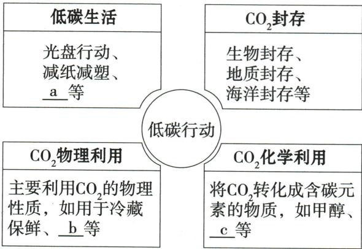

## 讲解

### 是什么

自然温室效应使地球保持合适温度；温室气体增加会加强此效应。碳达峰指排放由增转降，碳中和指规定范围时间的排放与移除抵消，不等于没有任何排放。

### 怎么来的

节电、节约材料和合理出行从源头减少相关能耗；植物光合吸收$CO_{2}$，封存延长不进入大气的时间；物理冷藏只暂时使用，不能从反应式上说化学消耗。

### 什么时候能用

不把$CO_{2}$是否列入常见空气污染物与其气候及高浓度健康影响混同。原题政策年份按资料保留；此条不提供现实碳核算结论，化学利用净减排还需完整过程证据。

## 例题

### 低碳措施选择

> 来源ID Q06-08；第六单元碳和碳的氧化物；51-100/full.md 第1932–1940行。原答案与解析定位：51-100/full.md 第1964–1966行。

例3 (2024 山东东营中考)我国提出 2030 年前实现“碳达峰”,2060 年前实现“碳中和”。下列做法不利于实现“碳达峰,碳中和”的是（）

A.绿色出行

B.焚烧垃圾

C.节约用纸

D.随手关灯

**原资料答案与解析：**

例3 解析 绿色出行、节约用纸、随手关灯都能减少二氧化碳的排放,焚烧垃圾产生二氧化碳。

答案 B

**展开解析（依据原详解补足理由与步骤）：**

选不利的B。A绿色出行减少相关能源消耗，C节约纸减少生产消耗及废弃，D关灯节电，均符合题设低碳方向。B本题泛指焚烧垃圾，会产生$CO_{2}$。它不是对所有具体垃圾处理工艺的完整生命周期评价；不能从这道单选题断言所有焚烧回收能量情形的净排放都一定较其他方式高。原题年代与政策目标按提供资料保留。

### 低碳行动方案图

> 来源ID Q06-09；第六单元碳和碳的氧化物；51-100/full.md 第1942–1952行。原答案与解析定位：51-100/full.md 第1968–1970行。

例4 (2024 广东中考节选)低碳行动方案

同学们展示如图所示的方案,并交流讨论、完善方案。

i. 完善方案中的内容(各补写一条): a\_\_\_\_; b\_\_\_\_; c\_\_\_\_。

ii. $CO_{2}$ 物理利用 \_\_\_\_ (填“能”或“不能”)从总量上减少 $CO_{2}$ 。

iii.植树造林,利用绿色植物的\_\_\_\_作用吸收 $\mathrm{CO}_{2}$ 。

**原资料答案与解析：**

例4 解析 ii. 根据图中“$CO_{2}$ 物理利用”, 可以知道利用二氧化碳冷藏保鲜、人工增雨等, 不能从总量上减少 $CO_{2}$。

答案 i. 绿色出行 人工增雨 乙醇 ii. 不能 iii. 光合

**展开解析（依据原详解补足理由与步骤）：**

i.a绿色出行，属于生活减排；b人工增雨，利用干冰升华吸热的物理性质；c乙醇，属于将$CO_{2}$转成含碳物质的化学利用。ii.按图中冷藏、增雨等短期物理利用填不能，利用后仍释放$CO_{2}$，不从总量消耗。不能把这个结论推广到长期地质封存；图中特意将封存另列。化学转化也不自动保证全生命周期净减排。iii.光合；植物吸收$CO_{2}$形成有机物，实际长期净储碳还与生长、分解等过程有关。

## 易错

把实验条件、主要气体与杂质、化学变化与物理利用分清。
