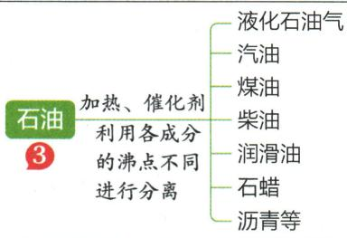

## 讲解

### 是什么

煤、石油和天然气是长期地质过程形成的能源，按人类尺度不可再生，天然样品均混合物。

### 怎么来的

煤主要含碳元素，石油主要碳氢，天然气以甲烷为主。干馏煤改变化学组成，分馏石油利用组分沸点差分离，分别化学与物理变化。

### 什么时候能用

天然气不等于纯甲烷，煤不等于纯碳。资源不可再生不表示任何一份物质永远不能形成，而是形成速度远慢消耗；所有石油加工不全是物理变化。

## 例题

### 能源四项判断

> 来源ID Q07-06；第七单元能源的合理利用与开发；101-150/full.md 第206–209；233–235行。原答案与解析定位：101-150/full.md 第213–217行。

例1（2024 广东广州中考）能源与生活息息相关。下列说法不正确的是 （）

A.石油属于化石燃料,是不可再生能源  
B.天然气燃烧产生的二氧化碳可造成酸雨

C.乙醇汽油用作汽车燃料可减少空气污染

D. 太阳能电池可将太阳能转化为电能

**原资料答案与解析：**

例1 解析 A(√) 石油是不可再生能源; B(×) 二氧化碳不会造成酸雨; C(√) 乙醇燃烧生成二氧化碳和水, 可以减少空气污染;

D(√)太阳能电池将太阳能转化为电能。

答案 B

**展开解析（依据原详解补足理由与步骤）：**

选不正确B。A石油形成需很长地质时间，不能按人类使用速度再生，属于化石不可再生能源。B酸雨主要与$SO_{2}$、氮氧化物形成的酸有关，不把$CO_{2}$溶水的通常弱酸性降水叫酸雨。C乙醇汽油按教材情境可减少部分污染物排放，但不是零污染或全过程必净减碳；D太阳能电池把光能转为电能，正确。选择依据是题列具体表述，不将“清洁”解释成各阶段完全没有环境影响。

### 汽车能源变迁

> 来源ID Q07-07；第七单元能源的合理利用与开发；101-150/full.md 第239–257行。原答案与解析定位：101-150/full.md 第219–223行。

例2（2024 福建中考）请参加社会性议题“汽车能源的变迁”的项目式学习。

(1)传统汽车能源主要来自石油。

①从物质分类角度看,石油属于\_\_\_\_(填“纯净物”或“混合物”)。

②汽油作汽车燃料的缺点有\_\_\_\_（写一个）。

(2)天然气和乙醇可替代传统汽车能源。

①甲烷 $\left(\mathrm{CH}_{4}\right)$ 和乙醇 $\left(\mathrm{C}_{2}\mathrm{H}_{6}\mathrm{O}\right)$ 均属于\_\_\_\_（填“无机”或“有机”）化合物。

②天然气的主要成分是甲烷,其完全燃烧的化学方程式为\_\_\_\_。

(3)电池可给新能源汽车提供动力。

①电动汽车的电池放电时,其能量转化方式为\_\_\_\_能转化为电能。

②以“使用电动汽车代替燃油车是否能减少 $CO_{2}$ 的排放”为题进行小组辩论,你的看法和理由是\_\_\_\_。

**原资料答案与解析：**

例2 解析 (1) ①石油属于混合物, ②汽油来自不可再生能源石油; (2) 甲烷和乙醇均属于有机化合物, 甲烷在氧气中燃烧生成二氧化碳和水; (3) 电动汽车的电池放电时将化学能转化为电能, 使用电动汽车代替燃油车不一定能减少二氧化碳的排放, 需要考虑多种因素。

答案（1）①混合物 ②汽油来自不可再生能源石油（或其他合理答案）（2）①有机 ② $\mathrm{CH}_4 + 2\mathrm{O}_2$ 点燃 $\mathrm{CO}_{2} + 2\mathrm{H}_{2}\mathrm{O}$ （3）①化学

②不一定,需要考虑多种因素,如电力来源、电池制造和回收过程等可能排放二氧化碳(或其他合理答案)

**展开解析（依据原详解补足理由与步骤）：**

(1)①石油有多种物质，混合物。②汽油来自不可再生石油，可答资源有限或燃烧有污染等。(2)①甲烷、乙醇为有机化合物。②先写$CH_{4}$+$O_{2}$→$CO_{2}$+$H_{2}O$：C1故CO₂1，H4故H₂O2，右O4故左O₂2；$CH_4+2O_2\xlongequal{\text{点燃}}CO_2+2H_2O$。(3)①化学能转电能。②不一定，使用阶段少了尾气，电力生产、电池制造回收等仍可排$CO_{2}$，应比较同样出行服务的整个过程。原题本身已给此边界，不把电动与绝对零排放画等号。

### 二氧化碳制汽油流程

> 来源ID Q07-08；第七单元能源的合理利用与开发；101-150/full.md 第259–271行。原答案与解析定位：101-150/full.md 第225–231行。

例3 (2024 云南中考节选)新能源的开发和利用促进了能源结构向多元、清洁和低碳转变。

(1) 目前, 人类利用的能量大多来自化石燃料, 如石油、天然气和 \_\_\_\_。在有石油的地方, 一般都有天然气存在, 天然气的主要成分是甲烷, 其化学式为 \_\_\_\_。

(3)我国研制出一种新型催化剂,在这种催化剂作用下,二氧化碳可以转化为汽油,主要转化过程如图所示(部分生成物已略去)。

①催化剂在化学反应前后化学性质和\_\_\_\_不变；

②过程Ⅰ中反应生成的另外一种物质为生活中常见的氧化物,该反应的化学方程式为\_\_\_\_。

(4)随着科学技术的发展,氢能源的开发利用已取得很大进展。氢气作为燃料的优点是\_\_\_\_(答一点即可)。

**原资料答案与解析：**

例3 解析（1）化石燃料包括石油、天然气和煤；甲烷的化学式为 $\mathrm{CH}_{4}$ 。（3）①根据催化剂“一变两不变”的特征，催化剂在化学反应前后化学性质和质量不变；②分析反应示意图，过程Ⅱ为一氧化碳和单质X反应生成 $(\mathrm{CH}_2)_n$ ，根据质量守恒定律，可知单质X为氢气，过程I为二氧化碳和单质 $\mathrm{X(H_2)}$ 在催化剂的条件下反应生成一氧化碳和一种生活中常见的氧化物，则该氧化物为水，可写出反应的化学方程式。（4）氢气燃烧生成水，产物无污染，燃烧热值高。

答案 (1) 煤 $\mathrm{CH}_{4}$ (3) ① 质量

② $CO_{2}+H_{2}\xlongequal{\text{催化剂}}CO+H_{2}O$

(4)环保,无污染(或热值高,合理即可)

**展开解析（依据原详解补足理由与步骤）：**

(1)煤、$CH_{4}$。(3)①质量也不变。②图Ⅱ中$CO$与单质X成(CH₂)ₙ，$CO$已供C，新增H需由单质氢H₂提供，所以X=H₂。过程Ⅰ是$CO_{2}$+H₂→$CO$+另一常见氧化物；余H2、O1对应$H_{2}O$，得$CO_2+H_2\xlongequal{\text{催化剂}}CO+H_2O$，C1、$O_{2}$、H2均守恒。(4)按使用阶段可答燃烧产物水、单位质量热值高。制氢及制汽油的总净排放未给，不能从$CO_{2}$反应消耗就保证全过程零排放。题为节选，跳号(1)(3)(4)按原资料保留，不另补第(2)问。

### 原化石能源加工表

> 来源ID Q07-11；第七单元能源的合理利用与开发；101-150/full.md 第62–66；86–95行。原答案与解析定位：101-150/full.md 第62–66行；101-150/full.md 第86–95行。

煤、石油和天然气属于化石能源,是不可再生能源,都属于混合物。这些化石能源及其加工后的产品常被用作燃料,因此化石能源也被称为化石燃料。

# 1. 煤和石油 ①

|  | 煤 | 石油 |
| --- | --- | --- |
| 性质 | 黑色固体,有光泽,具有可燃性 | 深褐色(或黑色)黏稠状液体,不溶于水,密度比水的小,具有可燃性 |
| 组成 | 主要含碳元素,还含有氢、氧、氮、硫等元素 | 主要含碳元素、氢元素 |
| 综合利用2 | 1煤隔绝空气加强热焦炭→冶炼金属煤焦油→化工原料煤气→居民生活燃气和化工原料2煤与其他物质反应 |  |

# ① 拓展延伸

1. 煤被称为“工业的粮食”。将煤作为燃料，主要是利用碳与氧气反应放出的热量。  
2. 煤气是由一氧化碳、氢气和甲烷等组成的混合气体。  
3.石油被称为“工业的血液”。从地下开采出来的石油叫作原油。  
4. 液化石油气主要成分是丙烷、丁烷、丙烯和丁烯等，加压后可储存在钢瓶中，一般作为燃料使用。

# 2 拓展延伸

煤的干馏是化学变化，石油的分馏是物理变化。

**原资料答案与解析：**

煤、石油和天然气属于化石能源,是不可再生能源,都属于混合物。这些化石能源及其加工后的产品常被用作燃料,因此化石能源也被称为化石燃料。

# 1. 煤和石油 ①

|  | 煤 | 石油 |
| --- | --- | --- |
| 性质 | 黑色固体,有光泽,具有可燃性 | 深褐色(或黑色)黏稠状液体,不溶于水,密度比水的小,具有可燃性 |
| 组成 | 主要含碳元素,还含有氢、氧、氮、硫等元素 | 主要含碳元素、氢元素 |
| 综合利用2 | 1煤隔绝空气加强热焦炭→冶炼金属煤焦油→化工原料煤气→居民生活燃气和化工原料2煤与其他物质反应 |  |

# ① 拓展延伸

1. 煤被称为“工业的粮食”。将煤作为燃料，主要是利用碳与氧气反应放出的热量。  
2. 煤气是由一氧化碳、氢气和甲烷等组成的混合气体。  
3.石油被称为“工业的血液”。从地下开采出来的石油叫作原油。  
4. 液化石油气主要成分是丙烷、丁烷、丙烯和丁烯等，加压后可储存在钢瓶中，一般作为燃料使用。

# 2 拓展延伸

煤的干馏是化学变化，石油的分馏是物理变化。

**展开解析（依据原详解补足理由与步骤）：**

这是原组成与加工表。煤、石油、天然气均多成分混合物。煤干馏产生焦炭、煤焦油、煤气，物质改变，是化学变化；石油分馏利用沸点差分出原有组分，是物理变化。煤气、天然气和液化石油气不能混用成分。

**原图勘误：**石油图把“催化剂”与“利用各成分沸点不同进行分离”并排。单纯分馏靠加热、冷凝及沸点差，不以催化剂改变物质；催化裂化等其它炼制过程才涉及化学转化。这一区别由本段L95的“分馏是物理变化”及[EIA炼制说明](https://www.eia.gov/todayinenergy/detail.php?id=9150)支持。原图仍保留，不能从该图得出分馏必须加催化剂。

## 易错

逐项判断条件；原题模型与现实完整过程分开。
