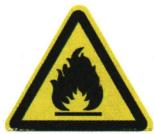
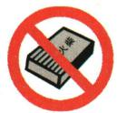
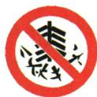
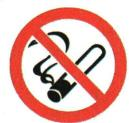

## 讲解

### 是什么

可燃气体或可燃粉尘与空气适当混合，遇火源可能迅速反应，有限空间中压强骤升可致燃烧爆炸。

### 怎么来的

混合使燃料与氧大面积接触，反应热短时间聚集，气体膨胀而来不及释放压强。可燃物、空气比例、火源和散热空间共同影响，不是只有密闭才会发生。

### 什么时候能用

并非所有爆炸都是化学变化，气瓶物理破裂也能爆。图标应识别具体对象；禁止吸烟并不等于允许其他火种。燃气泄漏不能开关电器制造火花；真实事故先离开危险区求助，不开展验证实验。

## 例题

### 禁止吸烟图标

> 来源ID Q07-04；第七单元能源的合理利用与开发；101-150/full.md 第36–48行。原答案与解析定位：101-150/full.md 第26–28行。

例3 (2023 湖南怀化中考)因森林覆盖面积广,怀化市被誉为“会呼吸的城市”。林区内禁止吸烟,下列图标中属于“禁止吸烟”标志的是 （）

  
A

  
B

  
C

  
D

**原资料答案与解析：**

例3 解析 A(×) 标志是当心易燃物; B(×) 标志是禁止带火种; C(×) 标志是禁止燃放鞭炮; D(√) 标志是禁止吸烟。

答案 D

**展开解析（依据原详解补足理由与步骤）：**

选D。A黄色三角火焰是当心易燃物，表示警告；B圈斜杠火柴是禁止带火种；C是禁止燃放鞭炮；D圈斜杠香烟是禁止吸烟。先看警告或禁止的形状，再看具体对象，不能只认都有火焰就混同。

## 易错

逐项判断条件；原题模型与现实完整过程分开。
