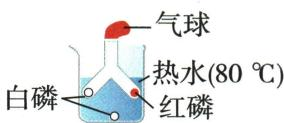
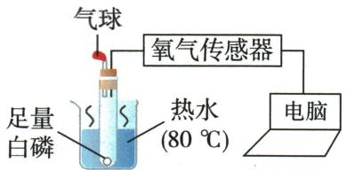
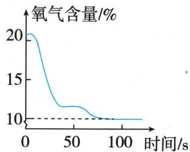

## 讲解

### 是什么

使燃料更充分燃烧，通常需足够空气和较大有效接触面积，以减少未充分氧化产物。

### 怎么来的

煤粉、蜂窝煤增加接触，送风提高氧供应；甲烷供氧不足可能产生$CO$和炭黑，黄色火焰兼锅底炭黑支持此题缺氧判断。

### 什么时候能用

火焰颜色可受杂质、燃烧器等影响，不能仅凭一眼颜色唯一诊断所有设备。通风不能当作室内炭火安全保证；$CO$风险按前条处理。

## 例题

### 生火有道跨段探究

> 来源ID Q07-02；第七单元能源的合理利用与开发；51-100/full.md 第2387–2415；另接101-150/full.md 第3–18行行。原答案与解析定位：51-100/full.md 第2419–2433行；101-150/full.md 第1–1行。

例1（2024 山东青岛中考节选）化学反应需要一定的条件,控制条件可以调控化学反应。“启航”小组以“调控化学反应”为主题展开探究，请回答下列问题。

# 【生火有道】

(1) 观察生活: 小组同学观察到天然气、木炭能燃烧, 而水和石头不能燃烧, 得出燃烧的条件之一是 \_\_\_\_。

实验探究:为继续探究燃烧的条件,小组同学设计并完成了图1所示实验。

已知:白磷着火点 $40^{\circ}$ C, 红磷着火点 $260^{\circ}$ C。磷燃烧时产生污染空气的五氧化二磷白烟。

  
图1

# 【现象与结论】

(2)①铜片上的白磷燃烧,红磷不燃烧,得出燃烧的条件之一是\_\_\_\_。

②小红根据\_\_\_\_现象,得出燃烧的条件之一是可燃物与氧气接触。

# 【评价与反思】

(3)①实验中小组同学认为图1装置存在不足,于是设计了图2所示装置。图2装置的优点为\_\_\_\_。

②小明对小红的结论提出疑问,设计了图3

所示装置,对燃烧过程中的氧气含量进行测定,得到图4所示图像。

  
图 2

  
图 3

  
图 4

结合图像分析,“可燃物与氧气接触”应准确地表述为\_\_\_\_。

【应用有方】

(5)通过探究,小组同学认识到,生活中也可以通过控制条件促进或抑制化学反应。

①用天然气做饭,发现炉火火焰呈黄色,锅底出现黑色物质,这时需要\_\_\_\_(填“调大”或“调小”)灶具的进风口。  
②炒菜时如果油锅着火,可采取的灭火措施是

(写一条即可)。

**原资料答案与解析：**

例1 解析 (1) 燃烧的条件之一是可燃物, 天然气、木炭具有可燃性, 而水和石头不具有可燃性。

(2) ①铜片上的白磷和红磷都属于可燃物, 且都与氧气接触, 白磷燃烧, 红磷不燃烧, 得出燃烧的条件之一是温度达到可燃物的着火点。

②铜片上的白磷和水中的白磷属于同一种物质, 着火点相同, 铜片上的白磷燃烧, 而热水中的白磷不燃烧, 得出燃烧的条件之一是可燃物与氧气接触。

(3) ①图2装置在密闭环境中进行实验, 不会污染环境, 装置的优点为环保。

②由图3和图4可知, 当氧气浓度小于10%时, 白磷不再燃烧, 应准确地表述为可燃物与足够浓度的氧气接触。

(5) ①黑色物质为不完全燃烧生成的炭黑, 说明氧气不充足, 需要调大灶具进风口, 使燃烧更充分。

②油锅着火, 应用锅盖盖灭, 隔绝空气, 从而灭火。

答案 (1) 可燃物 (2) ① 温度达到可燃物的着火点 ② 铜片上的白磷燃烧, 而热水中的白磷不燃烧

(3)①环保 ②可燃物与足够浓度的氧气接触 (5)①调大 ②用锅盖盖灭(合理即可)

**展开解析（依据原详解补足理由与步骤）：**

(1)可燃物。(2)①铜片白磷燃烧而红磷不燃，二者都接触空气、温度相近，但80℃只达到白磷着火点，说明温度要达到对应着火点。②铜片与水中同种白磷都达着火点，但前者接触空气、后者被水隔开，现象支持氧气条件。(3)①封闭图2减少白烟逸散，较环保，仍须规范装置防热压风险。②图4降到约10%后不再下降而白磷已熄灭，表明不是有一点氧就一定持续燃烧，要足够浓度；这里10%只对应此装置条件，不能作为通用安全阈值。(5)①调大进风口提高空气供应，针对题述正常灶具的不完全燃烧情境；实际设备故障应由成人专业处理。②锅盖隔绝空气，不能向热油浇水。若有蔓延立即撤离报警，不由学生操作明火。

## 易错

逐项判断条件；原题模型与现实完整过程分开。
