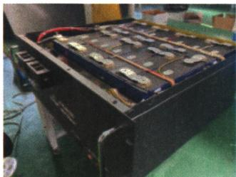

## 讲解

### 判据

题问是否更清洁或减少$CO_{2}$，先问评价的是使用端还是全过程。

### 流程

列所给反应或能源转化，只推出该阶段结论；再检查电力、原料、制造回收等题设未给因素。信息不足用“不一定+具体因素”，不要编排放量；对错选择按题列限定语评价。

## 例题

### 能源四项判断

> 来源ID Q07-06；第七单元能源的合理利用与开发；101-150/full.md 第206–209；233–235行。原答案与解析定位：101-150/full.md 第213–217行。

例1（2024 广东广州中考）能源与生活息息相关。下列说法不正确的是 （）

A.石油属于化石燃料,是不可再生能源  
B.天然气燃烧产生的二氧化碳可造成酸雨

C.乙醇汽油用作汽车燃料可减少空气污染

D. 太阳能电池可将太阳能转化为电能

**原资料答案与解析：**

例1 解析 A(√) 石油是不可再生能源; B(×) 二氧化碳不会造成酸雨; C(√) 乙醇燃烧生成二氧化碳和水, 可以减少空气污染;

D(√)太阳能电池将太阳能转化为电能。

答案 B

**展开解析（依据原详解补足理由与步骤）：**

选不正确B。A石油形成需很长地质时间，不能按人类使用速度再生，属于化石不可再生能源。B酸雨主要与$SO_{2}$、氮氧化物形成的酸有关，不把$CO_{2}$溶水的通常弱酸性降水叫酸雨。C乙醇汽油按教材情境可减少部分污染物排放，但不是零污染或全过程必净减碳；D太阳能电池把光能转为电能，正确。选择依据是题列具体表述，不将“清洁”解释成各阶段完全没有环境影响。

### 汽车能源变迁

> 来源ID Q07-07；第七单元能源的合理利用与开发；101-150/full.md 第239–257行。原答案与解析定位：101-150/full.md 第219–223行。

例2（2024 福建中考）请参加社会性议题“汽车能源的变迁”的项目式学习。

(1)传统汽车能源主要来自石油。

①从物质分类角度看,石油属于\_\_\_\_(填“纯净物”或“混合物”)。

②汽油作汽车燃料的缺点有\_\_\_\_（写一个）。

(2)天然气和乙醇可替代传统汽车能源。

①甲烷 $\left(\mathrm{CH}_{4}\right)$ 和乙醇 $\left(\mathrm{C}_{2}\mathrm{H}_{6}\mathrm{O}\right)$ 均属于\_\_\_\_（填“无机”或“有机”）化合物。

②天然气的主要成分是甲烷,其完全燃烧的化学方程式为\_\_\_\_。

(3)电池可给新能源汽车提供动力。

①电动汽车的电池放电时,其能量转化方式为\_\_\_\_能转化为电能。

②以“使用电动汽车代替燃油车是否能减少 $CO_{2}$ 的排放”为题进行小组辩论,你的看法和理由是\_\_\_\_。

**原资料答案与解析：**

例2 解析 (1) ①石油属于混合物, ②汽油来自不可再生能源石油; (2) 甲烷和乙醇均属于有机化合物, 甲烷在氧气中燃烧生成二氧化碳和水; (3) 电动汽车的电池放电时将化学能转化为电能, 使用电动汽车代替燃油车不一定能减少二氧化碳的排放, 需要考虑多种因素。

答案（1）①混合物 ②汽油来自不可再生能源石油（或其他合理答案）（2）①有机 ② $\mathrm{CH}_4 + 2\mathrm{O}_2$ 点燃 $\mathrm{CO}_{2} + 2\mathrm{H}_{2}\mathrm{O}$ （3）①化学

②不一定,需要考虑多种因素,如电力来源、电池制造和回收过程等可能排放二氧化碳(或其他合理答案)

**展开解析（依据原详解补足理由与步骤）：**

(1)①石油有多种物质，混合物。②汽油来自不可再生石油，可答资源有限或燃烧有污染等。(2)①甲烷、乙醇为有机化合物。②先写$CH_{4}$+$O_{2}$→$CO_{2}$+$H_{2}O$：C1故CO₂1，H4故H₂O2，右O4故左O₂2；$CH_4+2O_2\xlongequal{\text{点燃}}CO_2+2H_2O$。(3)①化学能转电能。②不一定，使用阶段少了尾气，电力生产、电池制造回收等仍可排$CO_{2}$，应比较同样出行服务的整个过程。原题本身已给此边界，不把电动与绝对零排放画等号。

### 二氧化碳制汽油流程

> 来源ID Q07-08；第七单元能源的合理利用与开发；101-150/full.md 第259–271行。原答案与解析定位：101-150/full.md 第225–231行。

例3 (2024 云南中考节选)新能源的开发和利用促进了能源结构向多元、清洁和低碳转变。

(1) 目前, 人类利用的能量大多来自化石燃料, 如石油、天然气和 \_\_\_\_。在有石油的地方, 一般都有天然气存在, 天然气的主要成分是甲烷, 其化学式为 \_\_\_\_。

(3)我国研制出一种新型催化剂,在这种催化剂作用下,二氧化碳可以转化为汽油,主要转化过程如图所示(部分生成物已略去)。

①催化剂在化学反应前后化学性质和\_\_\_\_不变；

②过程Ⅰ中反应生成的另外一种物质为生活中常见的氧化物,该反应的化学方程式为\_\_\_\_。

(4)随着科学技术的发展,氢能源的开发利用已取得很大进展。氢气作为燃料的优点是\_\_\_\_(答一点即可)。

**原资料答案与解析：**

例3 解析（1）化石燃料包括石油、天然气和煤；甲烷的化学式为 $\mathrm{CH}_{4}$ 。（3）①根据催化剂“一变两不变”的特征，催化剂在化学反应前后化学性质和质量不变；②分析反应示意图，过程Ⅱ为一氧化碳和单质X反应生成 $(\mathrm{CH}_2)_n$ ，根据质量守恒定律，可知单质X为氢气，过程I为二氧化碳和单质 $\mathrm{X(H_2)}$ 在催化剂的条件下反应生成一氧化碳和一种生活中常见的氧化物，则该氧化物为水，可写出反应的化学方程式。（4）氢气燃烧生成水，产物无污染，燃烧热值高。

答案 (1) 煤 $\mathrm{CH}_{4}$ (3) ① 质量

② $CO_{2}+H_{2}\xlongequal{\text{催化剂}}CO+H_{2}O$

(4)环保,无污染(或热值高,合理即可)

**展开解析（依据原详解补足理由与步骤）：**

(1)煤、$CH_{4}$。(3)①质量也不变。②图Ⅱ中$CO$与单质X成(CH₂)ₙ，$CO$已供C，新增H需由单质氢H₂提供，所以X=H₂。过程Ⅰ是$CO_{2}$+H₂→$CO$+另一常见氧化物；余H2、O1对应$H_{2}O$，得$CO_2+H_2\xlongequal{\text{催化剂}}CO+H_2O$，C1、$O_{2}$、H2均守恒。(4)按使用阶段可答燃烧产物水、单位质量热值高。制氢及制汽油的总净排放未给，不能从$CO_{2}$反应消耗就保证全过程零排放。题为节选，跳号(1)(3)(4)按原资料保留，不另补第(2)问。

### 光伏优点节选

> 来源ID Q11-08；第十一单元化学与社会；151-200/full.md 第733–733行。原答案与解析定位：151-200/full.md 第773–773行。

例2（2024 山东淄博中考节选）国家《2024—2025 年节能降碳行动方案》提出,加快建筑光伏一体化建设。光伏发电是太阳能直接利用的有效方式。请列举一条光伏发电的优点：\_\_\_\_。

**原资料答案与解析：**

例2 答案 无污染(或节约化石燃料、较少受地域限制、安全可靠、无噪声等,合理即可)

**展开解析（依据原详解补足理由与步骤）：**

原答列无污染、节约化石燃料等可选。较稳妥表述“发电运行阶段无需燃烧化石燃料，可减少该阶段燃烧排放”。原“无污染”“较少受地域限制”不作全流程或任何地点绝对结论：制造回收有环境影响，光照受地域天气时间影响。仅需按原问写一条成立优点。

### 磷酸铁锂电池回收

> 来源ID Q11-09；第十一单元化学与社会；151-200/full.md 第735–745行。原答案与解析定位：151-200/full.md 第775–783行。

例3（2024山东东营中考）我国新能源汽车产销量连续八年全球第一，新能源汽车常用磷酸铁锂电池(如图)作为动力。

(1)新能源汽车与传统燃油汽车相比,突出的优点是\_\_\_\_。

(2)磷酸铁锂电池外壳常用的材料大体分为三种:塑料、钢壳和铝壳,其中属于合成材料的是\_\_\_\_,电池工作过程中将化学能转化为\_\_\_\_能。

(3)电极材料磷酸铁锂 $\left(\mathrm{LiFePO}_{4}\right)$ 中,锂、氧两种元素的质量比是\_\_\_\_。

(4)报废的磷酸铁锂电池经过预处理、酸浸、除杂等环节回收得到的物质,可重新作为制作该电池的原料。已知拆解电池所得材料中含铁片、铜箔、铝箔等,采用硫酸“酸浸”的目的是除去铁、铝,反应的化学方程式为\_\_\_\_（任写其中一个）,该反应属于\_\_\_\_（填基本反应类型)反应。

**原资料答案与解析：**

例3 解析（1）与传统燃油汽车相比，新能源汽车可以减少污染物的排放，保护环境。

(2) 塑料属于合成材料, 钢是铁的合金, 钢和铝均属于金属材料; 电池工作过程中将化学能转化为电能。

(3) 磷酸铁锂中锂、氧两种元素的质量比为 $7: (16 \times 4) = 7: 64$ 。

(4)采用硫酸“酸浸”的目的是除去铁、铝,发生的反应为铁和硫酸反应生成硫酸亚铁和氢气、铝和硫酸反应生成硫酸铝和氢气;上述反应均属于置换反应。

答案（1）可以减少污染物的排放，保护环境（合理即可）（2）塑料电（3）7：64（4） $2\mathrm{Al}+3\mathrm{H}_{2}\mathrm{SO}_{4}=\mathrm{Al}_{2}\left(\mathrm{SO}_{4}\right)_{3}+3\mathrm{H}_{2}\uparrow$ （或 $Fe+H_{2}SO_{4}=FeSO_{4}+H_{2}\uparrow$ ）置换

**展开解析（依据原详解补足理由与步骤）：**

(1)与燃油汽车相比，电驱运行减少当地燃烧尾气排放，依发电和制造边界评价全流程。(2)塑料属合成材料，钢合金与铝属金属材料；电池放电化学能转电能，充电反向储能。(3)按式Li₁Fe₁P₁O₄，用Li=7、O=16，质量比$7:(16\times4)=7:64$，不是1:4原子比。(4)稀硫酸与活动性铁铝反应、铜在本模型不置氢，所以除铁铝。可写$Fe+H_2SO_4=FeSO_4+H_2\uparrow$，或$2Al+3H_2SO_4=Al_2(SO_4)_3+3H_2\uparrow$，均单质换单质为置换。酸浸需工业条件，铝表面膜及浓酸不同不套简式自行操作。

### 绿电氢气部分替代CO炼铁

> 来源ID Q14-03；专题三物质的推断；151-200/full.md 第1549–1561行。原答案与解析定位：151-200/full.md 第1563–1573行。

例3 (2024 河北中考)为减少炼铁过程中生成 $\mathrm{CO}_{2}$ 的质量,某小组设计了如图所示的炼铁新方案(反应条件已略去)。A\~H 是初中化学常见物质,其中 A 是常用的溶剂,G 是铁;反应①中用到的电为“绿电”,获得“绿电”的过程中不排放 $\mathrm{CO}_{2}$ 。

请回答下列问题:

(1)可作为“绿电”来源的是\_\_\_\_（选填“煤炭”或“水能”）。

(2) 反应①的化学方程式为 \_\_\_\_。

(3) 反应①\~④中属于置换反应的是 \_\_\_\_ (选填序号)。

(4)冶炼得到相同质量的铁,使用该新方案比高炉炼铁生成 $CO_{2}$ 的质量少,其原因除使用了“绿电”外,还有\_\_\_\_。

**原资料答案与解析：**

解析 A 是常用的溶剂, 则 A 为 $H_{2}O$ ; 由此可以推知反应①生成的 B、C 分别为 $O_{2}$ 或 $H_{2}$ 中的一种, 反应①为分解反应。G 为铁, 反应③生成铁和水, 则反应④是炼铁原理, E 为 $Fe_{2}O_{3}$ , B 为 $H_{2}$ , C 为 $O_{2}$ , 反应③为置换反应; 氧化物 F 为还原剂 $CO$。反应②为 $O_{2}$ 和 D 反应生成 $CO$, 则 D 为碳单质, 反应②为化合反应。

(1)获得“绿电”的过程中不排放 $CO_{2}$ ，则“绿电”来源可以是水能。

(2)由分析可知,反应①为水在通电条件下分解为氢气和氧气。

(3)由分析可知,反应③为置换反应。注意反应④即炼铁原理,不属于置换反应。

(4)高炉炼铁中石灰石的分解、一氧化碳还原铁矿石、焦炭燃烧等途径都能产生二氧化碳,而题目方案中还原氧化铁的一部分 $CO$ 被 $\mathrm{H}_{2}$ 代替,所以炼得相同质量的铁时,产生的二氧化碳质量少。

答案 (1) 水能 (2) $2H_{2}O\xlongequal{\text{通电}}2H_{2}\uparrow+O_{2}\uparrow$ (3)③ (4)有一部分氧化铁被氢气还原,没有二氧化碳产生

**展开解析（依据原详解补足理由与步骤）：**

A常用溶剂$H_{2}O$，①电解$2H_2O\xlongequal{\text{通电}}2H_2\uparrow+O_2\uparrow$。③B与E成铁G和水A，所以B=H₂，E=$Fe_{2}O_{3}$，C=$O_{2}$；②C与D成F还原剂，D=C碳、F=$CO$。③$Fe_2O_3+3H_2\xlongequal{\text{高温}}2Fe+3H_2O$为单质化合物换单质化合物，置换；④$Fe_2O_3+3CO\xlongequal{\text{高温}}2Fe+3CO_2$两化合物起始非置换。(1)水能；煤炭发电燃烧有$CO_{2}$。(3)③；①分解、②$2C+O_2\xlongequal{\text{点燃}}2CO$化合、④非上述置换。(4)相同铁，一部分用氢还原生成水，少用$CO$、少生$CO_{2}$，但②④仍有含碳支路，不称整个方案零排放。题的绿电定义仅题设获取电的阶段，非水电设施建造全生命周期。

## 易错

控制变量不是只把质量相等；安全适用范围先核对。
