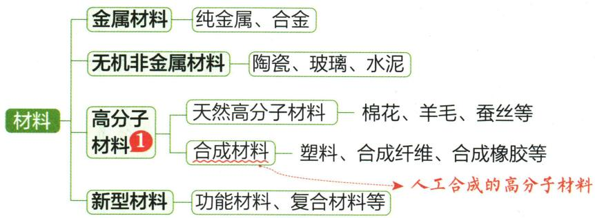

## 讲解

### 判据

塑料、钢铝、玻璃钢、GaN等名称可能混淆，先看题问哪个分类轴。

### 流程

钢铝归金属，PET塑料归合成有机高分子，棉羊毛天然高分子；玻璃钢按不同材料组合归复合；GaN按指定式归纯化合物。容器回收标志只提示材料回收类别，不保证任何热条件食品安全。

## 例题

### 氮化镓材料与能源

> 来源ID Q11-07；第十一单元化学与社会；151-200/full.md 第723–731行。原答案与解析定位：151-200/full.md 第769–771行。

例1（2024江苏无锡中考）氮化镓(GaN)可用于制造太阳能电池。下列叙述正确的是 （）

A. 镓属于非金属元素

B. 氮化镓属于混合物

C. 氮化镓属于复合材料

D. 太阳能属于新能源

**原资料答案与解析：**

例1 解析 A(×) 镓属于金属元素; B(×) 氮化镓由同种物质组成, 属于纯净物; C(×) 氮化镓不是复合材料。

答案 D

**展开解析（依据原详解补足理由与步骤）：**

选D。A镓为金属元素，错；B GaN为指定化合物、纯净物，非混合，错；C一种化合物含两元素不等于两材料复合，GaN非由此判复合材料，错；D太阳能按课本新能源类别，对。使用在太阳能电池不自动改变GaN类别。

### 磷酸铁锂电池回收

> 来源ID Q11-09；第十一单元化学与社会；151-200/full.md 第735–745行。原答案与解析定位：151-200/full.md 第775–783行。

例3（2024山东东营中考）我国新能源汽车产销量连续八年全球第一，新能源汽车常用磷酸铁锂电池(如图)作为动力。

(1)新能源汽车与传统燃油汽车相比,突出的优点是\_\_\_\_。

(2)磷酸铁锂电池外壳常用的材料大体分为三种:塑料、钢壳和铝壳,其中属于合成材料的是\_\_\_\_,电池工作过程中将化学能转化为\_\_\_\_能。

(3)电极材料磷酸铁锂 $\left(\mathrm{LiFePO}_{4}\right)$ 中,锂、氧两种元素的质量比是\_\_\_\_。

(4)报废的磷酸铁锂电池经过预处理、酸浸、除杂等环节回收得到的物质,可重新作为制作该电池的原料。已知拆解电池所得材料中含铁片、铜箔、铝箔等,采用硫酸“酸浸”的目的是除去铁、铝,反应的化学方程式为\_\_\_\_（任写其中一个）,该反应属于\_\_\_\_（填基本反应类型)反应。

**原资料答案与解析：**

例3 解析（1）与传统燃油汽车相比，新能源汽车可以减少污染物的排放，保护环境。

(2) 塑料属于合成材料, 钢是铁的合金, 钢和铝均属于金属材料; 电池工作过程中将化学能转化为电能。

(3) 磷酸铁锂中锂、氧两种元素的质量比为 $7: (16 \times 4) = 7: 64$ 。

(4)采用硫酸“酸浸”的目的是除去铁、铝,发生的反应为铁和硫酸反应生成硫酸亚铁和氢气、铝和硫酸反应生成硫酸铝和氢气;上述反应均属于置换反应。

答案（1）可以减少污染物的排放，保护环境（合理即可）（2）塑料电（3）7：64（4） $2\mathrm{Al}+3\mathrm{H}_{2}\mathrm{SO}_{4}=\mathrm{Al}_{2}\left(\mathrm{SO}_{4}\right)_{3}+3\mathrm{H}_{2}\uparrow$ （或 $Fe+H_{2}SO_{4}=FeSO_{4}+H_{2}\uparrow$ ）置换

**展开解析（依据原详解补足理由与步骤）：**

(1)与燃油汽车相比，电驱运行减少当地燃烧尾气排放，依发电和制造边界评价全流程。(2)塑料属合成材料，钢合金与铝属金属材料；电池放电化学能转电能，充电反向储能。(3)按式Li₁Fe₁P₁O₄，用Li=7、O=16，质量比$7:(16\times4)=7:64$，不是1:4原子比。(4)稀硫酸与活动性铁铝反应、铜在本模型不置氢，所以除铁铝。可写$Fe+H_2SO_4=FeSO_4+H_2\uparrow$，或$2Al+3H_2SO_4=Al_2(SO_4)_3+3H_2\uparrow$，均单质换单质为置换。酸浸需工业条件，铝表面膜及浓酸不同不套简式自行操作。

### PET瓶与原子比

> 来源ID Q11-10；第十一单元化学与社会；151-200/full.md 第749–765行。原答案与解析定位：151-200/full.md 第785–789行。

例4 (2024 海南中考)某品牌矿泉水瓶底标有如图所示标志。回答下列问题:

(1) PET 表示聚酯类塑料, 塑料属于\_\_\_\_（填“有机物”或“无机物”）。

(2)垃圾是放错位置的资源。使用后的该矿泉水瓶属于\_\_\_\_。

A. 可回收垃圾

B.有害垃圾

C. 厨余垃圾

D.其他垃圾

(3)合成 PET 的原料之一为乙二醇( $\mathrm{C}_{2} \mathrm{H}_{6} \mathrm{O}_{2}$ ), 乙二醇分子中碳、氢原子个数比为\_\_\_\_（最简整数比）。

**原资料答案与解析：**

例4 解析（1）PET表示聚酯类塑料，塑料是含碳化合物，属于有机物。（2）矿泉水瓶可回收再利用，属于可回收垃圾。（3）根据乙二醇化学式可知，其分子中碳、氢原子个数比=2:6=1:3。

答案 (1) 有机物 (2) A

(3)1:3

**展开解析（依据原详解补足理由与步骤）：**

(1)PET为有机高分子材料，属有机物。(2)A可回收；B有害、C厨余、D其它不符此清洁塑料瓶题设，回收标识不等于任何温度可反复食品使用。(3)C₂H₆O₂每分子C2、H6，个数比2:6=1:3；不是碳氢质量比，氧不计题问两者之比。

### 原材料分类结构及纤维表

> 来源ID Q11-15；第十一单元化学与社会；151-200/full.md 第679–690；702–719行。原答案与解析定位：151-200/full.md 第679–690行；151-200/full.md 第702–719行。

1 拓展延伸 高分子材料的结构如下

  
网状结构

② 拓展延伸

聚乙烯塑料无毒，聚氯乙烯塑料有毒。

3 易错警示 正确区分合成材料与复合材料

复合材料是两种或两种以上的不同材料复合而成的材料；合成材料是人工合成的有机高分子材料，主要成分是有机物。

1. 材料的分类

2. 常见的合成材料

(1)塑料:密度小,耐腐蚀,易加工。常见的类型:聚乙烯、聚丙烯、聚氯乙烯、聚苯乙烯、聚酯等。②  
(2) 合成橡胶: 弹性和绝缘性好。常见的类型: 顺丁橡胶、丁苯橡胶、异戊橡胶等。  
(3) 合成纤维: 强度高, 弹性好, 耐磨, 耐腐蚀。常见的类型: 聚丙烯纤维 (丙纶)、聚对苯二甲酸乙二酯纤维 (涤纶)、聚丙烯腈纤维 (腈纶) 等。

几种常见纤维的鉴别方法：

| 纤维种类 | 纤维种类 | 成分 | 鉴别方法 |
| --- | --- | --- | --- |
| 天然纤维 | 棉纤维 | 纤维素 | 易燃烧,燃烧时有烧纸的气味,灰烬呈灰色,手捻时全部成粉末 |
| 天然纤维 | 羊毛纤维 | 蛋白质 | 燃烧时有烧焦羽毛的气味,灰烬呈黑褐色 |
| 合成纤维(如涤纶、锦纶) | 合成纤维(如涤纶、锦纶) | — | 先熔化再燃烧,或边熔化边燃烧,燃烧时有特殊气味,灰烬为黑褐色硬块状态 |

3. 复合材料 ③

(1) 定义: 将几种材料复合起来, 综合各组分性能的优点的材料。  
(2) 实例: 玻璃纤维增强塑料(玻璃钢)、碳纤维复合材料、芳纶复合材料等。

**原资料答案与解析：**

1 拓展延伸 高分子材料的结构如下

  
网状结构

② 拓展延伸

聚乙烯塑料无毒，聚氯乙烯塑料有毒。

3 易错警示 正确区分合成材料与复合材料

复合材料是两种或两种以上的不同材料复合而成的材料；合成材料是人工合成的有机高分子材料，主要成分是有机物。

1. 材料的分类

2. 常见的合成材料

(1)塑料:密度小,耐腐蚀,易加工。常见的类型:聚乙烯、聚丙烯、聚氯乙烯、聚苯乙烯、聚酯等。②  
(2) 合成橡胶: 弹性和绝缘性好。常见的类型: 顺丁橡胶、丁苯橡胶、异戊橡胶等。  
(3) 合成纤维: 强度高, 弹性好, 耐磨, 耐腐蚀。常见的类型: 聚丙烯纤维 (丙纶)、聚对苯二甲酸乙二酯纤维 (涤纶)、聚丙烯腈纤维 (腈纶) 等。

几种常见纤维的鉴别方法：

| 纤维种类 | 纤维种类 | 成分 | 鉴别方法 |
| --- | --- | --- | --- |
| 天然纤维 | 棉纤维 | 纤维素 | 易燃烧,燃烧时有烧纸的气味,灰烬呈灰色,手捻时全部成粉末 |
| 天然纤维 | 羊毛纤维 | 蛋白质 | 燃烧时有烧焦羽毛的气味,灰烬呈黑褐色 |
| 合成纤维(如涤纶、锦纶) | 合成纤维(如涤纶、锦纶) | — | 先熔化再燃烧,或边熔化边燃烧,燃烧时有特殊气味,灰烬为黑褐色硬块状态 |

3. 复合材料 ③

(1) 定义: 将几种材料复合起来, 综合各组分性能的优点的材料。  
(2) 实例: 玻璃纤维增强塑料(玻璃钢)、碳纤维复合材料、芳纶复合材料等。

**展开解析（依据原详解补足理由与步骤）：**

原图及表。天然棉羊毛蚕丝高分子不因高分子就算合成；塑料合成橡胶合成纤维是常见合成材料；玻璃钢为玻璃纤维与塑料等复合，名字有钢不归金属钢。链状常与热塑加工有关，交联网络通常不再易熔流，不能把所有链状高分子或所有塑料都绝对化。棉烧纸味、羊毛蛋白烧焦羽毛味、涤纶熔融结硬块是纯/主要纤维小样学校鉴别模型，混纺或阻燃添加剂会改变现象。原PE无毒PVC有毒过宽，材料安全须看配方、残留、迁移及使用条件；食品容器依用途标识，不能凭树脂名自行判可加热。

## 易错

课本对应关系不代替个人诊断、处方或所有使用条件。
