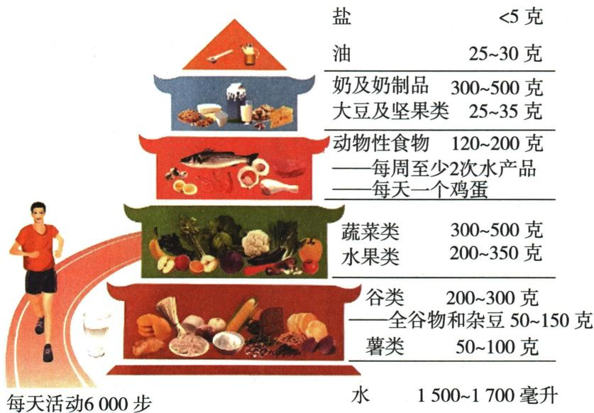

## 讲解

### 判据

元素、维生素、疾病、食物常用配对，但“可能导致”和“唯一原因”不同。

### 流程

先确认铁/钙、维生素A/C等对象；再问所述功能是否对应；最后看“蒸煮后都可吃”“所有贫血都缺铁”等范围是否越过证据。按原题评价选项，保留临床问题需专业判断的边界。

## 例题

### 铁与玉米营养

> 来源ID Q11-01；第十一单元化学与社会；151-200/full.md 第598–603行。原答案与解析定位：151-200/full.md 第592–594行。

例1 (2024 广东中考) 玉米是三大粮食作物之一。我国科学家破解了铁元素进入玉米籽粒的路径, 有望低成本改善大范围人群的铁营养状况。下列说法错误的是 ( )

A. 玉米含淀粉等营养物质  
B.铁元素是人体必需的常量元素   
C.人体缺铁会引起贫血   
D.该研究利于提高玉米的铁含量

**原资料答案与解析：**

例1 解析 A(√) 玉米含淀粉等营养物质; B(×) 铁元素是人体必需的微量元素; C(√) 人体缺铁会引起贫血; D(√) 科学家破解了铁元素进入玉米籽粒的路径, 利于提高玉米的铁含量。

答案 B

**展开解析（依据原详解补足理由与步骤）：**

选错误B。A玉米有淀粉，属于糖类，对；B铁属原人体含量分类的微量而不是常量，错；C缺铁可造成缺铁性贫血，对但不是所有贫血都缺铁；D研究铁进入籽粒路径有利于提高其铁含量，对。元素营养指铁元素进入适当化合物，不是让人体食铁单质。

### 食品安全与维生素错配

> 来源ID Q11-04；第十一单元化学与社会；151-200/full.md 第627–632行。原答案与解析定位：151-200/full.md 第657–659行。

例4 (2024 山东日照中考)下列说法正确的是 ( )

A. 霉变食物含有黄曲霉毒素, 蒸煮后可以食用  
B. 多食用含钙丰富的牛奶、虾皮等食物可预防贫血  
C. 缺乏维生素 A 会引起坏血病, 应多食用鱼肝油等富含维生素 A 的食物  
D.纤维素在人体消化中起特殊作用,每天应摄入一定量的蔬菜、水果和粗粮等食物

**原资料答案与解析：**

例4 解析 A(×) 黄曲霉毒素蒸煮后无法除去, 霉变食物不能食用; B(×) 多食含钙丰富的食物可预防骨质疏松, 食用含铁的食物可预防贫血; C(×) 缺乏维生素 C 会引起坏血病; D(√) 纤维素有助于人体消化, 每天应摄入一定量的蔬菜、水果和粗粮。

答案 D

**展开解析（依据原详解补足理由与步骤）：**

选D。A普通蒸煮不能保证除黄曲霉等毒素，霉变粮食不能因此放心吃；B含钙食物不是缺铁性贫血的对应补铁依据，更不能诊断全部贫血；C坏血病主要对应维生素C缺乏，不是A，A不足与夜盲等相关；D纤维素等膳食纤维有消化相关作用，适量摄入蔬果粗粮的方向对。实际疾病和膳食量需专业评估，本题仅原理匹配。

### 膳食四判断

> 来源ID Q11-06；第十一单元化学与社会；151-200/full.md 第640–647行。原答案与解析定位：151-200/full.md 第665–667行。

例6（2024 山东济南中考）《中国居民膳食指南》可指导人们选择和搭配食物。下列说法中,不合理的是()

A.要均衡膳食,使摄入的各种营养成分保持适当比例  
B. 生长发育期的青少年应摄入比成人更多的蛋白质  
C. 铁、锌、碘、硒等微量元素对人体健康有不可或缺的作用  
D.为了健康,不吃米饭等含“碳水化合物”的食物

**原资料答案与解析：**

例6 解析 A(√) 均衡膳食, 使摄入的各种营养成分保持适当比例, 有利于身体健康; B(√) 生长发育期的青少年应摄入比成人更多的蛋白质; C(√) 铁、锌、碘、硒等微量元素, 对人体健康有不可或缺的作用; D(×) 糖类是主要能量来源, 米饭等含“碳水化合物”的食物提供糖类, 应适量摄入。

答案 D

**展开解析（依据原详解补足理由与步骤）：**

选不合理D。A适当比例均衡对；B原题按生长发育需要充足蛋白质的常规情境判对，但“比成人更多”不推广为所有体型、活动量人群每日总克数都必更大；C铁锌碘硒等适量必需微量有功能，对，不能多补；D完全不吃米饭等碳水食物不合均衡供能，对应错误。原图按所给膳食指南图解读，非本条提供个人食谱。

## 易错

课本对应关系不代替个人诊断、处方或所有使用条件。
