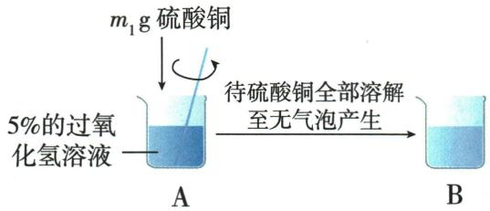
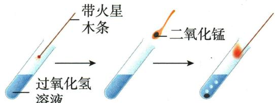
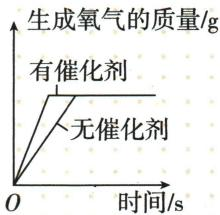

## 讲解

### 是什么

所供教材定义强调改变反应速率，而本身反应前后质量与化学性质不变；本章二氧化锰、硫酸铜实例都是加快过氧化氢分解。

### 怎么来的

短时间气泡增多体现速率变化；回收质量相同和再次促进同一反应支持另外两个条件。催化剂写在箭头上而非作为消耗原料。它可使完成反应所需时间缩短，但不凭空增加相同原料完全反应后的氧气总量。

### 什么时候能用

只说化学性质不变，不是所有性质不变，也不是反应过程中从不参与。规范术语中IUPAC把加快反应者称催化剂，减慢者称抑制剂，不推荐“负催化剂”；原书扩展用词保留在来源记录，本文不将其当统一术语。[核查来源](https://goldbook.iupac.org/terms/view/I03035)。

## 例题

### 硫酸铜催化作用探究

> 来源ID Q02-12；第二单元空气和氧气；1-50/full.md 第1915–1938行。原答案与解析定位：1-50/full.md 第1940–1946行。

例 学习了“过氧化氢制氧气使用二氧化锰作催化剂”,化学社团在“寻找新的催化剂”的活动中,对“硫酸铜能否作过氧化氢分解的催化剂”进行了以下探究。

【实验探究】甲同学按如下方案进行实验。

| 实验步骤（按PDF实际第33页恢复） | ①向5%过氧化氢溶液中伸入带火星木条；②加入白色硫酸铜固体；③再伸入带火星木条 |
| --- | --- |
| 实验现象 | 步骤1木条不复燃;步骤2产生气泡,溶液变蓝色;步骤3____ |
| 实验结论 | 硫酸铜能作过氧化氢分解的催化剂,反应的文字表达式为____ |

【评价改进】大家认为甲同学的实验结论不严谨。若要确定该实验结论正确,还需证明硫酸铜的\_\_\_\_在反应前后都没有发生改变。

【继续探究】乙同学补做以下实验,进而确认了甲同学的实验结论。

在甲同学实验的基础上,将乙同学实验时烧杯 B 中的溶液蒸发、干燥得到白色固体,称其质量为 \_\_\_\_ g,
然后将固体加入 5% 的过氧化氢溶液中,仍然可以加速过氧化氢分解。

【拓展延伸】比较硫酸铜和二氧化锰对过氧化氢制氧气的催化效果,实验过程中不需要控制的条件是\_\_\_\_(填字母)。

A.溶液的起始温度

B. 催化剂的质量

C. 溶液的浓度

D. 反应起始时间

**原资料答案与解析：**

解析【实验探究】步骤①中过氧化氢几乎不分解,产生的氧气较少,带火星的木条不复燃;步骤②加入硫酸铜,能观察到产生气泡,说明过氧化氢分解速率加快,反应产生了较多的氧气,因此步骤③中带火星的木条复燃。

【继续探究】若硫酸铜为催化剂,其反应后质量应与反应前质量相等,为 $m_{1}$ g。

【拓展延伸】溶液的起始温度、催化剂的质量和溶液的浓度均会影响过氧化氢的分解,因此需要控制这些条件相同。

答案【实验探究】木条复燃 过氧化氢 $\xrightarrow{\text{硫酸铜}}$ 水+氧气 【评价改进】质量和化学性质 【继续探究】 $m_{1}$ 【拓展延伸】D

**展开解析（依据原详解补足理由与步骤）：**

实验步骤按PDF实际第33页核对：①把带火星木条伸入5%的过氧化氢溶液上方；②加入白色硫酸铜固体；③再检验所得气体。①不复燃说明短时间氧气太少，不是完全不分解。②气泡变多，③木条复燃，支持产生氧气及速率加快。文字表达式为过氧化氢$\xrightarrow{\text{硫酸铜}}$水+氧气。单有速率证据不能确认催化剂，还要检验反应前后质量和化学性质。继续探究中，按原题“同种白色固体完全回收并干燥”的模型，质量应为$m_1\ \mathrm{g}$；再加入5%过氧化氢仍能加速，是性质保持的证据。真实回收实验还须排除未除净水或杂质等干扰，不能只称总溶液质量。拓展选D：A初温、B催化剂质量、C溶液浓度影响速率，要保持相同；D不必同一钟表时刻开始，但比较必须从各自开始反应计相同时间。

### 二氧化锰作用探究

> 来源ID Q02-15；第二单元空气和氧气；1-50/full.md 第2014–2029行。原答案与解析定位：1-50/full.md 第1981–1988行。

例3（2024 山西中考改编）探究“分解过氧化氢制氧气的反应中二氧化锰的作用”。

  
图1  
图2  
图3

(1)实验方法:①向图1试管中加入5 mL 5%的过氧化氢溶液,把带火星的木条伸入试管,观察现象。②向图2试管内加入少量二氧化锰,把带火星木条伸入试管,观察现象。③待试管中没有现象发生时,重复进行①的实验操作,观察现象。  
(2)实验原理:图2中发生反应的文字表达式为\_\_\_\_。  
(3)实验现象:图1中带火星木条不复燃。图3中的现象为\_\_\_\_。  
(4)实验结论:二氧化锰可使过氧化氢分解的速率\_\_\_\_。

# 【问题与思考】

(1)研究表明,二氧化锰是该反应的催化剂,它在反应前后的化学性质有无变化?  
(2)常温下,图1试管内也产生了氧气,但带火星木条不能复燃的原因可能是什么?

**原资料答案与解析：**

例3 解析（2）图2为过氧化氢在二氧化锰的催化下分解生成氧气和水的反应；(4)图1中没有加入二氧化锰，带火星木条不复燃，图3中带火星的木条复燃，证明过氧化氢在二氧化锰的催化下分解生成氧气和水，说明二氧化锰可使过氧化氢分解的速率加快；【问题与思考】(1)在化学反应前后，催化剂的化学性质不变。

答案 (2) 过氧化氢 $\xrightarrow{\text{二氧化锰}}$ 水+
氧气 (3) 试管内有气泡产生, 带
火星的木条复燃(合理即可)
(4)加快(合理即可)

【问题与思考】(1)无变化 (2)过氧化氢在常温下分解缓慢,产生的氧气很少(合理即可)

**展开解析（依据原详解补足理由与步骤）：**

(2)过氧化氢在二氧化锰作用下分解为水和氧气，文字表达式把二氧化锰写在箭头条件上。(3)图3试管内有气泡，带火星木条复燃，证明加入二氧化锰后产生的氧气足以支持复燃。(4)速率加快。思考(1)催化剂在反应前后化学性质无变化；(2)图1常温下分解很慢，短时间氧气量少，木条不复燃。不能由不复燃推出没有生成氧气。本题现象主要支持速率变化，反应前后质量是否不变还需另外称量，不能声称三图已独立证实全部定义条件。

### 原催化剂质量时间图案例

> 来源ID Q02-17；第二单元空气和氧气；1-50/full.md 第1864–1866行。原答案与解析定位：1-50/full.md 第1849–1850行；1-50/full.md 第1888–1893行。

⑦ 拓展延伸 制取氧气实验中有无催化剂图像

**原资料答案与解析：**

①催化剂:在化学反应里能改变其他物质的化学反应速率,而本身的质量和化学性质在反应前后都没有发生变化的物质。  
②催化作用:催化剂在化学反应中所起的作用。

# 特别提醒 8

1. 在化学反应前后, 催化剂的化学性质不变, 其物理性质可能改变。  
2. 同一化学反应可以有多种催化剂, 如二氧化锰、氧化铁粉末都能催化过氧化氢分解。  
3. 催化剂是针对具体的反应而言的,不能单独地说某种物质是催化剂,如应描述为二氧化锰是过氧化氢分解反应的催化剂。  
4. 催化剂具有选择性, 即某种催化剂只对某个或某类化学反应具有催化作用。如二氧化锰是过氧化氢分解反应的催化剂, 但对其他的反应不一定有催化作用。

**展开解析（依据原详解补足理由与步骤）：**

这是原图案例，不是独立考试题。横轴时间、纵轴生成氧气质量；有催化剂曲线先达到平台，无催化剂曲线更迟。两曲线终点相同，表示同量过氧化氢完全分解时最终氧气质量相同，差别在速度。比较某一时刻质量时，有催化剂的一组可能更多；比较反应完成后的总量时才相等。前提是过氧化氢用量、浓度和最终反应程度相同，不能跨不同反应物量作比较。

## 易错

先核对对象、条件和直接证据，再判断；相似现象不能代替定义。
