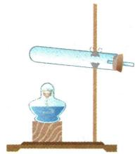
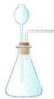
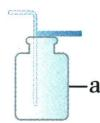
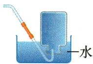

## 讲解

### 是什么

化合反应是两种或以上反应物生成一种物质；分解反应是一种反应物生成两种或以上物质。

### 怎么来的

分类数的是物质种类，不是分子个数或化学式前系数。铁与氧生成四氧化三铁是多变一；过氧化氢分解为水和氧是一变多。二氧化锰作为条件不计为反应物。

### 什么时候能用

两者属于基本反应类型；必须完整看反应物和生成物，不能只看有无氧气。蜡烛燃烧生成两类物质，不能因有氧就归化合。

## 例题

### 燃烧现象与符号表达式

> 来源ID Q02-11；第二单元空气和氧气；1-50/full.md 第1755–1757行。原答案与解析定位：1-50/full.md 第1769–1771行。

例3 (2024 山东枣庄中考改编)关于氧气性质的实验,下列现象与符号表达式均正确的是 ()

| 选项 | 实验 | 现象 | 符号表达式 |
| --- | --- | --- | --- |
| A | 木炭在氧气中燃烧 | 发出红光,生成黑色固体 | $C+O_2\xrightarrow{\text{点燃}}CO_2$ |
| B | 铁丝在氧气中燃烧 | 火星四射,生成黑色固体 | $Fe+O_2\xrightarrow{\text{点燃}}Fe_3O_4$ |
| C | 镁带在空气中燃烧 | 发出耀眼的白光,生成白色固体 | $Mg+O_2\xrightarrow{\text{点燃}}MgO_2$ |
| D | 红磷在空气中燃烧 | 产生黄色火焰,生成黄烟 | $P+O_2\xrightarrow{\text{点燃}}P_2O_3$ |

**原资料答案与解析：**

例3 解析 A(×)木炭在氧气中燃烧, 发出白光, 生成无色、无臭的气体; C(×)镁在空气中燃烧生成氧化镁, 正确的符号表达式为 $Mg + O_{2} \xrightarrow{\text{点燃}} MgO$ ; D(×)红磷在空气中燃烧产生黄色火焰, 生成白烟, 正确的符号表达式为 $P + O_{2} \xrightarrow{\text{点燃}} P_{2}O_{5}$ 。

答案 B

**展开解析（依据原详解补足理由与步骤）：**

选B。A原式是$C+O_2\xrightarrow{\text{点燃}}CO_2$，符号表达式对，但木炭在氧气中发白光而非红光，生成气体而非黑色固体。B铁丝火星四射、生成黑色固体，原式中产物$Fe_3O_4$也对。C耀眼白光和白色固体现象对，但原选项写$MgO_2$，应为$MgO$。D红磷产生白烟而非黄烟，原选项$P_2O_3$也应改为教材口径$P_2O_5$。这些是本题的未配平符号表达式，不能当作正式化学方程式，配平在相应条目学习。

### 过氧化氢制取收集验满

> 来源ID Q02-14；第二单元空气和氧气；1-50/full.md 第1990–2010行。原答案与解析定位：1-50/full.md 第1977–1979行。

例2 (2023 陕西中考改编)下图是实验室常见的气体制备装置。

  
A

  
B

  
C

  
D

(1)写出标有字母 a 的仪器名称：\_\_\_\_。

(2)用过氧化氢溶液和二氧化锰制氧气时,应选择的气体发生装置是\_\_\_\_(填字母),该反应的基本反应类型为\_\_\_\_。

(3)用 C 装置收集氧气时,验满方法是\_\_\_\_;

用 D 装置收集氧气时,验满方法是\_\_\_\_。

**原资料答案与解析：**

例2 解析（2）用过氧化氢溶液和二氧化锰制氧气，应选用固液常温型装置；过氧化氢分解制氧气符合“一变多”的特点，是分解反应。

答案 (1) 集气瓶 (2) B 分解反应 (3) 将带火星的木条放在集气瓶口, 若木条复燃, 说明已集满 当集气瓶口有大气泡冒出时, 说明氧气已集满

**展开解析（依据原详解补足理由与步骤）：**

(1)a标注集气瓶。(2)过氧化氢溶液与二氧化锰在常温下反应，不需加热，因此选B；A为固体加热发生装置，不适合这里。一个反应物过氧化氢变成水和氧气，属于分解反应，催化剂不计为反应物。(3)C是向上排空气收集，带火星木条放瓶口，复燃表示已满；放瓶内只能作检验。D倒扣于水中，瓶内水被排完、瓶口出现大气泡，表示收集满。开始阶段导管口气泡是空气排出，不能据此开始收集或认定已满。

## 易错

先核对对象、条件和直接证据，再判断；相似现象不能代替定义。
