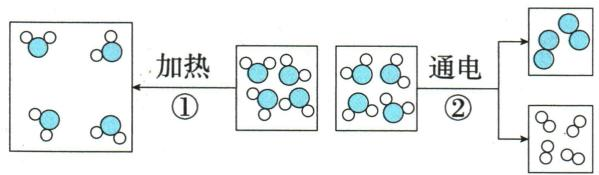

## 讲解

### 是什么

普通化学反应元素种类、原子种类数目、元素质量和物质总质量保持；物质种类与分子种类通常改变，分子总数可变也可不变。

### 怎么来的

反应是原子组合关系改变，不是拆开原子核。Cl₂与H₂成2$HCl$，左2分子右2分子，是总数不变的实例；水分解2水分子成2氢分子加1氧分子，是总数改变。

### 什么时候能用

不把“可能改变”写成“一定改变”；比较微观图先看图例，不把分子变化误当元素变化。中子等核信息不是普通化学变化的题设目标。

## 例题

### 水变化微观图

> 来源ID Q05-06；第五单元化学反应的定量关系；51-100/full.md 第991–999行。原答案与解析定位：51-100/full.md 第1001–1003行。

例6 (2024 陕西中考)下图是水发生变化的微观示意图,请回答。

(1)图中共有\_\_\_\_种原子。

(2)水分子本身未发生改变的是变化\_\_\_\_（填“①”或“②”）。

(3)水通电时,参加反应的水与生成的气体的质量比为\_\_\_\_。

**原资料答案与解析：**

解析 (1)根据图示,有2种原子。(2)变化①中分子种类不变,改变的是分子间间隔,属于物理变化;变化②中水分子在通电条件下生成了氢分子和氧分子,分子种类改变,属于化学变化。综上,水分子本身未发生改变的是变化①。(3)水在通电条件下生成氢气与氧气,该过程中水全部转化成气体,根据质量守恒定律,参加反应的水与生成的气体的质量比为1:1。

答案 (1)2 (2)① (3)1:1

**展开解析（依据原详解补足理由与步骤）：**

(1)两种原子，图中大球、小球分别表示氧、氢，组合改变不增加元素。(2)①只改变间隔，水分子仍相同，是加热状态变化；②通电重新组合为氢分子和氧分子，水分子改变。(3)参加反应的水全部形成两种气体，按质量守恒，水与“氢气加氧气总质量”之比1∶1，不是水与其中一种气体的比。

### 氯氢反应哪些量不变

> 来源ID Q05-07；第五单元化学反应的定量关系；51-100/full.md 第1015–1023行。原答案与解析定位：51-100/full.md 第1042–1044行。

例1 (2024 江苏南通中考) 下列关于 $Cl_{2} + H_{2} \xlongequal{\text{点燃}} 2HCl$ 的说法正确的是

A. 反应前后分子种类发生变化

B. 反应前后元素种类发生变化

C. 反应前后分子总数发生变化

D. 反应前后原子总数发生变化

**原资料答案与解析：**

例1 解析 对于题给反应,反应前后元素种类、分子总数、原子总数均不变,分子种类改变。

答案 A

**展开解析（依据原详解补足理由与步骤）：**

选A。反应$Cl_2+H_2\xlongequal{\text{点燃}}2HCl$，A原先氯分子和氢分子，后为氯化氢分子，种类改变。B元素仍Cl、H不变；C左每组1+1=2分子，右2分子，这个具体反应数目不变；D左Cl2、H2共4原子，右2$HCl$也共4，不变。分子总数是“可能变”，不能把别的反应数变结论套这里。

## 易错

质量、原子数、分子数及投料量分开核对，任何计算使用实际参加量。
