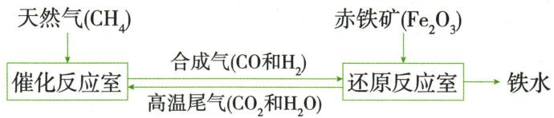

## 讲解

### 是什么

一种单质和一种化合物生成另一单质与另一化合物，按物质种类和数量模式划分。

### 怎么来的

被置出的元素从化合物进入单质，投入单质形成新化合物；必须两边都满足“单质+化合物”，不是只看某边。

### 什么时候能用

$CO$还原虽生铜却两反应物都化合物，不是置换；甲烷燃烧虽有$O_{2}$单质，产物没有单质也不是。还原是另一个角度，不能与基本类型混为一谈。

## 例题

### 镁水反应分类

> 来源ID Q08-11；第八单元金属和金属材料；101-150/full.md 第858–866行。原答案与解析定位：101-150/full.md 第920–920行。

例3 (2024 江苏无锡中考) 镁与水反应的化学方程式为 $Mg+2H_2O\rightarrow Mg(OH)_2+H_2\uparrow$ ，该反应的类型属于（）

A. 化合反应

B. 分解反应

C. 置换反应

D. 复分解反应

**原资料答案与解析：**

例3 解析 该反应是一种单质和一种化合物反应生成另一种单质和另一种化合物,属于置换反应。答案 C

**展开解析（依据原详解补足理由与步骤）：**

选C。题给$Mg+2H_2O\rightarrow Mg(OH)_2+H_2\uparrow$，Mg单质与$H_{2}O$化合物生成另一化合物及H₂单质，符合置换。A有两个产物，不是多变一；B有两种反应物不是一变多；D不是两种化合物交换成分。原题为反应类型判断，未给条件不自行加实验方案。

### 合成气还原炼铁流程

> 来源ID Q08-15；第八单元金属和金属材料；101-150/full.md 第1061–1070行。原答案与解析定位：101-150/full.md 第1047–1049行。

例1（2024 江苏无锡中考节选改编）低碳行动是人类应对全球变暖的重要举措，二氧化碳的资源化利用有多种途径。

I. $CO_{2}$ 转化为 $CO$

炼铁的一种原理示意图如下(括号内化学式表示相应物质的主要成分):

(1)写出还原反应室中炼铁的化学方程式：\_\_\_\_。
(2)写出能使 Fe 转化为 $Fe_{3}O_{4}$ 的化学方程式：\_\_\_\_。

**原资料答案与解析：**

例1 解析（1）还原反应室中炼铁的反应有一氧化碳与氧化铁在高温条件下反应生成铁和二氧化碳、氢气与氧化铁在高温条件下反应生成铁与水。（2）铁丝在纯氧中燃烧生成 $Fe_{3}O_{4}$ ，写出相应的化学方程式。

答案（1） $3CO + Fe_{2}O_{3} \xlongequal{\text{高温}} 2Fe + 3CO_{2}$ （或 $3H_{2} + Fe_{2}O_{3} \xlongequal{\text{高温}} 2Fe + 3H_{2}O$ ）（2） $3Fe + 2O_{2} \xlongequal{\text{点燃}} Fe_{3}O_{4}$

**展开解析（依据原详解补足理由与步骤）：**

(1)图给合成气$CO$和H₂，任选一种原理：$Fe_2O_3+3CO\xlongequal{\text{高温}}2Fe+3CO_2$，或$Fe_2O_3+3H_2\xlongequal{\text{高温}}2Fe+3H_2O$。Fe2对应2Fe，3氧分别形成3$CO_{2}$或3水，其他元素随之平衡。(2)$3Fe+2O_2\xlongequal{\text{点燃}}Fe_3O_4$，氧气燃烧黑色产物，与铁锈的组成不同。$CO$、H₂并存时实际各消耗多少原题没有给，不能额外分配。

## 易错

先分单质化合物再看两侧模式。
