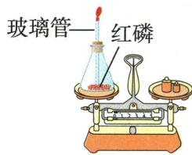
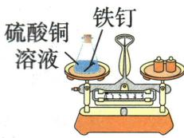
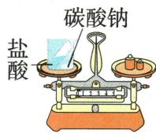
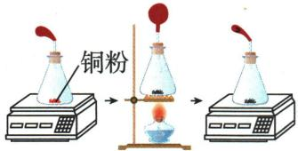
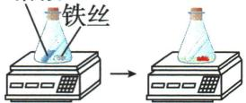

## 讲解

### 是什么

参加化学反应各物质的质量和等于生成物质量和。整个封闭称量系统也有前后总质量相等。

### 怎么来的

普通化学反应重新组合原子，不改变原子种类、数目和近似质量，因此元素质量及总质量守恒。装置和未反应部分在总称量式两边相同，扣除后得到反应质量关系。

### 什么时候能用

敞口称量若气体逸出或空气进入，所称范围改变，不否定守恒。物理变化在封闭系统也有质量守恒，但不能拿未发生化学反应的实验验证本章反应物生成物定律。体积和分子数未必守恒。

## 例题

### 三种质量守恒实验

> 来源ID Q05-01；第五单元化学反应的定量关系；51-100/full.md 第862–878行。原答案与解析定位：51-100/full.md 第880–886行。

例1 同学们学习了质量守恒定律后,在实验室设计并完成了如下实验来验证质量守恒定律。

  
实验①

  
实验②

  
实验③

(1)实验方法:如图所示,小组同学分别设计了三组实验验证质量守恒定律。  
(2)实验原理:上述实验中发生反应的符号表达式为\_\_\_\_（任写一个）。  
(3)实验现象:实验①中红磷燃烧,产生大量白烟,气球先胀大后变瘪,冷却至室温后天平指针不偏转;实验②中\_\_\_\_\_,天平指针不偏转;实验③中固体减少,产生气泡,天平指针\_\_\_\_\_(填“不偏转”“偏左”或“偏右”)。   
(4)实验结论:参加化学反应的各物质的质量总和等于反应后生成的各物质的质量总和。  
(5)实验结束后,回收实验②中铁钉的操作是\_\_\_\_。  
(6)问题与交流:上述三组实验中,实验③无法达到实验目的。若不改变仪器,只将碳酸钠换成硝酸银溶液,(能/不能)达到实验目的(盐酸与硝酸银反应生成氯化银沉淀和硝酸)。

**原资料答案与解析：**

解析 (2) 实验①中反应的符号表达式为 $\mathrm{P} + \mathrm{O}_{2} \xrightarrow{\text{点燃}} \mathrm{P}_{2} \mathrm{O}_{5}$ ; 实验②中反应的符号表达式为 $\mathrm{Fe} + \mathrm{CuSO}_{4} \longrightarrow \mathrm{FeSO}_{4} + \mathrm{Cu}$ ; 实验③中反应的符号表达式为 $\mathrm{Na}_{2} \mathrm{CO}_{3} + \mathrm{HCl} \longrightarrow \mathrm{NaCl} + \mathrm{H}_{2} \mathrm{O} + \mathrm{CO}_{2}$ , 任写一个即可。

(3)实验②中铁与硫酸铜反应生成硫酸亚铁和铜,铁钉表面有红色固体析出,溶液由蓝色变为浅绿色,天平指针不偏转。实验③中碳酸钠与盐酸反应生成氯化钠、水和二氧化碳,生成的气体逸散到空气中,左盘质量减少,则天平指针偏右。(5)实验②反应后铁钉表面附着一层铜,从溶液中取出铁钉烘干,用砂纸打磨,去除表面的铜,可回收实验②中的铁钉。(6)实验③反应生成的气体逸散到空气中,不能用于验证质量守恒定律。若试剂换成盐酸与硝酸银溶液,反应生成氯化银沉淀和硝酸,没有气体放出,反应前后装置中各物质的质量总和相等,能达到实验目的。

答案 (2) $\mathrm{P} + \mathrm{O}_2\xrightarrow{\text{点燃}}\mathrm{P}_2\mathrm{O}_5$ （或 $\mathrm{Fe} + \mathrm{CuSO}_4\longrightarrow \mathrm{FeSO}_4 + \mathrm{Cu}$ 或 $\mathrm{Na_2CO_3 + HCl}\longrightarrow \mathrm{NaCl + H_2O + CO_2})$

(3)铁钉表面有红色固体析出,溶液由蓝色变为浅绿色 偏右 (5)取出铁钉烘干,用砂纸打磨 (6)能

**展开解析（依据原详解补足理由与步骤）：**

(2)任选原题一反应的符号表达式即可，如$Fe+CuSO_4\rightarrow FeSO_4+Cu$；若写正式方程式则需配平。(3)②铁钉表面有红色固体析出，溶液蓝色渐浅并出现浅绿色；不产生逸散气体，称量不变。③二氧化碳逸散，左盘留在称量范围内的质量减少，指针偏右，不是定律失效。(5)按原资料取出、烘干、砂纸去表面铜，可回收铁钉；这不是回收全部参与反应的铁，已溶解的铁不能靠打磨取回。(6)能：换硝酸银后生成氯化银沉淀和硝酸，没有气体逸出，避免了原来的称量范围缺失。应同时防止溅出并等待反应完成。

### 氯氢反应哪些量不变

> 来源ID Q05-07；第五单元化学反应的定量关系；51-100/full.md 第1015–1023行。原答案与解析定位：51-100/full.md 第1042–1044行。

例1 (2024 江苏南通中考) 下列关于 $Cl_{2} + H_{2} \xlongequal{\text{点燃}} 2HCl$ 的说法正确的是

A. 反应前后分子种类发生变化

B. 反应前后元素种类发生变化

C. 反应前后分子总数发生变化

D. 反应前后原子总数发生变化

**原资料答案与解析：**

例1 解析 对于题给反应,反应前后元素种类、分子总数、原子总数均不变,分子种类改变。

答案 A

**展开解析（依据原详解补足理由与步骤）：**

选A。反应$Cl_2+H_2\xlongequal{\text{点燃}}2HCl$，A原先氯分子和氢分子，后为氯化氢分子，种类改变。B元素仍Cl、H不变；C左每组1+1=2分子，右2分子，这个具体反应数目不变；D左Cl2、H2共4原子，右2$HCl$也共4，不变。分子总数是“可能变”，不能把别的反应数变结论套这里。

### 原封闭称量实验案例

> 来源ID Q05-24；第五单元化学反应的定量关系；51-100/full.md 第762–762行。原答案与解析定位：51-100/full.md 第762–775行。

| 实验方案 | 实验方案 | 铜与氧气反应前后质量的测定 | 铁与硫酸铜溶液反应前后质量的测定 |
| --- | --- | --- | --- |
| 图示2 | 图示2 |  | 硫酸铜溶液 |
| 反应原理 | 反应原理 | 铜+氧气 $\xrightarrow{\text{加热}}$ 氧化铜 | 铁+硫酸铜 $\longrightarrow$ 铜+硫酸亚铁 |
| 实验现象 | 实验现象 | 气球鼓起后又变瘪,红色粉末逐渐变为黑色 | 光亮的铁丝表面逐渐变红,溶液由蓝色逐渐变为浅绿色 |
| 实验数据 | 实验数据 | 反应前后总质量不变 | 反应前后总质量不变 |
| 实验现象分析 | 实验现象分析 | 开始加热时,锥形瓶中气体受热膨胀,气球鼓起;随着氧气被消耗,瓶内气体压强减小,最终气球变瘪,红色的铜粉与氧气反应生成黑色的氧化铜 | 反应前,铁丝光亮,呈银白色,硫酸铜溶液为蓝色;反应后生成的红色的铜覆盖在铁丝表面,随着硫酸亚铁(其溶液为浅绿色)的生成,溶液由蓝色逐渐变为浅绿色 |
| 实验数据解释 | 实验数据解释 | 反应体系封闭,与外界没有物质交换,反应前后物质总质量相等 | 反应体系封闭,与外界没有物质交换,反应前后物质总质量相等 |
| 实验数据处理 | 反应前总质量 | 1装置质量2铜粉质量(参加反应的铜粉质量+未参加反应的铜粉质量)3瓶中氧气质量(参加反应的氧气质量+未参加反应的氧气质量)4瓶中其他气体质量 | 1装置质量2铁丝质量(参加反应的铁丝质量+未参加反应的铁丝质量)3硫酸铜溶液质量(参加反应的硫酸铜质量+未参加反应的硫酸铜溶液质量)4瓶中气体质量 |
| 实验数据处理 | 反应后总质量 | 1装置质量2生成的氧化铜质量3未参加反应的铜粉质量4未参加反应的氧气质量5瓶中其他气体质量 | 1装置质量2生成的硫酸亚铁质量3生成的铜质量4未参加反应的铁丝质量5未参加反应的硫酸铜溶液质量6瓶中气体质量 |
| 实验数据处理 | 消去反应前后相同项 | $m_{\text{参加反应的铜粉}} + m_{\text{参加反应的氧气}} = m_{\text{生成的氧化铜}}$ | $m_{\text{参加反应的铁丝}} + m_{\text{参加反应的硫酸铜}} = m_{\text{生成的硫酸亚铁}} + m_{\text{生成的铜}}$ |

**原资料答案与解析：**

| 实验方案 | 实验方案 | 铜与氧气反应前后质量的测定 | 铁与硫酸铜溶液反应前后质量的测定 |
| --- | --- | --- | --- |
| 图示2 | 图示2 |  | 硫酸铜溶液 |
| 反应原理 | 反应原理 | 铜+氧气 $\xrightarrow{\text{加热}}$ 氧化铜 | 铁+硫酸铜 $\longrightarrow$ 铜+硫酸亚铁 |
| 实验现象 | 实验现象 | 气球鼓起后又变瘪,红色粉末逐渐变为黑色 | 光亮的铁丝表面逐渐变红,溶液由蓝色逐渐变为浅绿色 |
| 实验数据 | 实验数据 | 反应前后总质量不变 | 反应前后总质量不变 |
| 实验现象分析 | 实验现象分析 | 开始加热时,锥形瓶中气体受热膨胀,气球鼓起;随着氧气被消耗,瓶内气体压强减小,最终气球变瘪,红色的铜粉与氧气反应生成黑色的氧化铜 | 反应前,铁丝光亮,呈银白色,硫酸铜溶液为蓝色;反应后生成的红色的铜覆盖在铁丝表面,随着硫酸亚铁(其溶液为浅绿色)的生成,溶液由蓝色逐渐变为浅绿色 |
| 实验数据解释 | 实验数据解释 | 反应体系封闭,与外界没有物质交换,反应前后物质总质量相等 | 反应体系封闭,与外界没有物质交换,反应前后物质总质量相等 |
| 实验数据处理 | 反应前总质量 | 1装置质量2铜粉质量(参加反应的铜粉质量+未参加反应的铜粉质量)3瓶中氧气质量(参加反应的氧气质量+未参加反应的氧气质量)4瓶中其他气体质量 | 1装置质量2铁丝质量(参加反应的铁丝质量+未参加反应的铁丝质量)3硫酸铜溶液质量(参加反应的硫酸铜质量+未参加反应的硫酸铜溶液质量)4瓶中气体质量 |
| 实验数据处理 | 反应后总质量 | 1装置质量2生成的氧化铜质量3未参加反应的铜粉质量4未参加反应的氧气质量5瓶中其他气体质量 | 1装置质量2生成的硫酸亚铁质量3生成的铜质量4未参加反应的铁丝质量5未参加反应的硫酸铜溶液质量6瓶中气体质量 |
| 实验数据处理 | 消去反应前后相同项 | $m_{\text{参加反应的铜粉}} + m_{\text{参加反应的氧气}} = m_{\text{生成的氧化铜}}$ | $m_{\text{参加反应的铁丝}} + m_{\text{参加反应的硫酸铜}} = m_{\text{生成的硫酸亚铁}} + m_{\text{生成的铜}}$ |

# ① 拓展延伸

1. 体系与环境：在化学中，把研究的对象叫作体系；体系以外的部分叫作环境。  
2. 封闭体系：体系与环境之间无物质交换，只有能量交换。利用有气体参加或生成的化学反应验证质量守恒定律，必须在封闭体系中进行。  
3.敞开体系：体系与环境之间既有物质交换又有能量交换。

# ② 拓展延伸 橡胶塞和小气球的作用

1. 橡胶塞和小气球可以使装置封闭，防止外界物质进入装置，使结果产生误差。  
2. 小气球还可起缓冲作用，防止瓶内气体受热膨胀而冲开橡胶塞。

| 实验结论 | 参加反应的铜粉和氧气的质量总和等于反应后生成的氧化铜的质量 | 参加反应的铁和硫酸铜的质量总和等于反应后生成的铜和硫酸亚铁的质量总和 |
| --- | --- | --- |

**展开解析（依据原详解补足理由与步骤）：**

这是原实验说明。整个装置封闭时，铜与瓶内氧反应，或者铁与硫酸铜反应，都只在所称系统内部改变组成；装置、未反应物和旁观成分前后都要列入称量。把这些相同项从前后总质量等式两边各减去，才得参加反应物质量和=生成物质量和。气球先受热膨胀，再因耗氧且冷却变瘪，不能据其鼓瘪推断质量增加或减少。称量宜等温，并注意气球体积变化可能造成浮力干扰。

## 易错

质量、原子数、分子数及投料量分开核对，任何计算使用实际参加量。
