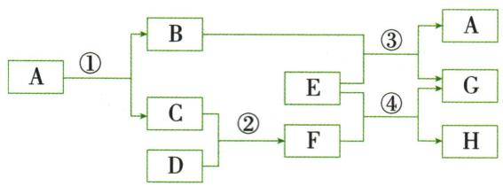

## 讲解

### 判据

看见单质参加或生成还不足判断。

### 流程

分别标两边每种为单质或化合物，检查一单一化→另一单另一化，再核反应事实和式子；不凭是否金属或是否还原断定。

## 例题

### 镁水反应分类

> 来源ID Q08-11；第八单元金属和金属材料；101-150/full.md 第858–866行。原答案与解析定位：101-150/full.md 第920–920行。

例3 (2024 江苏无锡中考) 镁与水反应的化学方程式为 $Mg+2H_2O\rightarrow Mg(OH)_2+H_2\uparrow$ ，该反应的类型属于（）

A. 化合反应

B. 分解反应

C. 置换反应

D. 复分解反应

**原资料答案与解析：**

例3 解析 该反应是一种单质和一种化合物反应生成另一种单质和另一种化合物,属于置换反应。答案 C

**展开解析（依据原详解补足理由与步骤）：**

选C。题给$Mg+2H_2O\rightarrow Mg(OH)_2+H_2\uparrow$，Mg单质与$H_{2}O$化合物生成另一化合物及H₂单质，符合置换。A有两个产物，不是多变一；B有两种反应物不是一变多；D不是两种化合物交换成分。原题为反应类型判断，未给条件不自行加实验方案。

### 合成气还原炼铁流程

> 来源ID Q08-15；第八单元金属和金属材料；101-150/full.md 第1061–1070行。原答案与解析定位：101-150/full.md 第1047–1049行。

例1（2024 江苏无锡中考节选改编）低碳行动是人类应对全球变暖的重要举措，二氧化碳的资源化利用有多种途径。

I. $CO_{2}$ 转化为 $CO$

炼铁的一种原理示意图如下(括号内化学式表示相应物质的主要成分):

(1)写出还原反应室中炼铁的化学方程式：\_\_\_\_。
(2)写出能使 Fe 转化为 $Fe_{3}O_{4}$ 的化学方程式：\_\_\_\_。

**原资料答案与解析：**

例1 解析（1）还原反应室中炼铁的反应有一氧化碳与氧化铁在高温条件下反应生成铁和二氧化碳、氢气与氧化铁在高温条件下反应生成铁与水。（2）铁丝在纯氧中燃烧生成 $Fe_{3}O_{4}$ ，写出相应的化学方程式。

答案（1） $3CO + Fe_{2}O_{3} \xlongequal{\text{高温}} 2Fe + 3CO_{2}$ （或 $3H_{2} + Fe_{2}O_{3} \xlongequal{\text{高温}} 2Fe + 3H_{2}O$ ）（2） $3Fe + 2O_{2} \xlongequal{\text{点燃}} Fe_{3}O_{4}$

**展开解析（依据原详解补足理由与步骤）：**

(1)图给合成气$CO$和H₂，任选一种原理：$Fe_2O_3+3CO\xlongequal{\text{高温}}2Fe+3CO_2$，或$Fe_2O_3+3H_2\xlongequal{\text{高温}}2Fe+3H_2O$。Fe2对应2Fe，3氧分别形成3$CO_{2}$或3水，其他元素随之平衡。(2)$3Fe+2O_2\xlongequal{\text{点燃}}Fe_3O_4$，氧气燃烧黑色产物，与铁锈的组成不同。$CO$、H₂并存时实际各消耗多少原题没有给，不能额外分配。

### 绿电氢气部分替代CO炼铁

> 来源ID Q14-03；专题三物质的推断；151-200/full.md 第1549–1561行。原答案与解析定位：151-200/full.md 第1563–1573行。

例3 (2024 河北中考)为减少炼铁过程中生成 $\mathrm{CO}_{2}$ 的质量,某小组设计了如图所示的炼铁新方案(反应条件已略去)。A\~H 是初中化学常见物质,其中 A 是常用的溶剂,G 是铁;反应①中用到的电为“绿电”,获得“绿电”的过程中不排放 $\mathrm{CO}_{2}$ 。

请回答下列问题:

(1)可作为“绿电”来源的是\_\_\_\_（选填“煤炭”或“水能”）。

(2) 反应①的化学方程式为 \_\_\_\_。

(3) 反应①\~④中属于置换反应的是 \_\_\_\_ (选填序号)。

(4)冶炼得到相同质量的铁,使用该新方案比高炉炼铁生成 $CO_{2}$ 的质量少,其原因除使用了“绿电”外,还有\_\_\_\_。

**原资料答案与解析：**

解析 A 是常用的溶剂, 则 A 为 $H_{2}O$ ; 由此可以推知反应①生成的 B、C 分别为 $O_{2}$ 或 $H_{2}$ 中的一种, 反应①为分解反应。G 为铁, 反应③生成铁和水, 则反应④是炼铁原理, E 为 $Fe_{2}O_{3}$ , B 为 $H_{2}$ , C 为 $O_{2}$ , 反应③为置换反应; 氧化物 F 为还原剂 $CO$。反应②为 $O_{2}$ 和 D 反应生成 $CO$, 则 D 为碳单质, 反应②为化合反应。

(1)获得“绿电”的过程中不排放 $CO_{2}$ ，则“绿电”来源可以是水能。

(2)由分析可知,反应①为水在通电条件下分解为氢气和氧气。

(3)由分析可知,反应③为置换反应。注意反应④即炼铁原理,不属于置换反应。

(4)高炉炼铁中石灰石的分解、一氧化碳还原铁矿石、焦炭燃烧等途径都能产生二氧化碳,而题目方案中还原氧化铁的一部分 $CO$ 被 $\mathrm{H}_{2}$ 代替,所以炼得相同质量的铁时,产生的二氧化碳质量少。

答案 (1) 水能 (2) $2H_{2}O\xlongequal{\text{通电}}2H_{2}\uparrow+O_{2}\uparrow$ (3)③ (4)有一部分氧化铁被氢气还原,没有二氧化碳产生

**展开解析（依据原详解补足理由与步骤）：**

A常用溶剂$H_{2}O$，①电解$2H_2O\xlongequal{\text{通电}}2H_2\uparrow+O_2\uparrow$。③B与E成铁G和水A，所以B=H₂，E=$Fe_{2}O_{3}$，C=$O_{2}$；②C与D成F还原剂，D=C碳、F=$CO$。③$Fe_2O_3+3H_2\xlongequal{\text{高温}}2Fe+3H_2O$为单质化合物换单质化合物，置换；④$Fe_2O_3+3CO\xlongequal{\text{高温}}2Fe+3CO_2$两化合物起始非置换。(1)水能；煤炭发电燃烧有$CO_{2}$。(3)③；①分解、②$2C+O_2\xlongequal{\text{点燃}}2CO$化合、④非上述置换。(4)相同铁，一部分用氢还原生成水，少用$CO$、少生$CO_{2}$，但②④仍有含碳支路，不称整个方案零排放。题的绿电定义仅题设获取电的阶段，非水电设施建造全生命周期。

## 易错

四种基本反应模式按完整净反应判断。
