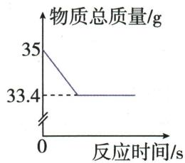
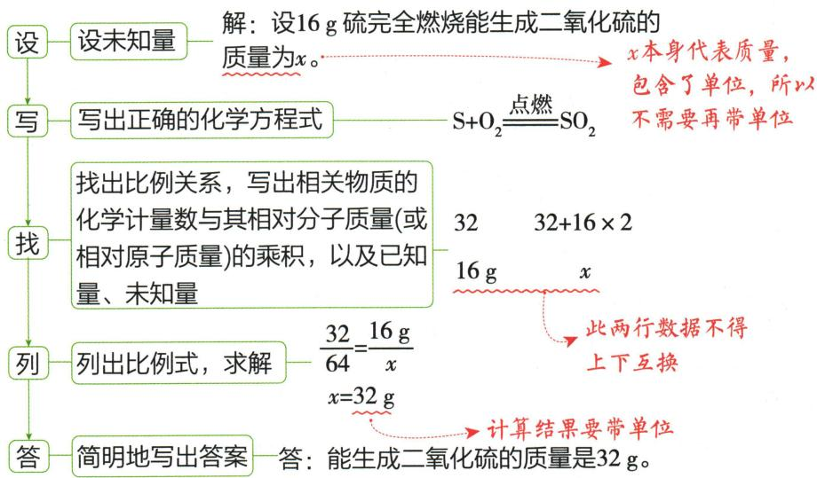
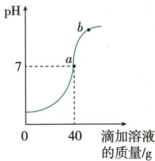
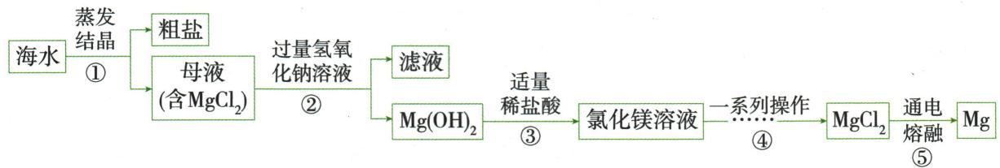

## 讲解

### 判据

给一参加量或产物量求另一量时，先确认纯物质和反应程度。

### 流程

写并配平方程式；算两物质各自“系数×相对质量”；将两贡献和对应实际质量一一对齐列比例。设未知包含单位，交叉相乘再除对应贡献；代回比例并检查量级。不把两行上下配错，也不漏系数。

## 例题

### 电子秤时间表计算

> 来源ID Q05-13；第五单元化学反应的定量关系；51-100/full.md 第1345–1351行。原答案与解析定位：51-100/full.md 第1353–1363行。

例5 某化学兴趣小组同学在实验室中取一定量的过氧化氢溶液放入小烧杯中并加入少量的二氧化锰,用电子秤测其质量,不同时间电子秤的读数记录如下表所示。

| 时间/min | 0 | 1 | 2 | 3 | 4 | 5 |
| --- | --- | --- | --- | --- | --- | --- |
| 电子秤示数 | 205 g | 203.4 g | 201.8 g | 200.2 g | 198.6 g | 198.6 g |

(1)通过对表格数据的分析,该化学反应生成氧气的质量为\_\_\_\_g。

(2)计算此过氧化氢溶液中含过氧化氢的质量,写出计算过程。

**原资料答案与解析：**

解析 (1)根据质量守恒定律可知,电子秤示数减小的值即为生成的氧气的质量,即 $205 \mathrm{~g} - 198.6 \mathrm{~g} = 6.4 \mathrm{~g}$ 。

答案 (1)6.4

(2) 解: 设过氧化氢溶液中含过氧化氢的质量为 x。

$$
\begin{array}{l l} 2 \mathrm{H} _ {2} \mathrm{O} _ {2} \stackrel {\mathrm{MnO} _ {2}} {=} 2 \mathrm{H} _ {2} \mathrm{O} + \mathrm{O} _ {2} \uparrow & \frac {6 8}{3 2} = \frac {x}{6 . 4 \mathrm{g}} \\ 6 8 & 3 2 \\ x & 6. 4 \mathrm{g} \end{array}
$$

答: 过氧化氢溶液中含过氧化氢的质量为 13.6 g。

**展开解析（依据原详解补足理由与步骤）：**

(1)4、5 min同读数198.6 g，按题设已反应完、只氧逸出模型，氧质量$205-198.6=6.4$ g。(2)设实际分解过氧化氢质量x，式$2H_2O_2\xlongequal{MnO_2}2H_2O+O_2\uparrow$。过氧化氢相对质量34，系数2贡献68；氧气32，故$68/32=x/(6.4\ \mathrm{g})$。两边乘6.4 g，$x=68\times6.4/32=13.6$ g。原溶液还有水，不能把秤总读数或催化剂当过氧化氢质量。若有蒸发或飞溅，需要先排除。

### 过氧化氢质量曲线

> 来源ID Q05-14；第五单元化学反应的定量关系；51-100/full.md 第1365–1369行。原答案与解析定位：51-100/full.md 第1371–1385行。

例6 实验室用 34 g 过氧化氢溶液和 1 g 二氧化锰制取氧气,实验的相关数据如图所示。请回答:

(1)过氧化氢中氢元素和氧元素的质量比为\_\_\_\_。  
(2)反应生成氧气的质量为\_\_\_\_g。  
(3) 计算该反应生成水的质量。

**原资料答案与解析：**

解析（1）过氧化氢中氢元素和氧元素的质量比为 $(1\times2):(16\times2)=1:16;$

(2)根据质量守恒定律,反应后减少的质量为生成氧气的质量,即35 g-33.4 g=1.6 g。

答案 (1) $1:16$ (2)1.6

(3) 解: 设该反应生成水的质量为 x。

$$
\begin{array}{r l} 2 \mathrm{H} _ {2} \mathrm{O} _ {2} & \xlongequal {\mathrm{MnO} _ {2}} 2 \mathrm{H} _ {2} \mathrm{O} + \mathrm{O} _ {2} \uparrow \\ & 3 6 \quad 3 2 \\ & x \quad 1. 6 \mathrm{g} \end{array} \qquad \begin{array}{r l} \frac {3 6}{3 2} = \frac {x}{1 . 6 \mathrm{g}} \\ x = 1. 8 \mathrm{g} \end{array}
$$

答:该反应生成水的质量为 1.8 g。

**展开解析（依据原详解补足理由与步骤）：**

(1)过氧化氢H2、$O_{2}$，元素质量比$(1\times2):(16\times2)=2:32=1:16$。(2)起始包含34 g溶液加1 g催化剂共35 g，图终点33.4 g；氧逸出质量$35-33.4=1.6$ g。(3)设新生成水质量x，按$2H_2O_2\xlongequal{MnO_2}2H_2O+O_2\uparrow$，水贡献$2\times18=36$，氧32，得$36/32=x/(1.6\ \mathrm{g})$；$x=36\times1.6/32=1.8$ g。问的是反应新生水，不能把原溶液的水也算入。

### 生产钛所需镁

> 来源ID Q05-18；第五单元化学反应的定量关系；51-100/full.md 第1480–1483行。原答案与解析定位：51-100/full.md 第1417–1439行。

例3 (2024 湖北中考)钛(Ti)和钛合金广泛用于火箭、导弹、航天飞机和通讯设备等。工业上生产钛的反应为 $TiCl_{4} + 2Mg \xlongequal{\text{高温}} 2MgCl_{2} + Ti$ 。

(1) $TiCl_{4}$ 中钛、氯元素的质量比为\_\_\_\_。   
(2)若要生产 12 t 钛, 至少需要镁的质量是多少? (写出计算过程)

**原资料答案与解析：**

例3 解析（1） $TiCl_{4}$ 中钛、氯元素的质量比为 $(48\times1):(35.5\times4)=48:142=24:71$ 。

答案 (1)24:71(或 48:142)

(2) 解: 设至少需要镁的质量为 x。

$$
\mathrm{TiCl} _ {4} + 2 \mathrm{Mg} \xlongequal {\text {高温}} 2 \mathrm{MgCl} _ {2} + \mathrm{Ti}
$$

$$
\begin{array}{l l} 4 8 & 4 8 \\ x & 1 2 \text {   t   } \end{array}
$$

$$
\frac {4 8}{4 8} = \frac {x}{1 2 \mathrm{t}} (\text {或} \frac {4 8}{x} = \frac {4 8}{1 2 \mathrm{t}})
$$

$$
x = 1 2 \mathrm{t}
$$

答: 至少需要镁的质量为 12 t。

**展开解析（依据原详解补足理由与步骤）：**

(1)TiCl₄元素质量比$48:(35.5\times4)=48:142=24:71$。(2)式中2Mg对应1Ti，镁相对质量贡献$2\times24=48$，钛48，质量比1∶1。设参加反应镁质量x，$48/48=x/(12\ \mathrm{t})$，两边乘12 t，得x=12 t。这里是纯镁理论用量，没有收率或杂质条件，不能额外增加损耗系数。

### 石英砂纯度计算

> 来源ID Q05-19；第五单元化学反应的定量关系；51-100/full.md 第1484–1487行。原答案与解析定位：51-100/full.md 第1441–1455行。

例4 (2024 山东淄博中考) 硅化镁 $\left(\mathrm{Mg}_{2} \mathrm{Si}\right)$ 在能源器件、激光和半导体制造等领域具有重要应用价值, 可通过石英砂 (主要成分为 $\mathrm{SiO}_{2}$ , 杂质不含硅元素) 和金属镁反应制得, 反应的化学方程式为 $\mathrm{SiO}_{2} + 4 \mathrm{Mg} \xlongequal{\text {高温}} \mathrm{Mg}_{2} \mathrm{Si} + 2 \mathrm{X}$ 。

(1)上述化学方程式中 X 为\_\_\_\_（填化学式）。  
(2)用 12.5 kg 石英砂与足量镁充分反应得到 15.2 kg 硅化镁, 计算石英砂中 $SiO_{2}$ 的质量分数(写出计算过程)。

**原资料答案与解析：**

例4 答案 (1) $MgO$

(2) 解: 设石英砂中 $SiO_{2}$ 的质量为 x。

$$
\begin{array}{l} \mathrm{SiO} _ {2} + 4 \mathrm{Mg} \xlongequal {\text {高温}} \mathrm{Mg} _ {2} \mathrm{Si} + 2 \mathrm{MgO} \\ 6 0 \quad 7 6 \\ x \quad 1 5. 2 \mathrm{kg} \\ \frac {6 0}{7 6} = \frac {x}{1 5 . 2 \mathrm{kg}} x = 1 2 \mathrm{kg} \\ \end{array}
$$

则石英砂中 $SiO_{2}$ 的质量分数为

$$
\frac {12 \mathrm{kg}}{12.5 \mathrm{kg}} \times 100 \% = 96 \%
$$

答:石英砂中 $SiO_{2}$ 的质量分数为 96%。

**展开解析（依据原详解补足理由与步骤）：**

(1)左Si1、$O_{2}$、Mg4；右Mg₂Si已占Si1、Mg2，还剩Mg2和$O_{2}$，由2X组成，所以每X含Mg1O1，X=$MgO$。(2)按反应1$SiO_{2}$→1Mg₂Si，式量60与76。设原砂$SiO_{2}$质量x，$60/76=x/(15.2\ \mathrm{kg})$，$x=60\times15.2/76=12$ kg。纯度$12/12.5\times100\%=96\%$。足量Mg让$SiO_{2}$完全反应，杂质不含Si避免其他硅源；原砂12.5 kg是混合物总量，不能代入$SiO_{2}$反应比例。

### 原十六克硫计算案例

> 来源ID Q05-20；第五单元化学反应的定量关系；51-100/full.md 第1244–1248行。原答案与解析定位：51-100/full.md 第1246–1248行。

# 3. 利用化学方程式进行计算的一般步骤 12

以硫在空气中燃烧生成二氧化硫为例,若 16 g 硫完全燃烧,能生成二氧化硫的质量是多少?

**原资料答案与解析：**

以硫在空气中燃烧生成二氧化硫为例,若 16 g 硫完全燃烧,能生成二氧化硫的质量是多少?

**展开解析（依据原详解补足理由与步骤）：**

这是原资料示范计算，不是另编变式。16 g硫完全燃烧，$S+O_2\xlongequal{\text{点燃}}SO_2$；式量32与64。设产物x，$32/64=16\ \mathrm{g}/x$，交叉相乘$32x=64\times16\ \mathrm{g}$，两边除32，$x=32$ g。增大的质量来自参加的氧气，不能把硫质量直接当产物总质量。

### 千吨赤铁矿炼铁

> 来源ID Q08-14；第八单元金属和金属材料；101-150/full.md 第1015–1015行。原答案与解析定位：101-150/full.md 第1017–1043行。

例 (2024 江苏盐城中考节选)(5)生产汽车还需要使用大量的金属铁。若用 $1000 \mathrm{t}$ 含氧化铁 $\left(\mathrm{Fe}_{2} \mathrm{O}_{3}\right)$ $80 \%$ 的赤铁矿石, 理论上可以炼出纯铁的质量为 \_\_\_\_ (写出计算过程)。

**原资料答案与解析：**

解析 首先计算出氧化铁的质量,然后根据化学方程式计算出纯铁的质量。

答案 560 t

(5) 解: 设可以炼出纯铁的质量为 $x_{0}$ 。

$$
\mathrm{Fe} _ {2} \mathrm{O} _ {3} + 3 \mathrm{CO} \xlongequal {\text {高温}} 2 \mathrm{Fe} + 3 \mathrm{CO} _ {2}
$$

$$
\begin{array}{c c} 1 6 0 & 1 1 2 \end{array}
$$

$$
1000 \mathrm{t} \times 80 \% x
$$

$$
\frac {1 6 0}{1 1 2} = \frac {1 0 0 0 \mathrm{t} \times 80 \%}{x}
$$

$$
x = 5 6 0 \mathrm{t}
$$

答: 可以炼出纯铁的质量为 560 t。

**展开解析（依据原详解补足理由与步骤）：**

矿石不是纯$Fe_{2}O_{3}$，先取$1000\ \mathrm{t}\times80\%=800\ \mathrm{t}$。式$Fe_2O_3+3CO\xlongequal{\text{高温}}2Fe+3CO_2$，$Fe_{2}O_{3}$式量$2\times56+3\times16=160$，2Fe贡献112。设纯铁x，$160/112=800\ \mathrm{t}/x$；两边交叉相乘$160x=112\times800\ \mathrm{t}$，除160得$x=560\ \mathrm{t}$。理论产量不含损失；若问生铁质量还须除铁质量分数，原题问纯铁无需该步。

### 未知盐酸质量分数

> 来源ID Q10-06；第十单元常见的酸碱盐；101-150/full.md 第2708–2712行。原答案与解析定位：101-150/full.md 第2714–2747行。

例4 (2024 江苏宿迁中考)化学实践小组为测定实验室一瓶失去标签的稀盐酸的溶质质量分数。取该稀盐酸 $50 \mathrm{~g}$ , 利用传感器实时监测稀盐酸与溶质质量分数为 $10 \%$ 的氢氧化钠溶液反应过程中 $\mathrm{pH}$ 的变化情况, 测定结果如图所示。

(1)该实验是将滴入另一溶液中。  
(2)b 点所对应溶液中的溶质有 \_\_\_\_ (填化学式)。  
(3)计算该瓶稀盐酸的溶质质量分数(写出计算过程)。

**原资料答案与解析：**

解析（1）由图可知，开始时溶液 $\mathrm{pH} < 7$ ，随着反应的进行，溶液的 $\mathrm{pH}$ 逐渐增大，最后大于7，则该实验是将氢氧化钠溶液滴入稀盐酸中；

(2)氢氧化钠和盐酸反应生成氯化钠和水,b 点 pH>7,说明此时氢氧化钠过量,则 b 点所对应溶液中的溶质有 $NaCl$、$NaOH$。

答案 (1) 氢氧化钠溶液

(2) $\mathrm{{NaCl}}$ 、 $\mathrm{{NaOH}}$   
(3) 恰好完全反应时消耗氢氧化钠溶液质量为 40 g, 其中溶质质量为 $40 \, g \times 10\% = 4 \, g$ 。

解:设该瓶稀盐酸的溶质质量分数为 x。

$$
\mathrm{NaOH} + \mathrm{HCl} = \mathrm{NaCl} + \mathrm{H} _ {2} \mathrm{O}
$$

$$
4 0 \quad 3 6. 5
$$

$$
4 \mathrm{g} \quad 5 0 \mathrm{g} \cdot x
$$

$$
\frac {3 6 . 5}{4 0} = \frac {5 0 \mathrm{g} \cdot x}{4 \mathrm{g}}
$$

$$
x = 7.3 \%
$$

答:该瓶稀盐酸的溶质质量分数为7.3%。

**展开解析（依据原详解补足理由与步骤）：**

(1)曲线起始<7，加液后上升，所以将$NaOH$溶液滴入盐酸。题干OCR漏出的空格按原问意保留，不补浓度。(2)b过7，为$NaOH$过量，液溶质$NaCl$、$NaOH$。(3)40g所加10%碱液恰好中和，$NaOH$质量$40\times10\%=4$g。$HCl+NaOH=NaCl+H_2O$的质量比36.5:40，所以耗$HCl$ $4\times36.5/40=3.65$g。原50g酸液分数$3.65/50\times100\%=7.3\%$。40g是碱液不是$NaOH$，分母50g是原酸液不是反应后的总液。

### 久置NaOH定性定量变质率

> 来源ID Q10-12；第十单元常见的酸碱盐；151-200/full.md 第220–256行。原答案与解析定位：151-200/full.md 第258–286行。

例1 (2024 黑龙江牡丹江中考)兴趣小组对一瓶久置的 $\mathrm{NaOH}$ 固体的变质情况进行了实验探究。

【提出问题】$NaOH$ 变质了吗？

【作出猜想】①没有变质 ②已经变质

请用化学方程式表示 $NaOH$ 能变质的原因：\_\_\_\_。

任务一 定性实验 探究该 $NaOH$ 固体是否变质

【实验活动1】兴趣小组设计方案进行如下实验

| 实验方案 | 实验现象 | 实验结论 |
| --- | --- | --- |
| 取少量该$NaOH$固体样品完全溶于水,加入过量稀盐酸 |  | 猜想2成立,依据是_________(用化学方程式表示) |

【反思评价】有的同学提出此实验无法确定该 $NaOH$ 固体变质程度。

任务二 定量实验 探究该 $NaOH$ 固体变质程度

【实验活动 2】兴趣小组利用控制变量的方法进行实验,实验数据如下表所示。

| 实验装置 | 实验序号 | 分别向左右容器内加入下列物质 | 温度升高/°C | 溶液pH |
| --- | --- | --- | --- | --- |
| 10 mL水 pH传感器49 mL水 | 1 | 1.0 g $NaOH$固体 | 31.52 | 13.69 |
| 10 mL水 pH传感器49 mL水 | 2 | $a$ g  $Na_{2}CO_{3}$ 固体( $a$ 的数值为____) | 10.03 | 11.92 |
| 10 mL水 pH传感器49 mL水 | 3 | 1.0 g该$NaOH$固体样品 | 15.71 | m |

【实验结论】小组同学分析温度升高数据,确定该 $NaOH$ 固体变质程度是\_\_\_\_,请推测 m 的取值范围是\_\_\_\_。

# 任务三 计算该 NaOH 固体的变质率

【实验活动3】实验步骤:称量1.0 g该$NaOH$固体样品于小烧杯中备用;量取10.0 mL 12%的稀盐酸;用电子秤称量反应前仪器和药品的质量,记录数据;将稀盐酸加入小烧杯内,待完全反应,再次称量仪器和反应后溶液的质量,记录数据。

| 反应前质量/g | 反应后质量/g | 质量差/g |
| --- | --- | --- |
| 105.32 | 105.02 | 0.30 |

兴趣小组结合实验数据,计算出该 $NaOH$ 固体的变质率为 \_\_\_\_ (结果保留至 1%)。

温馨提示:变质率= $\frac{已经变质的 NaOH 的质量}{未变质前 NaOH 的总质量}$ $\times$ 100%

【反思评价】兴趣小组充分认识到定量研究在化学实验中的重要作用。

【拓展延伸】生活中的管道疏通剂和炉具清洁剂成分中都含有 $NaOH$, 包装标签上应注明的注意事项是 \_\_\_\_ (写一条)。

**原资料答案与解析：**

解析【作出猜想】氢氧化钠变质的实质是氢氧化钠和二氧化碳反应生成碳酸钠和水。

【实验活动1】猜想②成立说明该 $\mathrm{NaOH}$ 固体已经变质, 即样品中存在 $\mathrm{Na}_{2} \mathrm{CO}_{3}, \mathrm{Na}_{2} \mathrm{CO}_{3}$ 和稀盐酸反应生成二氧化碳, 实验现象为产生气泡。

【实验活动2】该实验的目的是探究氢氧化钠固体变质程度,根据控制变量法,加入物质的种类不同,其他因素相同,故a的数值为1.0。

【实验结论】由表中数据可知,相同条件下,该氢氧化钠固体样品的温度升高值介于加入氢氧化钠固体和碳酸钠固体的温度升高值之间,说明该 $NaOH$ 固体变质程度是部分变质;该氢氧化钠固体部分变质,即该氢氧化钠固体样品中含氢氧化钠和碳酸钠,故其溶液的 pH 应介于实验 1 和实验 2 溶液 pH 之间,m 的取值范围是 11.92<m<13.69。

【实验活动3】反应前后的质量差 $0.30 \mathrm{~g}$ 为反应生成二氧化碳的质量。

设该氢氧化钠固体样品中碳酸钠的质量为 x，变质的氢氧化钠的质量为 y。

$$
\begin{array}{l} \mathrm{Na} _ {2} \mathrm{CO} _ {3} + 2 \mathrm{HCl} = 2 \mathrm{NaCl} + \mathrm{H} _ {2} \mathrm{O} + \mathrm{CO} _ {2} \uparrow \\ \mathrm{CO} _ {2} + 2 \mathrm{NaOH} = \mathrm{Na} _ {2} \mathrm{CO} _ {3} + \mathrm{H} _ {2} \mathrm{O} \\ 1 0 6 \quad 4 4 \\ \begin{array}{c c} 8 0 & 1 0 6 \end{array} \\ x \quad 0. 3 0 \mathrm{g} \\ y \quad 0. 7 2 \mathrm{g} \\ \frac {1 0 6}{4 4} = \frac {x}{0 . 3 0 \mathrm{g}} \quad \frac {8 0}{1 0 6} = \frac {y}{0 . 7 2 \mathrm{g}} \\ x \approx 0. 7 2 \mathrm{g} \quad y \approx 0. 5 4 \mathrm{g} \\ \end{array}
$$

故该 $NaOH$ 固体的变质率为 $\frac{0.54\ g}{0.54\ g+(1.0\ g-0.72\ g)}\times100\%\approx66\%$ .

答案【作出猜想】 $2NaOH+CO_{2}=Na_{2}CO_{3}+H_{2}O$

【实验活动1】产生气泡 $Na_{2}CO_{3} + 2HCl = 2NaCl + H_{2}O + CO_{2}\uparrow$

【实验活动2】1.0

【实验结论】部分变质 11.92<m<13.69

【实验活动3】66%

【拓展延伸】密封保存(合理即可)

**展开解析（依据原详解补足理由与步骤）：**

变质式$2NaOH+CO_2=Na_2CO_3+H_2O$。活动1加过量$HCl$，气泡说明$Na_{2}CO_{3}$存在，式$Na_2CO_3+2HCl=2NaCl+CO_2\uparrow+H_2O$；不能独立判全部变质。活动2控制同1.0g固体，所以a=1.0；样品15.71℃在两纯物10.03、31.52之间，在题设干燥$NaOH$/$Na_{2}CO_{3}$二组分无其他热源模型下部分变质；11.92<m<13.69，pH不能线性平均。活动3假设差量只有逸$CO_{2}$且酸足量，$CO_{2}$=105.32−105.02=0.30g。$Na_{2}CO_{3}$量=$0.30\times106/44=0.722727\ldots$g；相应已变$NaOH$=$0.30\times80/44=0.545454\ldots$g；现存未变$NaOH$=$1-0.722727\ldots=0.277272\ldots$g。原未变前$NaOH$总量为两者之和$0.822727\ldots$g，变质率$0.545454\ldots/0.822727\ldots\times100\%\approx66\%$。本样品碳酸钠分数约72%与变质率66%不同。原解中间0.54等近似保留，补解保留精度到最后。标签可密封保存、防腐蚀；不提供居家操作试验。

### 海水取镁与理论石灰用量

> 来源ID Q15-05；专题四化学工艺流程；151-200/full.md 第1796–1806行。原答案与解析定位：151-200/full.md 第1808–1841行。

例5 (2024 四川巴中中考)海洋是一个巨大的资源宝库。广泛应用于火箭、导弹和飞机制造业的金属镁,就是利用从海水中提取的镁盐制取的。下图是模拟从海水中制取镁的简易流程。

根据流程回答下列问题:

(1)步骤①得到的母液是氯化钠的\_\_\_\_（选填“饱和”或“不饱和”）溶液。  
(2) 步骤②操作中用到的玻璃仪器有烧杯、玻璃棒和\_\_\_\_。  
(3)步骤②中加入氢氧化钠溶液需过量的目的是\_\_\_\_。  
(4)写出步骤③中反应的化学方程式：\_\_\_\_。  
(5)市场调研发现, $\mathrm{Ca(OH)_2}$ 的价格远低于 $\mathrm{NaOH}$ , 更适用于实际工业生产。在步骤②中, 若要制得 $580\mathrm{tMg(OH)_2}$ , 理论上至少需要加入 $\mathrm{Ca(OH)_2}$ 的质量是多少? (写出计算过程)

**原资料答案与解析：**

解析（1）步骤①得到的母液不能继续溶解氯化钠，则为氯化钠的饱和溶液；

(2) 步骤②实现了固液分离, 所以步骤②是过滤, 操作中用到的玻璃仪器有烧杯、玻璃棒和漏斗;  
(3) 步骤②中加入过量的氢氧化钠溶液是为了使氯化镁完全反应；  
(4) 步骤③中氢氧化镁和盐酸反应生成氯化镁和水,化学方程式为 $\mathrm{Mg(OH)}_{2} + 2\mathrm{HCl} = \mathrm{MgCl}_{2} + 2\mathrm{H}_{2}\mathrm{O}$ 。

答案 (1) 饱和

(2) 漏斗   
(3)使 $MgCl_{2}$ 全部反应  
(4) $\mathrm{Mg(OH)}_2 + 2\mathrm{HCl} = \mathrm{MgCl}_2 + 2\mathrm{H}_2\mathrm{O}$   
(5) 解: 设至少需要 $\mathrm{Ca(OH)}_{2}$ 的质量为 $x_{0}$ 。

$$
\mathrm{MgCl} _ {2} + \mathrm{Ca(OH)} _ {2} = \mathrm{CaCl} _ {2} + \mathrm{Mg(OH)} _ {2} \downarrow
$$

74

58

x

580 t

$$
\frac {7 4}{5 8} = \frac {x}{5 8 0 \mathrm{t}}
$$

$$
x = 7 4 0 \mathrm{t}
$$

答: 至少需要 $\mathrm{Ca(OH)}_{2}$ 的质量为 740 t。

**展开解析（依据原详解补足理由与步骤）：**

(1)原步骤①蒸发结晶除去部分$NaCl$，晶体与母液在该条件共存，母液对$NaCl$饱和；不据此称对$MgCl_{2}$也饱和。(2)②产生不溶$Mg(OH)_{2}$并固液分离，过滤需烧杯、玻璃棒、漏斗，空填漏斗。(3)过量$NaOH$保证$MgCl_{2}$尽量完全转成沉淀，不是保证滤液无$NaOH$。(4)$Mg(OH)_2+2HCl=MgCl_2+2H_2O$，两个OH各需一份$HCl$。(5)设理论最少纯$Ca(OH)_{2}$质量为x。$MgCl_2+Ca(OH)_2=CaCl_2+Mg(OH)_2\downarrow$，系数1∶1。$Ca(OH)_{2}$式量$40+2(16+1)=74$，$Mg(OH)_{2}$式量$24+2(16+1)=58$；故反应质量满足$\dfrac{x}{580\,\mathrm{t}}=\dfrac{74}{58}$。等式两侧乘580t：$x=580\,\mathrm{t}\times\dfrac{74}{58}=740\,\mathrm{t}$。这是纯料、完全转化且无损失的理论下限，实际还需计纯度和损耗。④从$MgCl_{2}$溶液到盐须分离脱水；⑤明确熔融再电解，不能把盐水电解套进去。

## 易错

只改化学计量数，不编造化学式；结果回到原条件核验。
