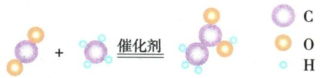
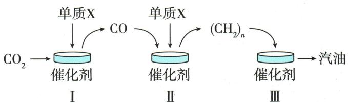
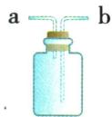

## 讲解

### 判据

文字明确反应物产物或图给球种和组合时，先转成物质。

### 流程

读每种球及组合对应的化学式，先剔除两边等量残留，再写骨架式；根据图给催化、高温等条件标注；用原子守恒配平并回查图。只有原子差量而无反应事实不能唯一猜所有产物。

## 例题

### 陌生铁反应书式

> 来源ID Q05-10；第五单元化学反应的定量关系；51-100/full.md 第1284–1284行。原答案与解析定位：51-100/full.md 第1286–1288行。

例2 (2024 江苏镇江中考节选)纳米零价铁(Fe)用于废水处理,可用 $H_{2}$ 和 $\mathrm{Fe(OH)}_{3}$ 在高温下反应获得,反应的化学方程式为 \_\_\_\_。

**原资料答案与解析：**

解析 根据质量守恒定律,化学反应前后元素种类不变,反应物中含有 H、Fe、O 这 3 种元素,生成物中已含 Fe,则另外的产物含有 H、O,该产物是 $H_{2}O$ ,化学方程式为 $2\mathrm{Fe(OH)}_{3} + 3\mathrm{H}_{2}\xlongequal{\text {高温}}2\mathrm{Fe} + 6\mathrm{H}_{2}\mathrm{O}$ 。

答案 $2\mathrm{Fe(OH)}_{3}+3\mathrm{H}_{2}\xlongequal{\text{高温}}2\mathrm{Fe}+6\mathrm{H}_{2}\mathrm{O}$

**展开解析（依据原详解补足理由与步骤）：**

按原题反应事实和教材模型，产物为铁与水。先写$Fe(OH)_3+H_2\rightarrow Fe+H_2O$。取氢氧化铁2个，则Fe2、O6，所以右取2Fe和6$H_{2}O$；右H12，左氢氧化铁已有H6，尚缺6H，由3H₂供给。得$2Fe(OH)_3+3H_2\xlongequal{\text{高温}}2Fe+6H_2O$。核验Fe2、O6、H12两边相同。仅从缺H、O并不能在任意陌生反应唯一确定水，仍需题目反应情境支持；不编造其他可行产物。

### 制醋酸微观图

> 来源ID Q05-11；第五单元化学反应的定量关系；51-100/full.md 第1290–1297行。原答案与解析定位：51-100/full.md 第1299–1301行。

例3 (2024 山东日照中考)《齐民要术》记载“粟米曲作酢”, “酢”即醋酸。我国科研人员研究出制取醋酸( $\mathrm{CH}_{3} \mathrm{COOH}$ )的新方法,新方法的反应微观示意图如图所示。下列说法错误的是 ( )

A. 古法酿醋是用粮食发酵而成, 发酵属于物理变化  
B. 新方法的反应化学方程式: $CO_{2} + CH_{4} \xlongequal{\text{催化剂}} CH_{3}COOH$   
C. 反应前后催化剂的化学性质不变  
D. 新方法有助于减缓温室效应

**原资料答案与解析：**

解析 A(×)发酵过程中,有新物质生成,属于化学变化;B(√)由图可知,该反应为二氧化碳和甲烷在催化剂作用下反应生成 $CH_{3}COOH$ , 反应的化学方程式书写正确; C(√)催化剂在化学反应前后化学性质保持不变; D(√)二氧化碳、甲烷含量过高会引起温室效应加剧,该反应消耗二氧化碳、甲烷,有助于减缓温室效应。

答案 A

**展开解析（依据原详解补足理由与步骤）：**

选错误项A。A发酵产生醋酸等新物质，是化学变化。B原图左为1$CO_{2}$与1$CH_{4}$，右为1CH₃COOH，C2、H4、$O_{2}$两边均相同，式$CO_2+CH_4\xlongequal{\text{催化剂}}CH_3COOH$正确。C催化剂反应前后化学性质不变，正确。D按原题只看消耗温室气体的反应方向，可以理解“有助于”；不能由一个反应式进一步断言整个实际工艺净排放必减少，生命周期能耗未给。

### 天然气硫化氢微观反应

> 来源ID Q05-17；第五单元化学反应的定量关系；51-100/full.md 第1471–1476行。原答案与解析定位：51-100/full.md 第1411–1415行。

例2 (2024 海南中考)天然气是一种重要的化工原料,使用前需对其进行预处理,除去对生产有害的成分。下图为利用催化剂除去天然气中 X 的反应原理示意图。

(1)天然气主要成分的化学式是\_\_\_\_。  
(2)写出图中 X 变成最终产物反应的化学方程式: \_\_\_\_。

**原资料答案与解析：**

例2 解析 (1)天然气主要成分是甲烷,化学式为 $CH_{4}$ 。(2)由图可知,X 为硫化氢,该反应是硫化氢在催化剂的作用下生成氢气和硫,化学方程式为 $H_{2}S\xlongequal{\text{催化剂}}H_{2}+S$ 。

答案 (1) $\mathrm{CH}_{4}$

(2) $H_{2}S\xlongequal{\text{催化剂}}H_{2}+S$

**展开解析（依据原详解补足理由与步骤）：**

(1)天然气主要成分甲烷$CH_4$。(2)图例小球为H、大球为S，X每个S连两个H，即H₂S；产物为双H分子H₂与硫S。各式系数1即可守恒：$H_2S\xlongequal{\text{催化剂}}H_2+S$。催化剂是条件，不能写成反应物；按图条件硫原子模型保留，不自行添加未给温度或状态符号。

### 二氧化碳制汽油流程

> 来源ID Q07-08；第七单元能源的合理利用与开发；101-150/full.md 第259–271行。原答案与解析定位：101-150/full.md 第225–231行。

例3 (2024 云南中考节选)新能源的开发和利用促进了能源结构向多元、清洁和低碳转变。

(1) 目前, 人类利用的能量大多来自化石燃料, 如石油、天然气和 \_\_\_\_。在有石油的地方, 一般都有天然气存在, 天然气的主要成分是甲烷, 其化学式为 \_\_\_\_。

(3)我国研制出一种新型催化剂,在这种催化剂作用下,二氧化碳可以转化为汽油,主要转化过程如图所示(部分生成物已略去)。

①催化剂在化学反应前后化学性质和\_\_\_\_不变；

②过程Ⅰ中反应生成的另外一种物质为生活中常见的氧化物,该反应的化学方程式为\_\_\_\_。

(4)随着科学技术的发展,氢能源的开发利用已取得很大进展。氢气作为燃料的优点是\_\_\_\_(答一点即可)。

**原资料答案与解析：**

例3 解析（1）化石燃料包括石油、天然气和煤；甲烷的化学式为 $\mathrm{CH}_{4}$ 。（3）①根据催化剂“一变两不变”的特征，催化剂在化学反应前后化学性质和质量不变；②分析反应示意图，过程Ⅱ为一氧化碳和单质X反应生成 $(\mathrm{CH}_2)_n$ ，根据质量守恒定律，可知单质X为氢气，过程I为二氧化碳和单质 $\mathrm{X(H_2)}$ 在催化剂的条件下反应生成一氧化碳和一种生活中常见的氧化物，则该氧化物为水，可写出反应的化学方程式。（4）氢气燃烧生成水，产物无污染，燃烧热值高。

答案 (1) 煤 $\mathrm{CH}_{4}$ (3) ① 质量

② $CO_{2}+H_{2}\xlongequal{\text{催化剂}}CO+H_{2}O$

(4)环保,无污染(或热值高,合理即可)

**展开解析（依据原详解补足理由与步骤）：**

(1)煤、$CH_{4}$。(3)①质量也不变。②图Ⅱ中$CO$与单质X成(CH₂)ₙ，$CO$已供C，新增H需由单质氢H₂提供，所以X=H₂。过程Ⅰ是$CO_{2}$+H₂→$CO$+另一常见氧化物；余H2、O1对应$H_{2}O$，得$CO_2+H_2\xlongequal{\text{催化剂}}CO+H_2O$，C1、$O_{2}$、H2均守恒。(4)按使用阶段可答燃烧产物水、单位质量热值高。制氢及制汽油的总净排放未给，不能从$CO_{2}$反应消耗就保证全过程零排放。题为节选，跳号(1)(3)(4)按原资料保留，不另补第(2)问。

### 四装置制气集气与尿素

> 来源ID Q12-01；专题一气体的制取；151-200/full.md 第999–1016行。原答案与解析定位：151-200/full.md 第1018–1028行。

例1 (2024 江苏宿迁中考)化学实践小组利用以下装置完成部分气体的相关实验,请你参与。

  
A

  
B

  
C

  
D

(1)实验室用稀盐酸和块状石灰石反应制取二氧化碳的化学方程式是\_\_\_\_。其发生装置可选用装置A或B,与装置B相比,装置A具有的优点是\_\_\_\_。  
(2)若选用装置 B 和 C 制取并收集氧气,证明氧气已收集满的操作和现象是\_\_\_\_。  
(3)常温常压下,氨气是一种无色、有刺激性气味,极易溶于水,密度比空气小的气体。实验室常用氯化铵和熟石灰两种固体混合物共热的方法制取氨气。若选用装置D测定产生氨气的体积,水面需加一层植物油,其目的是\_\_\_\_。  
(4)二氧化碳和氨气在一定条件下可以合成尿素[化学式为 $\mathrm{CO(NH_{2})_{2}}$ ]，同时生成水。该反应的化学方程式是 \_\_\_\_。

**原资料答案与解析：**

解析（1）石灰石的主要成分碳酸钙和盐酸反应生成氯化钙、二氧化碳和水；装置 A 可以控制反应的发生与停止；

(2)氧气密度比空气的大,故集气时,气体长进短出,通过观察出气端口带火星的木条复燃,说明氧气已集满;  
(3) 氨气极易溶于水, 加植物油防止氨气溶于水;  
(4)二氧化碳和氨气在一定条件下反应生成尿素和水,写出化学方程式并配平。

答案（1） $\mathrm{CaCO_3 + 2HCl = CaCl_2 + H_2O + CO_2\uparrow}$ 可以控制反应的发生与停止

(2) 将带火星的木条放在 a 端, 木条复燃, 说明已收集满氧气  
(3)防止氨气溶于水   
(4) $\mathrm{CO}_{2} + 2\mathrm{NH}_{3}\xlongequal{\text{一定条件}}\mathrm{CO(NH_{2})_{2} + H_{2}O}$

**展开解析（依据原详解补足理由与步骤）：**

(1)$CaCO_3+2HCl=CaCl_2+H_2O+CO_2\uparrow$。A多孔隔板支撑块固体，夹闭后气压使酸退回与固体分离可停；B分液漏斗可控滴速，停止滴加却未必让原酸与固体分离，A优势发生停止。(2)C图a短b长，氧密度大应b长进、a短出；在a出气口放带火星木条复燃验满。不是盲记a一定进。(3)D气从短管接油面上，水从长管排量筒。油隔$NH_{3}$与水减溶解，量排水近似气体体积；还需检查漏气、温度压差，不说油可完全消除所有溶解误差。(4)$CO_2+2NH_3\xlongequal{\text{一定条件}}CO(NH_2)_2+H_2O$。由右$N_{2}$取左2$NH_{3}$，右H4+水H2合6，左6，C1/$O_{2}$两边守恒。

## 易错

只改化学计量数，不编造化学式；结果回到原条件核验。
