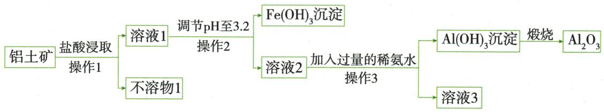

## 讲解

### 判据

题给已配平反应及X，先按每个式的系数计算各种原子。

### 流程

分别列左、右原子总数，扣掉已知物质相同贡献；未知项应补的各元素差量除以X前系数，得到一份X组成，再与选项逐一比。无法整除时先检查是否漏括号或系数，不随意改题设。

## 例题

### 守恒推硫化物化学式

> 来源ID Q05-02；第五单元化学反应的定量关系；51-100/full.md 第927–935行。原答案与解析定位：51-100/full.md 第937–939行。

例2 (2024 江苏常州中考)在电化学储能领域拥有巨大潜力的 $CuFeS_{2}$ 可由以下化学反应制得: $CuCl + FeCl_{3} + 2X \xlongequal[\triangle]{无水乙二胺} CuFeS_{2} + 4NH_{4}Cl$ ，则可推测 X 是 ()

A. $NH_{3}$

B. $(\mathrm{NH}_4)_2\mathrm{S}$

C. $NH_{4}Cl$

D. $(\mathrm{NH}_4)_2\mathrm{SO}_4$

**原资料答案与解析：**

解析 根据质量守恒定律,化学反应前后原子个数不变,反应前 Cu、Fe、Cl 原子个数分别为 1、1、4,反应后 Cu、Fe、S、N、H、Cl 原子个数分别为 1、1、2、4、16、4,则每个 X 由 1 个 S、2 个 N、8 个 H 构成,X 的化学式为 $\left(\mathrm{NH}_{4}\right)_{2}\mathrm{S}$ ,故选 B。

答案 B

**展开解析（依据原详解补足理由与步骤）：**

选B。先只数已知式：左Cu1、Fe1、Cl1+3=4；右Cu1、Fe1、Cl4、S2、N4、H16。Cu、Fe、Cl已平衡，缺的S2、N4、H16均由左侧2X补足，故一个X含S1、$N_{2}$、H8，即$(NH_4)_2S$。A$NH_3$没有S且N、H数不符；C$NH_4Cl$没有S且会额外增加Cl；D硫酸铵会带入右侧没有的O。系数2必须先计入，再将差量除以2。

### 石英砂纯度计算

> 来源ID Q05-19；第五单元化学反应的定量关系；51-100/full.md 第1484–1487行。原答案与解析定位：51-100/full.md 第1441–1455行。

例4 (2024 山东淄博中考) 硅化镁 $\left(\mathrm{Mg}_{2} \mathrm{Si}\right)$ 在能源器件、激光和半导体制造等领域具有重要应用价值, 可通过石英砂 (主要成分为 $\mathrm{SiO}_{2}$ , 杂质不含硅元素) 和金属镁反应制得, 反应的化学方程式为 $\mathrm{SiO}_{2} + 4 \mathrm{Mg} \xlongequal{\text {高温}} \mathrm{Mg}_{2} \mathrm{Si} + 2 \mathrm{X}$ 。

(1)上述化学方程式中 X 为\_\_\_\_（填化学式）。  
(2)用 12.5 kg 石英砂与足量镁充分反应得到 15.2 kg 硅化镁, 计算石英砂中 $SiO_{2}$ 的质量分数(写出计算过程)。

**原资料答案与解析：**

例4 答案 (1) $MgO$

(2) 解: 设石英砂中 $SiO_{2}$ 的质量为 x。

$$
\begin{array}{l} \mathrm{SiO} _ {2} + 4 \mathrm{Mg} \xlongequal {\text {高温}} \mathrm{Mg} _ {2} \mathrm{Si} + 2 \mathrm{MgO} \\ 6 0 \quad 7 6 \\ x \quad 1 5. 2 \mathrm{kg} \\ \frac {6 0}{7 6} = \frac {x}{1 5 . 2 \mathrm{kg}} x = 1 2 \mathrm{kg} \\ \end{array}
$$

则石英砂中 $SiO_{2}$ 的质量分数为

$$
\frac {12 \mathrm{kg}}{12.5 \mathrm{kg}} \times 100 \% = 96 \%
$$

答:石英砂中 $SiO_{2}$ 的质量分数为 96%。

**展开解析（依据原详解补足理由与步骤）：**

(1)左Si1、$O_{2}$、Mg4；右Mg₂Si已占Si1、Mg2，还剩Mg2和$O_{2}$，由2X组成，所以每X含Mg1O1，X=$MgO$。(2)按反应1$SiO_{2}$→1Mg₂Si，式量60与76。设原砂$SiO_{2}$质量x，$60/76=x/(15.2\ \mathrm{kg})$，$x=60\times15.2/76=12$ kg。纯度$12/12.5\times100\%=96\%$。足量Mg让$SiO_{2}$完全反应，杂质不含Si避免其他硅源；原砂12.5 kg是混合物总量，不能代入$SiO_{2}$反应比例。

### 天然气硫化氢微观反应

> 来源ID Q05-17；第五单元化学反应的定量关系；51-100/full.md 第1471–1476行。原答案与解析定位：51-100/full.md 第1411–1415行。

例2 (2024 海南中考)天然气是一种重要的化工原料,使用前需对其进行预处理,除去对生产有害的成分。下图为利用催化剂除去天然气中 X 的反应原理示意图。

(1)天然气主要成分的化学式是\_\_\_\_。  
(2)写出图中 X 变成最终产物反应的化学方程式: \_\_\_\_。

**原资料答案与解析：**

例2 解析 (1)天然气主要成分是甲烷,化学式为 $CH_{4}$ 。(2)由图可知,X 为硫化氢,该反应是硫化氢在催化剂的作用下生成氢气和硫,化学方程式为 $H_{2}S\xlongequal{\text{催化剂}}H_{2}+S$ 。

答案 (1) $\mathrm{CH}_{4}$

(2) $H_{2}S\xlongequal{\text{催化剂}}H_{2}+S$

**展开解析（依据原详解补足理由与步骤）：**

(1)天然气主要成分甲烷$CH_4$。(2)图例小球为H、大球为S，X每个S连两个H，即H₂S；产物为双H分子H₂与硫S。各式系数1即可守恒：$H_2S\xlongequal{\text{催化剂}}H_2+S$。催化剂是条件，不能写成反应物；按图条件硫原子模型保留，不自行添加未给温度或状态符号。

### 含铜剩余固体制胆矾

> 来源ID Q15-01；专题四化学工艺流程；151-200/full.md 第1694–1709行。原答案与解析定位：151-200/full.md 第1711–1715行。

例1 (2024 江西中考)研究小组利用炭粉与氧化铜反应后的剩余固体(含 $\mathrm{Cu} 、 \mathrm{Cu}_{2} \mathrm{O} 、 \mathrm{CuO}$ 和 $\mathrm{C}$ )为原料制备胆矾(硫酸铜晶体),操作流程如图:

资料: $\mathrm{Cu}_{2}\mathrm{O}+\mathrm{H}_{2}\mathrm{SO}_{4}=\mathrm{CuSO}_{4}+\mathrm{Cu}+\mathrm{H}_{2}\mathrm{O}$

(1)步骤①中进行反应时用玻璃棒搅拌的目的是  
(2)步骤②中反应的化学方程式为 $\mathrm{Cu}+\mathrm{H}_{2}\mathrm{SO}_{4}+\mathrm{H}_{2}\mathrm{O}_{2}=$ $CuSO_{4}+2X$ ，则 X 的化学式为 \_\_\_\_。  
(3)步骤③中生成蓝色沉淀的化学方程式为\_\_\_\_。

(4)下列分析不正确的是\_\_\_\_（填字母,双选）。

A. 操作 1 和操作 2 的名称是过滤  
B. 固体 N 的成分是炭粉  
C. 步骤④中加入的溶液丙是 $Na_{2}SO_{4}$ 溶液   
D.“一系列操作”中包含降温结晶,说明硫酸铜的溶解度随温度的升高而减小

**原资料答案与解析：**

解析 (1) 反应过程中搅拌的目的是使反应物之间充分接触, 加快反应速率, 使反应更快、更充分。

(2)根据质量守恒定律,化学反应前后原子的种类和个数不变,反应前有6个氧原子、1个铜原子、4个氢原子、1个硫原子,反应后已有4个氧原子、1个铜原子、1个硫原子,所以2X中共有2个氧原子、4个氢原子,故一个X分子中有1个氧原子、2个氢原子,化学式为 $H_{2}O$ 。(3)溶液甲中含有硫酸铜,加入过量氢氧化钠溶液后,氢氧化钠和硫酸铜反应生成氢氧化铜沉淀和硫酸钠,据此书写化学方程式。(4)A(√)通过操作1和操作2均得到溶液和固体,属于固液分离操作,即过滤;B(√)剩余固体中含Cu、 $Cu_{2}O$ 、$CuO$和C,加入过量稀硫酸后得到的固体M中含铜和炭粉,加入过量过氧化氢溶液和过量稀硫酸后,得到的固体N为不反应的炭粉;C(×)步骤③得到的蓝色沉淀为氢氧化铜沉淀,加入适量溶液丙得到硫酸铜溶液,而 $Na_{2}SO_{4}$ 不与氢氧化铜反应,丙应为硫酸,与氢氧化铜反应生成硫酸铜和水;D(×)“一系列操作”中包含降温结晶,可通过降温结晶获得晶体,说明硫酸铜的溶解度随温度的降低而减小。

答案 (1)加快化学反应速率(或使反应更充分等) (2) $H_{2}O$ (3) $CuSO_{4}+2NaOH=Cu(OH)_{2}\downarrow+Na_{2}SO_{4}$ (4)CD

**展开解析（依据原详解补足理由与步骤）：**

(1)玻璃棒搅拌使固液接触更充分，反应更快；不是改变最终理论可制得的铜量。(2)左侧Cu₁、S₁、O₆、H₄，已有$CuSO_{4}$含Cu₁S₁O₄，故2X合含O₂H₄，每个X是$H_{2}O$。补全为$Cu+H_2SO_4+H_2O_2=CuSO_4+2H_2O$。(3)$CuSO_4+2NaOH=Cu(OH)_2\downarrow+Na_2SO_4$，2$NaOH$既供两个OH也供$Na_{2}SO_{4}$的两个Na。(4)A正确，两操作均把液和不溶固体分开，是过滤；B正确，①$CuO$与酸成铜盐，原给定$Cu_{2}O$与酸同时成$CuSO_{4}$及Cu，故M含Cu和C；②铜由酸与$H_{2}O_{2}$转为可溶铜盐，C未反应，N是炭粉。C错误，$Cu(OH)_{2}$需加硫酸转$CuSO_{4}$和水，$Na_{2}SO_{4}$不能完成该反应；D错误，冷却才析晶说明在该区间降温溶解度减小，即升温溶解度增大。题目双选不正确项，选CD。③过量$NaOH$后溶液乙还可能有剩余$NaOH$，不能只列生成的$Na_{2}SO_{4}$；取得沉淀再与适量酸反应，隔开该杂质。

### 铝土矿浸取调pH提取氧化铝

> 来源ID Q15-03；专题四化学工艺流程；151-200/full.md 第1755–1766行。原答案与解析定位：151-200/full.md 第1768–1774行。

例3 (2023 湖北十堰中考)工业上从铝土矿(主要成分为 $\mathrm{Al}_{2} \mathrm{O}_{3}$ , 还含有 $\mathrm{SiO}_{2} 、 \mathrm{Fe}_{2} \mathrm{O}_{3}$ 等)中提取 $\mathrm{Al}_{2} \mathrm{O}_{3}$ 的主要流程如下:

已知:① $SiO_{2}$ 难溶于水,不与盐酸反应。

②当 $pH \geqslant 3.2$ 时, $Fe^{3+}$ 完全转化为 $\mathrm{Fe(OH)}_{3}$ 沉淀。

(1) 操作 1 的名称是 \_\_\_\_。  
(2)在“盐酸浸取”前需将铝土矿粉碎,其目的是\_\_\_\_。  
(3)“煅烧”过程中反应的化学方程式是 $2 \mathrm{Al(OH)}_{3} \xlongequal{\text {高温}} \mathrm{Al}_{2} \mathrm{O}_{3} + 3 \mathrm{X}, \mathrm{X}$ 的化学式是  
(4) 向溶液 2 中加入过量稀氨水,生成沉淀的化学方程式为 \_\_\_\_。

**原资料答案与解析：**

解析（1）经过操作1后物质被分成溶液1和不溶物1两部分，说明操作1起到固液分离的作用，则操作1为过滤；

(2)粉碎固体,可以增大反应物的接触面积,使反应更充分;  
(3)根据质量守恒定律,反应前后原子的种类和数目不变,反应物中有2个Al、6个O、6个H,生成物已有2个Al、3个O,所以3X含有3个O、6个H,X中含有2个H和1个O,则X的化学式为 $H_{2}O$ ;  
(4)溶液2中含 $AlCl_{3}$ ，加入稀氨水， $AlCl_{3}$ 与 $NH_{3}\cdot H_{2}O$ 反应生成 $\mathrm{Al(OH)}_{3}$ 沉淀和 $NH_{4}Cl$ 。

答案 (1) 过滤 (2) 增大与酸的接触面积, 使反应进行更充分 (3) $\mathrm{H}_{2} \mathrm{O}$ (4) $\mathrm{AlCl}_{3} + 3 \mathrm{NH}_{3} \cdot \mathrm{H}_{2} \mathrm{O} = 3 \mathrm{NH}_{4} \mathrm{Cl} + \mathrm{Al(OH)}_{3} \downarrow$

**展开解析（依据原详解补足理由与步骤）：**

(1)液与不溶物分流，操作1过滤。(2)粉碎增大与酸接触面积，利于反应更充分；不增加矿石原有Al总量。(3)$2Al(OH)_3\xlongequal{\text{高温}}Al_2O_3+3H_2O$。反应物Al₂O₆H₆，已知氧化铝占$Al_{2}O_{3}$，3X合O₃H₆，每X为$H_{2}O$。(4)盐酸浸取使$Al_{2}O_{3}$、$Fe_{2}O_{3}$都溶解成氯化物，$SiO_{2}$按已知条件留不溶物1。调pH到3.2按题给条件去$Fe^{3+}$；原流程同时要求铝还留在溶液2，不能自行把pH调到任意更大。加过量稀氨水后$AlCl_3+3NH_3\cdot H_2O=3NH_4Cl+Al(OH)_3\downarrow$；3$NH_3\cdot H_2O$供三个OH，氯转入$NH_{4}Cl$。过滤取得铝沉淀再煅烧。氨水及铝的这组反应属于本题信息和拓展，不要求初中生掌握高中两性机理。

## 易错

只改化学计量数，不编造化学式；结果回到原条件核验。
