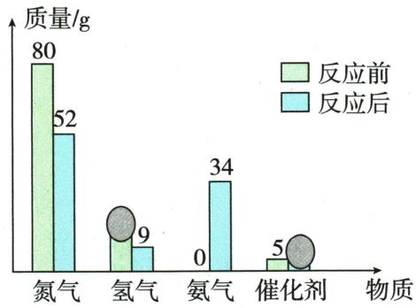
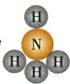
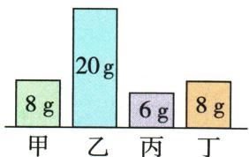
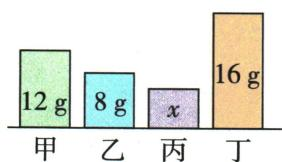

## 讲解

### 判据

题给前后表、遮挡柱或未知质量，先守恒补数再判身份。

### 流程

分别求前总质量和后已知和，差得未知；逐项算后减前，负为消耗、正为生成，0只保留可能解释。用差量求反应质量比，再结合物质种类变化判基本类型。相对分子质量比还需系数，不能直接从柱高比断言。

## 例题

### 反应前后质量差表

> 来源ID Q05-04；第五单元化学反应的定量关系；51-100/full.md 第957–967行。原答案与解析定位：51-100/full.md 第969–971行。

例4 (2024 山东临沂中考)一定条件下,甲、乙、丙、丁四种物质反应前后的质量关系如表所示。下列说法中错误的是 ( )

| 物质 | 甲 | 乙 | 丙 | 丁 |
| --- | --- | --- | --- | --- |
| 反应前的质量/g | 40 | 3 | 5 | 2 |
| 反应后的质量/g | 4 | x | 5 | 34 |

A.x=7

B.丙可能是该反应的催化剂

C.该反应属于化合反应

D. 反应中甲和丁的质量比是 9:8

**原资料答案与解析：**

解析 A(√) 由质量守恒定律可知, $x = (40 + 3 + 5 + 2) - (4 + 5 + 34) = 7$ ; B(√) 丙质量不变, 可能是该反应的催化剂, 也可能不参加反应; C(×) 由表中信息可知, 甲物质质量减少, 为反应物, 乙和丁质量增加, 为生成物, 反应符合“一变多”, 属于分解反应; D(√) 由表可以得出, 反应中甲和丁的质量比为 $(40 \mathrm{~g} - 4 \mathrm{~g}) : (34 \mathrm{~g} - 2 \mathrm{~g}) = 9:8$ 。

答案 C

**展开解析（依据原详解补足理由与步骤）：**

选C。A总质量$40+3+5+2=50$ g，后已知和$4+5+34=43$ g，故$x=50-43=7$ g。甲减少36、乙增加4、丁增加32、丙0变化。B不变只说明可能催化剂，也可能旁观物，正确。C只有甲消耗，乙丁生成，是一变多的分解反应，不是化合。D参加的甲∶生成丁=$36:32=9:8$，正确。不能用甲起始40与丁终值34直接作反应质量比。

### 合成氨柱图遮挡

> 来源ID Q05-05；第五单元化学反应的定量关系；51-100/full.md 第973–985行。原答案与解析定位：51-100/full.md 第987–989行。

例5 (2024 河北中考) 当前, 氨气 $\left(\mathrm{NH}_{3}\right)$ 的能源化应用逐渐成为研究热点。工业上常用氮气和氢气合成氨气, 一定条件下, 在密闭容器中加入反应物和催化剂进行该反应, 反应前后各物质的质量如图所示, 图中有两处被墨迹遮盖。下列说法正确的是 ( )

A. 反应后催化剂的质量为 $8 \, g$

B. 参加反应的氢气质量为 $6 \mathrm{~g}$

C. 氨气分子的微观示意图为

D. 参加反应的氮气和生成的氨气分子个数比为 $4: 1$

**原资料答案与解析：**

解析 A(×) 反应前后催化剂的质量不变, 故反应后催化剂的质量也为 5 g; B(√) 根据质量守恒定律, 反应前氢气质量为 $52 \, g + 9 \, g + 34 \, g - 80 \, g - 0 \, g = 15 \, g$ , 参加反应的氢气质量为 $15 \, g - 9 \, g = 6 \, g$ ; C(×) 氨气由氨气分子构成, 每个氨气分子由 1 个氮原子和 3 个氢原子构成, 微观示意图错误; D(×) 参加反应的氮气质量为 $80 \, g - 52 \, g = 28 \, g$ ，生成氨气的质量为 $34 \, g - 0 \, g = 34 \, g$ ，参加反应的氮气和生成的氨气分子个数比为 $\frac{28 \, g}{28} : \frac{34 \, g}{17} = 1 : 2$ 。

答案 B

**展开解析（依据原详解补足理由与步骤）：**

选B。A催化剂前为5 g，后仍5，不能写8。B排除前后相同催化剂，反应前氢气=$52+9+34-80=15$ g，氢气消耗=$15-9=6$ g，正确。C图中的中心N连4个H，而氨一分子应1N3H，错误。D氮气消耗$80-52=28$ g，氨生成34 g；分别按一个分子的相对质量28和17除，粒子比$(28/28):(34/17)=1:2$，不是4∶1。质量比不等于分子数比。

### 柱图差量与相对分子质量

> 来源ID Q05-08；第五单元化学反应的定量关系；51-100/full.md 第1027–1038行。原答案与解析定位：51-100/full.md 第1046–1048行。

例2 (2024 山东滨州中考)密闭容器内有甲、乙、丙、丁四种物质,在一定条件下发生某一化学反应,反应前后各物质质量如图所示。下列说法不正确的是 ( )

  
反应前

  
反应后

A.该反应遵循质量守恒定律  
B.丙可能为该反应的催化剂  
C. 反应前后乙和丁的质量变化之比为 3:2  
D.甲和丁的相对分子质量之比为 $1: 2$

**原资料答案与解析：**

例2 解析 A(√) 所有的化学反应都遵循质量守恒定律。B(√) 根据质量守恒定律可知, 化学反应前后各物质质量总和不变, 8 g + 20 g + 6 g + 8 g = 12 g + 8 g + x + 16 g, 解得 x = 6 g, 则反应前后丙的质量不变, 可能是该反应的催化剂, 也可能是不参与反应的物质。C(√) 反应前后乙、丁的质量变化之比为 12 g : 8 g = 3 : 2。D(×) 由于不知道该反应的化学计量数, 无法确定甲和丁的相对分子质量的关系。

答案 D

**展开解析（依据原详解补足理由与步骤）：**

选D。总质量前$8+20+6+8=42$ g，后已知$12+8+16=36$ g，所以丙x=6 g，与初始相同。A密闭反应符合守恒。B丙可能催化或未反应，正确。C乙消耗$20-8=12$ g，丁生成$16-8=8$ g，质量变化比3∶2正确。D甲、丁变化分别4、8 g，为1∶2，但还需各自计量数才可反推相对分子质量比；只有质量比不能决定，错误。

## 易错

只改化学计量数，不编造化学式；结果回到原条件核验。
