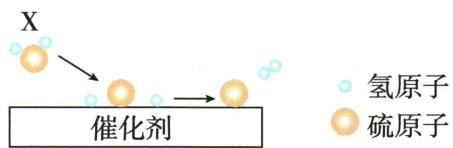

## 讲解

### 判据

题给骨架式、微观图或反应事实，先固定真实反应物产物。

### 流程

从复杂式或原子个数奇偶不一致处入手，逐元素传递系数；出现分数可所有系数乘同数消分母。最后逐种数原子、约系数并补条件。原例FeS₂取$Fe_{2}O_{3}$系数2→FeS₂4→SO₂8→O₂11，是每一步来自上一步守恒。

## 例题

### 原氧化铁一氧化碳配平案例

> 来源ID Q05-21；第五单元化学反应的定量关系；51-100/full.md 第1170–1170行。原答案与解析定位：51-100/full.md 第1170–1170行。

|  | 如配平 $CO+Fe_{2}O_{3} \xlongequal{\text{高温}} Fe+CO_{2}$ |
| --- | --- |
| 第一步 | 观察发现1个 $Fe_{2}O_{3}$ 可以提供3个氧原子,1个$CO$结合1个氧原子生成1个 $CO_{2}$ ,则1个 $Fe_{2}O_{3}$ 需要与3个$CO$结合生成3个 $CO_{2}$ ,因此 $CO、CO_{2}$ 的化学计量数为3 |
| 第二步 | Fe的化学计量数为2 |
| 第三步 | 横线改等号。 $3CO+Fe_{2}O_{3} \xlongequal{\text{高温}} 2Fe+3CO_{2}$ 8 |

**原资料答案与解析：**

|  | 如配平 $CO+Fe_{2}O_{3} \xlongequal{\text{高温}} Fe+CO_{2}$ |
| --- | --- |
| 第一步 | 观察发现1个 $Fe_{2}O_{3}$ 可以提供3个氧原子,1个$CO$结合1个氧原子生成1个 $CO_{2}$ ,则1个 $Fe_{2}O_{3}$ 需要与3个$CO$结合生成3个 $CO_{2}$ ,因此 $CO、CO_{2}$ 的化学计量数为3 |
| 第二步 | Fe的化学计量数为2 |
| 第三步 | 横线改等号。 $3CO+Fe_{2}O_{3} \xlongequal{\text{高温}} 2Fe+3CO_{2}$ 8 |

**展开解析（依据原详解补足理由与步骤）：**

这是原配平表。取$Fe_{2}O_{3}$系数1，有Fe2，所以Fe取2；每$CO$变$CO_{2}$需要多1O，$Fe_{2}O_{3}$给3O，故$CO$取3、$CO_{2}$取3。核验左O为3+3=6，右3×2=6，C各3、Fe各2。式$Fe_2O_3+3CO\xlongequal{\text{高温}}2Fe+3CO_2$。只改前系数，不改$CO_{2}$下标。

### 原红磷配平案例

> 来源ID Q05-22；第五单元化学反应的定量关系；51-100/full.md 第1187–1187行。原答案与解析定位：51-100/full.md 第1187–1187行。

|  | 如配平 $P+O_{2}\xlongequal{\text{点燃}}P_{2}O_{5}$ |
| --- | --- |
| 第一步 | 在横线两边各出现一次且原子个数相差较大的原子是氧原子,以氧原子为配平起点 |
| 第二步 | 1个 $O_{2}$ 和1个 $P_{2}O_{5}$ 中氧原子个数的最小公倍数为 $2\times5=10$ |
| 第三步 | 1个 $O_{2}$ 中含有2个氧原子, $10\div2=5$ ,1个 $P_{2}O_{5}$ 中含有5个氧原子, $10\div5=2$ ,化学式 $O_{2}$ 和 $P_{2}O_{5}$ 前分别写5和2。 $P+5O_{2}\xlongequal{\text{点燃}}2P_{2}O_{5}$ |
| 第四步 | 反应物P转化为 $P_{2}O_{5}$ ,2个 $P_{2}O_{5}$ 中含有4个磷原子,因此化学式P的化学计量数为4。 $4P+5O_{2}\xlongequal{\text{点燃}}2P_{2}O_{5}$ |
| 第五步 | 横线改等号。 $4P+5O_{2}\xlongequal{\text{点燃}}2P_{2}O_{5}$ |

**原资料答案与解析：**

|  | 如配平 $P+O_{2}\xlongequal{\text{点燃}}P_{2}O_{5}$ |
| --- | --- |
| 第一步 | 在横线两边各出现一次且原子个数相差较大的原子是氧原子,以氧原子为配平起点 |
| 第二步 | 1个 $O_{2}$ 和1个 $P_{2}O_{5}$ 中氧原子个数的最小公倍数为 $2\times5=10$ |
| 第三步 | 1个 $O_{2}$ 中含有2个氧原子, $10\div2=5$ ,1个 $P_{2}O_{5}$ 中含有5个氧原子, $10\div5=2$ ,化学式 $O_{2}$ 和 $P_{2}O_{5}$ 前分别写5和2。 $P+5O_{2}\xlongequal{\text{点燃}}2P_{2}O_{5}$ |
| 第四步 | 反应物P转化为 $P_{2}O_{5}$ ,2个 $P_{2}O_{5}$ 中含有4个磷原子,因此化学式P的化学计量数为4。 $4P+5O_{2}\xlongequal{\text{点燃}}2P_{2}O_{5}$ |
| 第五步 | 横线改等号。 $4P+5O_{2}\xlongequal{\text{点燃}}2P_{2}O_{5}$ |

**展开解析（依据原详解补足理由与步骤）：**

这是原最小公倍数表。氧在左$O_{2}$每份2、右P₂O₅每份5，最小公倍数10；左$O_{2}$系数10÷2=5，右P₂O₅系数10÷5=2。右P2×2=4，所以左P系数4。式$4P+5O_2\xlongequal{\text{点燃}}2P_2O_5$；两侧P4、O10。配平不能为方便将产物改成P₂O₃。

### 原二硫化铁奇偶配平案例

> 来源ID Q05-23；第五单元化学反应的定量关系；51-100/full.md 第1203–1203行。原答案与解析定位：51-100/full.md 第1203–1203行。

|  | 如配平 $FeS_{2}+O_{2}\xlongequal{\text{高温}}Fe_{2}O_{3}+SO_{2}$ |
| --- | --- |
| 第一步 | 氧元素是横线两边出现次数较多的元素 |
| 第二步 | 因为氧分子是双原子的分子,无论有多少个氧分子与 $FeS_{2}$ 反应,反应物中总含有偶数个氧原子。但是生成物里氧原子数目是奇数。选定氧元素作为配平的起点 |
| 第三步 | 1.1个 $SO_{2}$ 中含有两个氧原子,是偶数,它的化学式前的化学计量数无论是多少,所含氧原子的个数总是偶数。因此,只有改变 $Fe_{2}O_{3}$ 的化学计量数才能使生成物的氧原子个数变为偶数。可以在化学式 $Fe_{2}O_{3}$ 前试写一个最小偶数2,再进一步配平。 $FeS_{2}+O_{2}\xlongequal{\text{高温}}2Fe_{2}O_{3}+SO_{2}$ |
| 第三步 | 2.生成物 $Fe_{2}O_{3}$ 中的铁原子全部来自反应物 $FeS_{2}$ ,因此 $FeS_{2}$ 中的铁原子个数等于 $Fe_{2}O_{3}$ 中的铁原子个数。2个 $Fe_{2}O_{3}$ 中含有4个铁原子,在化学式 $FeS_{2}$ 前写4。 $4FeS_{2}+O_{2}\xlongequal{\text{高温}}2Fe_{2}O_{3}+SO_{2}$ |
| 第三步 | 3.生成物 $SO_{2}$ 中的硫原子全部来自反应物 $FeS_{2}$ ,4个 $FeS_{2}$ 中有8个硫原子,在化学式 $SO_{2}$ 前写8。 $4FeS_{2}+O_{2}\xlongequal{\text{高温}}2Fe_{2}O_{3}+8SO_{2}$ |
| 第三步 | 4.生成物中所含的氧原子总数为22,且全部来自反应物 $O_{2}$ ,在化学式 $O_{2}$ 前写11。 $4FeS_{2}+11O_{2}\xlongequal{\text{高温}}2Fe_{2}O_{3}+8SO_{2}$ |
| 第四步 | 横线改等号。 $4FeS_{2}+11O_{2}\xlongequal{\text{高温}}2Fe_{2}O_{3}+8SO_{2}$ |

**原资料答案与解析：**

|  | 如配平 $FeS_{2}+O_{2}\xlongequal{\text{高温}}Fe_{2}O_{3}+SO_{2}$ |
| --- | --- |
| 第一步 | 氧元素是横线两边出现次数较多的元素 |
| 第二步 | 因为氧分子是双原子的分子,无论有多少个氧分子与 $FeS_{2}$ 反应,反应物中总含有偶数个氧原子。但是生成物里氧原子数目是奇数。选定氧元素作为配平的起点 |
| 第三步 | 1.1个 $SO_{2}$ 中含有两个氧原子,是偶数,它的化学式前的化学计量数无论是多少,所含氧原子的个数总是偶数。因此,只有改变 $Fe_{2}O_{3}$ 的化学计量数才能使生成物的氧原子个数变为偶数。可以在化学式 $Fe_{2}O_{3}$ 前试写一个最小偶数2,再进一步配平。 $FeS_{2}+O_{2}\xlongequal{\text{高温}}2Fe_{2}O_{3}+SO_{2}$ |
| 第三步 | 2.生成物 $Fe_{2}O_{3}$ 中的铁原子全部来自反应物 $FeS_{2}$ ,因此 $FeS_{2}$ 中的铁原子个数等于 $Fe_{2}O_{3}$ 中的铁原子个数。2个 $Fe_{2}O_{3}$ 中含有4个铁原子,在化学式 $FeS_{2}$ 前写4。 $4FeS_{2}+O_{2}\xlongequal{\text{高温}}2Fe_{2}O_{3}+SO_{2}$ |
| 第三步 | 3.生成物 $SO_{2}$ 中的硫原子全部来自反应物 $FeS_{2}$ ,4个 $FeS_{2}$ 中有8个硫原子,在化学式 $SO_{2}$ 前写8。 $4FeS_{2}+O_{2}\xlongequal{\text{高温}}2Fe_{2}O_{3}+8SO_{2}$ |
| 第三步 | 4.生成物中所含的氧原子总数为22,且全部来自反应物 $O_{2}$ ,在化学式 $O_{2}$ 前写11。 $4FeS_{2}+11O_{2}\xlongequal{\text{高温}}2Fe_{2}O_{3}+8SO_{2}$ |
| 第四步 | 横线改等号。 $4FeS_{2}+11O_{2}\xlongequal{\text{高温}}2Fe_{2}O_{3}+8SO_{2}$ |

**展开解析（依据原详解补足理由与步骤）：**

这是原奇数配偶表。$O_{2}$贡献偶数，$SO_{2}$也贡献偶数；$Fe_{2}O_{3}$含3O，先令其系数2，让该部分O为6。Fe需4，令FeS₂系数4；S共8，令$SO_{2}$系数8；右总O=6+16=22，故$O_{2}$系数11。式$4FeS_2+11O_2\xlongequal{\text{高温}}2Fe_2O_3+8SO_2$。最后检验Fe4、S8、O22全部守恒。

### 陌生铁反应书式

> 来源ID Q05-10；第五单元化学反应的定量关系；51-100/full.md 第1284–1284行。原答案与解析定位：51-100/full.md 第1286–1288行。

例2 (2024 江苏镇江中考节选)纳米零价铁(Fe)用于废水处理,可用 $H_{2}$ 和 $\mathrm{Fe(OH)}_{3}$ 在高温下反应获得,反应的化学方程式为 \_\_\_\_。

**原资料答案与解析：**

解析 根据质量守恒定律,化学反应前后元素种类不变,反应物中含有 H、Fe、O 这 3 种元素,生成物中已含 Fe,则另外的产物含有 H、O,该产物是 $H_{2}O$ ,化学方程式为 $2\mathrm{Fe(OH)}_{3} + 3\mathrm{H}_{2}\xlongequal{\text {高温}}2\mathrm{Fe} + 6\mathrm{H}_{2}\mathrm{O}$ 。

答案 $2\mathrm{Fe(OH)}_{3}+3\mathrm{H}_{2}\xlongequal{\text{高温}}2\mathrm{Fe}+6\mathrm{H}_{2}\mathrm{O}$

**展开解析（依据原详解补足理由与步骤）：**

按原题反应事实和教材模型，产物为铁与水。先写$Fe(OH)_3+H_2\rightarrow Fe+H_2O$。取氢氧化铁2个，则Fe2、O6，所以右取2Fe和6$H_{2}O$；右H12，左氢氧化铁已有H6，尚缺6H，由3H₂供给。得$2Fe(OH)_3+3H_2\xlongequal{\text{高温}}2Fe+6H_2O$。核验Fe2、O6、H12两边相同。仅从缺H、O并不能在任意陌生反应唯一确定水，仍需题目反应情境支持；不编造其他可行产物。

### 天然气硫化氢微观反应

> 来源ID Q05-17；第五单元化学反应的定量关系；51-100/full.md 第1471–1476行。原答案与解析定位：51-100/full.md 第1411–1415行。

例2 (2024 海南中考)天然气是一种重要的化工原料,使用前需对其进行预处理,除去对生产有害的成分。下图为利用催化剂除去天然气中 X 的反应原理示意图。

(1)天然气主要成分的化学式是\_\_\_\_。  
(2)写出图中 X 变成最终产物反应的化学方程式: \_\_\_\_。

**原资料答案与解析：**

例2 解析 (1)天然气主要成分是甲烷,化学式为 $CH_{4}$ 。(2)由图可知,X 为硫化氢,该反应是硫化氢在催化剂的作用下生成氢气和硫,化学方程式为 $H_{2}S\xlongequal{\text{催化剂}}H_{2}+S$ 。

答案 (1) $\mathrm{CH}_{4}$

(2) $H_{2}S\xlongequal{\text{催化剂}}H_{2}+S$

**展开解析（依据原详解补足理由与步骤）：**

(1)天然气主要成分甲烷$CH_4$。(2)图例小球为H、大球为S，X每个S连两个H，即H₂S；产物为双H分子H₂与硫S。各式系数1即可守恒：$H_2S\xlongequal{\text{催化剂}}H_2+S$。催化剂是条件，不能写成反应物；按图条件硫原子模型保留，不自行添加未给温度或状态符号。

## 易错

只改化学计量数，不编造化学式；结果回到原条件核验。
