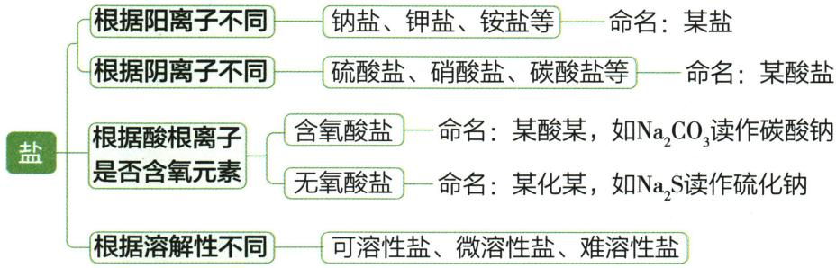

## 讲解

### 是什么

本章盐由金属阳离子或$NH_4^{+}$与酸根构成；按阳离子可钠盐铵盐，按酸根可碳酸盐硫酸盐等。

### 怎么来的

盐身份看组成而非俗名或水液pH。$Na_{2}CO_{3}$纯碱是盐却液呈碱性；$NH_{4}Cl$不含金属仍盐。酸性盐液也不把盐重新分类为酸。

### 什么时候能用

含两元素不自动盐，含金属也不自动盐；盐并非只食盐$NaCl$。初中保留组成判据，不讲超出必要的水解公式。

## 例题

### pH12离子共存

> 来源ID Q10-18；第十单元常见的酸碱盐；151-200/full.md 第409–417行。原答案与解析定位：151-200/full.md 第387–389行。

例3 (2024 山东滨州中考)下列各组离子在 $\mathrm{pH} = 12$ 的溶液中能大量共存的是 （）

A. $H^{+}$ 、 $SO_{4}^{2-}$ 、 $Ba^{2+}$ 、 $Cl^{-}$

B. $Ag^{+}$ 、 $NO_{3}^{-}$ 、 $Mg^{2+}$ 、 $Na^{+}$

C. $\mathrm{Ca}^{2+}$ 、 $\mathrm{SO}_4^{2-}$ 、 $\mathrm{NH}_4^+$ 、 $\mathrm{CO}_3^{2-}$

D. $Na^{+}$ 、 $K^{+}$ 、 $NO_{3}^{-}$ 、 $Cl^{-}$

**原资料答案与解析：**

例3 解析 pH 为 12 的溶液中含有大量的 $OH^{-}$ 。A(×) $H^{+}$ 和 $OH^{-}$ 结合生成水， $SO_{4}^{2-}$ 和 $Ba^{2+}$ 结合生成硫酸钡沉淀；B(×) $Ag^{+}$ 、 $Mg^{2+}$ 均和 $OH^{-}$ 结合生成沉淀；C(×) $NH_{4}^{+}$ 和 $OH^{-}$ 结合生成 $NH_{3}\cdot H_{2}O$ ， $Ca^{2+}$ 与 $CO_{3}^{2-}$ 结合成碳酸钙沉淀。

答案 D

**展开解析（依据原详解补足理由与步骤）：**

选D。pH12隐含$OH^{-}$大量存在。A $H^{+}$耗$OH^{-}$，且$Ba^{2+}$/$SO_4^{2-}$沉淀，错；B $Ag^{+}$、$Mg^{2+}$分别与$OH^{-}$形成难溶物，错，不硬写稳定AgOH（实际银氧化物细节为拓展）；C $NH_4^{+}$遇$OH^{-}$会转化、$Ca^{2+}$/$CO_3^{2-}$沉淀，错；D Na⁺K⁺NO₃⁻Cl⁻与$OH^{-}$在题设均无沉淀气体水消耗组合，可大量共存。先加隐含离子，再查组选项，不只互查列出的四离子。

### 营养液氮肥选择

> 来源ID Q10-20；第十单元常见的酸碱盐；151-200/full.md 第442–450行。原答案与解析定位：151-200/full.md 第466–468行。

例5 (2024 福建中考)下列可用于配制无土栽培营养液的物质中,属于氮肥的是 ( )

A.$KCl$

B. ${\mathrm{{NH}}}_{4}{\mathrm{{NO}}}_{3}$

C. $\mathrm{MgSO}_{4}$

D. $\mathrm{Ca(H_2PO_4)_2}$

**原资料答案与解析：**

例5 解析 A 是钾肥, B 是氮肥, C 不是化肥, D 是磷肥。

答案 B

**展开解析（依据原详解补足理由与步骤）：**

选B。$NH_{4}NO_{3}$有营养N属氮肥；A $KCl$提供K是钾肥，D $Ca(H_{2}PO_{4})_{2}$供P属磷肥，均非题问；C $MgSO_{4}$不属按N/P/K划分氮肥，原解说“不为化肥”过宽，Mg/S实际亦植物营养，可作营养盐，不能因无N/P/K就断言不能作农业肥料。

### 原常见盐分类与碳酸盐比较

> 来源ID Q10-28；第十单元常见的酸碱盐；151-200/full.md 第39–45；49–63行。原答案与解析定位：151-200/full.md 第39–45行；151-200/full.md 第49–63行。

1.盐的定义：盐是指由金属离子(或铵根离子)和酸根离子构成的化合物。①

2.盐的分类与命名

含有铵根离子的盐称为铵盐

(1)氯化钠($NaCl$)——食盐的主要成分

①物理性质:白色晶体,易溶于水。

②化学性质:与硝酸银溶液反应生成白色沉淀。化学方程式为 $AgNO_{3}+NaCl=AgCl\downarrow+NaNO_{3}$ 。

③用途:医疗上用氯化钠配制生理盐水;农业上用一定浓度的氯化钠溶液选种;工业上以氯化钠为原料来制取碳酸钠、氢氧化钠、氯气和盐酸等;日常生活中用食盐作调味品、腌渍食物;公路上曾经使用氯化钠作融雪剂。溶质质量分数为0.9%的氯化钠溶液

④分布:分布很广,海水、盐湖、盐井和盐矿中都含有氯化钠。

(2)碳酸钠、碳酸氢钠、碳酸钙

大理石或石灰石的主要成分

|  | 碳酸钠 | 碳酸氢钠 | 碳酸钙 |
| --- | --- | --- | --- |
| 化学式 | $Na_{2}CO_{3}$ | $NaHCO_{3}$ | $CaCO_{3}$ |
| 俗称 | 纯碱2、苏打 | 小苏打 | — |
| 物理性质 | 白色粉末状固体,易溶于水 | 白色晶体,可溶于水 | 白色固体,难溶于水 |
| 化学性质 | 1碳酸钠的水溶液呈碱性,能使无色酚酞溶液变红2与酸反应,如 $Na_{2}CO_{3} + 2HCl = 2NaCl + CO_{2} \uparrow + H_{2}O$ 3与某些可溶性碱反应,如 $Na_{2}CO_{3} + Ba(OH)_{2} = BaCO_{3} \downarrow + 2NaOH$ 4与某些可溶性盐反应,如 $Na_{2}CO_{3} + CaCl_{2} = CaCO_{3} \downarrow + 2NaCl$ | 1与酸反应,如 $NaHCO_{3} + HCl = NaCl + CO_{2} \uparrow + H_{2}O$ 2受热易分解, $2NaHCO_{3} \xlongequal{\Delta} Na_{2}CO_{3} + CO_{2} \uparrow + H_{2}O$ | 1与酸反应,如 $CaCO_{3} + 2HCl = CaCl_{2} + CO_{2} \uparrow + H_{2}O$ 2高温分解, $CaCO_{3} \xlongequal{\text{高温}} CaO + CO_{2} \uparrow$ |
| 主要用途 | 重要的工业原料,广泛用于玻璃、造纸、纺织等行业和洗涤剂的生产等 | 1焙制糕点所用的发酵粉的主要成分之一2治疗胃酸过多症的一种药剂3 | 1重要的建筑材料2用作补钙剂 |

**原资料答案与解析：**

1.盐的定义：盐是指由金属离子(或铵根离子)和酸根离子构成的化合物。①

2.盐的分类与命名

含有铵根离子的盐称为铵盐

(1)氯化钠($NaCl$)——食盐的主要成分

①物理性质:白色晶体,易溶于水。

②化学性质:与硝酸银溶液反应生成白色沉淀。化学方程式为 $AgNO_{3}+NaCl=AgCl\downarrow+NaNO_{3}$ 。

③用途:医疗上用氯化钠配制生理盐水;农业上用一定浓度的氯化钠溶液选种;工业上以氯化钠为原料来制取碳酸钠、氢氧化钠、氯气和盐酸等;日常生活中用食盐作调味品、腌渍食物;公路上曾经使用氯化钠作融雪剂。溶质质量分数为0.9%的氯化钠溶液

④分布:分布很广,海水、盐湖、盐井和盐矿中都含有氯化钠。

(2)碳酸钠、碳酸氢钠、碳酸钙

大理石或石灰石的主要成分

|  | 碳酸钠 | 碳酸氢钠 | 碳酸钙 |
| --- | --- | --- | --- |
| 化学式 | $Na_{2}CO_{3}$ | $NaHCO_{3}$ | $CaCO_{3}$ |
| 俗称 | 纯碱2、苏打 | 小苏打 | — |
| 物理性质 | 白色粉末状固体,易溶于水 | 白色晶体,可溶于水 | 白色固体,难溶于水 |
| 化学性质 | 1碳酸钠的水溶液呈碱性,能使无色酚酞溶液变红2与酸反应,如 $Na_{2}CO_{3} + 2HCl = 2NaCl + CO_{2} \uparrow + H_{2}O$ 3与某些可溶性碱反应,如 $Na_{2}CO_{3} + Ba(OH)_{2} = BaCO_{3} \downarrow + 2NaOH$ 4与某些可溶性盐反应,如 $Na_{2}CO_{3} + CaCl_{2} = CaCO_{3} \downarrow + 2NaCl$ | 1与酸反应,如 $NaHCO_{3} + HCl = NaCl + CO_{2} \uparrow + H_{2}O$ 2受热易分解, $2NaHCO_{3} \xlongequal{\Delta} Na_{2}CO_{3} + CO_{2} \uparrow + H_{2}O$ | 1与酸反应,如 $CaCO_{3} + 2HCl = CaCl_{2} + CO_{2} \uparrow + H_{2}O$ 2高温分解, $CaCO_{3} \xlongequal{\text{高温}} CaO + CO_{2} \uparrow$ |
| 主要用途 | 重要的工业原料,广泛用于玻璃、造纸、纺织等行业和洗涤剂的生产等 | 1焙制糕点所用的发酵粉的主要成分之一2治疗胃酸过多症的一种药剂3 | 1重要的建筑材料2用作补钙剂 |

**展开解析（依据原详解补足理由与步骤）：**

原分类与性质表。盐可含$NH_4^{+}$无金属；$NaCl$、$Na_{2}CO_{3}$、$NaHCO_{3}$、$CaCO_{3}$均盐，纯碱虽碱性但不是碱类。碳酸根/碳酸氢根遇足酸产$CO_{2}$，盐种不同式和计量比不同。烘焙产气为化学应用，不把原补钙/治胃酸等表当处方；题设用途可解释、实际用药需专业指导。

## 易错

分类、酸碱性、强弱、浓稀、溶解性分别判断。原例与纠正内容分开。
