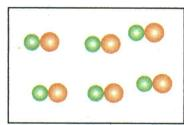
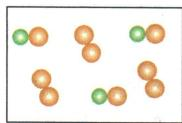
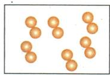
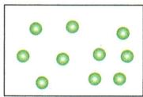

## 讲解

### 判据

图用颜色区分原子、连球表示组合时，比较整体粒子类型。

### 流程

先读图例与连球规则；把同样组成和连接方式的分子归一类，再数种类。两种颜色组成同一种分子也可纯净；全是单球也可纯净。这个方法适用于图设的分子或单原子体系，离子晶体有阴阳离子却仍可能是纯净化合物。

## 例题

### 微观图判断纯净物

> 来源ID Q03-01；第三单元物质构成的奥秘；1-50/full.md 第2190–2202行。原答案与解析定位：1-50/full.md 第2204–2206行。

例1 下列各图中“○”和“●”表示不同元素的原子,其中不能表示纯净物的是 ( )

  
A

  
B

  
C

  
D

**原资料答案与解析：**

解析 图 B 中有两种不同的分子,属于混合物。

答案 B

**展开解析（依据原详解补足理由与步骤）：**

选B。A每个粒子均为同样的双色双球组合，只有一种分子；B同时有双色双球和同色双球两种分子，是混合物；C所有粒子是相同的同色双球；D所有粒子是同种单球原子。A虽有两种元素，仍是一种物质；D不含分子也可以表示纯净物。判断数的是粒子组合类型，不是球的颜色个数。

## 易错

分别数总电子、最外层电子和粒子种类；答案需对准题问。
