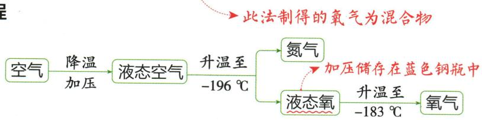

## 讲解

### 是什么

工业制氧可利用液化空气中各成分沸点不同进行分离。

### 怎么来的

原资料给液氮沸点−196 ℃、液氧−183 ℃，升温时氮气较先汽化；这个过程改变状态并分离成分，没有形成新物质。实验室从含氧物质分解出氧气则是另一原理。

### 什么时候能用

该判断限于分离液态空气流程，不是所有工业氧气工艺都只用这一办法。数字按所供教材的近似条件使用，不能离开压强条件当精确常数。

## 例题

### 原工业制氧流程案例

> 来源ID Q02-18；第二单元空气和氧气；1-50/full.md 第1797–1810行。原答案与解析定位：1-50/full.md 第1799–1810行。

# 知识点 1 氧气的工业制法★☆☆

# 1.原理 1

根据液态氮(沸点为-196 ℃)和液态氧(沸点为-183 ℃)的沸点不同,采用低温蒸发的方法得到氧气。

# 2. 流程

# 1 易错警示

工业制氧气过程中无新物质生成，
发生的是物理变化。

**原资料答案与解析：**

# 1.原理 1

根据液态氮(沸点为-196 ℃)和液态氧(沸点为-183 ℃)的沸点不同,采用低温蒸发的方法得到氧气。

# 2. 流程

# 1 易错警示

工业制氧气过程中无新物质生成，
发生的是物理变化。

**展开解析（依据原详解补足理由与步骤）：**

这是原流程案例，不是独立考试题。把空气液化，再利用液氮沸点−196 ℃与液氧−183 ℃不同分离；升温时氮气先易汽化，保留下来的液体更富氧。成分分离而不形成新物质，属于物理变化。实验室分解含氧物质形成新物质则是化学变化，不能把“得到氧气”当成唯一变化判据。

## 易错

先核对对象、条件和直接证据，再判断；相似现象不能代替定义。
