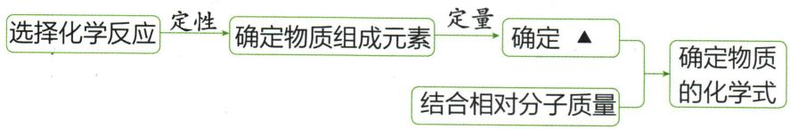
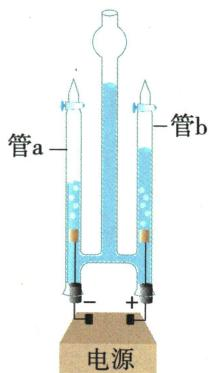
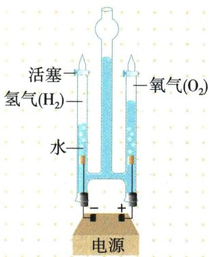
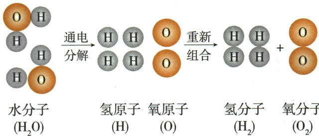

## 错法

背氢二氧一，直接说水中氢氧质量2∶1或水由氢气氧气组成。

## 正解

2∶1是同条件产物气体体积比，1∶8才是对应质量比。原子是分子内部构成，气体是分解后形成，二者不可当作水原来的混合物成分。

## 例题

### 水的合成分解与分子模型

> 来源ID Q04-05；第四单元自然界的水；51-100/full.md 第365–382行。原答案与解析定位：51-100/full.md 第410–416行。

例1（2024江西中考）兴趣小组追寻科学家的足迹，对水进行探究。

【宏观辨识】根据实验探究水的组成

(1)水的合成:在密闭容器中将氢气和氧气的混合气体点燃,根据容器内生成的小水珠可知,水是由\_\_\_\_组成的化合物。

(2)水的分解:电解水一段时间后(如图),观察到管 a 电源
和管 b 中气体体积比为 \_\_\_\_, 经检验管 a 中的气体是 \_\_\_\_。

【证据推理】结合实验现象推算水分子中氢、氧原子个数比。

(3)方法一:根据相同条件下气体的体积比等于其分子的个数比,得出电解水的产物中氢、氧原子个数比为\_\_\_\_,进而推算出结果。

(4)方法二:已知电解水实验中氢气和氧气的体积比和正、负极产生气体的\_\_\_\_,可计算出水中各元素质量比,结合氢、氧原子的相对原子质量,可进一步推算出结果。

【模型构建】(5)以分子构成的物质为例,图中“▲”表示的是\_\_\_\_。

**原资料答案与解析：**

例1 解析 (1) 氢气和氧气点燃生成小水珠, 说明水由氢元素和氧元素组成。(2) 根据“正氧负氢, 氢二氧一”, 管 a 和管 b 中气体体积比为 $2:1$ , a 中的气体是氢气。(3) 根据相同条件下气体的体积比等于其分子的个数比, 电解水的产物中氢、氧原子个数比为 $2:1$ 。(4) 由于质量 = 体积 × 密度, 已知电解水实验中氢气和氧气的体积比, 要计算出水中各元素质量比, 则需要知道正、负极产生气体的密度比。

答案 (1) 氢元素和氧元素

(2)2:1 $H_{2}$ (3)2:1

(4) 密度比 (5) 各元素质量比

**展开解析（依据原详解补足理由与步骤）：**

(1)水由氢元素和氧元素组成，不是氢气与氧气的混合物。(2)补接原管图可见a接负极、气体更多，故a为氢气，a∶b约2∶1。(3)题设同条件体积比等于分子数比，氢分子∶氧分子=2∶1；每个两种分子都含2个对应原子，所以原子数比$(2\times2):(1\times2)=2:1$。(4)还需密度比，因为气体质量比$\rho_H V_H:\rho_O V_O$，不能直接拿体积比当质量比。再把各元素质量分别除以相对原子质量，可推原子数比。(5)原模型先定性确定元素种类，再定量确定“各元素质量比”，结合相对分子质量推化学式。体积比只是实验数据，不能直接替代模型中的质量比。

### 原电解水实验案例

> 来源ID Q04-17；第四单元自然界的水；51-100/full.md 第268–274行。原答案与解析定位：51-100/full.md 第288–326行。

# 1.电解水实验 3

交流电会频繁变换正负极，不能使用

| 实验步骤 | 在电解器玻璃管里加满水(为增强导电性,水中可加入少量硫酸钠溶液或氢氧化钠溶液),接通直流电源,观察并记录两个电极附近和玻璃管内产生的现象正氧负氢,氢二氧一 |
| --- | --- |
| 实验现象 | 通电一段时间后,两个电极附近均有无色气泡产生,正极产生的少,负极产生的多,正、负极产生气体的体积比约为1:2（旁注④） |
| 气体检验 | 切断装置中的电源,用燃着的木条分别在两个玻璃管尖嘴口检验产生的气体:正极产生的气体能使木条燃烧更剧烈,说明该气体是氧气;负极产生的气体可以燃烧,产生淡蓝色火焰,说明该气体是氢气 |
| 反应原理 | 水 $\xrightarrow{\text{通电}}$ 氢气+氧气 |
| 实验结论 | 1水在直流电的作用下分解生成氢气和氧气;2水是由氢元素和氧元素组成的 |

**原资料答案与解析：**

理论上，电解水实验产生氢气和氧气的体积比为 2:1，质量比为 1:8。但可能出现氢气和氧气的体积比大于 2:1 的现象，原因可能是氢气比氧气难溶于水或氧气与电极发生了反应等。

# 2.从微观角度解释水的电解过程

# 5 易错警示

1. 水分子是由氢原子和氧原子构成的，水分子中不含氢分子和氧分子。

2. 水是由氢元素和氧元素组成的，水不是由氢气和氧气组成的。

# 6 拓展延伸

依据元素组成可把单质分为三类:

1. 金属单质：由金属元素组成的单质，如铁、铜、银等。

2. 非金属单质：由非金属元素组成的单质，如碳、磷、氧气等。

3. 稀有气体：由稀有气体元素组成的单质，如氦气、氖气等。

# 7 易错辨析

1.由一种元素组成的物质一定是单质 (×)

2.由不同种元素组成的物质一定是化合物。 (×)

“化”龙点睛 判断一种物质属于单质还是化合物，前提是该物质是纯净物。

(1) 当水分子分解时,生成了氢原子和氧原子,2个氢原子结合成1个氢分子,很多氢分子聚集成氢气;2个氧原子结合成1个氧分子,很多氧分子聚集成氧气。

(2)根据精确的实验测定,每个水分子是由2个氢原子和1个氧原子构成的,因此水可以表示为 $H_{2}O$ 。

(3)水分子分解示意图可以说明：⑤

①水是由氢元素和氧元素组成的。 ②分子由原子构成。  
③化学变化的实质是分子分成原子,原子重新结合成新的分子。  
④化学反应前后元素种类、原子种类和原子数量均不变。

**展开解析（依据原详解补足理由与步骤）：**

这是原实验说明，不是自编题。原表“正负体积1∶24”中尾4为旁注号，规范读1∶2；负极氢气为正极氧气体积约两倍。直流使两极稳定，加入少量合适电解质提高导电性，不改变水分解产物的元素来源。理想同条件下$V(H_2):V(O_2)=2:1$，质量则$2\times2:1\times32=1:8$，不可混淆。实际溶解、漏气和电极反应会影响量得体积比。理论微观过程用水分子内原子重新组合解释，不说水里原来含氢气氧气。
