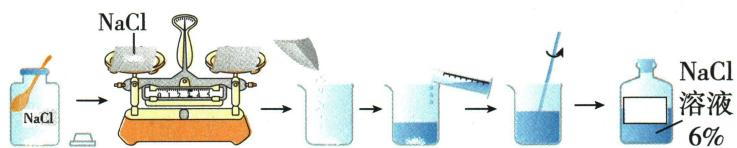

## 错法

看到装瓶时少量溶液洒出，便说“溶质少了，质量分数偏低”。容易这样想，是只盯住分子里的盐，却没有同步追踪分母里的整份溶液。错误发生在把“成品总量减少”直接变成“组成比例下降”。

还容易把“倒入烧杯前洒出水”和“混匀后洒出盐水”当成同一件事。前者只损失水，后者同时损失溶质和水，必须按操作阶段区分。

## 正解

均一溶液各部分组成相同。设原液总质量为 $M$、所含溶质为 $s$；混匀后留下原液的 $k$ 倍，$0<k<1$，则溶质留下 $ks$，溶液留下 $kM$：

$$\omega_{\text{剩余}}=\frac{ks}{kM}=\frac{s}{M}$$

约去同一比例因子，质量分数不变。Q09-20 的装瓶溅出就是这种条件，但剩余成品质量不再达到原定50克；“浓度正确”不能替代“质量足量”。

若仅在量好的水转移时洒出，盐量不变而水减少，分母变小，浓度偏大；若称好的盐没有全部转入，水量不变而盐减少，浓度偏小。若烧杯或试剂瓶原本留有清水，则增加溶剂，浓度偏小。

同比损失的判断要求溶液已经混匀、未析晶，流失部分与留下部分组成相同。有未溶固体、局部分层或选择性失去某种物质时，不能直接约去同一个比例。

## 例题

### NaOH配液三处错误

> 来源ID Q09-16；第九单元溶液；101-150/full.md 第2077–2085行。原答案与解析定位：101-150/full.md 第2100–2102行。

例5 (2024 山东济宁中考) 某同学在实验室配制 50 g 质量分数为 20% 的 $NaOH$ 溶液, 步骤如下图。

请回答：

(1)该同学实验操作过程中出现了\_\_\_\_处错误;   
(2)若完成溶液的配制,需要量取\_\_\_\_mL 的水(常温下水的密度为 1 g/mL);  
(3)用量筒量取水时,若像如图所示仰视读数,所配 $NaOH$ 溶液的溶质质量分数 \_\_\_\_ 20%(填“大于”“小于”或“等于”)。

**原资料答案与解析：**

例5 解析（1）实验操作中有3处错误：称量时氢氧化钠应放在玻璃器皿中；称量时氢氧化钠应置于左盘，右盘放砝码；量取水时，不能仰视读数。（2）需要$NaOH$质量= $50\ g\times20\%=10\ g$ ；水的质量= $50\ g-10\ g=40\ g$ ，则水的体积为40 mL。（3）量取水时仰视读数，会造成量取水的体积偏大，即水的实际质量偏大，则所配$NaOH$溶液的溶质质量分数小于20%。

答案 (1)3 (2)40 (3)小于

**展开解析（依据原详解补足理由与步骤）：**

(1)3处：$NaOH$不可裸放纸上，应在适当玻璃器皿称；图右物左码反；量水仰视。其他所示转移混合按本图不是错误。(2)$NaOH$ $50\times20\%=10$g，水$50-10=40$g，以1g/mL换40mL。(3)仰视按目标刻度停加水，真实水多于40mL；固定10g溶质，分母大于50g，分数小于20%。这题是按刻度量目标，不能套“读数偏小”就说实际水少。$NaOH$溶解放热，混匀冷却后处理，不以热体积代常温密度。

### 原五十克六百分配液案例

> 来源ID Q09-20；第九单元溶液；101-150/full.md 第1911–1925行。原答案与解析定位：101-150/full.md 第1911–1925行。

以配制 50 g 溶质质量分数为 6% 的氯化钠溶液为例。

# (1) 实验用品

氯化钠、蒸馏水；烧杯、玻璃棒、天平、称量纸、量筒、胶头滴管、药匙、空试剂瓶、空白标签。

# (2) 实验步骤

①计算:需要氯化钠的质量为 $50 \, g \times 6\% = 3 \, g$ ;水的质量为 $47 \, g$ 。  
②称量:用天平称量 3.0 g 氯化钠,放入烧杯中。  
③量取:用量筒量取 47 mL 水 ⑦,倒入盛有氯化钠的烧杯中。  
④溶解:用玻璃棒不断搅拌,使氯化钠全部溶解。  
⑤装瓶:把配制好的溶液装入试剂瓶中,盖好瓶塞并贴上标签。

**原资料答案与解析：**

以配制 50 g 溶质质量分数为 6% 的氯化钠溶液为例。

# (1) 实验用品

氯化钠、蒸馏水；烧杯、玻璃棒、天平、称量纸、量筒、胶头滴管、药匙、空试剂瓶、空白标签。

# (2) 实验步骤

①计算:需要氯化钠的质量为 $50 \, g \times 6\% = 3 \, g$ ;水的质量为 $47 \, g$ 。  
②称量:用天平称量 3.0 g 氯化钠,放入烧杯中。  
③量取:用量筒量取 47 mL 水 ⑦,倒入盛有氯化钠的烧杯中。  
④溶解:用玻璃棒不断搅拌,使氯化钠全部溶解。  
⑤装瓶:把配制好的溶液装入试剂瓶中,盖好瓶塞并贴上标签。

**展开解析（依据原详解补足理由与步骤）：**

这是原实验步骤。溶质$50\times6\%=3$g，水$50-3=47$g，按常温1g/mL约47mL；先称与量分别确定两质量，再搅拌溶解。用合适50mL量筒量水，不在量筒中溶解配液。装瓶标签写$NaCl$与6%；量筒只有刻度精度，结果按教材实验精度理解。

### 原六百分稀释成三百分案例

> 来源ID Q09-21；第九单元溶液；101-150/full.md 第1939–1953行。原答案与解析定位：101-150/full.md 第1939–1953行。

以用溶质质量分数为 6% 的氯化钠溶液配制 50 g 溶质质量分数为 3% 的氯化钠溶液为例。

# (1) 实验用品

溶质质量分数为 $6 \%$ 的氯化钠溶液（密度为 $1.04 \mathrm{~g} / \mathrm{cm}^{3}$ ）、蒸馏水；烧杯、玻璃棒、量筒、胶头滴管、空试剂瓶、空白标签。

# (2) 实验步骤

①计算:需要溶质质量分数为6%的氯化钠溶液的质量为 $\frac{50\ g\times3\%}{6\%}=25\ g$ ,其体积为 $\frac{25\ g}{1.04\ g/cm^{3}}\approx24\ cm^{3}=24\ mL$ ;需要水的质量为50 g-25 g=25 g,其体积为25 mL。

②量取:用量筒分别量取 24 mL 溶质质量分数为 6% 的氯化钠溶液和 25 mL 蒸馏水,倒入烧杯中。10

③混匀:用玻璃棒小心搅拌,使液体混合均匀。

④装瓶:把配好的溶液装入试剂瓶中,盖好瓶塞并贴上标签。

**原资料答案与解析：**

以用溶质质量分数为 6% 的氯化钠溶液配制 50 g 溶质质量分数为 3% 的氯化钠溶液为例。

# (1) 实验用品

溶质质量分数为 $6 \%$ 的氯化钠溶液（密度为 $1.04 \mathrm{~g} / \mathrm{cm}^{3}$ ）、蒸馏水；烧杯、玻璃棒、量筒、胶头滴管、空试剂瓶、空白标签。

# (2) 实验步骤

①计算:需要溶质质量分数为6%的氯化钠溶液的质量为 $\frac{50\ g\times3\%}{6\%}=25\ g$ ,其体积为 $\frac{25\ g}{1.04\ g/cm^{3}}\approx24\ cm^{3}=24\ mL$ ;需要水的质量为50 g-25 g=25 g,其体积为25 mL。

②量取:用量筒分别量取 24 mL 溶质质量分数为 6% 的氯化钠溶液和 25 mL 蒸馏水,倒入烧杯中。10

③混匀:用玻璃棒小心搅拌,使液体混合均匀。

④装瓶:把配好的溶液装入试剂瓶中,盖好瓶塞并贴上标签。

**展开解析（依据原详解补足理由与步骤）：**

这是原稀释步骤。目标溶质$50\times3\%=1.5$g；需6%液质量$1.5/6\%=25$g；其水23.5g，另加水$50-25=25$g。浓液密度1.04g/cm³，体积$25/1.04\approx24.04$cm³，按原量筒精度取约24mL；另加水约25mL。两液体积不假定可加出精确49mL最终体积，质量才相加，近似量取不冒称无限精确3.000%。
