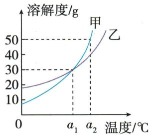
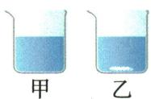
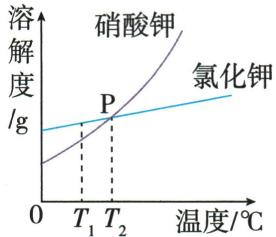
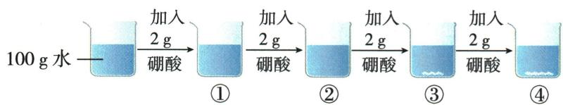
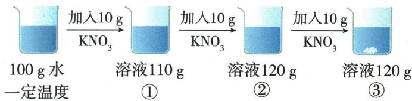
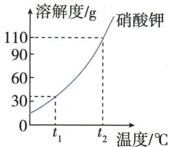
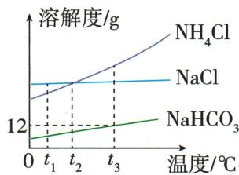

## 讲解

### 是什么

在一定温度下，某固体在**100克某种溶剂**中达到饱和时所溶解的质量，叫这种固体在该溶剂中的溶解度，记作 $S$，单位为克。读一句溶解度数据，要同时读出温度、100克溶剂、饱和状态和所溶质量。

例如本章硼酸表给20℃溶解度5克，意思是20℃、100克水达到饱和时，能溶5克硼酸；饱和溶液共105克。它既不是“100克溶液含5克硼酸”，也不是“任意一杯水都能溶5克”。

### 怎么来的

统一以100克溶剂作标准，是为了排除不同实验水量的影响。设水质量为 $W$ 克，在同温、同溶质、同溶剂的模型下，可溶上限为 $C$ 克；饱和时溶质与水的质量比例相同：

$$\frac{C}{W}=\frac{S}{100\,\mathrm{g}}$$

两边乘以水质量，得到本杯容量：

$$C=W\frac{S}{100\,\mathrm{g}}$$

原 KCl 题40℃时 $S=40\,\mathrm{g}$，70克水的容量是 $70\,\mathrm{g}\times40\,\mathrm{g}/(100\,\mathrm{g})=28\,\mathrm{g}$。加入30克并不改变容量；充分溶解后，28克在溶液中，剩余2克仍为固体。

同温度时改变水量，会改变 $C$，但不改变标准 $S$。搅拌和磨细影响接近饱和的快慢，也不改变这个平衡标准；改变温度、溶质或溶剂种类，才须重新取对应的 $S$。

### 什么时候能用

本章固体数据通常以水为溶剂，不能把相同数值直接移到酒精等其他溶剂。比较不同物质的溶解度，必须指定同一温度；曲线相交表示交点温度下的 $S$ 相同，不保证其他温度大小不变。

不能用不饱和样品的已溶量反推溶解度。只有达到饱和、且水量已知时，才可由已溶质量与水质量的比例换算到100克水的标准。

## 例题

### 甲乙曲线四选项

> 来源ID Q09-07；第九单元溶液；101-150/full.md 第1658–1665行。原答案与解析定位：101-150/full.md 第1667–1669行。

例2 (2024 湖南长沙中考) 利用溶解度曲线, 可以获得许多有关物质溶解度的信息。甲、乙两种物质的溶解度曲线如图所示。下列说法正确的是 ( )

A. 在 $a_{1}^{\circ}C$ 时, 甲和乙的溶解度均为 30 g  
B. 在 $a_{2}^{\circ}C$ 时, 甲的溶解度小于乙的溶解度  
C. 甲、乙两种物质的溶解度随着温度的升高而减小  
D. 升高温度, 可将甲的不饱和溶液变为饱和溶液

**原资料答案与解析：**

解析 A(√) 由图像可知, 在 $a_{1}^{\circ}C$ 时, 甲和乙的溶解度均为 30 g; B(×) 由图像可知, 在 $a_{2}^{\circ}C$ 时, 甲的溶解度大于乙的溶解度; C(×) 两条曲线都是陡升型, 因此甲、乙两种物质的溶解度均随着温度的升高而增大; D(×) 升高温度, 甲的溶解度增大, 甲的不饱和溶液仍为不饱和溶液。

答案 A

**展开解析（依据原详解补足理由与步骤）：**

选A。a₁处交点纵值30g，所以两者均30，A对。a₂处甲曲线高于乙，B将大小写反。两曲线上升，C说都减小，错。甲随升温容纳能力增大，原不饱和且不改变投料和水量，升温仍不饱和，D错。交点只说明该温溶解度相同，不是各自任何溶液浓度都相同。

### 两盐等量升温至交点

> 来源ID Q09-08；第九单元溶液；101-150/full.md 第1671–1681行。原答案与解析定位：101-150/full.md 第1683–1685行。

例3 (2024 山东东营中考节选)(5) $T_{1} \mathrm{°C}$ 时, 将等质量的硝酸钾和氯化钾分别加入到各盛有 $100 \mathrm{~g}$ 水的两个烧杯中, 充分搅拌后, 现象如图 1 所示。两者的溶解度曲线如图 2 所示。

  
图 1

  
图 2

①烧杯\_\_\_\_（填“甲”或“乙”）中上层清液为饱和溶液；  
②图2中P点的含义是\_\_\_\_；  
③将温度由 $T_{1} \mathrm{C}$ 升高到 $T_{2} \mathrm{C}$ , 充分搅拌, 烧杯乙中固体 \_\_\_\_ (填“能”或“不能”) 全部溶解。

**原资料答案与解析：**

解析 (5)①由图1可知:甲完全溶解,乙没有完全溶解,说明烧杯乙中上层清液为饱和溶液。②溶解度曲线的交点表示该温度下两固体溶解度相等。③由图1可知, $T_{1}$ ℃时,溶解度:甲中物质>乙中物质,结合图2可知,烧杯甲中是氯化钾溶液,烧杯乙中是硝酸钾溶液;由于两物质在 $T_{2}$ ℃时溶解度相等,且烧杯中的水等量,加入的两物质的质量也相等, $T_{2}$ ℃时烧杯甲中仍无剩余固体,烧杯乙中一定也无剩余固体,即烧杯乙中的固体能全部溶解。

答案 (5)①乙 ② $T_{2}$ ℃时,硝酸钾、氯化钾的溶解度相等 ③能

**展开解析（依据原详解补足理由与步骤）：**

①乙有固体且充分搅拌达平衡，上清饱和；甲全溶，仅凭无固体不能确定饱和。②T₂℃时$KNO_{3}$、$KCl$溶解度相等。③能。T₁时$KCl$溶解度较大，故甲$KCl$、乙$KNO_{3}$；甲在T₁全溶说明共同投料不大于$KCl$在T₁100g水的容量。$KCl$到T₂容量又变大，交点处$KNO_{3}$容量与其相同，因此共同投料也能在乙溶尽。不是仅因“升温”就无条件说能全溶。

### 硼酸四步三小题

> 来源ID Q09-09；第九单元溶液；101-150/full.md 第1697–1731行。原答案与解析定位：101-150/full.md 第1735–1741行。

例1（2024 北京中考）硼酸在生产生活中有广泛应用。20 ℃时,进行如下实验。完成下面小题。

资料:20 ℃时,硼酸的溶解度为 5.0 g;40 ℃时,硼酸的溶解度为 8.7 g。

1.①\~④所得溶液中,溶质与溶剂的质量比为1:50的是()

A.①

B.②

C.③

D.④

2.③所得溶液的质量为 （）

A. $104 \mathrm{~g}$

B. $105 \mathrm{~g}$

C. $106 \mathrm{~g}$

D. $108 \mathrm{~g}$

3.下列关于①\~④的说法不正确的是 （）

A.①所得溶液为不饱和溶液

B. 若②升温至 $40^{\circ}$ C, 溶质质量变大

C. 若向③中加水, 溶液质量变大

D. 若④升温至 $40^{\circ}$ C, 得到不饱和溶液

**原资料答案与解析：**

例1 解析 1.①中溶质与溶剂的质量比为 $2 \mathrm{~g}: 100 \mathrm{~g} = 1: 50$ , 故选 A。

2.从题图中看出,③中有固体剩余,是饱和溶液,20 ℃时硼酸的溶解度是5.0 g,所得溶液的质量为5.0 g+100 g=105 g。

3.A(√)①中水的质量为100g,硼酸的质量为2g,根据20℃硼酸的溶解度可知①所得溶液为不饱和溶液;B(×)②中4g硼酸完全溶解,若②升温至40℃,硼酸的溶解度增大,但溶质质量不变;C(√)③中6g硼酸只溶解5g,若向③中加水,硼酸继续溶解,溶液质量变大;D(√)④中水的质量为100g,加入硼酸的总质量为8g,根据40℃硼酸的溶解度,能完全溶解得到不饱和溶液。

答案 1.A 2.B 3.B

**展开解析（依据原详解补足理由与步骤）：**

图依次共加2、4、6、8g硼酸，水恒100g。20℃容量5g。第1题选A：①实际2/100=1/50；②4/100=1/25；③④实际都只溶5g，比1/20，所以B/C/D不符。第2题选B：③实际5g加水100g为105g；104只对应②，106把未溶1g计入，108把④总投料计入，A/C/D错。第3题选不正确B：①2<5不饱和，A对；②只有4g且全溶，升温容量8.7g但无更多固体，溶质仍4g，B错；③加水且还可溶残余，液质量增加，C对；④总8<8.7，40℃全部溶后不饱和，D对。区分实际溶质、全体系投料与容量。

### 硝酸钾三次加入

> 来源ID Q09-10；第九单元溶液；101-150/full.md 第1757–1775行。原答案与解析定位：101-150/full.md 第1745–1751行。

例2 (2024 山东枣庄中考节选)为探究硝酸钾的溶解度,进行如图1所示的三次实验,实验过程中温度不变。通过多次实验,绘制出了硝酸钾的溶解度曲线如图2所示。

  
图1

  
图2

回答下列问题:

(1)图 1 三次实验中所得溶液饱和的是\_\_\_\_（填序号），该温度下硝酸钾的溶解度为\_\_\_\_g。

(3)若要使③中固体溶解,可采用的方法有\_\_\_\_(填一种即可)。

(4)由图2可知,下列说法错误的是\_\_\_\_。

A.硝酸钾的溶解度随温度的升高而增大  
B. $t_{2}$ ℃时硝酸钾溶液降温至 $t_{1}$ ℃，一定有晶体析出  
C. 获得硝酸钾晶体常用的方法是降温结晶

**原资料答案与解析：**

例2 解析（1）由图1可知，③中有未溶解的固体，一定为饱和溶液，②③溶液质量相同，说明加入的硝酸钾没有溶解，则②也为饱和溶液；120 g饱和溶液中，水的质量为100 g，硝酸钾的质量为20 g，则该温度下，硝酸钾的溶解度为20 g。（3）由图2可知，可采用升温的方法使③中固体溶解；也可加水使固体溶解。（4）A(√)由图2可知，硝酸钾的溶解度随温度升高而增大；B(×)将硝酸钾的饱和溶液降温，一定有晶体析出，但将不饱和溶液降温，不一定有晶体析出；C(√)可采用降温结晶的方法获得硝酸钾晶体。

答案 (1)②③ 20

(3) 加水(升高温度等, 合理即可)

(4) B

**展开解析（依据原详解补足理由与步骤）：**

(1)②③饱和。③固体剩且液质量120g；②加入10g后至120g，第三次加10g却不增液质量，表示②已到容量。原水100g、液120g，已溶20g，溶解度20g。(3)加水或升温可增加容量，具体要完全溶尽还需足够增加量，原题只问方法。(4)选错误B：A上升曲线说明升温溶解度增，对；B未说明原溶液饱和，降温可能尚未到容量，不一定析晶；C硝酸钾陡升，冷却热饱和常用于取晶，对。节选编号按原保留。

### 三盐曲线双选

> 来源ID Q09-11；第九单元溶液；101-150/full.md 第1777–1784行。原答案与解析定位：101-150/full.md 第1753–1755行。

例3 (双选)(2024 山东济南中考节选)如图为 $NaCl$、NH $_{4}$ Cl 和 NaHCO $_{3}$ 的溶解度曲线。下列说法中,正确的是\_\_\_\_(填选项序号)。

A. $t_{1}$ ℃时,$NaCl$的溶解度小于NH $_{4}$ Cl的溶解度  
B. 当 $NH_{4}Cl$ 中混有少量 $NaCl$ 时, 可采用降温结晶的方法提纯 $NH_{4}Cl$   
C. $t_{3}$ ℃时, $NaHCO_{3}$ 饱和溶液中溶质与溶液的质量比为3:25   
D. $t_{3}$ ℃时,各取相同质量的 $NH_{4}Cl$ 和$NaCl$固体,分别加水至恰好完全溶解,然后降温至 $t_{2}$ ℃,此时所得 $NH_{4}Cl$ 溶液的质量小于$NaCl$溶液的质量

**原资料答案与解析：**

例3 解析 A(×) 图中 $t_{1}^{\circ}C$ 时, $NaCl$ 的溶解度大于 $NH_{4}Cl$ 的溶解度; B(√) 氯化铵的溶解度受温度影响大于氯化钠, 可采用降温结晶的方法提纯氯化铵; C(×) $t_{3}^{\circ}C$ 时, $NaHCO_{3}$ 的溶解度是 12 g, 饱和溶液中溶质与溶液的质量比为 12 g: (12+100) g=3:28; D(√) $t_{3}^{\circ}C$ 时氯化铵的溶解度大于氯化钠, 等质量的二者在 $t_{3}^{\circ}C$ 配成饱和溶液时, 氯化铵溶液质量小于氯化钠溶液, 降温至 $t_{2}^{\circ}C$ , 氯化铵溶液中析出更多晶体, 则氯化铵溶液质量仍小于氯化钠溶液。

答案 BD

**展开解析（依据原详解补足理由与步骤）：**

选BD。A t₁处$NaCl$曲线高于$NH_{4}Cl$，所以小于错误。B $NH_{4}Cl$降温容量减少较多，少量$NaCl$多留母液，降温结晶可提纯，对但不保证单次绝对纯。C t₃ $NaHCO_{3}$ S=12g，溶质/溶液=$12/(100+12)=3/28$，3/25错。D固体各取同质量m、t₃恰好全溶作饱和，水分别$m\times100/S$；$NH_{4}Cl$ S较大用水更少，降至t₂两S相同、两体系有晶体，所得饱和液质量各为“各自水质量×(1+S₂/100)”，共同因子相同，$NH_{4}Cl$仍较小。不单靠斜率大小就断言析晶绝对质量多少。

### NaClKCl交点与浓度

> 来源ID Q09-12；第九单元溶液；101-150/full.md 第2025–2032行。原答案与解析定位：101-150/full.md 第2017–2021行。

例1（2024 江苏无锡中考）$NaCl$、$KCl$ 的溶解度曲线如图所示。下列叙述正确的是 （）

A. $KCl$ 的溶解度大于 $NaCl$ 的溶解度  
B. $T^{\circ} \mathrm{C}$ 时, $KCl$ 和 $NaCl$ 的溶解度相等  
C.40 ℃ 时, $KCl$ 饱和溶液的溶质质量分数为 40%  
D. $80^{\circ}$ C 时, $KCl$ 不饱和溶液降温, 肯定无晶体析出

**原资料答案与解析：**

例1 解析 A(×)没有指明温度,无法比较两者溶解度大小; B(√)由图可知,T ℃时,$KCl$ 和 $NaCl$ 的溶解度相等; C(×)40 ℃时,$KCl$ 饱和溶液的溶质质量分数为 $\frac{40\ g}{100\ g+40\ g} \times 100\% \approx 28.6\%$ ;

D(×)由于不清楚不饱和溶液中溶质和溶剂的比例关系,所以不能判断降温过程中会不会析出晶体。

答案 B

**展开解析（依据原详解补足理由与步骤）：**

选B。A未指定温度，曲线交叉，两者大小不是固定，错。B交点T℃两S相等，对。C40℃$KCl$ S=40g是每100g水，分数$40/(100+40)\times100\%\approx28.6\%$，非40%，错。D80℃不饱和可浓可稀，降温后可能达到新容量并析晶，也可能仍不饱和，肯定无晶错。

### KCl三组投料混合

> 来源ID Q09-13；第九单元溶液；101-150/full.md 第2034–2041行。原答案与解析定位：101-150/full.md 第2087–2089行。

例2 (2024 重庆 A 卷中考) 已知 $KCl$ 的溶解度随温度升高而增大, 在 $40^{\circ} \mathrm{C}$ 时 $KCl$ 的溶解度为 $40 \mathrm{~g}$ , 在该温度下, 依据下表所示的数据, 进行 $KCl$ 溶于水的实验探究。下列说法中正确的是 ( )

| 实验编号 | 1 | 2 | 3 |
| --- | --- | --- | --- |
| $KCl$ 的质量/g | 10 | 20 | 30 |
| 水的质量/g | 50 | 60 | 70 |

A.在上述实验所得的溶液中,溶质质量分数①>②   
B.实验③所得溶液中,溶质与溶剂的质量比为3:7   
C. 将实验②、③的溶液分别降温, 一定都有晶体析出  
D. 将实验①、③的溶液按一定比例混合可得到与②浓度相等的溶液

**原资料答案与解析：**

例2 解析 根据 40 ℃ 时 $KCl$ 的溶解度, 50 g、60 g、70 g 水中最多溶解氯化钾的质量为 20 g、24 g、28 g, ①、②形成不饱和溶液, ③形成饱和溶液。A(×)①、②所得溶液的溶质质量分数分别为 16.7%、25%, 故①<②。B(×)③中溶质质量: 溶剂质量 = 28 g : 70 g = 2 : 5。C(×)②形成不饱和溶液, 降温后不一定析出晶体。D(√)①、②、③所得溶液溶质质量分数分别为 16.7%、25%、28.6%, 将①、③的溶液混合可得到与②浓度相等的溶液。

答案 D

**展开解析（依据原详解补足理由与步骤）：**

选D。40℃每100g水容40g，三组上限$50\times0.4=20$、$60\times0.4=24$、$70\times0.4=28$g，实际溶10、20、28g。A分数10/60≈16.7%、20/80=25%，①<②，错。B③比28:70=2:5，未溶2g不能计为溶质，3:7错。C②不饱和，降温幅度和最后容量未给，不一定析晶，错。D①约16.7%<25%<③约28.6%，按适当液质量比例可得25%；例如列$m_1(25\%-1/6)=m_3(2/7-25\%)$，两侧每单位差为1/12和1/28，故$m_1/m_3=3/7$。这是由原题数据推出比例，不是另造例题；混合用③上清液不带未溶固体。

## 易错

- **把100克水换成100克溶液**：Q09-09 硼酸饱和液为105克，分母对象不同会影响所有后续比例。
- **把投入30克当成溶解度30克**：Q09-13 的溶解度仍是40克，70克水实际溶28克；投料、已溶量、标准容量是三个数。
- **在不饱和样品里读出“最多能溶”**：少量固体全溶只证明至少能溶这么多，不能证明已经到限度。
- **比较曲线时不给温度**：Q09-12 的两条曲线相交，交点两侧的大小顺序可能不同。
