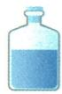

## 讲解

### 是什么

用固体配制指定质量和质量分数的溶液，是按成品组成，分别确定固体溶质和溶剂的实际用量，再使它们全部形成均一溶液。基本流程是计算、称量、量取、溶解，最后装瓶贴标签。

设目标溶液质量为 $M$，目标溶质质量分数为 $\omega$；使用纯固体、水且全部溶解时，所需固体为 $M\omega$，水为 $M-M\omega$。质量统一用克，水体积再按水的密度换算。

### 怎么来的

公式来自两个关系：溶质质量分数是溶质除以溶液，所以溶质为总量乘分数；溶液总质量等于已溶溶质加水，所以水为总量减溶质。

原资料配50克6%氯化钠溶液：先得盐 $50\times6\%=3\,\mathrm{g}$，再得水 $50-3=47\,\mathrm{g}$，按常温水密度1克每毫升近似量47毫升。47毫升是水的体积，不是成品盐水体积。

操作各有目的。天平称固体保证分子对应的质量；量筒量水保证溶剂量，临近目标时用胶头滴管逐滴补足，并平视凹液面最低处。固体与水转入烧杯，用玻璃棒搅拌，使固体较快完全溶解；不能在量筒中边搅拌边配液，因为量筒用于量取，容器形状和刻度也不适合这种操作。混匀后装瓶，标签使使用者知道物质和浓度。

不同固体的称量条件不同。原 NaOH 题需10克氢氧化钠、40克水；氢氧化钠易吸水且有腐蚀性，不能直接放纸上称，要用适当玻璃器皿并计入或扣除器皿质量。其溶解放热，后续处理须考虑冷却到相应温度。

### 什么时候能用

纯固体计算要求试剂纯度符合题设、固体全溶、无反应和损失，目标浓度不超过该条件的饱和上限。含杂试剂需先求目标物实际质量；吸水或变质试剂不能把称得总量都当纯溶质。

水密度按1克每毫升换算是本章常温近似，不能用于任意溶液或高温液体。用量筒配制的结果按实验器材精度理解，不宣称无限精确。

## 例题

### 碳酸氢钠配液仪器

> 来源ID Q09-15；第九单元溶液；101-150/full.md 第2055–2075行。原答案与解析定位：101-150/full.md 第2095–2098行。

例4 (2024 江苏南通中考节选)配制一定质量分数的 $\mathrm{NaHCO}_{3}$ 溶液。

(1)“称量”时,用\_\_\_\_(填“镊子”或“药匙”)从试剂瓶中取出 $NaHCO_{3}$ 粉末。  
(2)“溶解”时,若需量取 15.0 mL 的水,当量筒中已有 14.6 mL 水时,后续加水使用的仪器为 \_\_\_\_ (填字母)。

  
a

  
b

  
c

(3)配制过程中玻璃棒的作用是\_\_\_\_（填字母）。

a.搅拌

b.引流

c.蘸取

**原资料答案与解析：**

例4 答案 (1) 药匙

(2)c   
(3)a

**展开解析（依据原详解补足理由与步骤）：**

(1)药匙取粉末，镊子通常取块状。(2)c胶头滴管，小量逐滴补到15.0mL并平视凹面最低处，a试剂瓶继续倾倒难精确控制，b烧杯不是滴加工具。(3)a搅拌，加快均匀溶解；b引流是过滤等转移液体时用途，c蘸取是取少量液体时用途，本配液步骤不选。

### NaOH配液三处错误

> 来源ID Q09-16；第九单元溶液；101-150/full.md 第2077–2085行。原答案与解析定位：101-150/full.md 第2100–2102行。

例5 (2024 山东济宁中考) 某同学在实验室配制 50 g 质量分数为 20% 的 $NaOH$ 溶液, 步骤如下图。

请回答：

(1)该同学实验操作过程中出现了\_\_\_\_处错误;   
(2)若完成溶液的配制,需要量取\_\_\_\_mL 的水(常温下水的密度为 1 g/mL);  
(3)用量筒量取水时,若像如图所示仰视读数,所配 $NaOH$ 溶液的溶质质量分数 \_\_\_\_ 20%(填“大于”“小于”或“等于”)。

**原资料答案与解析：**

例5 解析（1）实验操作中有3处错误：称量时氢氧化钠应放在玻璃器皿中；称量时氢氧化钠应置于左盘，右盘放砝码；量取水时，不能仰视读数。（2）需要$NaOH$质量= $50\ g\times20\%=10\ g$ ；水的质量= $50\ g-10\ g=40\ g$ ，则水的体积为40 mL。（3）量取水时仰视读数，会造成量取水的体积偏大，即水的实际质量偏大，则所配$NaOH$溶液的溶质质量分数小于20%。

答案 (1)3 (2)40 (3)小于

**展开解析（依据原详解补足理由与步骤）：**

(1)3处：$NaOH$不可裸放纸上，应在适当玻璃器皿称；图右物左码反；量水仰视。其他所示转移混合按本图不是错误。(2)$NaOH$ $50\times20\%=10$g，水$50-10=40$g，以1g/mL换40mL。(3)仰视按目标刻度停加水，真实水多于40mL；固定10g溶质，分母大于50g，分数小于20%。这题是按刻度量目标，不能套“读数偏小”就说实际水少。$NaOH$溶解放热，混匀冷却后处理，不以热体积代常温密度。

### 原五十克六百分配液案例

> 来源ID Q09-20；第九单元溶液；101-150/full.md 第1911–1925行。原答案与解析定位：101-150/full.md 第1911–1925行。

以配制 50 g 溶质质量分数为 6% 的氯化钠溶液为例。

# (1) 实验用品

氯化钠、蒸馏水；烧杯、玻璃棒、天平、称量纸、量筒、胶头滴管、药匙、空试剂瓶、空白标签。

# (2) 实验步骤

①计算:需要氯化钠的质量为 $50 \, g \times 6\% = 3 \, g$ ;水的质量为 $47 \, g$ 。  
②称量:用天平称量 3.0 g 氯化钠,放入烧杯中。  
③量取:用量筒量取 47 mL 水 ⑦,倒入盛有氯化钠的烧杯中。  
④溶解:用玻璃棒不断搅拌,使氯化钠全部溶解。  
⑤装瓶:把配制好的溶液装入试剂瓶中,盖好瓶塞并贴上标签。

**原资料答案与解析：**

以配制 50 g 溶质质量分数为 6% 的氯化钠溶液为例。

# (1) 实验用品

氯化钠、蒸馏水；烧杯、玻璃棒、天平、称量纸、量筒、胶头滴管、药匙、空试剂瓶、空白标签。

# (2) 实验步骤

①计算:需要氯化钠的质量为 $50 \, g \times 6\% = 3 \, g$ ;水的质量为 $47 \, g$ 。  
②称量:用天平称量 3.0 g 氯化钠,放入烧杯中。  
③量取:用量筒量取 47 mL 水 ⑦,倒入盛有氯化钠的烧杯中。  
④溶解:用玻璃棒不断搅拌,使氯化钠全部溶解。  
⑤装瓶:把配制好的溶液装入试剂瓶中,盖好瓶塞并贴上标签。

**展开解析（依据原详解补足理由与步骤）：**

这是原实验步骤。溶质$50\times6\%=3$g，水$50-3=47$g，按常温1g/mL约47mL；先称与量分别确定两质量，再搅拌溶解。用合适50mL量筒量水，不在量筒中溶解配液。装瓶标签写$NaCl$与6%；量筒只有刻度精度，结果按教材实验精度理解。

## 易错

- **给定50克溶液就量50毫升水**：Q09-20 还需加3克盐，水应47克，成品总质量才50克。
- **盐在称量纸上残留仍认为盐量准确**：称到的量不等于进入烧杯的量；未转入的部分会使实际溶质减少。
- **氢氧化钠照普通食盐放纸上称**：Q09-16 的试剂性质不同，需合适器皿并处理器皿质量。
- **搅拌是为了增加溶解度**：Q09-15 中玻璃棒帮助更快溶解、分布均匀，不改变同温饱和容量。
- **热液体积按常温水密度算**：氢氧化钠放热后体积和密度会变，不能跳过温度条件。
