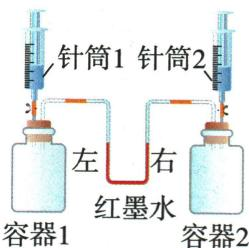

## 讲解

### 是什么

物质溶解形成溶液时，可能出现净吸热、净放热或温度变化不明显。比较的是加入物质前的温度与溶解过程中的温度：在尽量减小环境影响的实验中，温度升高支持净放热，降低支持净吸热。

原表中，氢氧化钠固体溶于水明显放热，硝酸铵固体溶于水吸热，氯化钠溶于水的温度变化不明显。这是本章常见物质的实验规律，不能改成“所有盐吸热”或“所有固体放热”。

### 怎么来的

理解净热效应，可把溶解过程分成两方面：让原来的粒子分散开需要吸收能量，粒子与水分子相互作用又会释放能量。两方面同时发生，最后温度反映它们的合计结果。这是对原资料过程说明的解释，不要求计算微观能量。

释放的热量多于吸收的热量时，多余能量使周围液体升温；吸收的多于释放的时，液体降温；两者接近时，温度变化较小。因此“温度几乎不变”并不表示两个过程都没有能量变化。

比较实验要控制同样的初温、固体用量和水量，用可比的容器并尽量减小散热。密闭装置里，溶解造成的温变还会使气体压强改变，所以热效应能通过温度计或液柱现象间接观察；液柱题须另排除产气、吸收气体等影响。

### 什么时候能用

温度升高不能单独证明化学变化。判化学变化仍要看是否产生新物质，不能把“放热”当成反应的唯一证据。

原红墨水题中，浓硫酸与水混合放热；这与固体氢氧化钠溶解的实验对象不同，却都可能使瓶内气体升温。判断液柱时按题设体积和忽略小热效应的模型；“不发生化学反应”不等于“没有溶解或混合热效应”。

## 例题

### 红墨水气压与热效应

> 来源ID Q09-05；第九单元溶液；101-150/full.md 第1369–1371；1390–1390行。原答案与解析定位：101-150/full.md 第1386–1388行。

例4 (2023 湖南常德中考)某跨学科学习小组为体会化学与物理间的联系设计了实验装置(如图),其中容器 1、2 体积相同,起始时红墨水左右两端液面保持相平,若利用针筒将一定量液体同时注入容器中,并迅速关闭弹簧夹,下表中所列药品在实验过程中有可能观察到红墨水左低右高的是 ()

| 选项 | 针筒1 | 容器1 | 针筒2 | 容器2 |
| --- | --- | --- | --- | --- |
| A | 15mL水 | 5g硝酸铵 | 15mL水 | 5g氯化钠 |
| B | 5mL浓硫酸 | 10mL水 | 5mL氯化钙溶液 | 10mL水 |
| C | 5mL氢氧化钠溶液 | 充满二氧化硫 | 5mL硫酸亚铁溶液 | 充满氮气 |
| D | 5mL硫酸钠溶液 | 5g硝酸钾粉末 | 5mL稀硫酸 | 5g镁粉 |

**原资料答案与解析：**

例4 解析 A(×)硝酸铵溶于水吸热,温度降低,氯化钠溶于水温度无明显变化,则容器1中压强减小,容器2中压强基本不变,红墨水左高右低;B(√)浓硫酸溶于水放热,温度升高,氯化钙溶液滴入水中温度无明显变化,则容器1中压强增大,容器2中压强基本不变,红墨水左低右高;C(×)氢氧化钠和二氧化硫反应生成亚硫酸钠和水,氮气不能和硫酸亚铁反应,则容器1中压强减小,容器2中压强基本不变,红墨水左高右低;D(×)硫酸钠不能和硝酸钾反应,稀硫酸和镁反应生成硫酸镁和氢气,则容器1中压强基本不变,容器2中压强增大,红墨水左高右低。

答案 B

**展开解析（依据原详解补足理由与步骤）：**

选B。左低右高表示左气压较大。A硝酸铵溶解吸热使左温降压减，右氯化钠近不变，左应高，错。B左浓硫酸稀释放热、压升；按原题忽略右稀氯化钙溶液的微小混合热，左压更大，符合。C左$SO_{2}$被碱吸收气体量减，右氮基本不反应，左压减，方向反。D右镁与酸产氢压升，左不是产气反应，方向反；原解析把左“不能反应”直接当完全无热效应不严，$KNO_{3}$溶解仍可有热效应，但不会支持左高压。依题设液体体积相等、短时密闭比较模型，温度、气体量和气相空间均须考虑。

### 原三固体溶解热表

> 来源ID Q09-18；第九单元溶液；101-150/full.md 第1204–1204行。原答案与解析定位：101-150/full.md 第1204–1204行。

| 溶质 | 氯化钠 | 硝酸铵 | 氢氧化钠 |
| --- | --- | --- | --- |
| 现象 | 固体全部溶解,温度几乎不变 | 固体全部溶解, $t_{1}$ °C $<t$ °C | 固体全部溶解, $t_{1}$ °C $>t$ °C |
| 结论 | 物质在溶解形成溶液时,溶液的温度与加入溶质前溶剂的温度相比一般会发生改变 | 物质在溶解形成溶液时,溶液的温度与加入溶质前溶剂的温度相比一般会发生改变 | 物质在溶解形成溶液时,溶液的温度与加入溶质前溶剂的温度相比一般会发生改变 |
| 分析 | 物质在溶解过程中通常伴随着热量的变化。在溶解时,有些物质会出现吸热现象,有些物质则会出现放热现象 | 物质在溶解过程中通常伴随着热量的变化。在溶解时,有些物质会出现吸热现象,有些物质则会出现放热现象 | 物质在溶解过程中通常伴随着热量的变化。在溶解时,有些物质会出现吸热现象,有些物质则会出现放热现象 |

**原资料答案与解析：**

| 溶质 | 氯化钠 | 硝酸铵 | 氢氧化钠 |
| --- | --- | --- | --- |
| 现象 | 固体全部溶解,温度几乎不变 | 固体全部溶解, $t_{1}$ °C $<t$ °C | 固体全部溶解, $t_{1}$ °C $>t$ °C |
| 结论 | 物质在溶解形成溶液时,溶液的温度与加入溶质前溶剂的温度相比一般会发生改变 | 物质在溶解形成溶液时,溶液的温度与加入溶质前溶剂的温度相比一般会发生改变 | 物质在溶解形成溶液时,溶液的温度与加入溶质前溶剂的温度相比一般会发生改变 |
| 分析 | 物质在溶解过程中通常伴随着热量的变化。在溶解时,有些物质会出现吸热现象,有些物质则会出现放热现象 | 物质在溶解过程中通常伴随着热量的变化。在溶解时,有些物质会出现吸热现象,有些物质则会出现放热现象 | 物质在溶解过程中通常伴随着热量的变化。在溶解时,有些物质会出现吸热现象,有些物质则会出现放热现象 |

**展开解析（依据原详解补足理由与步骤）：**

这是原实验表。同量水与可比用量固体、同初温，$NaOH$温升为净放热，$NH_{4}NO_{3}$温降为净吸热，$NaCl$近不变是净热效应小。粒子分散需吸热、与水作用可放热，两者合计决定；“无明显升降”不表示完全没有微观能量变化。

## 易错

- **把温度不明显变化写成没有能量变化**：Q09-18 的氯化钠实验说明净效应较小，吸热和放热两方面仍可存在。
- **把硝酸铵与氢氧化钠的方向记反**：前者常使水温降低，后者常使水温升高；先落实物质，再判断液柱方向。
- **看到温升就判化学反应**：现象只能说明热效应，必须再用新物质的证据判断变化类型。
- **“不能反应”就当气压不变**：Q09-05 仍要检查溶解热、注入液体压缩气相空间等因素，不能用一句话跳过压力分析。
