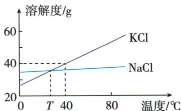

## 讲解

### 判据

题目给原液、投料、产品纯度、蒸发或反应信息，要求某一种物质的质量分数时，先确定目标溶质质量，再确定最终液相总质量。分子和分母必须对应**同一个最终状态**，不能把最后得到的盐除以另一状态的盐水质量。

### 流程

1. **圈目标物和所问时刻。** 是原卤水中的氯化钠，还是反应后的某种盐？题目问原卤水时，分母仍用原卤水质量，不改成蒸发后的盐质量。
2. **按来源求纯目标物。** 产品含杂质时，先用产品质量乘目标物纯度。Q09-06 所得60克盐含氯化钠95%，目标氯化钠为 $60\times95\%=57\,\mathrm{g}$，不能把60克全部作为氯化钠。
3. **另列液相总账。** 单纯溶解且无损失时，水加已溶溶质就是溶液质量；有未溶物或沉淀则排除固相；有气体逸出则扣逸出质量。反应生成和消耗的目标溶质另算，不能用“总质量守恒”断言某一种溶质不变。
4. **统一质量单位。** 由体积求质量用 $m=\rho V$，密度必须属于该份溶液。浓盐液密度1.04克每立方厘米，不能一律按1克每毫升换算。
5. **代回比例并检查。** 原卤水300克含目标氯化钠57克，所得 $57/300=19\%$。若还要判断饱和，在原题忽略少量其他矿物质影响的模型下，再和该温度纯氯化钠水体系的饱和上限比较；这一步不能无条件推广到复杂多盐体系。

## 例题

### 桃花盐卤水质量分数

> 来源ID Q09-06；第九单元溶液；101-150/full.md 第1626–1628行。原答案与解析定位：101-150/full.md 第1630–1632行。

例1 (2024 江苏常州中考节选)云南出产的桃花盐因色如桃花而得名。用 300 g 常温盐泉卤水敞锅熬制得 60 g 桃花盐,其中含氯化钠 95%,其余为矿物质等。

(3)常温下该盐泉卤水中 $NaCl$ 的质量分数为 \_\_\_\_, 属于 $NaCl$ 的 \_\_\_\_ (选填“饱和”或“不饱和”)溶液。(该温度下 $NaCl$ 的溶解度为 36 g, 溶质质量分数= $\frac{溶质质量}{溶液质量} \times 100\%$ )

**原资料答案与解析：**

解析（3）常温下该盐泉卤水中 $NaCl$ 的质量分数为 $\frac{60\ g \times 95\%}{300\ g} \times 100\% = 19\%$ , 该温度下饱和氯化钠溶液的溶质质量分数为 $\frac{36\ g}{36\ g + 100\ g} \times 100\% \approx 26.5\%$ , $19\% < 26.5\%$ , 所以常温下该盐泉卤水属于氯化钠的不饱和溶液。

答案 (3) $19 \%$ 不饱和

**展开解析（依据原详解补足理由与步骤）：**

所得盐60g含$NaCl$ $60\times95\%=57$g；回到原300g卤水，质量分数$57/300\times100\%=19\%$。纯$NaCl$水体系在该温饱和限度为$36/(100+36)\times100\%\approx26.5\%$，19%较小，按原题忽略少量其他矿物质对溶解的影响模型判不饱和。未提供离子相互作用数据，不将此比较推广到任何复杂多盐溶液。

### NaClKCl交点与浓度

> 来源ID Q09-12；第九单元溶液；101-150/full.md 第2025–2032行。原答案与解析定位：101-150/full.md 第2017–2021行。

例1（2024 江苏无锡中考）$NaCl$、$KCl$ 的溶解度曲线如图所示。下列叙述正确的是 （）

A. $KCl$ 的溶解度大于 $NaCl$ 的溶解度  
B. $T^{\circ} \mathrm{C}$ 时, $KCl$ 和 $NaCl$ 的溶解度相等  
C.40 ℃ 时, $KCl$ 饱和溶液的溶质质量分数为 40%  
D. $80^{\circ}$ C 时, $KCl$ 不饱和溶液降温, 肯定无晶体析出

**原资料答案与解析：**

例1 解析 A(×)没有指明温度,无法比较两者溶解度大小; B(√)由图可知,T ℃时,$KCl$ 和 $NaCl$ 的溶解度相等; C(×)40 ℃时,$KCl$ 饱和溶液的溶质质量分数为 $\frac{40\ g}{100\ g+40\ g} \times 100\% \approx 28.6\%$ ;

D(×)由于不清楚不饱和溶液中溶质和溶剂的比例关系,所以不能判断降温过程中会不会析出晶体。

答案 B

**展开解析（依据原详解补足理由与步骤）：**

选B。A未指定温度，曲线交叉，两者大小不是固定，错。B交点T℃两S相等，对。C40℃$KCl$ S=40g是每100g水，分数$40/(100+40)\times100\%\approx28.6\%$，非40%，错。D80℃不饱和可浓可稀，降温后可能达到新容量并析晶，也可能仍不饱和，肯定无晶错。

### KCl三组投料混合

> 来源ID Q09-13；第九单元溶液；101-150/full.md 第2034–2041行。原答案与解析定位：101-150/full.md 第2087–2089行。

例2 (2024 重庆 A 卷中考) 已知 $KCl$ 的溶解度随温度升高而增大, 在 $40^{\circ} \mathrm{C}$ 时 $KCl$ 的溶解度为 $40 \mathrm{~g}$ , 在该温度下, 依据下表所示的数据, 进行 $KCl$ 溶于水的实验探究。下列说法中正确的是 ( )

| 实验编号 | 1 | 2 | 3 |
| --- | --- | --- | --- |
| $KCl$ 的质量/g | 10 | 20 | 30 |
| 水的质量/g | 50 | 60 | 70 |

A.在上述实验所得的溶液中,溶质质量分数①>②   
B.实验③所得溶液中,溶质与溶剂的质量比为3:7   
C. 将实验②、③的溶液分别降温, 一定都有晶体析出  
D. 将实验①、③的溶液按一定比例混合可得到与②浓度相等的溶液

**原资料答案与解析：**

例2 解析 根据 40 ℃ 时 $KCl$ 的溶解度, 50 g、60 g、70 g 水中最多溶解氯化钾的质量为 20 g、24 g、28 g, ①、②形成不饱和溶液, ③形成饱和溶液。A(×)①、②所得溶液的溶质质量分数分别为 16.7%、25%, 故①<②。B(×)③中溶质质量: 溶剂质量 = 28 g : 70 g = 2 : 5。C(×)②形成不饱和溶液, 降温后不一定析出晶体。D(√)①、②、③所得溶液溶质质量分数分别为 16.7%、25%、28.6%, 将①、③的溶液混合可得到与②浓度相等的溶液。

答案 D

**展开解析（依据原详解补足理由与步骤）：**

选D。40℃每100g水容40g，三组上限$50\times0.4=20$、$60\times0.4=24$、$70\times0.4=28$g，实际溶10、20、28g。A分数10/60≈16.7%、20/80=25%，①<②，错。B③比28:70=2:5，未溶2g不能计为溶质，3:7错。C②不饱和，降温幅度和最后容量未给，不一定析晶，错。D①约16.7%<25%<③约28.6%，按适当液质量比例可得25%；例如列$m_1(25\%-1/6)=m_3(2/7-25\%)$，两侧每单位差为1/12和1/28，故$m_1/m_3=3/7$。这是由原题数据推出比例，不是另造例题；混合用③上清液不带未溶固体。

### NaOH配液三处错误

> 来源ID Q09-16；第九单元溶液；101-150/full.md 第2077–2085行。原答案与解析定位：101-150/full.md 第2100–2102行。

例5 (2024 山东济宁中考) 某同学在实验室配制 50 g 质量分数为 20% 的 $NaOH$ 溶液, 步骤如下图。

请回答：

(1)该同学实验操作过程中出现了\_\_\_\_处错误;   
(2)若完成溶液的配制,需要量取\_\_\_\_mL 的水(常温下水的密度为 1 g/mL);  
(3)用量筒量取水时,若像如图所示仰视读数,所配 $NaOH$ 溶液的溶质质量分数 \_\_\_\_ 20%(填“大于”“小于”或“等于”)。

**原资料答案与解析：**

例5 解析（1）实验操作中有3处错误：称量时氢氧化钠应放在玻璃器皿中；称量时氢氧化钠应置于左盘，右盘放砝码；量取水时，不能仰视读数。（2）需要$NaOH$质量= $50\ g\times20\%=10\ g$ ；水的质量= $50\ g-10\ g=40\ g$ ，则水的体积为40 mL。（3）量取水时仰视读数，会造成量取水的体积偏大，即水的实际质量偏大，则所配$NaOH$溶液的溶质质量分数小于20%。

答案 (1)3 (2)40 (3)小于

**展开解析（依据原详解补足理由与步骤）：**

(1)3处：$NaOH$不可裸放纸上，应在适当玻璃器皿称；图右物左码反；量水仰视。其他所示转移混合按本图不是错误。(2)$NaOH$ $50\times20\%=10$g，水$50-10=40$g，以1g/mL换40mL。(3)仰视按目标刻度停加水，真实水多于40mL；固定10g溶质，分母大于50g，分数小于20%。这题是按刻度量目标，不能套“读数偏小”就说实际水少。$NaOH$溶解放热，混匀冷却后处理，不以热体积代常温密度。

## 易错

- **产品纯度不乘就入分子**：Q09-06 的60克是含杂盐，目标氯化钠只有57克。
- **分母也机械乘95%**：原卤水质量300克包括水及所有已溶物，纯度只用于识别目标氯化钠质量。
- **蒸发后有晶体还坚持液相溶质不变**：总溶质可能守恒，但一部分进入固相，计算剩余母液时须扣除。
- **把反应物质量总和直接当成最终溶液质量**：沉淀、残固体和已经离开液相的气体要按实际状态排除。
- **19%小于纯盐饱和上限就推广到任何卤水**：本题结论依赖忽略少量其他矿物质的模型，不能替代多盐相互影响的数据。
