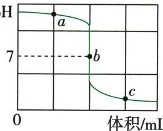

## 讲解

### 是什么

酸与碱生成盐和水的反应为中和反应，常见$HCl$+$NaOH$。酸与碳酸盐或金属氧化物虽也消耗酸，不按本章定义叫中和。

### 怎么来的

共同过程$H^{+}$与$OH^{-}$形成水，酸根和碱阳离子通常进入盐。等量关系来自配平方程式而非两瓶等质量；盐若难溶还会沉淀。

### 什么时候能用

酸碱可能有一方过量；恰好反应后的盐液未必都中性，$HCl$与$NaOH$等题给强酸强碱普通条件可用pH7判断。不能把中和概念应用为自行处理灼伤虫咬或用药。

## 例题

### 硫酸滴入氢氧化钡pH

> 来源ID Q10-04；第十单元常见的酸碱盐；101-150/full.md 第2652–2656行。原答案与解析定位：101-150/full.md 第2658–2660行。

例2 (2024 河南中考)某同学用 pH 传感器测定稀硫酸滴入稀氢氧化钡溶液的过程中 pH 的变化, 测定的结果如图所示。硫酸与氢氧化钡反应的化学方程式为 \_\_\_\_ ; c 点所表示的溶液中溶质为 \_\_\_\_ ; 在 a 点所表示的溶液中滴加酚酞溶液, 溶液会显 \_\_\_\_ 色。(提示: $\mathrm{BaSO}_{4}$ 难溶于水)

pH

**原资料答案与解析：**

解析 硫酸与氢氧化钡反应生成硫酸钡和水;c点溶液显酸性,说明硫酸过量,反应生成的硫酸钡是沉淀,生成的水是溶剂,故溶液中溶质为硫酸;a点溶液呈碱性,滴加酚酞溶液,会变红色。

答案 $\mathrm{H}_{2} \mathrm{SO}_{4} + \mathrm{Ba(OH)}_{2} = \mathrm{BaSO}_{4} \downarrow + 2 \mathrm{H}_{2} \mathrm{O}$ 硫酸（或 $\mathrm{H}_{2} \mathrm{SO}_{4}$ ）红

**展开解析（依据原详解补足理由与步骤）：**

$H_2SO_4+Ba(OH)_2=BaSO_4\downarrow+2H_2O$。起始pH>7，碱在杯、酸滴入；a为碱剩，按原图一般指示剂范围显红；b约7为题设恰好，c<7酸过量。c液溶质$H_{2}SO_{4}$，$BaSO_{4}$属沉淀不是溶质，水属溶剂。不能机械把“生成了盐”就列为溶液溶质。

### 中和可视化与高pH酚酞

> 来源ID Q10-05；第十单元常见的酸碱盐；101-150/full.md 第2662–2682行。原答案与解析定位：101-150/full.md 第2684–2690行。

例3 (2024 辽宁中考节选)为实现氢氧化钠溶液和盐酸反应现象的可视化,某兴趣小组设计如下实验。

【监测温度】(1)在稀氢氧化钠溶液和稀盐酸反应过程中,温度传感器监测到溶液温度升高,说明该反应\_\_\_\_(填“吸热”或“放热”),化学方程式为\_\_\_\_。

【观察颜色】(2)在试管中加入 2 mL 某浓度的氢氧化钠溶液,滴入 2 滴酚酞溶液作\_\_\_\_剂,再逐滴加入盐酸,振荡,该过程中溶液的颜色和 pH 记录如下图所示。

(3)在①中未观察到预期的红色,为探明原因,小组同学查阅到酚酞变色范围如下:

0<pH<8.2 时呈无色, ${8.2} \leq  \mathrm{{pH}} \leq  {13}$ 时呈红色,pH>13 时呈无色。

据此推断,①中 a 的取值范围是\_\_\_\_(填标号)。

A. $0 < a < 8.2$

B. $8.2 \leqslant a \leqslant 13$

C. $a > 13$

(4)一段时间后,重复(2)实验,观察到滴加盐酸的过程中有少量气泡生成,原因是\_\_\_\_。

**原资料答案与解析：**

解析（1）溶液温度升高，说明该反应是放热反应；氢氧化钠和盐酸反应生成氯化钠和水。

(2)酚酞溶液通常被用作指示剂。  
(3)结合实验图和酚酞变色范围,可知a的取值范围应大于13。  
(4)氢氧化钠变质产生的碳酸钠和盐酸反应产生二氧化碳,有少量气泡生成。

答案 (1) 放热 $\mathrm{HCl} + \mathrm{NaOH} = \mathrm{NaCl} + \mathrm{H}_{2} \mathrm{O}$ (2) 指示 (3) C (4) 氢氧化钠变质(或盐酸与碳酸钠发生反应)

**展开解析（依据原详解补足理由与步骤）：**

(1)放热，$HCl+NaOH=NaCl+H_2O$。(2)指示剂。(3)选C。题明确pH>13时也无色，①是尚未加酸的$NaOH$，随后加酸降到12反而红，因此a>13。A虽无色但酸性不符原液且加酸不会升到12；B区间应红，不符①无色；C唯一吻合。(4)久置吸收$CO_{2}$生成$Na_{2}CO_{3}$，再遇酸产气：$2NaOH+CO_2=Na_2CO_3+H_2O$，$Na_2CO_3+2HCl=2NaCl+CO_2\uparrow+H_2O$。不能把“无色”独自当中性或酸性证据。

### 中和温升数据四选项

> 来源ID Q10-11；第十单元常见的酸碱盐；151-200/full.md 第7–19行。原答案与解析定位：151-200/full.md 第1–3行。

例5 (2024 山西中考)室温下,向一定体积 10% 的氢氧化钠溶液中滴加 10% 的盐酸,测得溶液温度变化与加入盐酸体积的关系如下( $\Delta t$ 为溶液实时温度与初始温度差),其中表述正确的是()

| 盐酸体积V/mL | 2 | 4 | 6 | 8 | 10 | 12 | 14 | 16 | 18 | 20 |
| --- | --- | --- | --- | --- | --- | --- | --- | --- | --- | --- |
| 溶液温度变化Δt/°C | 5.2 | 9.6 | 12.0 | 16.0 | 18.2 | 16.7 | 15.7 | 14.7 | 13.7 | 12.9 |

A.滴加盐酸的全过程中,持续发生反应并放出热量

B.滴加盐酸的过程中,溶液的碱性逐渐增强

C. 滴加盐酸的全过程中,氯化钠的溶解度逐渐增大

D. 反应过程中, 氢氧化钠在混合溶液中的浓度逐渐减小

**原资料答案与解析：**

例5 解析 A(×) 根据图示可知, 当加入盐酸的量为 2 mL 至 10 mL 时, 溶液温度升高, 发生反应并放出热量; 当加入盐酸的量大于 10 mL 小于或等于 20 mL 时, 盐酸过量, 溶液的温度下降, 没有发生化学反应。B(×) 盐酸和氢氧化钠反应生成氯化钠和水, 滴加盐酸的过程中, 氢氧化钠不断被消耗, 溶液的碱性逐渐减弱。C(×) 盐酸和氢氧化钠反应过程中放出热量, 溶液的温度升高, 完全反应后, 溶液温度下降, 滴加盐酸的全过程中, 氯化钠的溶解度先逐渐增大后逐渐减小。D(√) 滴加盐酸的过程中, 氢氧化钠不断被消耗, 氢氧化钠在混合溶液中的浓度逐渐减小。

答案 D

**展开解析（依据原详解补足理由与步骤）：**

选D。A10mL附近温升达峰后降，碱已耗尽后再滴酸不再持续中和，错；B碱不断消耗且被稀释，碱性减弱而非增强，错；C温度先升后降，$NaCl$溶解度在本温区随温度先增后减，不能说全过程只增；D碱质量不断减且液总量增，其质量分数减，正确。散热、稀释热等实际会影响最高温的位置；按本题测得数据与初中模型将峰值作中和终点近似，不将任何真实峰都当精确等量点。

### 生活原理错误项

> 来源ID Q10-16；第十单元常见的酸碱盐；151-200/full.md 第393–395行。原答案与解析定位：151-200/full.md 第378–380行。

例1（2024 山东威海中考）化学服务于生活。下列做法中涉及的化学原理错误的是 （）

| 选项 | 做法 | 化学原理 |
| --- | --- | --- |
| A | 用碳酸镁治疗胃酸过多 | 碳酸镁能与胃酸发生中和反应 |
| B | 用汽油去除衣服上的油渍 | 汽油能溶解油渍 |
| C | 洗净后的铁锅及时擦干水分 | 破坏铁生锈的条件能达到防锈目的 |
| D | 用小苏打烘焙糕点 | $NaHCO_{3}$ 受热易分解产生气体 |

**原资料答案与解析：**

例1 解析 A(×)碳酸镁与胃液中的盐酸反应是盐与酸的反应,不属于中和反应;B(√)汽油能溶解油渍;C(√)破坏铁生锈的条件从而防锈;D(√)$NaHCO_{3}$俗称小苏打,受热易分解产生二氧化碳,从而使糕点蓬松。

答案 A

**展开解析（依据原详解补足理由与步骤）：**

选A。A碳酸镁属盐，盐与酸反应不是酸与碱的中和，错；B汽油作溶剂溶油，原理正确，题非建议用易燃汽油家庭洗衣；C去水减少铁锈蚀条件，正确；D小苏打受热产$CO_{2}$使糕点疏松，正确。能消耗酸不自动成为中和反应。

### 原中和定义实质与用途

> 来源ID Q10-27；第十单元常见的酸碱盐；101-150/full.md 第2569–2584行。原答案与解析定位：101-150/full.md 第2569–2584行。

不能用氢氧化钠改良酸性土壤，因为氢氧化钠具有强烈的腐蚀性。

(2)实验现象:滴加酚酞溶液,溶液变红;再滴加稀盐酸,溶液褪色。  
(3)实验分析:①氢氧化钠溶液能使无色酚酞溶液变红;②滴入盐酸,盐酸与氢氧化钠反应,溶液变成无色。  
(4)实验结论:稀盐酸与氢氧化钠能发生反应。化学方程式: $\mathrm{HCl} + \mathrm{NaOH} = \mathrm{NaCl} + \mathrm{H}_{2}\mathrm{O}$ 。放热反应

# 2. 中和反应

(1)定义:酸与碱作用生成盐和水的反应,叫作中和反应。  
(2)实质:酸溶液中的氢离子与碱溶液中的氢氧根离子结合生成水,即 $H^{+}+OH^{-}=H_{2}O$ 。不能选用$NaOH$，因为$NaOH$具有强腐蚀性

# (3) 应用

①医疗上:遵医嘱服用某些含有碱性物质的药物,可以中和过多的胃酸(主要成分是盐酸)。  
②生活中:被蜂或蚂蚁叮咬(在皮肤内分泌出蚁酸)后,可在叮咬处涂上含有碱性物质的溶液 16以减轻症状。

**原资料答案与解析：**

不能用氢氧化钠改良酸性土壤，因为氢氧化钠具有强烈的腐蚀性。

(2)实验现象:滴加酚酞溶液,溶液变红;再滴加稀盐酸,溶液褪色。  
(3)实验分析:①氢氧化钠溶液能使无色酚酞溶液变红;②滴入盐酸,盐酸与氢氧化钠反应,溶液变成无色。  
(4)实验结论:稀盐酸与氢氧化钠能发生反应。化学方程式: $\mathrm{HCl} + \mathrm{NaOH} = \mathrm{NaCl} + \mathrm{H}_{2}\mathrm{O}$ 。放热反应

# 2. 中和反应

(1)定义:酸与碱作用生成盐和水的反应,叫作中和反应。  
(2)实质:酸溶液中的氢离子与碱溶液中的氢氧根离子结合生成水,即 $H^{+}+OH^{-}=H_{2}O$ 。不能选用$NaOH$，因为$NaOH$具有强腐蚀性

# (3) 应用

①医疗上:遵医嘱服用某些含有碱性物质的药物,可以中和过多的胃酸(主要成分是盐酸)。  
②生活中:被蜂或蚂蚁叮咬(在皮肤内分泌出蚁酸)后,可在叮咬处涂上含有碱性物质的溶液 16以减轻症状。

**展开解析（依据原详解补足理由与步骤）：**

原反应模型$HCl+NaOH=NaCl+H₂O$，共同离子实质$H^{+}$和$OH^{-}$成水，盐离子留液。酸性土壤等用途需适量并依具体对象；中和不等于所有酸碱等质量混合，终盐液也未必pH=7。原蚊虫叮咬后涂碱的建议不能用作医疗操作：NHS虫咬资料不推荐小苏打等偏方；不把复杂虫毒都当简单甲酸水溶液。

## 易错

分类、酸碱性、强弱、浓稀、溶解性分别判断。原例与纠正内容分开。
