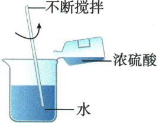
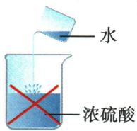

## 讲解

### 是什么

浓盐酸是浓$HCl$水溶液，易挥发；浓硫酸通常难挥发，吸水性强且能使一些有机物脱水炭化。浓稀指组成浓度，不直接等于酸种强弱。

### 怎么来的

$HCl$逸出遇空气水形成白雾小液滴，不是白烟；浓硫酸吸收现有水而使体系水增加，是吸水。脱水是从有机物结构中夺取氢氧等成水并改变物质，不能与吸水混称。

### 什么时候能用

浓硫酸可干燥不与其反应的气体，不能用来干$NH_{3}$等；敞口质量分数推断须说明忽略水蒸发等模型。浓酸实验仅按学校安全规程，不凭性质自行操作。

## 例题

### 物质性质用途说法

> 来源ID Q10-07；第十单元常见的酸碱盐；101-150/full.md 第2763–2771行。原答案与解析定位：101-150/full.md 第2751–2753行。

例1 (2024 湖南中考)下列有关物质的性质或用途说法正确的是( )

A.生石灰不能与水反应

B. 浓硫酸有挥发性

C. 催化剂不能加快化学反应速率

D. 熟石灰可用来改良酸性土壤

**原资料答案与解析：**

例1 解析 A(×) 生石灰(氧化钙)能与水反应生成氢氧化钙; B(×) 浓硫酸具有吸水性, 不具有挥发性; C(×) 催化剂如二氧化锰能加快过氧化氢分解速率。

答案 D

**展开解析（依据原详解补足理由与步骤）：**

选D。A生石灰与水生成$Ca(OH)_{2}$，故“不能反应”错；B浓硫酸通常难挥发，“有挥发性”错；C常见催化剂可加快所催化反应，故“不能加快”错；D熟石灰可调酸性土壤，对。需适量并依实际土壤，不能用强腐蚀性$NaOH$随意替代。

### 原浓酸性质稀释案例

> 来源ID Q10-23；第十单元常见的酸碱盐；101-150/full.md 第2378–2400行。原答案与解析定位：101-150/full.md 第2378–2400行。

|  | 盐酸($HCl$) | 硫酸( $H_2SO_4$ ) |
| --- | --- | --- |
| 颜色、状态 | 无色、液体 | 无色、黏稠的油状液体 |
| 气味 | 有刺激性气味 | 无味 |
| 挥发性 | 有挥发性,浓盐酸能在空气中形成白雾 | 难挥发 |
| 密度 | 常用浓盐酸(溶质质量分数为37%~38%)1.19 g/ $cm^3$ | 常用浓硫酸(溶质质量分数为98%)1.84 g/ $cm^3$ |
| 用途 | 用于制造药物、金属表面除锈等;人体胃液中含有盐酸,可以帮助消化 | 用于生产化肥、农药、火药、染料以及冶炼金属、精炼石油和金属除锈等;在实验室中常用浓硫酸作干燥剂 |

# (2)浓硫酸的特性

物理性质

①吸水性:可用作干燥剂 ③,干燥不能与其反应的酸性或中性气体,如 $CO_{2}$ 、 $SO_{2}$ 、 $H_{2}$ 、 $O_{2}$ 等;但不能干燥碱性气体,如 $NH_{3}$ 等。用浓硫酸干燥气体时,气体应从长导管进入(如图所示)。与浓硫酸反应

②强腐蚀性 4(脱水性): 浓硫酸能将纸张、木材、布料、皮肤(都由含碳、氢、氧等元素的化合物组成)里的氢、氧元素按水的组成比脱去,生成黑色的炭。

事故处理:若不慎将浓硫酸沾到皮肤上,应立即用大量水冲洗,再涂上溶质质量分数为3%\~5%的碳酸氢钠溶液,必要时需就医。

③强氧化性: 不可用浓硫酸干燥还原性气体, 如 $H_{2}S$ , 因为 $H_{2}S$ 能与浓硫酸发生反应。

# (3)稀释浓硫酸正误操作比较

|  | 正确操作 | 错误操作 |
| --- | --- | --- |
| 图示 |  |  |
| 实验操作 | 将浓硫酸沿着器壁缓慢注入水里,并用玻璃棒不断搅拌5 | 将水倒入浓硫酸中 |
| 实验现象 | 用温度计测量发现温度升高 | 液滴飞溅 |
| 原因 | 浓硫酸溶于水,放出大量的热 | 水的密度较小,会浮在浓硫酸上面。浓硫酸溶解时放出的热使水立刻沸腾,使硫酸液滴飞溅 |

# (4)敞口放置的浓盐酸和浓硫酸的变化 6

密封保存

|  | 溶质质量 | 溶剂质量 | 溶液质量 | 溶质质量分数 | 原因 |
| --- | --- | --- | --- | --- | --- |
| 浓盐酸 | 减小 | 不变 | 减小 | 减小 | 溶质挥发 |
| 浓硫酸 | 不变 | 增大 | 增大 | 减小 | 吸水 |

**原资料答案与解析：**

|  | 盐酸($HCl$) | 硫酸( $H_2SO_4$ ) |
| --- | --- | --- |
| 颜色、状态 | 无色、液体 | 无色、黏稠的油状液体 |
| 气味 | 有刺激性气味 | 无味 |
| 挥发性 | 有挥发性,浓盐酸能在空气中形成白雾 | 难挥发 |
| 密度 | 常用浓盐酸(溶质质量分数为37%~38%)1.19 g/ $cm^3$ | 常用浓硫酸(溶质质量分数为98%)1.84 g/ $cm^3$ |
| 用途 | 用于制造药物、金属表面除锈等;人体胃液中含有盐酸,可以帮助消化 | 用于生产化肥、农药、火药、染料以及冶炼金属、精炼石油和金属除锈等;在实验室中常用浓硫酸作干燥剂 |

# (2)浓硫酸的特性

物理性质

①吸水性:可用作干燥剂 ③,干燥不能与其反应的酸性或中性气体,如 $CO_{2}$ 、 $SO_{2}$ 、 $H_{2}$ 、 $O_{2}$ 等;但不能干燥碱性气体,如 $NH_{3}$ 等。用浓硫酸干燥气体时,气体应从长导管进入(如图所示)。与浓硫酸反应

②强腐蚀性 4(脱水性): 浓硫酸能将纸张、木材、布料、皮肤(都由含碳、氢、氧等元素的化合物组成)里的氢、氧元素按水的组成比脱去,生成黑色的炭。

事故处理:若不慎将浓硫酸沾到皮肤上,应立即用大量水冲洗,再涂上溶质质量分数为3%\~5%的碳酸氢钠溶液,必要时需就医。

③强氧化性: 不可用浓硫酸干燥还原性气体, 如 $H_{2}S$ , 因为 $H_{2}S$ 能与浓硫酸发生反应。

# (3)稀释浓硫酸正误操作比较

|  | 正确操作 | 错误操作 |
| --- | --- | --- |
| 图示 |  |  |
| 实验操作 | 将浓硫酸沿着器壁缓慢注入水里,并用玻璃棒不断搅拌5 | 将水倒入浓硫酸中 |
| 实验现象 | 用温度计测量发现温度升高 | 液滴飞溅 |
| 原因 | 浓硫酸溶于水,放出大量的热 | 水的密度较小,会浮在浓硫酸上面。浓硫酸溶解时放出的热使水立刻沸腾,使硫酸液滴飞溅 |

# (4)敞口放置的浓盐酸和浓硫酸的变化 6

密封保存

|  | 溶质质量 | 溶剂质量 | 溶液质量 | 溶质质量分数 | 原因 |
| --- | --- | --- | --- | --- | --- |
| 浓盐酸 | 减小 | 不变 | 减小 | 减小 | 溶质挥发 |
| 浓硫酸 | 不变 | 增大 | 增大 | 减小 | 吸水 |

**展开解析（依据原详解补足理由与步骤）：**

原比较表及操作案例，非另造题。浓盐酸挥发形成酸雾，敞口$HCl$损失；浓硫酸吸水，敞口质量可增、分数可降，吸水与使有机物脱水炭化不同。稀释浓硫酸，酸慢入水并搅拌散热；少水倒酸可能局部沸腾飞溅。原文有灼伤后涂3%—5%$NaHCO_{3}$的旧建议，明确纠正：按ILO/WHO ICSC0362和NHS应立即大量流水持续冲洗并尽快求医，不自行在皮肤加酸碱中和；混酸实验须学校安全条件。敞口“水质量不变”仅忽略水蒸发的课本模型，不是永远不变。

## 易错

分类、酸碱性、强弱、浓稀、溶解性分别判断。原例与纠正内容分开。
