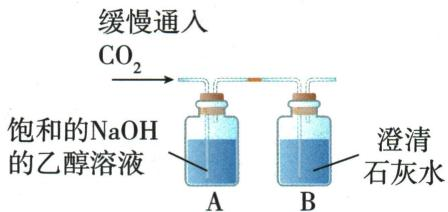

## 讲解

### 是什么

本章碱产生的阴离子全为$OH^{-}$；$NaOH$、$Ca(OH)_{2}$为常见碱。可溶碱水液碱性，常见石蕊蓝、酚酞红。

### 怎么来的

可自由移动$OH^{-}$造成共性，与酸$H^{+}$成水，也可与适当盐形成难溶氢氧化物；碱吸收某些非金属氧化物，例如$CO_{2}$。微溶$Ca(OH)_{2}$仍有已溶$OH^{-}$。

### 什么时候能用

强弱与溶解性不同：$Ca(OH)_{2}$微溶不据此叫中强碱，已溶部分的解离按常见强碱口径，依据OpenStax14.3。不扩展到高中平衡计算；难溶碱不直接套所有可溶碱实验。

## 例题

### 二氧化碳碱反应三路证据

> 来源ID Q10-03；第十单元常见的酸碱盐；101-150/full.md 第2611–2634行。原答案与解析定位：101-150/full.md 第2636–2642行。

例1 (2024 山东临沂中考)同学们在整理归纳碱的化学性质时,发现氢氧化钠和二氧化碳反应无明显现象,于是进行了如下实验探究。

【提出问题】如何证明氢氧化钠和二氧化碳发生了反应？

【进行实验】探究实验 I: 分别向两个充满二氧化碳的软塑料瓶中加入 20 mL 氢氧化钠溶液和蒸馏水, 振荡, 使其充分反应, 现象如图 1、图 2, 证明氢氧化钠与二氧化碳发生了化学反应。设计图 2 实验的目的是 \_\_\_\_。

  
图1 图2

探究实验Ⅱ:取图1实验反应后的少量溶液于试管中,加入\_\_\_\_,现象为\_\_\_\_,再次证明二者发生了反应。

探究实验Ⅲ: [查阅资料]20 ℃时, $\mathrm{{NaOH}}\text{、}{\mathrm{{Na}}}_{2}{\mathrm{{CO}}}_{3}$ 在水和乙醇中的溶解性如表所示:

| 溶质/溶剂 | 水 | 乙醇 |
| --- | --- | --- |
| $NaOH$ | 溶 | 溶 |
| $Na_{2}CO_{3}$ | 溶 | 不 |

[设计方案]20 ℃时,兴趣小组进行了如下实验:

实验现象:装置 A 中出现白色沉淀,装置 B 中无明显现象。装置 A 中出现白色沉淀的原因是\_\_\_\_。

【反思评价】(1)写出氢氧化钠和二氧化碳反应的化学方程式：\_\_\_\_。

(2)对于无明显现象的化学反应,一般可以从反应物的减少或新物质的生成等角度进行分析。

**原资料答案与解析：**

解析【进行实验】探究实验Ⅰ:二氧化碳和氢氧化钠反应,塑料瓶内气体减少,压强减小,塑料瓶变瘪。二氧化碳溶于水,塑料瓶也会变瘪,为了排除二氧化碳溶于水使塑料瓶变瘪,设计图2作对比实验,通过图1的塑料瓶比图2变瘪程度大,证明二氧化碳和氢氧化钠发生了反应。探究实验Ⅱ:二氧化碳和氢氧化钠反应生成碳酸钠和水,可验证碳酸钠的生成,证明反应的发生。取图1实验反应后的少量溶液于试管中,加入过量的稀盐酸,碳酸钠和盐酸反应生成氯化钠、水、二氧化碳,若能观察到有气泡产生,再次证明二者发生了反应。探究实验Ⅲ:装置A中,二氧化碳和氢氧化钠反应生成碳酸钠和水,碳酸钠不溶于乙醇,故出现白色沉淀。

答案【进行实验】探究实验Ⅰ:作对比实验 探究实验Ⅱ:过量的稀盐酸 有气泡产生

探究实验Ⅲ:生成的碳酸钠不溶于乙醇

【反思评价】(1) $CO_{2}+2NaOH=Na_{2}CO_{3}+H_{2}O$

**展开解析（依据原详解补足理由与步骤）：**

实验Ⅰ水瓶作空白，排除仅溶于水就使瓶瘪的解释；同温同瓶同$CO_{2}$同20mL，碱瓶更瘪支持额外消耗。Ⅱ加入过量稀盐酸，有气泡：$Na_2CO_3+2HCl=2NaCl+CO_2\uparrow+H_2O$，过量保证先耗余$NaOH$后还能与碳酸盐反应。实际还应排除起始$NaOH$已有碳酸盐。Ⅲ按题给20℃溶解表，新$Na_{2}CO_{3}$不溶乙醇，A出白色沉淀；B无明显现象说明通入后未检出足以浑浊的$CO_{2}$，不能把“无明显”说成任何气体都没有。反应$CO_2+2NaOH=Na_2CO_3+H_2O$。反应物减少与产物形成是两条互相支持的证据。

### 中和可视化与高pH酚酞

> 来源ID Q10-05；第十单元常见的酸碱盐；101-150/full.md 第2662–2682行。原答案与解析定位：101-150/full.md 第2684–2690行。

例3 (2024 辽宁中考节选)为实现氢氧化钠溶液和盐酸反应现象的可视化,某兴趣小组设计如下实验。

【监测温度】(1)在稀氢氧化钠溶液和稀盐酸反应过程中,温度传感器监测到溶液温度升高,说明该反应\_\_\_\_(填“吸热”或“放热”),化学方程式为\_\_\_\_。

【观察颜色】(2)在试管中加入 2 mL 某浓度的氢氧化钠溶液,滴入 2 滴酚酞溶液作\_\_\_\_剂,再逐滴加入盐酸,振荡,该过程中溶液的颜色和 pH 记录如下图所示。

(3)在①中未观察到预期的红色,为探明原因,小组同学查阅到酚酞变色范围如下:

0<pH<8.2 时呈无色, ${8.2} \leq  \mathrm{{pH}} \leq  {13}$ 时呈红色,pH>13 时呈无色。

据此推断,①中 a 的取值范围是\_\_\_\_(填标号)。

A. $0 < a < 8.2$

B. $8.2 \leqslant a \leqslant 13$

C. $a > 13$

(4)一段时间后,重复(2)实验,观察到滴加盐酸的过程中有少量气泡生成,原因是\_\_\_\_。

**原资料答案与解析：**

解析（1）溶液温度升高，说明该反应是放热反应；氢氧化钠和盐酸反应生成氯化钠和水。

(2)酚酞溶液通常被用作指示剂。  
(3)结合实验图和酚酞变色范围,可知a的取值范围应大于13。  
(4)氢氧化钠变质产生的碳酸钠和盐酸反应产生二氧化碳,有少量气泡生成。

答案 (1) 放热 $\mathrm{HCl} + \mathrm{NaOH} = \mathrm{NaCl} + \mathrm{H}_{2} \mathrm{O}$ (2) 指示 (3) C (4) 氢氧化钠变质(或盐酸与碳酸钠发生反应)

**展开解析（依据原详解补足理由与步骤）：**

(1)放热，$HCl+NaOH=NaCl+H_2O$。(2)指示剂。(3)选C。题明确pH>13时也无色，①是尚未加酸的$NaOH$，随后加酸降到12反而红，因此a>13。A虽无色但酸性不符原液且加酸不会升到12；B区间应红，不符①无色；C唯一吻合。(4)久置吸收$CO_{2}$生成$Na_{2}CO_{3}$，再遇酸产气：$2NaOH+CO_2=Na_2CO_3+H_2O$，$Na_2CO_3+2HCl=2NaCl+CO_2\uparrow+H_2O$。不能把“无色”独自当中性或酸性证据。

### 原碱性质和保存案例

> 来源ID Q10-26；第十单元常见的酸碱盐；101-150/full.md 第2491–2499；2505–2519行。原答案与解析定位：101-150/full.md 第2491–2499行；101-150/full.md 第2505–2519行。

|  | 氢氧化钠($NaOH$) | 氢氧化钙[$Ca(OH)_{2}$] |
| --- | --- | --- |
| 俗名 | 苛性钠、火碱、烧碱 | 熟石灰、消石灰 |
| 颜色、状态 | 白色固体 | 白色粉末状固体 |
| 溶解性 | 易溶于水(溶解时放出大量的热) | 微溶于水(其水溶液俗称石灰水) |
| 吸水性 | 易吸水潮解 | 不易吸水 |
| 用途 | 化工原料,广泛应用于制肥皂以及石油、造纸、纺织和印染等工业;生活中可用于除油污等;在实验室中用作某些气体的干燥剂 | 用于建筑行业、制漂白粉、改良酸性土壤、配制农药波尔多液等;在实验室中用澄清石灰水检验二氧化碳由石灰乳和硫酸铜溶液配制 |

注意:氢氧化钠具有强腐蚀性,如果不慎沾到皮肤上,应立即用大量的水冲洗,再涂上溶质质量分数为1%的硼酸溶液。

# 知识点 ④ 碱的化学性质★★★

称量氢氧化钠固体时，需用玻璃仪器盛放

# 1. 化学性质 ⑬ 只有可溶性碱的溶液才能使指示剂变色

①将 $CO_{2}$ 分别通入$NaOH$与Ca(OH) $_{2}$ 溶液中:

a. $NaOH$ 溶液: 无明显现象。发生反应: $CO_{2} + 2NaOH = Na_{2}CO_{3} +$

$H_{2}O$ 。14 $NaOH$固体不可以干燥 $CO_{2}$ 等酸性气体

b. $\mathrm{Ca(OH)_2}$ 溶液:溶液变浑浊。发生反应: $\mathrm{CO_2 + Ca(OH)_2 = CaCO_3\downarrow + H_2O}$ 。

注意:实验室常用 $NaOH$ 溶液吸收或除去 $CO_{2}$ ，常用 $\mathrm{Ca(OH)}_{2}$ 溶液检验 $CO_{2}$ 。

② $SO_{3}$ 与$NaOH$发生反应: $SO_{3}+2NaOH=Na_{2}SO_{4}+H_{2}O$ 。

(3)与酸反应(通式:酸+碱→盐+水)详见 P139 中和反应

(4) 与某些盐反应(通式: 碱+盐→新碱+新盐)详见 P148 盐的化学性质

**原资料答案与解析：**

|  | 氢氧化钠($NaOH$) | 氢氧化钙[$Ca(OH)_{2}$] |
| --- | --- | --- |
| 俗名 | 苛性钠、火碱、烧碱 | 熟石灰、消石灰 |
| 颜色、状态 | 白色固体 | 白色粉末状固体 |
| 溶解性 | 易溶于水(溶解时放出大量的热) | 微溶于水(其水溶液俗称石灰水) |
| 吸水性 | 易吸水潮解 | 不易吸水 |
| 用途 | 化工原料,广泛应用于制肥皂以及石油、造纸、纺织和印染等工业;生活中可用于除油污等;在实验室中用作某些气体的干燥剂 | 用于建筑行业、制漂白粉、改良酸性土壤、配制农药波尔多液等;在实验室中用澄清石灰水检验二氧化碳由石灰乳和硫酸铜溶液配制 |

注意:氢氧化钠具有强腐蚀性,如果不慎沾到皮肤上,应立即用大量的水冲洗,再涂上溶质质量分数为1%的硼酸溶液。

# 知识点 ④ 碱的化学性质★★★

称量氢氧化钠固体时，需用玻璃仪器盛放

# 1. 化学性质 ⑬ 只有可溶性碱的溶液才能使指示剂变色

①将 $CO_{2}$ 分别通入$NaOH$与Ca(OH) $_{2}$ 溶液中:

a. $NaOH$ 溶液: 无明显现象。发生反应: $CO_{2} + 2NaOH = Na_{2}CO_{3} +$

$H_{2}O$ 。14 $NaOH$固体不可以干燥 $CO_{2}$ 等酸性气体

b. $\mathrm{Ca(OH)_2}$ 溶液:溶液变浑浊。发生反应: $\mathrm{CO_2 + Ca(OH)_2 = CaCO_3\downarrow + H_2O}$ 。

注意:实验室常用 $NaOH$ 溶液吸收或除去 $CO_{2}$ ，常用 $\mathrm{Ca(OH)}_{2}$ 溶液检验 $CO_{2}$ 。

② $SO_{3}$ 与$NaOH$发生反应: $SO_{3}+2NaOH=Na_{2}SO_{4}+H_{2}O$ 。

(3)与酸反应(通式:酸+碱→盐+水)详见 P139 中和反应

(4) 与某些盐反应(通式: 碱+盐→新碱+新盐)详见 P148 盐的化学性质

**展开解析（依据原详解补足理由与步骤）：**

$NaOH$潮解吸水为物理过程，吸收$CO_{2}$形成碳酸盐是化学变质；$Ca(OH)_{2}$微溶但溶入部分可使液碱性，不能因微溶说“中强碱”。原接触$NaOH$后涂1%硼酸建议不作急救指令：ICSC0360要求大量流水冲洗并立即求医，NHS不自行涂其他化学品。$NaOH$可除$CO_{2}$而不用该气作自身保护气；石灰水澄清仍可含已溶$Ca(OH)_{2}$。

## 易错

分类、酸碱性、强弱、浓稀、溶解性分别判断。原例与纠正内容分开。
