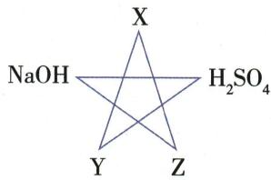
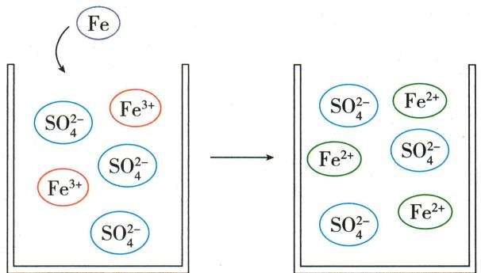

## 讲解

### 是什么

本章酸是在水中产生的阳离子全为$H^{+}$的化合物，$HCl$、$H_{2}SO_{4}$为常见酸。盐酸是$HCl$水溶液，为混合物；酸物质类别与酸性溶液不同。

### 怎么来的

共同$H^{+}$带来石蕊红、与适用活泼金属放氢、与金属氧化物成盐水、与碱中和、与特定盐反应等共性。酸根不同，又有$H_{2}SO_{4}$与$Ba^{2+}$沉淀等差异。

### 什么时候能用

金属放氢只用氢前金属及适用稀酸，浓硫酸/硝酸不套；NaHSO₄有$Na^{+}$属盐但可呈酸性。酸与任何金属或盐均反应是错的。

## 例题

### 物质性质用途说法

> 来源ID Q10-07；第十单元常见的酸碱盐；101-150/full.md 第2763–2771行。原答案与解析定位：101-150/full.md 第2751–2753行。

例1 (2024 湖南中考)下列有关物质的性质或用途说法正确的是( )

A.生石灰不能与水反应

B. 浓硫酸有挥发性

C. 催化剂不能加快化学反应速率

D. 熟石灰可用来改良酸性土壤

**原资料答案与解析：**

例1 解析 A(×) 生石灰(氧化钙)能与水反应生成氢氧化钙; B(×) 浓硫酸具有吸水性, 不具有挥发性; C(×) 催化剂如二氧化锰能加快过氧化氢分解速率。

答案 D

**展开解析（依据原详解补足理由与步骤）：**

选D。A生石灰与水生成$Ca(OH)_{2}$，故“不能反应”错；B浓硫酸通常难挥发，“有挥发性”错；C常见催化剂可加快所催化反应，故“不能加快”错；D熟石灰可调酸性土壤，对。需适量并依实际土壤，不能用强腐蚀性$NaOH$随意替代。

### 五角反应网络黑色固体

> 来源ID Q10-08；第十单元常见的酸碱盐；101-150/full.md 第2775–2785行。原答案与解析定位：101-150/full.md 第2755–2757行。

例2 (2024 山东济宁中考)某同学学习酸、碱的知识后,构建了有关酸、碱与 X、Y、Z 三种初中常见物质之间的反应关系图,图中连线两端的物质均能发生化学反应,其中 X 为黑色固体,Y、Z 为氧化物,常温下,Z 为气体。下列说法错误的是

A.X 为 $\mathrm{MnO}_{2}$

B. 若 Y 与稀 $H_{2}SO_{4}$ 反应得到黄色溶液, 则 Y 为 $Fe_{2}O_{3}$

C.X 与 Z 发生反应的化学方程式为 $C + CO_{2} \xlongequal{\text{高温}} 2CO$

D.X 与 Y 发生的化学反应属于置换反应

**原资料答案与解析：**

例2 解析 A(×)Y 和 Z 为氧化物, Y 与 $H_{2}SO_{4}$ 反应, 则 Y 是金属氧化物; 气体 Z 与 $NaOH$ 反应, 则 Z 是非金属氧化物; X 为黑色固体, 初中常见黑色固体有 C、Fe 粉、$CuO$、 $Fe_{3}O_{4}$ 、 $MnO_{2}$ , 且 X 与 Y 和 Z 反应, 则 X 是 C, Z 是 $CO_{2}$ 。B(√) $Fe_{2}O_{3}$ 与稀 $H_{2}SO_{4}$ 反应得到黄色溶液。D(√)X 与 Y 的反应是 C 还原金属氧化物, 属于置换反应。

答案 A

**展开解析（依据原详解补足理由与步骤）：**

选错误A。Z常温气态氧化物并与$NaOH$反应，按初中常见物可$CO_{2}$；黑色X可为碳，能与Z高温反应也能还原Y金属氧化物。A $MnO_{2}$不满足与$CO_{2}$这一连线，错。B Y与硫酸产黄色$Fe^{3+}$溶液，可为$Fe_{2}O_{3}$，对。C $C+CO_2\xlongequal{\text{高温}}2CO$满足连线，对；Z常温气体不等于全图反应都常温。D如$C+2CuO\xlongequal{\text{高温}}2Cu+CO_2\uparrow$，单质+化合物→单质+化合物属置换，对。逐项判断基于题给网络，而非仅“X黑色”唯一认碳。

### 酸共性差异与电导率

> 来源ID Q10-09；第十单元常见的酸碱盐；101-150/full.md 第2787–2806行。原答案与解析定位：101-150/full.md 第2759–2759行；101-150/full.md 第2823–2825行。

例3（2024山东潍坊中考）“宏观—微观—符号”是化学独特的表示物质及其变化的方法。某兴趣小组对盐酸和硫酸的共性和差异性进行以下研究。回答下列问题。

(1) 向稀盐酸和稀硫酸中分别滴加石蕊试液, 试液变红, 说明两种酸溶液中均存在 \_\_\_\_ (填微粒符号)。

(2)将表面生锈的铁钉(铁锈的主要成分为 $Fe_{2}O_{3}$ ) 投入到足量稀硫酸中, 铁锈脱落、溶解, 溶液变黄, 化学方程式为 \_\_\_\_; 铁钉表面产生气泡, 该气体为 \_\_\_\_; 一段时间后, 溶液慢慢变为黄绿色, 图1是对溶液变为黄绿色的一种微观解释, 参加反应的微粒是 \_\_\_\_ (填微粒符号)。

  
图1

(3) 分别向两份相同的 $\mathrm{Ba(OH)}_{2}$ 溶液中匀速滴加相同 pH 的稀盐酸和稀硫酸, 观察现象并绘制溶液电导率随时间变化曲线 (图 2) (电导率能衡量溶液导电能力大小,相同条件下,单位体积溶液中的离子总数越多,电导率越大)。

  
图 2

①图2中曲线1表示向 $\mathrm{Ba(OH)_2}$ 溶液中滴加\_\_\_\_；曲线2反应中的实验现象为\_\_\_\_；结合图3解释电导率Q点小于N点的原因\_\_\_\_。

  
图 3

②该实验说明,不同的酸中,由于\_\_\_\_不同,酸的性质也表现出差异。

**原资料答案与解析：**

例3 解析 (1) 石蕊试液变红, 说明两种酸溶液中均存在相同的阳离子即氢离子。(2) 铁锈脱落、溶解, 溶液变黄, 是由于氧化铁与硫酸反应生成硫酸铁和水; 铁钉表面产生气泡是由于裸露出来的铁与稀硫酸反应生成硫酸亚铁和氢气; 由图1可知, 铁与硫酸铁反应的微观实质是铁原子与铁离子反应生成亚铁离子。(3) ①稀硫酸与氢氧化钡反应生成硫酸钡沉淀和水, 当二者恰好完全反应时, 溶液中基本不存在自由移动的阴、阳离子, 此时电导率接近0; 而稀盐酸与氢氧化钡反应生成氯化钡和水, 反应过程无沉淀生成, 当二者恰好完全反应时, 溶液中离子浓度最小, 但此时电导率不会为0, 即滴加稀硫酸的溶液电导率的最小值小于滴加稀盐酸的溶液电导率的最小值, 结合图2可知,

曲线1表示向 $\mathrm{Ba(OH)_2}$ 溶液中滴加稀盐酸，曲线2表示向 $\mathrm{Ba(OH)_2}$ 溶液中滴加稀硫酸；曲线2反应中的实验现象为产生白色沉淀； $Q$ 点时稀硫酸与 $\mathrm{Ba(OH)_2}$ 恰好完全反应，溶液中离子浓度小于 $N$ 点。②不同的酸中，酸根（离子）不同，酸的性质不同。

答案 (1) $\mathrm{H}^{+}$ (2) $\mathrm{Fe}_{2} \mathrm{O}_{3} + 3 \mathrm{H}_{2} \mathrm{SO}_{4} = \mathrm{Fe}_{2} (\mathrm{SO}_{4})_{3} + 3 \mathrm{H}_{2} \mathrm{O}$ 氢气（或 $\mathrm{H}_{2}$ ） $\mathrm{Fe}, \mathrm{Fe}^{3+}$ (3) ①稀盐酸产生白色沉淀钡离子和硫酸根离子结合生成硫酸钡沉淀，氢离子和氢氧根离子结合生成水，硫酸钡、水几乎都不导电， $Q$ 点溶液中离子总数小于 $N$ 点 ②酸根（或酸根离子）

**展开解析（依据原详解补足理由与步骤）：**

(1)$H^{+}$。(2)$Fe_2O_3+3H_2SO_4=Fe_2(SO_4)_3+3H_2O$，黄来自$Fe^{3+}$。酸继续遇铁产H₂：$Fe+H_2SO_4=FeSO_4+H_2\uparrow$。图1另一过程$Fe+2Fe^{3+}\longrightarrow3Fe^{2+}$，参与Fe、$Fe^{3+}$，硫酸根前后保留；不是铁把硫酸根变成亚铁。(3)曲线1盐酸：$2HCl+Ba(OH)_2=BaCl_2+2H_2O$，可溶$BaCl_{2}$仍提供离子。曲线2硫酸出现白色$BaSO_{4}$；Q点$H^{+}$与$OH^{-}$成水、$Ba^{2+}$与$SO_4^{2-}$成沉淀，留液自由离子少于N，电导较低但不宣称绝对零。实际离子种类、迁移率、温度也影响电导，题给为可比条件模型。(4)酸根不同，产生沉淀等特性不同。

### 原酸的金属及氧化物反应表

> 来源ID Q10-24；第十单元常见的酸碱盐；101-150/full.md 第2460–2460；2464–2464行。原答案与解析定位：101-150/full.md 第2460–2460行；101-150/full.md 第2464–2464行。

| 金属 | 现象 | 化学方程式(与稀盐酸或稀硫酸反应) |
| --- | --- | --- |
| 镁 | 反应剧烈,有大量气泡产生,反应放热 | $\text{Mg} + 2\text{HCl} = \text{MgCl}_2 + \text{H}_2 \uparrow$  $\text{Mg} + \text{H}_2\text{SO}_4 = \text{MgSO}_4 + \text{H}_2 \uparrow$ |
| 铝 | 反应较快,有大量气泡产生,反应放热 | $2\text{Al} + 6\text{HCl} = 2\text{AlCl}_3 + 3\text{H}_2 \uparrow$  $2\text{Al} + 3\text{H}_2\text{SO}_4 = \text{Al}_2(\text{SO}_4)_3 + 3\text{H}_2 \uparrow$ |
| 锌 | 反应较快,有大量气泡产生,反应放热 | $\text{Zn} + 2\text{HCl} = \text{ZnCl}_2 + \text{H}_2 \uparrow$  $\text{Zn} + \text{H}_2\text{SO}_4 = \text{ZnSO}_4 + \text{H}_2 \uparrow$ |
| 铁 | 反应较慢,有气泡产生,无色溶液逐渐变成浅绿色,反应放热 | $\text{Fe} + 2\text{HCl} = \text{FeCl}_2 + \text{H}_2 \uparrow$ 注意Fe的化合 $\text{Fe} + \text{H}_2\text{SO}_4 = \text{FeSO}_4 + \text{H}_2 \uparrow$ 价为+2 |

| 金属氧化物 | 现象 | 化学方程式(与稀盐酸或稀硫酸反应) |
| --- | --- | --- |
| 氧化铁 | 红棕色固体消失,溶液变成黄色8 | $Fe_{2}O_{3} + 6HCl = 2FeCl_{3} + 3H_{2}O$  $Fe_{2}O_{3} + 3H_{2}SO_{4} = Fe_{2}(SO_{4})_{3} + 3H_{2}O$ |
| 氧化铜 | 黑色粉末消失,溶液变成蓝色 | $CuO + 2HCl = CuCl_{2} + H_{2}O$  $CuO + H_{2}SO_{4} = CuSO_{4} + H_{2}O$ 注意 $Fe$ 的化合价为+3 |

**原资料答案与解析：**

| 金属 | 现象 | 化学方程式(与稀盐酸或稀硫酸反应) |
| --- | --- | --- |
| 镁 | 反应剧烈,有大量气泡产生,反应放热 | $\text{Mg} + 2\text{HCl} = \text{MgCl}_2 + \text{H}_2 \uparrow$  $\text{Mg} + \text{H}_2\text{SO}_4 = \text{MgSO}_4 + \text{H}_2 \uparrow$ |
| 铝 | 反应较快,有大量气泡产生,反应放热 | $2\text{Al} + 6\text{HCl} = 2\text{AlCl}_3 + 3\text{H}_2 \uparrow$  $2\text{Al} + 3\text{H}_2\text{SO}_4 = \text{Al}_2(\text{SO}_4)_3 + 3\text{H}_2 \uparrow$ |
| 锌 | 反应较快,有大量气泡产生,反应放热 | $\text{Zn} + 2\text{HCl} = \text{ZnCl}_2 + \text{H}_2 \uparrow$  $\text{Zn} + \text{H}_2\text{SO}_4 = \text{ZnSO}_4 + \text{H}_2 \uparrow$ |
| 铁 | 反应较慢,有气泡产生,无色溶液逐渐变成浅绿色,反应放热 | $\text{Fe} + 2\text{HCl} = \text{FeCl}_2 + \text{H}_2 \uparrow$ 注意Fe的化合 $\text{Fe} + \text{H}_2\text{SO}_4 = \text{FeSO}_4 + \text{H}_2 \uparrow$ 价为+2 |

| 金属氧化物 | 现象 | 化学方程式(与稀盐酸或稀硫酸反应) |
| --- | --- | --- |
| 氧化铁 | 红棕色固体消失,溶液变成黄色8 | $Fe_{2}O_{3} + 6HCl = 2FeCl_{3} + 3H_{2}O$  $Fe_{2}O_{3} + 3H_{2}SO_{4} = Fe_{2}(SO_{4})_{3} + 3H_{2}O$ |
| 氧化铜 | 黑色粉末消失,溶液变成蓝色 | $CuO + 2HCl = CuCl_{2} + H_{2}O$  $CuO + H_{2}SO_{4} = CuSO_{4} + H_{2}O$ 注意 $Fe$ 的化合价为+3 |

**展开解析（依据原详解补足理由与步骤）：**

原表稀酸与MgAlZnFe产氢，铁生成亚铁盐；铁锈$Fe_{2}O_{3}$与酸生成三价铁盐黄色，$CuO$与酸成铜盐蓝色。活泼金属需在氢前及酸条件适用，不能将浓硫酸或硝酸套此稀酸放氢模型。原表嵌入注意语位置错乱，解释中分别归属铁锈/氧化铜。

### 原酸碱导电实验

> 来源ID Q10-25；第十单元常见的酸碱盐；101-150/full.md 第2477–2483行。原答案与解析定位：101-150/full.md 第2477–2483行。

| 待测液 | 稀盐酸 | 稀硫酸 | 蒸馏水 | 乙醇 |
| --- | --- | --- | --- | --- |
| 灯泡是否亮 | 亮 | 亮 | 不亮 | 不亮 |
| 结论 | 导电 | 导电 | 不导电 | 不导电 |
| 分析 | 溶于水能产生自由移动的离子9,通电后阴、阳离子定向移动形成电流 | 溶于水能产生自由移动的离子9,通电后阴、阳离子定向移动形成电流 | 没有产生自由移动的离子 | 没有产生自由移动的离子 |

(2)酸具有相似化学性质的原因:酸在水中都能解离出 $H^{+}$ 和酸根离子, 即在不同酸的溶液中都含有 $H^{+}$ , 所以, 酸有一些相似的化学性质。

# 知识点 ③ 常见的碱★★☆

1. 碱的定义：碱是指在水中解离出的阴离子全部是 $OH^{-}$ 的化合物。

**原资料答案与解析：**

| 待测液 | 稀盐酸 | 稀硫酸 | 蒸馏水 | 乙醇 |
| --- | --- | --- | --- | --- |
| 灯泡是否亮 | 亮 | 亮 | 不亮 | 不亮 |
| 结论 | 导电 | 导电 | 不导电 | 不导电 |
| 分析 | 溶于水能产生自由移动的离子9,通电后阴、阳离子定向移动形成电流 | 溶于水能产生自由移动的离子9,通电后阴、阳离子定向移动形成电流 | 没有产生自由移动的离子 | 没有产生自由移动的离子 |

(2)酸具有相似化学性质的原因:酸在水中都能解离出 $H^{+}$ 和酸根离子, 即在不同酸的溶液中都含有 $H^{+}$ , 所以, 酸有一些相似的化学性质。

# 知识点 ③ 常见的碱★★☆

1. 碱的定义：碱是指在水中解离出的阴离子全部是 $OH^{-}$ 的化合物。

**展开解析（依据原详解补足理由与步骤）：**

原电路案例。酸和可溶碱溶液有可自由移动离子，能导电；蒸馏水与乙醇在该灯泡装置未见发光，只说明导电太弱，蒸馏水并非绝对没有离子。灯不亮还需排电路问题，不能由有无发光判断纯净混合分类。

## 易错

分类、酸碱性、强弱、浓稀、溶解性分别判断。原例与纠正内容分开。
