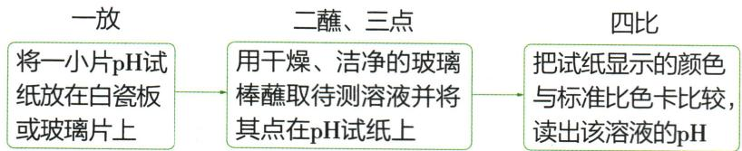

## 讲解

### 是什么

指示剂借溶液酸碱性产生颜色变化，常用紫色石蕊与无色酚酞。石蕊酸红碱蓝，酚酞在普通教材碱性区呈红。

### 怎么来的

酸碱环境不同使指示剂形式改变，故颜色是酸碱性证据而不是物质身份证。若无色同时可对应酸中性及题给极高pH，必须结合原液与变化方向。

### 什么时候能用

按题给变色范围优先，不能所有碱性都硬说红；指示剂不能测任意精确pH。颜色变化说明环境变，单独不能证明恰好中和。

## 例题

### 维生素C溶液酸性

> 来源ID Q10-01；第十单元常见的酸碱盐；101-150/full.md 第2316–2324行。原答案与解析定位：101-150/full.md 第2306–2308行。

例1（2024 江苏扬州中考）室温下,维生素 C 的水溶液能使紫色石蕊试液变红。其水溶液的酸碱性是 ( )

A.酸性

B. 中性

C.碱性

D. 无法判断

**原资料答案与解析：**

例1 解析 酸性溶液能使紫色石蕊试液变红。

答案 A

**展开解析（依据原详解补足理由与步骤）：**

选A。紫色石蕊变红支持酸性，A对；B中性、C碱性均不符合这一现象；D说无法判断忽略了题给指示剂证据，错。颜色取决于溶液酸碱性，不由维生素名称猜。

### 中和可视化与高pH酚酞

> 来源ID Q10-05；第十单元常见的酸碱盐；101-150/full.md 第2662–2682行。原答案与解析定位：101-150/full.md 第2684–2690行。

例3 (2024 辽宁中考节选)为实现氢氧化钠溶液和盐酸反应现象的可视化,某兴趣小组设计如下实验。

【监测温度】(1)在稀氢氧化钠溶液和稀盐酸反应过程中,温度传感器监测到溶液温度升高,说明该反应\_\_\_\_(填“吸热”或“放热”),化学方程式为\_\_\_\_。

【观察颜色】(2)在试管中加入 2 mL 某浓度的氢氧化钠溶液,滴入 2 滴酚酞溶液作\_\_\_\_剂,再逐滴加入盐酸,振荡,该过程中溶液的颜色和 pH 记录如下图所示。

(3)在①中未观察到预期的红色,为探明原因,小组同学查阅到酚酞变色范围如下:

0<pH<8.2 时呈无色, ${8.2} \leq  \mathrm{{pH}} \leq  {13}$ 时呈红色,pH>13 时呈无色。

据此推断,①中 a 的取值范围是\_\_\_\_(填标号)。

A. $0 < a < 8.2$

B. $8.2 \leqslant a \leqslant 13$

C. $a > 13$

(4)一段时间后,重复(2)实验,观察到滴加盐酸的过程中有少量气泡生成,原因是\_\_\_\_。

**原资料答案与解析：**

解析（1）溶液温度升高，说明该反应是放热反应；氢氧化钠和盐酸反应生成氯化钠和水。

(2)酚酞溶液通常被用作指示剂。  
(3)结合实验图和酚酞变色范围,可知a的取值范围应大于13。  
(4)氢氧化钠变质产生的碳酸钠和盐酸反应产生二氧化碳,有少量气泡生成。

答案 (1) 放热 $\mathrm{HCl} + \mathrm{NaOH} = \mathrm{NaCl} + \mathrm{H}_{2} \mathrm{O}$ (2) 指示 (3) C (4) 氢氧化钠变质(或盐酸与碳酸钠发生反应)

**展开解析（依据原详解补足理由与步骤）：**

(1)放热，$HCl+NaOH=NaCl+H_2O$。(2)指示剂。(3)选C。题明确pH>13时也无色，①是尚未加酸的$NaOH$，随后加酸降到12反而红，因此a>13。A虽无色但酸性不符原液且加酸不会升到12；B区间应红，不符①无色；C唯一吻合。(4)久置吸收$CO_{2}$生成$Na_{2}CO_{3}$，再遇酸产气：$2NaOH+CO_2=Na_2CO_3+H_2O$，$Na_2CO_3+2HCl=2NaCl+CO_2\uparrow+H_2O$。不能把“无色”独自当中性或酸性证据。

### 原指示剂与pH操作案例

> 来源ID Q10-22；第十单元常见的酸碱盐；101-150/full.md 第2216–2278行。原答案与解析定位：101-150/full.md 第2216–2278行。

# 知识点① 酸碱指示剂★★☆

1. 定义：能跟酸性或碱性溶液起作用而显示不同颜色的物质叫作酸碱指示剂，通常简称为指示剂。

# 2. 探究实验

3. 常用指示剂的变色情况 ①② 变色的是指示剂，而不是酸性或碱性溶液

|  | 酸性溶液 | 碱性溶液 | 中性溶液 |
| --- | --- | --- | --- |
| 紫色石蕊溶液 | 变红 | 变蓝 | 不变色(显紫色) |
| 无色酚酞溶液 | 不变色(显无色) | 变红 | 不变色(显无色) |

# 知识点 ② 溶液酸碱度的表示——pH ★★★★ ③

1. 溶液的酸碱度: 指溶液酸碱性的强弱程度, 是定量表示溶液酸碱性强弱的一种方法, 通常用 $\mathrm{pH}$ 来表示。

# 2.pH 与溶液酸碱性的关系

室温下，pH 的范围通常为 0\~14。pH 与溶液酸碱性的关系可用下图表示。

# 3.pH 的测定方法

(1) 测定溶液的 pH 通常用 pH 试纸或 pH 计, 简便方法是使用 pH 试纸。④用 pH 试纸测定 pH 的操作方法:

# (2) 注意事项

①不能直接把 pH 试纸浸入待测溶液中,否则会使待测溶液受到污染。

1 巧学妙记 指示剂变色口诀酸红碱蓝中性紫，酚酞遇碱变红色。

# ② 拓展延伸

1. 石蕊试纸有红色石蕊试纸和蓝色石蕊试纸两种。碱性溶液使红色石蕊试纸变蓝，酸性溶液使蓝色石蕊试纸变红。

2. 指示剂遇到酸性或碱性溶液变色是化学变化。

# ③ 温馨提示

酸碱指示剂只能检验溶液的酸碱性，不能精确测定溶液酸碱性的强弱程度。

# 4 实验用品

一种 pH 试纸和标准比色卡

两种 pH 计(酸度计)

# 5 温馨提示

pH 通常用来表示溶质质量分数较小的溶液的酸碱度，对于溶质质量分数较大的溶液，一般直接用 $H^{+}$ 或 $OH^{-}$ 的浓度表示。因此，pH = 0 的溶液不是酸性最强的溶液；同样，pH = 14 的溶液也不是碱性最强的溶液。

# 6 拓展延伸

厕所清洁剂中含有强酸，炉具清洁剂中含有强碱（$NaOH$）。

②测溶液的 pH 时,不能先用水将 pH 试纸润湿再进行测定,因为将待测溶液点到用水润湿后的 pH 试纸上,相当于稀释了待测溶液,会导致测得的 pH 不准确。

**原资料答案与解析：**

# 知识点① 酸碱指示剂★★☆

1. 定义：能跟酸性或碱性溶液起作用而显示不同颜色的物质叫作酸碱指示剂，通常简称为指示剂。

# 2. 探究实验

3. 常用指示剂的变色情况 ①② 变色的是指示剂，而不是酸性或碱性溶液

|  | 酸性溶液 | 碱性溶液 | 中性溶液 |
| --- | --- | --- | --- |
| 紫色石蕊溶液 | 变红 | 变蓝 | 不变色(显紫色) |
| 无色酚酞溶液 | 不变色(显无色) | 变红 | 不变色(显无色) |

# 知识点 ② 溶液酸碱度的表示——pH ★★★★ ③

1. 溶液的酸碱度: 指溶液酸碱性的强弱程度, 是定量表示溶液酸碱性强弱的一种方法, 通常用 $\mathrm{pH}$ 来表示。

# 2.pH 与溶液酸碱性的关系

室温下，pH 的范围通常为 0\~14。pH 与溶液酸碱性的关系可用下图表示。

# 3.pH 的测定方法

(1) 测定溶液的 pH 通常用 pH 试纸或 pH 计, 简便方法是使用 pH 试纸。④用 pH 试纸测定 pH 的操作方法:

# (2) 注意事项

①不能直接把 pH 试纸浸入待测溶液中,否则会使待测溶液受到污染。

1 巧学妙记 指示剂变色口诀酸红碱蓝中性紫，酚酞遇碱变红色。

# ② 拓展延伸

1. 石蕊试纸有红色石蕊试纸和蓝色石蕊试纸两种。碱性溶液使红色石蕊试纸变蓝，酸性溶液使蓝色石蕊试纸变红。

2. 指示剂遇到酸性或碱性溶液变色是化学变化。

# ③ 温馨提示

酸碱指示剂只能检验溶液的酸碱性，不能精确测定溶液酸碱性的强弱程度。

# 4 实验用品

一种 pH 试纸和标准比色卡

两种 pH 计(酸度计)

# 5 温馨提示

pH 通常用来表示溶质质量分数较小的溶液的酸碱度，对于溶质质量分数较大的溶液，一般直接用 $H^{+}$ 或 $OH^{-}$ 的浓度表示。因此，pH = 0 的溶液不是酸性最强的溶液；同样，pH = 14 的溶液也不是碱性最强的溶液。

# 6 拓展延伸

厕所清洁剂中含有强酸，炉具清洁剂中含有强碱（$NaOH$）。

②测溶液的 pH 时,不能先用水将 pH 试纸润湿再进行测定,因为将待测溶液点到用水润湿后的 pH 试纸上,相当于稀释了待测溶液,会导致测得的 pH 不准确。

**展开解析（依据原详解补足理由与步骤）：**

原定义与操作。石蕊红酸、蓝碱，紫不能细判精确pH；酚酞无色可能酸或中性，且第5原题强碱也可能无色。取少量液用洁净玻璃棒点干pH纸，对色卡；不可把纸浸瓶污染，不可先湿纸稀释待测液。通常试纸读近似整数，pH计可精测。室温常见稀水溶液以7中性，0—14是常见范围非数学绝对边界。

## 易错

分类、酸碱性、强弱、浓稀、溶解性分别判断。原例与纠正内容分开。
