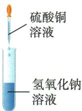
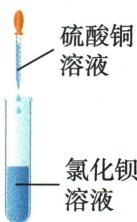

## 讲解

### 判据

遇酸碱盐任意两种，先预测交换后物质，再查是否形成可移出自由离子的产物。

### 流程

按离子和电荷配出候选化学式，不改下标配平；查原料可溶或酸可作用于固体；查沉淀/气体/水。若皆可溶且无新水气体，在本章通常无净反应。盐与活泼金属另属置换，需活动性条件，不能归复分解。

## 例题

### 贝壳草灰基本反应

> 来源ID Q10-17；第十单元常见的酸碱盐；151-200/full.md 第399–407行。原答案与解析定位：151-200/full.md 第382–385行。

例2 (2024 河南中考)《周礼·考工记》中记载,古人将含碳酸钙的贝壳制成石灰乳,在草木灰(含 $K_{2}CO_{3}$ ) 的水溶液中加石灰乳,生成物能除去丝帛污渍。以上反应中不涉及的基本反应类型是 ( )

A. 化合反应

B. 分解反应

C. 置换反应

D. 复分解反应

**原资料答案与解析：**

例2 解析 ① $CaCO_{3}\xlongequal{\text{高温}}CaO+$ $CO_{2}\uparrow$ （分解反应）；② $CaO+H_{2}O$ $\xlongequal{\quad}Ca(OH)_{2}$ （化合反应）；
③ $K_{2}CO_{3}+Ca(OH)_{2}=CaCO_{3}\downarrow+$ 2$KOH$(复分解反应)。

答案 C

**展开解析（依据原详解补足理由与步骤）：**

选C。贝壳主要$CaCO_{3}$，高温分解$CaCO_3\xlongequal{\text{高温}}CaO+CO_2\uparrow$，B涉及；$CaO$加水$CaO+H_2O=Ca(OH)_2$化合，A涉及；$K_2CO_3+Ca(OH)_2=CaCO_3\downarrow+2KOH$双交换为复分解，D涉及。没有单质参与生成新单质的置换，C不涉及。题说生成物除污，联系碱性但不添加原题未给定量。

### 原复分解条件与溶解口诀

> 来源ID Q10-29；第十单元常见的酸碱盐；151-200/full.md 第69–77；135–158行。原答案与解析定位：151-200/full.md 第69–77行；151-200/full.md 第135–158行。

1. 定义: 由两种化合物互相交换成分, 生成另外两种化合物的反应。

可表示为 AB+CD $\longrightarrow$ AD+CB。④

2. 特点(简记为“双交换、价不变”) 5

(1)一般在水溶液里进行,两种化合物中的离子互换。

(2)元素的化合价不改变。

| 实验 |  |  |
| --- | --- | --- |
| 现象 | 产生蓝色沉淀 | 产生白色沉淀 |
| 原理 | $2\text{NaOH} + \text{CuSO}_4 = \text{Cu(OH)}_2 \downarrow + \text{Na}_2\text{SO}_4$ | $\text{CuSO}_4 + \text{BaCl}_2 = \text{BaSO}_4 \downarrow + \text{CuCl}_2$ |

# (2) 反应类型及发生的条件 6

初中阶段学习的酸均易溶于水

| 反应类型 | 反应物条件 | 生成物条件 |
| --- | --- | --- |
| 酸+金属氧化物→盐+水 | 酸可溶 | 至少具备下列条件之一:1有沉淀生成;2有气体生成;3有水生成 |
| 酸+碱→盐+水7 | 一种可溶,一般酸可溶 | 至少具备下列条件之一:1有沉淀生成;2有气体生成;3有水生成 |
| 酸+盐→新酸+新盐 | 酸可溶 | 至少具备下列条件之一:1有沉淀生成;2有气体生成;3有水生成 |
| 碱+盐→新碱+新盐 | 二者均可溶 | 至少具备下列条件之一:1有沉淀生成;2有气体生成;3有水生成 |
| 盐1+盐2→新盐1+新盐2 | 二者均可溶 | 至少具备下列条件之一:1有沉淀生成;2有气体生成;3有水生成 |

# 4. 复分解反应的实质: 一般来说, 两种化合物在水溶液中互相交换离子, 当离子之间能够互相结合生成气体、沉淀或水, 反应就可以发生。⑧

# 知识点 ③ 盐的性质★★★

$\mathrm{AgCl} 、 \mathrm{Hg}_{2} \mathrm{Cl}_{2} 、 \mathrm{BaSO}_{4}$ 不溶, 其余盐酸盐、硫酸盐可溶

# 1.盐的物理性质

(1)颜色:大多数盐为白色固体,其水溶液呈无色。特殊情况:胆矾固体为蓝色,高锰酸钾固体为暗紫色;含 $Cu^{2+}$ 的溶液一般为蓝色,含 $Fe^{2+}$ 的溶液一般为浅绿色,含 $Fe^{3+}$ 的溶液一般为黄色。  
(2)溶解性:钾钠铵盐硝酸盐,完全溶解不困难;盐酸不溶银亚汞,硫酸不溶硫酸钡,碳酸能溶钾钠铵,微溶硫酸钙银碳酸镁。

# 2.盐的化学性质

碳酸盐只有 ${\mathrm{K}}_{2}{\mathrm{{CO}}}_{3}$ 、 ${\mathrm{{Na}}}_{2}{\mathrm{{CO}}}_{3}$ 、 ${\mathrm{{CaSO}}}_{4}$ 、 ${\mathrm{{Ag}}}_{2}{\mathrm{{SO}}}_{4}$ 、 ${\left( {\mathrm{{NH}}}_{4}\right) }_{2}{\mathrm{{CO}}}_{3}$ 可溶 ${\mathrm{{MgCO}}}_{3}$ 微溶

| 化学性质 | 实例 |
| --- | --- |
| 可溶性盐+金属→新盐+新金属K、Ca、Na除外 | $CuSO_{4} + Fe = FeSO_{4} + Cu$  $2AgNO_{3} + Cu = Cu(NO_{3})_{2} + 2Ag$ |
| 盐+酸→新盐+新酸 | $Na_{2}CO_{3} + 2HCl = 2NaCl + H_{2}O + CO_{2} \uparrow$   $BaCl_{2} + H_{2}SO_{4} = BaSO_{4} \downarrow + 2HCl$ |
| 可溶性盐+可溶性碱→新盐+新碱 | $Na_{2}CO_{3} + Ca(OH)_{2} = CaCO_{3} \downarrow + 2NaOH$  $CuSO_{4} + Ba(OH)_{2} = BaSO_{4} \downarrow + Cu(OH)_{2} \downarrow$ |
| 可溶性盐1+可溶性盐2→新盐1+新盐2 | $BaCl_{2} + Na_{2}CO_{3} = BaCO_{3} \downarrow + 2NaCl$  $NaCl + AgNO_{3} = NaNO_{3} + AgCl \downarrow$ |

**原资料答案与解析：**

1. 定义: 由两种化合物互相交换成分, 生成另外两种化合物的反应。

可表示为 AB+CD $\longrightarrow$ AD+CB。④

2. 特点(简记为“双交换、价不变”) 5

(1)一般在水溶液里进行,两种化合物中的离子互换。

(2)元素的化合价不改变。

| 实验 |  |  |
| --- | --- | --- |
| 现象 | 产生蓝色沉淀 | 产生白色沉淀 |
| 原理 | $2\text{NaOH} + \text{CuSO}_4 = \text{Cu(OH)}_2 \downarrow + \text{Na}_2\text{SO}_4$ | $\text{CuSO}_4 + \text{BaCl}_2 = \text{BaSO}_4 \downarrow + \text{CuCl}_2$ |

# (2) 反应类型及发生的条件 6

初中阶段学习的酸均易溶于水

| 反应类型 | 反应物条件 | 生成物条件 |
| --- | --- | --- |
| 酸+金属氧化物→盐+水 | 酸可溶 | 至少具备下列条件之一:1有沉淀生成;2有气体生成;3有水生成 |
| 酸+碱→盐+水7 | 一种可溶,一般酸可溶 | 至少具备下列条件之一:1有沉淀生成;2有气体生成;3有水生成 |
| 酸+盐→新酸+新盐 | 酸可溶 | 至少具备下列条件之一:1有沉淀生成;2有气体生成;3有水生成 |
| 碱+盐→新碱+新盐 | 二者均可溶 | 至少具备下列条件之一:1有沉淀生成;2有气体生成;3有水生成 |
| 盐1+盐2→新盐1+新盐2 | 二者均可溶 | 至少具备下列条件之一:1有沉淀生成;2有气体生成;3有水生成 |

# 4. 复分解反应的实质: 一般来说, 两种化合物在水溶液中互相交换离子, 当离子之间能够互相结合生成气体、沉淀或水, 反应就可以发生。⑧

# 知识点 ③ 盐的性质★★★

$\mathrm{AgCl} 、 \mathrm{Hg}_{2} \mathrm{Cl}_{2} 、 \mathrm{BaSO}_{4}$ 不溶, 其余盐酸盐、硫酸盐可溶

# 1.盐的物理性质

(1)颜色:大多数盐为白色固体,其水溶液呈无色。特殊情况:胆矾固体为蓝色,高锰酸钾固体为暗紫色;含 $Cu^{2+}$ 的溶液一般为蓝色,含 $Fe^{2+}$ 的溶液一般为浅绿色,含 $Fe^{3+}$ 的溶液一般为黄色。  
(2)溶解性:钾钠铵盐硝酸盐,完全溶解不困难;盐酸不溶银亚汞,硫酸不溶硫酸钡,碳酸能溶钾钠铵,微溶硫酸钙银碳酸镁。

# 2.盐的化学性质

碳酸盐只有 ${\mathrm{K}}_{2}{\mathrm{{CO}}}_{3}$ 、 ${\mathrm{{Na}}}_{2}{\mathrm{{CO}}}_{3}$ 、 ${\mathrm{{CaSO}}}_{4}$ 、 ${\mathrm{{Ag}}}_{2}{\mathrm{{SO}}}_{4}$ 、 ${\left( {\mathrm{{NH}}}_{4}\right) }_{2}{\mathrm{{CO}}}_{3}$ 可溶 ${\mathrm{{MgCO}}}_{3}$ 微溶

| 化学性质 | 实例 |
| --- | --- |
| 可溶性盐+金属→新盐+新金属K、Ca、Na除外 | $CuSO_{4} + Fe = FeSO_{4} + Cu$  $2AgNO_{3} + Cu = Cu(NO_{3})_{2} + 2Ag$ |
| 盐+酸→新盐+新酸 | $Na_{2}CO_{3} + 2HCl = 2NaCl + H_{2}O + CO_{2} \uparrow$   $BaCl_{2} + H_{2}SO_{4} = BaSO_{4} \downarrow + 2HCl$ |
| 可溶性盐+可溶性碱→新盐+新碱 | $Na_{2}CO_{3} + Ca(OH)_{2} = CaCO_{3} \downarrow + 2NaOH$  $CuSO_{4} + Ba(OH)_{2} = BaSO_{4} \downarrow + Cu(OH)_{2} \downarrow$ |
| 可溶性盐1+可溶性盐2→新盐1+新盐2 | $BaCl_{2} + Na_{2}CO_{3} = BaCO_{3} \downarrow + 2NaCl$  $NaCl + AgNO_{3} = NaNO_{3} + AgCl \downarrow$ |

**展开解析（依据原详解补足理由与步骤）：**

原反应表。两化合物交换离子，若产生沉淀、气体或水才在本章水溶液模型有净变化；反应物须能接触离子，酸可溶可与难溶碳酸盐/碱等反应。口诀不是所有盐绝对溶解：$CaSO_{4}$、Ag₂SO₄微溶；OCR156把它们插到“可溶碳酸盐”列，按原152及化学式纠正归硫酸盐。$CO_{2}$+$NaOH$属氧化物与碱，不按两个离子化合物双交换判复分解。

## 易错

先交代题设条件，再沿现象和物质账推理，不以一种颜色或气泡唯一认物。
