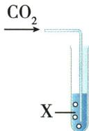
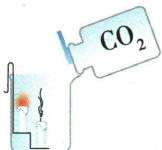
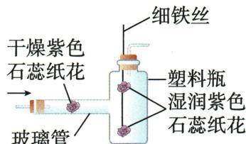
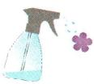
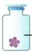
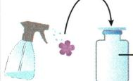
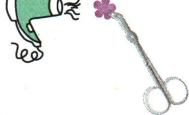

## 错法

湿花红便说$CO_{2}$自身是酸，忽略干花对照；或说所有燃烧都被$CO_{2}$灭。

## 正解

水与$CO_{2}$形成碳酸才显酸性。一般不支持常见可燃物燃烧有条件，镁可$2Mg+CO_2\xlongequal{\text{点燃}}2MgO+C$；不能拿$CO_{2}$灭镁火作为通用方法。

## 例题

### 二氧化碳性质表

> 来源ID Q06-06；第六单元碳和碳的氧化物；51-100/full.md 第1918–1920行。原答案与解析定位：51-100/full.md 第1956–1958行。

例1 (2024 广东中考节选) 性质实验

| 操作 | 现象 | 性质 |
| --- | --- | --- |
|  | X为澄清石灰水时,现象为____ | $CO_{2}$ 能与石灰水反应 |
|  | X为____时,现象为____ | $CO_{2}$ 能与水反应生成酸性物质 |
| ____ | 低处的蜡烛先熄灭,高处的蜡烛后熄灭 | ____;  $CO_{2}$ 不燃烧,也不支持燃烧 |

**原资料答案与解析：**

例1 解析 澄清石灰水与二氧化碳反应会生成碳酸钙沉淀和水,澄清石灰水变浑浊。二氧化碳与水反应生成碳酸,碳酸呈酸性,可以用紫色石蕊溶液检验,碳酸能使紫色石蕊溶液变红。低处的蜡烛先熄灭,高处的蜡烛后熄灭,说明了二氧化碳密度比空气大;二氧化碳不燃烧、不支持燃烧。

答案 澄清石灰水变浑浊 紫色石蕊溶液 紫色石蕊溶液变红 $CO_{2}$ 密度比空气大

**展开解析（依据原详解补足理由与步骤）：**

X石灰水：生成$CaCO_{3}$白色沉淀所以浑浊。X紫石蕊溶液：$CO_{2}$与水生成碳酸，溶液变红，不能说$CO_{2}$本身把干纸染红。下烛先灭说明气体在下方先积聚，结合上烛后灭说明密度比空气大；两烛熄灭表明本实验中不燃且不支持蜡烛燃烧。不能推广为连镁等物质也不能在$CO_{2}$中燃烧。

### 制取净化纸花综合

> 来源ID Q06-12；第六单元碳和碳的氧化物；51-100/full.md 第2151–2180行。原答案与解析定位：51-100/full.md 第2108–2111行。

例3 (2024 江苏苏州中考)实验室用下图所示装置制取 $\mathrm{CO}_{2}$ 气体, 并进行相关性质研究。

  
A

  
B

  
C

已知: $CO_{2}$ 与饱和 $NaHCO_{3}$ 溶液不发生反应。

(1)仪器 a 的名称是\_\_\_\_。

(2) 连接装置 A、B, 向锥形瓶内逐滴加入稀盐酸。

①锥形瓶内发生反应的化学方程式为\_\_\_\_。  
②若装置 B 内盛放饱和 $NaHCO_{3}$ 溶液, 其作用是 \_\_\_\_。  
(3)若装置 B 用来干燥 $CO$ $_{2}$ ,装置 B 中应盛放的试剂是\_\_\_\_。

(3)将纯净干燥的 $\mathrm{CO}_{2}$ 缓慢通入装置 C, 观察到现象:

a.玻璃管内的干燥纸花始终未变色；  
b.塑料瓶内的下方纸花先变红色,上方纸花后变红色。

①根据上述现象,得出关于 $CO_{2}$ 性质的结论是 \_\_\_\_、\_\_\_\_。  
②将变红的石蕊纸花取出,加热一段时间,纸花重新变成紫色,原因是\_\_\_\_(用化学方程式表示)。

(4) 将 $\mathrm{CO}_{2}$ 通入澄清石灰水, 生成白色沉淀, 该过程参加反应的离子有 \_\_\_\_ (填离子符号)。

**原资料答案与解析：**

例3 解析（2）② $NaHCO_{3}$ 与 $CO_{2}$ 不反应，与 $HCl$ 反应生成氯化钠、水和二氧化碳，饱和 $NaHCO_{3}$ 溶液能除去 $CO_{2}$ 中混有的 $HCl$。③ 浓硫酸具有吸水性，与二氧化碳不反应，可干燥二氧化碳。(3)② 加热变红的石蕊纸花，纸花重新变成紫色，说明碳酸受热分解。(4)二氧化碳与氢氧化钙反应的化学方程式为 $\mathrm{CO}_{2} + \mathrm{Ca(OH)}_{2} = \mathrm{CaCO}_{3} \downarrow + \mathrm{H}_{2}\mathrm{O}$ 。根据化学方程式可知，该过程参加反应的离子有钙离子和氢氧根离子。

答案（1）分液漏斗 （2）① $CaCO_{3}$ + 2$HCl$=CaCl $_{2}$ +$CO$ $_{2}$ ↑+H $_{2}$ O ②除去 $CO$ $_{2}$ 中混有的 $HCl$ ③浓硫酸 （3）①$CO$ $_{2}$ 与水反应生成酸性物质 $CO$ $_{2}$ 密度比空气大 ②H $_{2}$ $CO$ $_{3}$ =△
$CO$ $_{2}$ ↑+H $_{2}$ O （4）Ca $^{2+}$ 、OH $^{-}$

**展开解析（依据原详解补足理由与步骤）：**

(1)a为分液漏斗，可控制滴液。(2)①$CaCO_3+2HCl=CaCl_2+CO_2\uparrow+H_2O$；Ca、C各1，Cl2，H2，两侧O3，式平衡。②B饱和$NaHCO_{3}$去挥发$HCl$，$NaHCO_3+HCl=NaCl+H_2O+CO_2\uparrow$，不损本题$CO_{2}$。③浓硫酸吸水且本题不与$CO_{2}$反应，适合干燥；气体从长管入使其接触液体。原题此小项被OCR另标(3)，含义按原答案③说明。(3)①干花不变、湿花变红证明水参与形成酸性物质；下湿花先红说明$CO_{2}$密度比空气大。②$H_2CO_3\xlongequal{\triangle}CO_2\uparrow+H_2O$，酸性物质分解，纸花恢复紫色。(4)溶液里参与反应的离子$Ca^{2+}$、$OH^{-}$；$CO_{2}$作为气体也参与，只是题问的是离子。不要写本来尚未生成的$CO_3^{2-}$作加入前离子。

### 原干湿石蕊对照案例

> 来源ID Q06-15；第六单元碳和碳的氧化物；51-100/full.md 第1731–1733行。原答案与解析定位：51-100/full.md 第1731–1733行。

取三朵用石蕊溶液染成紫色的干燥的纸花,进行实验。

| 图示 |  | 二氧化碳 | 二氧化碳 |  |
| --- | --- | --- | --- | --- |
| 实验操作 | 向第一朵纸花喷水 | 将第二朵纸花放入盛满二氧化碳的集气瓶中 | 将第三朵纸花喷水后,再放入盛满二氧化碳的集气瓶中 | 吹干第三朵纸花 |
| 实验现象 | 纸花不变色 | 纸花不变色 | 纸花由紫变红 | 纸花由红变紫 |
| 分析 | 水不能使石蕊溶液变红 | 二氧化碳不能使石蕊变红 | 二氧化碳与水发生化学反应生成碳酸( $H_2CO_3$ ),碳酸能使石蕊溶液变红 | 碳酸不稳定,受热后易分解 |
| 实验结论 | 二氧化碳与水发生了化学反应 | 二氧化碳与水发生了化学反应 | 二氧化碳与水发生了化学反应 | 二氧化碳与水发生了化学反应 |
| 实验原理 | 1二氧化碳与水反应生成碳酸( $CO_2 + H_2O = H_2CO_3$ ),碳酸能使紫色石蕊溶液变红;2碳酸很不稳定,容易分解成水和二氧化碳( $H_2CO_3 = H_2O + CO_2 \uparrow$ ) | 1二氧化碳与水反应生成碳酸( $CO_2 + H_2O = H_2CO_3$ ),碳酸能使紫色石蕊溶液变红;2碳酸很不稳定,容易分解成水和二氧化碳( $H_2CO_3 = H_2O + CO_2 \uparrow$ ) | 1二氧化碳与水反应生成碳酸( $CO_2 + H_2O = H_2CO_3$ ),碳酸能使紫色石蕊溶液变红;2碳酸很不稳定,容易分解成水和二氧化碳( $H_2CO_3 = H_2O + CO_2 \uparrow$ ) | 1二氧化碳与水反应生成碳酸( $CO_2 + H_2O = H_2CO_3$ ),碳酸能使紫色石蕊溶液变红;2碳酸很不稳定,容易分解成水和二氧化碳( $H_2CO_3 = H_2O + CO_2 \uparrow$ ) |

**原资料答案与解析：**

取三朵用石蕊溶液染成紫色的干燥的纸花,进行实验。

| 图示 |  | 二氧化碳 | 二氧化碳 |  |
| --- | --- | --- | --- | --- |
| 实验操作 | 向第一朵纸花喷水 | 将第二朵纸花放入盛满二氧化碳的集气瓶中 | 将第三朵纸花喷水后,再放入盛满二氧化碳的集气瓶中 | 吹干第三朵纸花 |
| 实验现象 | 纸花不变色 | 纸花不变色 | 纸花由紫变红 | 纸花由红变紫 |
| 分析 | 水不能使石蕊溶液变红 | 二氧化碳不能使石蕊变红 | 二氧化碳与水发生化学反应生成碳酸( $H_2CO_3$ ),碳酸能使石蕊溶液变红 | 碳酸不稳定,受热后易分解 |
| 实验结论 | 二氧化碳与水发生了化学反应 | 二氧化碳与水发生了化学反应 | 二氧化碳与水发生了化学反应 | 二氧化碳与水发生了化学反应 |
| 实验原理 | 1二氧化碳与水反应生成碳酸( $CO_2 + H_2O = H_2CO_3$ ),碳酸能使紫色石蕊溶液变红;2碳酸很不稳定,容易分解成水和二氧化碳( $H_2CO_3 = H_2O + CO_2 \uparrow$ ) | 1二氧化碳与水反应生成碳酸( $CO_2 + H_2O = H_2CO_3$ ),碳酸能使紫色石蕊溶液变红;2碳酸很不稳定,容易分解成水和二氧化碳( $H_2CO_3 = H_2O + CO_2 \uparrow$ ) | 1二氧化碳与水反应生成碳酸( $CO_2 + H_2O = H_2CO_3$ ),碳酸能使紫色石蕊溶液变红;2碳酸很不稳定,容易分解成水和二氧化碳( $H_2CO_3 = H_2O + CO_2 \uparrow$ ) | 1二氧化碳与水反应生成碳酸( $CO_2 + H_2O = H_2CO_3$ ),碳酸能使紫色石蕊溶液变红;2碳酸很不稳定,容易分解成水和二氧化碳( $H_2CO_3 = H_2O + CO_2 \uparrow$ ) |

**展开解析（依据原详解补足理由与步骤）：**

这是原对照实验。水令纸花紫，说明水单独不使红；干$CO_{2}$加干花不红，说明$CO_{2}$单独不足；湿花在$CO_{2}$中红，结合干湿对照支持$CO_2+H_2O=H_2CO_3$。加热红花恢复紫，支持碳酸不稳定。把水与$CO_{2}$一起改变再只据一个现象推“$CO_{2}$有酸性”不严谨。
