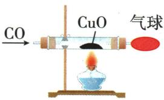

## 讲解

### 是什么

$CO$无色无臭、难溶于水，通常密度略小于空气。有可燃性$2CO+O_2\xlongequal{\text{点燃}}2CO_2$，可还原某些金属氧化物。

### 怎么来的

$CO$与$CuO$反应夺氧成$CO_{2}$，铜被还原。$CO$进入人体会妨碍血液正常供氧，具有毒性；无气味不能靠闻判断不存在。

### 什么时候能用

只在原资料指定加热及相应氧化物条件用还原式；$CO$实验须由有条件的学校实验室规范组织，防泄漏、处理尾气。难溶不等于水可有效吸收尾气。

## 例题

### 已知CO与CO2鉴别

> 来源ID Q06-04；第六单元碳和碳的氧化物；51-100/full.md 第1883–1891行。原答案与解析定位：51-100/full.md 第1893–1895行。

例1 两个软塑料瓶中分别充满 $CO$ 和 $CO_{2}$ 两种无色气体,下列试剂不能将二者鉴别出来的是 ( )

A.澄清石灰水

B. 水

C. 紫色石蕊溶液

D.石灰石

**原资料答案与解析：**

解析 A(√)$CO_{2}$ 能使澄清石灰水变浑浊; B(√) 向两个软塑料瓶中加适量水, 变瘪的塑料瓶中的是 $CO_{2}$; C(√)$CO_{2}$ 能使紫色石蕊溶液变红; D(×) 石灰石与 $CO$、$CO_{2}$ 均不反应。

答案 D

**展开解析（依据原详解补足理由与步骤）：**

选不能鉴别的D。A二氧化碳与石灰水生成碳酸钙沉淀，$CO$不反应，可区分。B二氧化碳溶于水且部分反应，软瓶明显变瘪；$CO$难溶，现象差异可用。C只有$CO_{2}$与水形成酸性溶液使紫石蕊变红。D题设常温直接接触石灰石没有区分现象。若额外加入水并改变条件，$CO_{2}$可参与碳酸氢钙形成，已不是原题直接用石灰石的条件。此处候选已限定两气体，石蕊可鉴别；未知气体使石蕊红却不能独证$CO_{2}$。

### 一氧化碳还原与收集尾气

> 来源ID Q06-07；第六单元碳和碳的氧化物；51-100/full.md 第1924–1928行。原答案与解析定位：51-100/full.md 第1960–1962行。

例2 (2024 山东菏泽中考节选)根据要求回答问题。

用 $CO$ 还原 $CuO$ 时, 在右图装置中通入 $CO$, 一段时间后加热, 可观察到硬质玻璃管中发生的现象为 \_\_\_\_。该实验中对尾气进行处理的目的是 \_\_\_\_。

**原资料答案与解析：**

例2 解析 一氧化碳和氧化铜加热生成铜和二氧化碳, 可观察到硬质玻璃管中黑色固体逐渐变红; 一氧化碳有毒, 直接排放会污染空气, 该实验中对尾气进行处理的目的是防止污染空气。

答案 黑色固体变为红色 防止一氧化碳污染空气

**展开解析（依据原详解补足理由与步骤）：**

黑色$CuO$逐渐变红，$CO+CuO\xlongequal{\triangle}Cu+CO_2$；$CO$夺走氧化铜的氧，铜生成。图中尾气由气球收集，含未反应$CO$，防直接释放污染空气和造成中毒。不要把本题气球图说成已点燃尾气；原书另一方法才用点燃。先通气排空气再热，结束先停热并继续通气冷却，防铜再次接触空气氧化；这些顺序是对原知识表的补充联系。

## 易错

把实验条件、主要气体与杂质、化学变化与物理利用分清。
