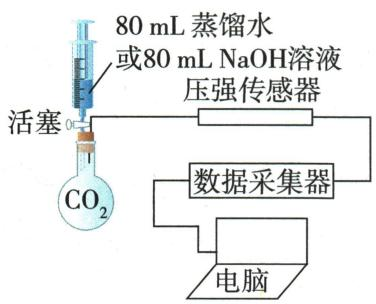

## 讲解

### 是什么

$CO_2+H_2O=H_2CO_3$形成酸性物质；碳酸不稳定。$CO_2+Ca(OH)_2=CaCO_3\downarrow+H_2O$，$CO_2+2NaOH=Na_2CO_3+H_2O$。

### 怎么来的

湿花变红而干花不变说明水参与。石灰水中的$Ca^{2+}$可形成难溶碳酸钙，所以给可见沉淀；氢氧化钠溶液吸收$CO_{2}$通常无类似浑浊，不能因无浑浊说不反应。

### 什么时候能用

上述方程式是适量$CO_{2}$条件；持续过量$CO_{2}$可令石灰水先浑浊后澄清。未知酸性气体也可能令石蕊红或石灰水浑浊，须候选范围支持；不直接将$CO_{2}$叫酸。

## 例题

### 已知CO与CO2鉴别

> 来源ID Q06-04；第六单元碳和碳的氧化物；51-100/full.md 第1883–1891行。原答案与解析定位：51-100/full.md 第1893–1895行。

例1 两个软塑料瓶中分别充满 $CO$ 和 $CO_{2}$ 两种无色气体,下列试剂不能将二者鉴别出来的是 ( )

A.澄清石灰水

B. 水

C. 紫色石蕊溶液

D.石灰石

**原资料答案与解析：**

解析 A(√)$CO_{2}$ 能使澄清石灰水变浑浊; B(√) 向两个软塑料瓶中加适量水, 变瘪的塑料瓶中的是 $CO_{2}$; C(√)$CO_{2}$ 能使紫色石蕊溶液变红; D(×) 石灰石与 $CO$、$CO_{2}$ 均不反应。

答案 D

**展开解析（依据原详解补足理由与步骤）：**

选不能鉴别的D。A二氧化碳与石灰水生成碳酸钙沉淀，$CO$不反应，可区分。B二氧化碳溶于水且部分反应，软瓶明显变瘪；$CO$难溶，现象差异可用。C只有$CO_{2}$与水形成酸性溶液使紫石蕊变红。D题设常温直接接触石灰石没有区分现象。若额外加入水并改变条件，$CO_{2}$可参与碳酸氢钙形成，已不是原题直接用石灰石的条件。此处候选已限定两气体，石蕊可鉴别；未知气体使石蕊红却不能独证$CO_{2}$。

### 检验鉴别除杂的目的

> 来源ID Q06-05；第六单元碳和碳的氧化物；51-100/full.md 第1904–1910行。原答案与解析定位：51-100/full.md 第1912–1914行。

例2 下列依据实验目的所设计的实验操作中,正确的是

( )

| 选项 | 实验目的 | 实验操作 |
| --- | --- | --- |
| A | 检验 $CO_{2}$ | 将气体通入紫色石蕊溶液中 |
| B | 鉴别 $CO_{2}$ 和$CO$ | 观察气体的颜色 |
| C | 除去$CO$中的 $CO_{2}$ | 将混合气体通入足量的氢氧化钠溶液中 |
| D | 除去 $CO_{2}$ 中的$CO$ | 向混合气体中通入过量的氧气,点燃 |

**原资料答案与解析：**

解析 A(×)使紫色石蕊溶液变红的气体可能是 $SO_{2}$ ，检验二氧化碳应使用澄清石灰水；B(×)一氧化碳和二氧化碳均为无色气体，用观察气体的颜色的方法不能鉴别二者；C(√)氢氧化钠只与二氧化碳反应，不与一氧化碳反应，能除去杂质且没有引入新的杂质，符合除杂原则；D(×)二氧化碳大量存在时，一氧化碳不能被点燃。

答案 C

**展开解析（依据原详解补足理由与步骤）：**

选C。A其他酸性气体也使紫石蕊红，证据不唯一。B两气体都无色，无法辨。C足量$NaOH$吸收$CO_{2}$：$CO_2+2NaOH=Na_2CO_3+H_2O$，$CO$在本题条件不反应，主要气体保留。D大量$CO_{2}$中少量$CO$不易点燃，过量$O_{2}$还会引入新杂质，方法不合要求。若产物还要求干燥，经过水溶液后另须适当干燥；原题仅评价去$CO_{2}$，不将湿气遗漏写成这题另一答案。

### 二氧化碳性质表

> 来源ID Q06-06；第六单元碳和碳的氧化物；51-100/full.md 第1918–1920行。原答案与解析定位：51-100/full.md 第1956–1958行。

例1 (2024 广东中考节选) 性质实验

| 操作 | 现象 | 性质 |
| --- | --- | --- |
|  | X为澄清石灰水时,现象为____ | $CO_{2}$ 能与石灰水反应 |
|  | X为____时,现象为____ | $CO_{2}$ 能与水反应生成酸性物质 |
| ____ | 低处的蜡烛先熄灭,高处的蜡烛后熄灭 | ____;  $CO_{2}$ 不燃烧,也不支持燃烧 |

**原资料答案与解析：**

例1 解析 澄清石灰水与二氧化碳反应会生成碳酸钙沉淀和水,澄清石灰水变浑浊。二氧化碳与水反应生成碳酸,碳酸呈酸性,可以用紫色石蕊溶液检验,碳酸能使紫色石蕊溶液变红。低处的蜡烛先熄灭,高处的蜡烛后熄灭,说明了二氧化碳密度比空气大;二氧化碳不燃烧、不支持燃烧。

答案 澄清石灰水变浑浊 紫色石蕊溶液 紫色石蕊溶液变红 $CO_{2}$ 密度比空气大

**展开解析（依据原详解补足理由与步骤）：**

X石灰水：生成$CaCO_{3}$白色沉淀所以浑浊。X紫石蕊溶液：$CO_{2}$与水生成碳酸，溶液变红，不能说$CO_{2}$本身把干纸染红。下烛先灭说明气体在下方先积聚，结合上烛后灭说明密度比空气大；两烛熄灭表明本实验中不燃且不支持蜡烛燃烧。不能推广为连镁等物质也不能在$CO_{2}$中燃烧。

### 制取净化纸花综合

> 来源ID Q06-12；第六单元碳和碳的氧化物；51-100/full.md 第2151–2180行。原答案与解析定位：51-100/full.md 第2108–2111行。

例3 (2024 江苏苏州中考)实验室用下图所示装置制取 $\mathrm{CO}_{2}$ 气体, 并进行相关性质研究。

  
A

  
B

  
C

已知: $CO_{2}$ 与饱和 $NaHCO_{3}$ 溶液不发生反应。

(1)仪器 a 的名称是\_\_\_\_。

(2) 连接装置 A、B, 向锥形瓶内逐滴加入稀盐酸。

①锥形瓶内发生反应的化学方程式为\_\_\_\_。  
②若装置 B 内盛放饱和 $NaHCO_{3}$ 溶液, 其作用是 \_\_\_\_。  
(3)若装置 B 用来干燥 $CO$ $_{2}$ ,装置 B 中应盛放的试剂是\_\_\_\_。

(3)将纯净干燥的 $\mathrm{CO}_{2}$ 缓慢通入装置 C, 观察到现象:

a.玻璃管内的干燥纸花始终未变色；  
b.塑料瓶内的下方纸花先变红色,上方纸花后变红色。

①根据上述现象,得出关于 $CO_{2}$ 性质的结论是 \_\_\_\_、\_\_\_\_。  
②将变红的石蕊纸花取出,加热一段时间,纸花重新变成紫色,原因是\_\_\_\_(用化学方程式表示)。

(4) 将 $\mathrm{CO}_{2}$ 通入澄清石灰水, 生成白色沉淀, 该过程参加反应的离子有 \_\_\_\_ (填离子符号)。

**原资料答案与解析：**

例3 解析（2）② $NaHCO_{3}$ 与 $CO_{2}$ 不反应，与 $HCl$ 反应生成氯化钠、水和二氧化碳，饱和 $NaHCO_{3}$ 溶液能除去 $CO_{2}$ 中混有的 $HCl$。③ 浓硫酸具有吸水性，与二氧化碳不反应，可干燥二氧化碳。(3)② 加热变红的石蕊纸花，纸花重新变成紫色，说明碳酸受热分解。(4)二氧化碳与氢氧化钙反应的化学方程式为 $\mathrm{CO}_{2} + \mathrm{Ca(OH)}_{2} = \mathrm{CaCO}_{3} \downarrow + \mathrm{H}_{2}\mathrm{O}$ 。根据化学方程式可知，该过程参加反应的离子有钙离子和氢氧根离子。

答案（1）分液漏斗 （2）① $CaCO_{3}$ + 2$HCl$=CaCl $_{2}$ +$CO$ $_{2}$ ↑+H $_{2}$ O ②除去 $CO$ $_{2}$ 中混有的 $HCl$ ③浓硫酸 （3）①$CO$ $_{2}$ 与水反应生成酸性物质 $CO$ $_{2}$ 密度比空气大 ②H $_{2}$ $CO$ $_{3}$ =△
$CO$ $_{2}$ ↑+H $_{2}$ O （4）Ca $^{2+}$ 、OH $^{-}$

**展开解析（依据原详解补足理由与步骤）：**

(1)a为分液漏斗，可控制滴液。(2)①$CaCO_3+2HCl=CaCl_2+CO_2\uparrow+H_2O$；Ca、C各1，Cl2，H2，两侧O3，式平衡。②B饱和$NaHCO_{3}$去挥发$HCl$，$NaHCO_3+HCl=NaCl+H_2O+CO_2\uparrow$，不损本题$CO_{2}$。③浓硫酸吸水且本题不与$CO_{2}$反应，适合干燥；气体从长管入使其接触液体。原题此小项被OCR另标(3)，含义按原答案③说明。(3)①干花不变、湿花变红证明水参与形成酸性物质；下湿花先红说明$CO_{2}$密度比空气大。②$H_2CO_3\xlongequal{\triangle}CO_2\uparrow+H_2O$，酸性物质分解，纸花恢复紫色。(4)溶液里参与反应的离子$Ca^{2+}$、$OH^{-}$；$CO_{2}$作为气体也参与，只是题问的是离子。不要写本来尚未生成的$CO_3^{2-}$作加入前离子。

### 原干湿石蕊对照案例

> 来源ID Q06-15；第六单元碳和碳的氧化物；51-100/full.md 第1731–1733行。原答案与解析定位：51-100/full.md 第1731–1733行。

取三朵用石蕊溶液染成紫色的干燥的纸花,进行实验。

| 图示 |  | 二氧化碳 | 二氧化碳 |  |
| --- | --- | --- | --- | --- |
| 实验操作 | 向第一朵纸花喷水 | 将第二朵纸花放入盛满二氧化碳的集气瓶中 | 将第三朵纸花喷水后,再放入盛满二氧化碳的集气瓶中 | 吹干第三朵纸花 |
| 实验现象 | 纸花不变色 | 纸花不变色 | 纸花由紫变红 | 纸花由红变紫 |
| 分析 | 水不能使石蕊溶液变红 | 二氧化碳不能使石蕊变红 | 二氧化碳与水发生化学反应生成碳酸( $H_2CO_3$ ),碳酸能使石蕊溶液变红 | 碳酸不稳定,受热后易分解 |
| 实验结论 | 二氧化碳与水发生了化学反应 | 二氧化碳与水发生了化学反应 | 二氧化碳与水发生了化学反应 | 二氧化碳与水发生了化学反应 |
| 实验原理 | 1二氧化碳与水反应生成碳酸( $CO_2 + H_2O = H_2CO_3$ ),碳酸能使紫色石蕊溶液变红;2碳酸很不稳定,容易分解成水和二氧化碳( $H_2CO_3 = H_2O + CO_2 \uparrow$ ) | 1二氧化碳与水反应生成碳酸( $CO_2 + H_2O = H_2CO_3$ ),碳酸能使紫色石蕊溶液变红;2碳酸很不稳定,容易分解成水和二氧化碳( $H_2CO_3 = H_2O + CO_2 \uparrow$ ) | 1二氧化碳与水反应生成碳酸( $CO_2 + H_2O = H_2CO_3$ ),碳酸能使紫色石蕊溶液变红;2碳酸很不稳定,容易分解成水和二氧化碳( $H_2CO_3 = H_2O + CO_2 \uparrow$ ) | 1二氧化碳与水反应生成碳酸( $CO_2 + H_2O = H_2CO_3$ ),碳酸能使紫色石蕊溶液变红;2碳酸很不稳定,容易分解成水和二氧化碳( $H_2CO_3 = H_2O + CO_2 \uparrow$ ) |

**原资料答案与解析：**

取三朵用石蕊溶液染成紫色的干燥的纸花,进行实验。

| 图示 |  | 二氧化碳 | 二氧化碳 |  |
| --- | --- | --- | --- | --- |
| 实验操作 | 向第一朵纸花喷水 | 将第二朵纸花放入盛满二氧化碳的集气瓶中 | 将第三朵纸花喷水后,再放入盛满二氧化碳的集气瓶中 | 吹干第三朵纸花 |
| 实验现象 | 纸花不变色 | 纸花不变色 | 纸花由紫变红 | 纸花由红变紫 |
| 分析 | 水不能使石蕊溶液变红 | 二氧化碳不能使石蕊变红 | 二氧化碳与水发生化学反应生成碳酸( $H_2CO_3$ ),碳酸能使石蕊溶液变红 | 碳酸不稳定,受热后易分解 |
| 实验结论 | 二氧化碳与水发生了化学反应 | 二氧化碳与水发生了化学反应 | 二氧化碳与水发生了化学反应 | 二氧化碳与水发生了化学反应 |
| 实验原理 | 1二氧化碳与水反应生成碳酸( $CO_2 + H_2O = H_2CO_3$ ),碳酸能使紫色石蕊溶液变红;2碳酸很不稳定,容易分解成水和二氧化碳( $H_2CO_3 = H_2O + CO_2 \uparrow$ ) | 1二氧化碳与水反应生成碳酸( $CO_2 + H_2O = H_2CO_3$ ),碳酸能使紫色石蕊溶液变红;2碳酸很不稳定,容易分解成水和二氧化碳( $H_2CO_3 = H_2O + CO_2 \uparrow$ ) | 1二氧化碳与水反应生成碳酸( $CO_2 + H_2O = H_2CO_3$ ),碳酸能使紫色石蕊溶液变红;2碳酸很不稳定,容易分解成水和二氧化碳( $H_2CO_3 = H_2O + CO_2 \uparrow$ ) | 1二氧化碳与水反应生成碳酸( $CO_2 + H_2O = H_2CO_3$ ),碳酸能使紫色石蕊溶液变红;2碳酸很不稳定,容易分解成水和二氧化碳( $H_2CO_3 = H_2O + CO_2 \uparrow$ ) |

**展开解析（依据原详解补足理由与步骤）：**

这是原对照实验。水令纸花紫，说明水单独不使红；干$CO_{2}$加干花不红，说明$CO_{2}$单独不足；湿花在$CO_{2}$中红，结合干湿对照支持$CO_2+H_2O=H_2CO_3$。加热红花恢复紫，支持碳酸不稳定。把水与$CO_{2}$一起改变再只据一个现象推“$CO_{2}$有酸性”不严谨。

### 二氧化碳碱反应三路证据

> 来源ID Q10-03；第十单元常见的酸碱盐；101-150/full.md 第2611–2634行。原答案与解析定位：101-150/full.md 第2636–2642行。

例1 (2024 山东临沂中考)同学们在整理归纳碱的化学性质时,发现氢氧化钠和二氧化碳反应无明显现象,于是进行了如下实验探究。

【提出问题】如何证明氢氧化钠和二氧化碳发生了反应？

【进行实验】探究实验 I: 分别向两个充满二氧化碳的软塑料瓶中加入 20 mL 氢氧化钠溶液和蒸馏水, 振荡, 使其充分反应, 现象如图 1、图 2, 证明氢氧化钠与二氧化碳发生了化学反应。设计图 2 实验的目的是 \_\_\_\_。

  
图1 图2

探究实验Ⅱ:取图1实验反应后的少量溶液于试管中,加入\_\_\_\_,现象为\_\_\_\_,再次证明二者发生了反应。

探究实验Ⅲ: [查阅资料]20 ℃时, $\mathrm{{NaOH}}\text{、}{\mathrm{{Na}}}_{2}{\mathrm{{CO}}}_{3}$ 在水和乙醇中的溶解性如表所示:

| 溶质/溶剂 | 水 | 乙醇 |
| --- | --- | --- |
| $NaOH$ | 溶 | 溶 |
| $Na_{2}CO_{3}$ | 溶 | 不 |

[设计方案]20 ℃时,兴趣小组进行了如下实验:

实验现象:装置 A 中出现白色沉淀,装置 B 中无明显现象。装置 A 中出现白色沉淀的原因是\_\_\_\_。

【反思评价】(1)写出氢氧化钠和二氧化碳反应的化学方程式：\_\_\_\_。

(2)对于无明显现象的化学反应,一般可以从反应物的减少或新物质的生成等角度进行分析。

**原资料答案与解析：**

解析【进行实验】探究实验Ⅰ:二氧化碳和氢氧化钠反应,塑料瓶内气体减少,压强减小,塑料瓶变瘪。二氧化碳溶于水,塑料瓶也会变瘪,为了排除二氧化碳溶于水使塑料瓶变瘪,设计图2作对比实验,通过图1的塑料瓶比图2变瘪程度大,证明二氧化碳和氢氧化钠发生了反应。探究实验Ⅱ:二氧化碳和氢氧化钠反应生成碳酸钠和水,可验证碳酸钠的生成,证明反应的发生。取图1实验反应后的少量溶液于试管中,加入过量的稀盐酸,碳酸钠和盐酸反应生成氯化钠、水、二氧化碳,若能观察到有气泡产生,再次证明二者发生了反应。探究实验Ⅲ:装置A中,二氧化碳和氢氧化钠反应生成碳酸钠和水,碳酸钠不溶于乙醇,故出现白色沉淀。

答案【进行实验】探究实验Ⅰ:作对比实验 探究实验Ⅱ:过量的稀盐酸 有气泡产生

探究实验Ⅲ:生成的碳酸钠不溶于乙醇

【反思评价】(1) $CO_{2}+2NaOH=Na_{2}CO_{3}+H_{2}O$

**展开解析（依据原详解补足理由与步骤）：**

实验Ⅰ水瓶作空白，排除仅溶于水就使瓶瘪的解释；同温同瓶同$CO_{2}$同20mL，碱瓶更瘪支持额外消耗。Ⅱ加入过量稀盐酸，有气泡：$Na_2CO_3+2HCl=2NaCl+CO_2\uparrow+H_2O$，过量保证先耗余$NaOH$后还能与碳酸盐反应。实际还应排除起始$NaOH$已有碳酸盐。Ⅲ按题给20℃溶解表，新$Na_{2}CO_{3}$不溶乙醇，A出白色沉淀；B无明显现象说明通入后未检出足以浑浊的$CO_{2}$，不能把“无明显”说成任何气体都没有。反应$CO_2+2NaOH=Na_2CO_3+H_2O$。反应物减少与产物形成是两条互相支持的证据。

### 二氧化碳压强数字实验

> 来源ID Q10-10；第十单元常见的酸碱盐；101-150/full.md 第2810–2821行。原答案与解析定位：101-150/full.md 第2827–2829行。

例4 (2024 山东菏泽中考)某兴趣小组利用图 1 装置, 对“$CO_{2}$ 和 $NaOH$ 溶液是否反应”进行数字化实验再探究。实验 1: 在盛满 $CO_{2}$ 的烧瓶中滴加 80 mL 蒸馏水; 实验 2: 在同样的烧瓶中滴加 80 mL $NaOH$ 溶液。实验得到如图 2 所示曲线。下列说法不正确的是 ( )

  
图1

  
图 2

A.由实验1得到的图像是A曲线  
B.A 曲线中 ab 段上升是因为加液体使烧瓶内 $CO_{2}$ 分子数增多  
C.该实验能证明 $\mathrm{CO}_{2}$ 与 $\mathrm{NaOH}$ 溶液发生了反应  
D. 通过此实验说明, 利用数字化实验可以实现对化学反应由定性到定量的研究

**原资料答案与解析：**

例4 解析 A(√)$CO_{2}$能溶于水,且能与$NaOH$溶液反应,这两种情况均会使容器内压强减小,而且反应消耗的$CO_{2}$越多,压强减小得越多,故图2中A曲线表示的是实验1;B(×)A曲线中ab段上升是因为注入水后将$CO_{2}$气体压缩导致压强增大,$CO_{2}$的分子数目并未增多;C(√)该实验通过对比注入相同体积的水和$NaOH$溶液后瓶内气体的压强改变不同,可以证明$CO_{2}$能与$NaOH$溶液反应;D(√)数字化实验能使无现象的实验变得可视化,且有明确的数据显示,实现由定性到定量的研究。

答案 B

**展开解析（依据原详解补足理由与步骤）：**

选不正确B。A水仅部分溶解吸收，终压比$NaOH$高，对；B加液压缩气相空间，使压强初升，未增加$CO_{2}$分子数，错；C同样80mL、同瓶及气体条件，碱终压明显更低支持额外反应消耗，对；D连续数值使定性现象可量化记录，对，但要用压强算具体反应物量还需体积、温度等条件，图本身不支持任意定量计算。

## 易错

把实验条件、主要气体与杂质、化学变化与物理利用分清。
