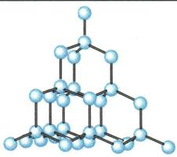
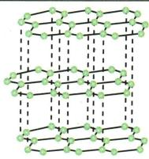
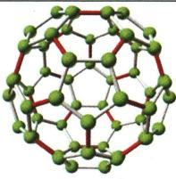

## 讲解

### 是什么

金刚石、石墨、C₆₀都只含碳元素，却是不同结构的单质，物理性质明显不同。

### 怎么来的

原子连接、排列形成不同结构；金刚石空间结构难破坏所以硬，石墨层间易滑所以滑腻。C₆₀有独立分子，构成层级与另两者不同。

### 什么时候能用

中学比较常见纯样品和通常条件。结构不同也能影响反应活性，不把“化学性质相似”说成完全相同；金刚石不导电的常规性质不包括特殊掺杂材料。

## 例题

### 碳单质不同性质

> 来源ID Q06-02；第六单元碳和碳的氧化物；51-100/full.md 第1649–1657行。原答案与解析定位：51-100/full.md 第1673–1675行。

例2 (2024 江苏盐城中考)金刚石、石墨和 $\mathrm{C}_{60}$ 都是由碳元素组成的单质, 它们的性质存在着明显差异。其原因是构成它们的原子 ( )

A. 种类不同

B.大小不同

C. 质量不同

D. 排列方式不同

**原资料答案与解析：**

例2 解析 原子排列方式不同会造成性质差异。

答案 D

**展开解析（依据原详解补足理由与步骤）：**

选D。都是碳元素，原子种类相同，所以A错；不靠把碳原子大小或质量改成不同来解释，B、C错。排列和结合方式不同产生不同结构，从而物理性质明显不同，D对。C₆₀由碳原子构成的分子组成，不能写成金刚石也是独立C₆₀分子。

### 原碳单质结构性质案例

> 来源ID Q06-13；第六单元碳和碳的氧化物；51-100/full.md 第1528–1534行。原答案与解析定位：51-100/full.md 第1528–1534行。

|  | 金刚石(C) | 石墨(C) | $C_{60}$ |
| --- | --- | --- | --- |
| 结构 | 由碳原子直接构成 | 由碳原子直接构成 | 由 $C_{60}$ 分子构成,每个 $C_{60}$ 分子由60个碳原子构成 |
| 结构 | 立体网状 | 层状 |  $C_{60}$ 的分子结构形似足球 |
| 外观 | 无色透明的固体 | 灰黑色、有金属光泽的固体 | 具有一些特殊的物理性质 |
| 硬度 | 天然存在的最硬的物质3 | 很软 | 具有一些特殊的物理性质 |
| 导电性 | 不导电 | 优良 | 具有一些特殊的物理性质 |
| 其他物理性质 | 在特殊条件下制备的金刚石薄膜,透光性好,导热性好 | 有滑腻感,熔点高 | 具有一些特殊的物理性质 |
| 用途与对应物理性质 | 制作钻石——无色透明;用作钻机钻头——硬度大;制备金刚石薄膜,用作透镜等光学仪器的涂层——透光性好,硬度大;用于集成电路基板散热——导热性好 | 用作铅笔芯——质软,有滑腻感;高铁列车的受电弓滑板——有滑腻感、导电性好、熔点高;电池电极——导电性好 | 应用于超导、催化、能源及医学等领域——特殊的物理性质 |

# 特别说明

1. 金刚石、石墨、 $C_{60}$ 都是由碳元素组成的单质,但它们的物理性质有明显差异,原因是碳原子排列方式不同。

2. 由同种元素组成的不同单质, 其物理性质不同, 但化学性质基本相同, 在一定条件下可以相互转化。如石墨在高温、高压条件下可以转化为金刚石, 此转化过程发生了化学变化。

**原资料答案与解析：**

|  | 金刚石(C) | 石墨(C) | $C_{60}$ |
| --- | --- | --- | --- |
| 结构 | 由碳原子直接构成 | 由碳原子直接构成 | 由 $C_{60}$ 分子构成,每个 $C_{60}$ 分子由60个碳原子构成 |
| 结构 | 立体网状 | 层状 |  $C_{60}$ 的分子结构形似足球 |
| 外观 | 无色透明的固体 | 灰黑色、有金属光泽的固体 | 具有一些特殊的物理性质 |
| 硬度 | 天然存在的最硬的物质3 | 很软 | 具有一些特殊的物理性质 |
| 导电性 | 不导电 | 优良 | 具有一些特殊的物理性质 |
| 其他物理性质 | 在特殊条件下制备的金刚石薄膜,透光性好,导热性好 | 有滑腻感,熔点高 | 具有一些特殊的物理性质 |
| 用途与对应物理性质 | 制作钻石——无色透明;用作钻机钻头——硬度大;制备金刚石薄膜,用作透镜等光学仪器的涂层——透光性好,硬度大;用于集成电路基板散热——导热性好 | 用作铅笔芯——质软,有滑腻感;高铁列车的受电弓滑板——有滑腻感、导电性好、熔点高;电池电极——导电性好 | 应用于超导、催化、能源及医学等领域——特殊的物理性质 |

# 特别说明

1. 金刚石、石墨、 $C_{60}$ 都是由碳元素组成的单质,但它们的物理性质有明显差异,原因是碳原子排列方式不同。

2. 由同种元素组成的不同单质, 其物理性质不同, 但化学性质基本相同, 在一定条件下可以相互转化。如石墨在高温、高压条件下可以转化为金刚石, 此转化过程发生了化学变化。

**展开解析（依据原详解补足理由与步骤）：**

这是原资料性质表，不是独立考题。金刚石原子构成牢固空间结构，硬度大适合切割；石墨层状结构，层间易相对滑动适合作润滑剂，并有导电性；C₆₀是一种分子型碳单质。相同元素不意味着同一物质。书中化学性质基本相似指它们以碳为主要反应成分的共性，不保证各种结构在任何温度都具有完全相同反应活性。

## 易错

把实验条件、主要气体与杂质、化学变化与物理利用分清。
