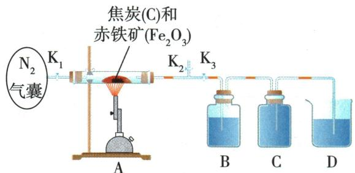

## 讲解

### 是什么

碳常温相对稳定，高温或点燃可反应。氧较充分主要$C+O_2\xlongequal{\text{点燃}}CO_2$，氧不足可$2C+O_2\xlongequal{\text{点燃}}2CO$。

### 怎么来的

温度升高使反应易进行；碳可夺某些氧化物的氧，$C+2CuO\xlongequal{\text{高温}}2Cu+CO_2\uparrow$，$CuO$被还原。高温下$C+CO_2\xlongequal{\text{高温}}2CO$，所以产物也受环境条件影响。

### 什么时候能用

“常温稳定”不等于永不反应；氧量和温度都影响实际产物，不能仅用碳质量唯一推$CO$/$CO_{2}$。中学式表示指定反应模型，不替代所有工业复杂过程。

## 例题

### 焦炭冶炼产物探究

> 来源ID Q06-03；第六单元碳和碳的氧化物；51-100/full.md 第1661–1671行。原答案与解析定位：51-100/full.md 第1677–1685行。

例3 (2023 四川泸州中考节选)工业上可用焦炭与赤铁矿冶炼铁。实验室用下图所示装置模拟冶炼铁并探究其产物。回答下列问题：

(1)酒精喷灯加热前,先打开活塞 $K_{1}$ 和 $K_{2}$ ,关闭 $K_{3}$ ,将气囊中 $N_{2}$ 鼓入。通 $N_{2}$ 的目的是\_\_\_\_。

(2)通适量 $N_{2}$ 后,关闭活塞 $K_{1}$ 和 $K_{2}$ ,打开 $K_{3}$ ,点燃酒精喷灯进行实验。B装置中盛放的试剂是\_\_\_\_（选填“稀硫酸”“澄清石灰水”或“氯化钙溶液”），用于检测气体产物之一\_\_\_\_（填分子式）。

(3)C装置的作用是\_\_\_\_。

(4)当 A 装置药品完全变黑后,停止实验。移走酒精喷灯停止加热前的操作是\_\_\_\_。

**原资料答案与解析：**

例3 解析 (1) 通 $\mathrm{N}_{2}$ 可排尽装置内的空气, 防止生成的铁被氧化。(2) 反应生成 $\mathrm{CO}_{2}, \mathrm{~B}$ 装置中盛放的是澄清石灰水, 用于检测 $\mathrm{CO}_{2}$ 。(3) 一氧化碳与氢氧化钙不反应, 不溶于水, 因此 C 装置的作用是收集一氧化碳气体。(4) 停止加热前, 关闭 $\mathrm{K}_{3}$ , 以防倒吸。

答案（1）排尽装置内的空气

(2)澄清石灰水 $CO_{2}$

(3)收集一氧化碳气体

(4) 关闭 $\mathrm{K}_{3}$

**展开解析（依据原详解补足理由与步骤）：**

(1)先在旁路K₁、K₂打开而K₃关闭时通氮，排出装置空气，防止生成铁再被氧化，也排除原有空气对产物证据干扰。(2)B选澄清石灰水检测$CO_{2}$；稀硫酸与氯化钙溶液在本题不给同样明确的二氧化碳沉淀证据。(3)B除去$CO_{2}$，剩余$CO$通过C把其中液体压到D，收集于C的上部，不是让$CO$被石灰水吸收。(4)按本图关闭K₃切断热管与后段液体联系，再停止加热，防倒吸。该阀门动作只针对本题气路，不能替代所有热管实验的统一结束方法。原解析说$CO$“不溶”应理解为难溶，不是严格零溶解。

### 原碳还原氧化铜操作案例

> 来源ID Q06-14；第六单元碳和碳的氧化物；51-100/full.md 第1605–1611行。原答案与解析定位：51-100/full.md 第1605–1611行。

# (1)木炭与氧化铜反应 实验 8

| 实验装置 | 使火焰集中并提高温度,也可使用酒精喷灯澄清石灰水 |
| --- | --- |
| 实验步骤 | 1查:检查装置气密性;2装:把刚烘干的木炭粉末和氧化铜粉末混合均匀,小心地铺放进试管;3定:将试管固定在铁架台上,将导管插入澄清石灰水中;4点:打开弹簧夹,点燃酒精灯,加热混合物;5撤、熄:撤出导管,熄灭酒精灯,用弹簧夹夹紧乳胶管;6倒:待试管冷却后再把试管里的粉末倒在纸上 |
| 实验现象 | 开始加热时,导管口有气泡逸出;一段时间后,黑色粉末逐渐变红,澄清石灰水变浑浊9 |
| 分析 | 开始加热时,试管中的空气因受热膨胀而逸出;加热一段时间后,木炭与氧化铜开始反应,生成的铜为红色固体,同时生成的二氧化碳为无色气体,能使澄清石灰水变浑浊 |
| 实验结论 | 高温下,木炭和氧化铜反应生成铜和二氧化碳 |
| 实验原理 | $2CuO + C \xlongequal{\text{高温}} 2Cu + CO_{2} \uparrow$ |
| 注意事项 | 1试管口应略向下倾斜,防止冷凝水倒流使试管炸裂;2弹簧夹夹紧乳胶管,待冷却后再把粉末倒在纸上,防止生成的铜在高温下被空气氧化而变黑;3先撤出导管后熄灭酒精灯,防止石灰水倒吸入试管使试管炸裂 |

# (2) 碳单质与氧化铁反应

在高温条件下,焦炭可以把铁从它的氧化物里还原出来。

**原资料答案与解析：**

# (1)木炭与氧化铜反应 实验 8

| 实验装置 | 使火焰集中并提高温度,也可使用酒精喷灯澄清石灰水 |
| --- | --- |
| 实验步骤 | 1查:检查装置气密性;2装:把刚烘干的木炭粉末和氧化铜粉末混合均匀,小心地铺放进试管;3定:将试管固定在铁架台上,将导管插入澄清石灰水中;4点:打开弹簧夹,点燃酒精灯,加热混合物;5撤、熄:撤出导管,熄灭酒精灯,用弹簧夹夹紧乳胶管;6倒:待试管冷却后再把试管里的粉末倒在纸上 |
| 实验现象 | 开始加热时,导管口有气泡逸出;一段时间后,黑色粉末逐渐变红,澄清石灰水变浑浊9 |
| 分析 | 开始加热时,试管中的空气因受热膨胀而逸出;加热一段时间后,木炭与氧化铜开始反应,生成的铜为红色固体,同时生成的二氧化碳为无色气体,能使澄清石灰水变浑浊 |
| 实验结论 | 高温下,木炭和氧化铜反应生成铜和二氧化碳 |
| 实验原理 | $2CuO + C \xlongequal{\text{高温}} 2Cu + CO_{2} \uparrow$ |
| 注意事项 | 1试管口应略向下倾斜,防止冷凝水倒流使试管炸裂;2弹簧夹夹紧乳胶管,待冷却后再把粉末倒在纸上,防止生成的铜在高温下被空气氧化而变黑;3先撤出导管后熄灭酒精灯,防止石灰水倒吸入试管使试管炸裂 |

# (2) 碳单质与氧化铁反应

在高温条件下,焦炭可以把铁从它的氧化物里还原出来。

**展开解析（依据原详解补足理由与步骤）：**

这是原实验步骤表。粉末须混匀，集中加热处由黑向红显示铜生成；气体使石灰水浑浊支持有$CO_{2}$。$C+2CuO\xlongequal{\text{高温}}2Cu+CO_2\uparrow$。停止时先撤石灰水中导管再停热，防冷却降压倒吸；冷却后再倒固体。若木炭过量，仍可有黑色残余，不能将“未全红”直接等同未反应。原文未提取出此表装置图，不按空格猜图，靠文字步骤与另一原题图说明。

## 易错

把实验条件、主要气体与杂质、化学变化与物理利用分清。
