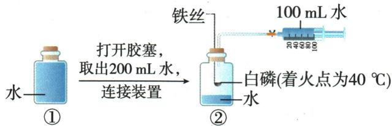
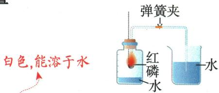

## 讲解

### 判据

出现密闭装置、耗氧物质和水面或活塞读数，想到用体积变化间接测氧。

### 流程

先标初始气体空间；再验证耗氧反应不会消耗其他主要气体或生成未吸收气体；等装置冷却，再读初末体积。活塞从100移到60是移动40，不是氧气60。最后算$40/200=1/5$，每个数对应不同物理量。

## 例题

### 注射器测氧气含量

> 来源ID Q02-01；第二单元空气和氧气；1-50/full.md 第1479–1486行。原答案与解析定位：1-50/full.md 第1557–1559行。

例1 (2024 北京中考)用如图装置进行实验,测定出空气中 $O_{2}$ 约占 $\frac{1}{5}$ (按体积计算)。下列叙述不正确的是 ()

A.②中瓶内空气的体积约为 200 mL  
B. 可加热铁丝引燃铜匙中的白磷  
C. 白磷的作用是消耗②中瓶内的 $\mathrm{O}_{2}$   
D.最终注射器活塞移至约 40 mL 刻度线处

**原资料答案与解析：**

例1 解析 A(√)②中瓶内空气的体积即为取出的水的体积；B(√)铁具有良好的导热性，可加热铁丝引燃铜匙中的白磷；C(√)白磷燃烧消耗瓶内的氧气，使容器内压强减小，待白磷熄灭并冷却至室温，打开弹簧夹，注射器活塞向左移动，移动的体积为消耗氧气的体积；D(×)氧气约占空气体积的1/5，消耗的氧气约为200 mL×1/5=40 mL，最终注射器活塞会移至约60 mL刻度线处。

答案 D

**展开解析（依据原详解补足理由与步骤）：**

本题选错误项D。A：原瓶装满水，取出200 mL水后同体积空气进入，故瓶内初始空气为200 mL。B：铁丝传热到白磷，使其达到图注40 ℃着火点，正确。C：白磷燃烧消耗瓶中氧气，冷却后瓶内压强降低，推动注射器活塞移动，正确。D：消耗体积为$200\times1/5=40\ \mathrm{mL}$，这是活塞移动量，不是终读数。图示起始读数为100 mL，因此终读数为$100-40=60\ \mathrm{mL}$。注射器内初始装的是水，不能把100 mL加到初始空气体积里。

### 原红磷测氧实验案例

> 来源ID Q02-16；第二单元空气和氧气；1-50/full.md 第1278–1286；1290–1294；1338–1355行。原答案与解析定位：1-50/full.md 第1280–1286行；1-50/full.md 第1342–1355行。

(2)实验原理:红磷+氧气 $\xrightarrow{\text{点燃}}$ 五氧化二磷。利用红磷燃烧消耗氧气,生成五氧化二磷固体,使集气瓶内压强减小,集气瓶内外产生压强差。在大气压作用下,烧杯中的水被压入集气瓶中,进入集气瓶内水的体积即为减小的氧气的体积。

试剂的选用原则 利用燃烧法测定空气中氧气的含量时(烧杯和集气瓶中装的都是水),选择的反应物应具备以下条件:②

1.该试剂本身的状态不是气体,且能够在空气中燃烧。  
2.该试剂在空气中燃烧时只能消耗 $O_{2}$ ，而不能消耗其他气体。  
3.该试剂在空气中燃烧时生成固体,而不能生成气体(若生成气体,要做相应的装置改进,使其完全被吸收)。

保证气密性良好

①连接仪器,检查装置的气密性；  
②在集气瓶内加入少量水③,将水面上方空间分为5等份,并做好标记;③用弹簧夹夹紧乳胶管,在燃烧匙内放入足量的红磷,用酒精灯加热,点燃红磷后立即伸入集气瓶中,并塞紧橡胶塞,观察现象。  
④待红磷熄灭并冷却至室温,打开弹簧夹,观察实验现象及水面的变化情况。

# (4) 实验现象

五氧化二磷固体扩散到空气中

①红磷燃烧,产生大量白烟并放出大量的热。  
②红磷熄灭并冷却至室温以后,打开弹簧夹,烧杯中的水沿导管进入集气瓶,瓶内液面上升至1个等份的标记附近。

(5)实验结论:空气中氧气的体积约占空气总体积的1/5。④

(6)误差分析

粗略测定，可利用数字化实验精确测定

(7) 实验反思(实验成功的关键)

①红磷要足量,保证完全消耗装置内空气中的氧气。②装置的气密性必须良好,不能漏气。③必须冷却至室温后再打开弹簧夹。④点燃的红磷要迅速伸入集气瓶并塞紧橡胶塞。

**原资料答案与解析：**

(2)实验原理:红磷+氧气 $\xrightarrow{\text{点燃}}$ 五氧化二磷。利用红磷燃烧消耗氧气,生成五氧化二磷固体,使集气瓶内压强减小,集气瓶内外产生压强差。在大气压作用下,烧杯中的水被压入集气瓶中,进入集气瓶内水的体积即为减小的氧气的体积。

试剂的选用原则 利用燃烧法测定空气中氧气的含量时(烧杯和集气瓶中装的都是水),选择的反应物应具备以下条件:②

1.该试剂本身的状态不是气体,且能够在空气中燃烧。  
2.该试剂在空气中燃烧时只能消耗 $O_{2}$ ，而不能消耗其他气体。  
3.该试剂在空气中燃烧时生成固体,而不能生成气体(若生成气体,要做相应的装置改进,使其完全被吸收)。

①红磷燃烧,产生大量白烟并放出大量的热。  
②红磷熄灭并冷却至室温以后,打开弹簧夹,烧杯中的水沿导管进入集气瓶,瓶内液面上升至1个等份的标记附近。

(5)实验结论:空气中氧气的体积约占空气总体积的1/5。④

(6)误差分析

粗略测定，可利用数字化实验精确测定

(7) 实验反思(实验成功的关键)

①红磷要足量,保证完全消耗装置内空气中的氧气。②装置的气密性必须良好,不能漏气。③必须冷却至室温后再打开弹簧夹。④点燃的红磷要迅速伸入集气瓶并塞紧橡胶塞。

**展开解析（依据原详解补足理由与步骤）：**

这是原实验说明与误差图，不是独立考试题。先检查气密性，再给足量红磷，封闭后燃烧消耗氧气；产物是固体，不补充气体。待温度回到初始室温再打开夹子，外界压强把水压入，进入水体积近似等于消耗氧气体积。分母是瓶内初始气体空间，不包括预先的水。漏气或磷不足时缺少应有的气体减少，结果偏小；过早开夹时热气膨胀，水进得少也偏小；燃烧前未夹紧或塞瓶慢导致原空气逸出，可能偏大。红磷熄灭不等于氧气严格为零，是在此实验精度下近似耗尽。铁丝在普通空气中不易持续燃烧、镁还会消耗其他气体、炭或硫补充气体，因此均不能直接替换标准水封红磷实验。

## 易错

不能只记答案字母；条件、分母、仪器位置改变时重新判断。
