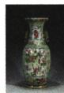
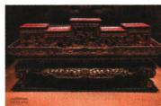
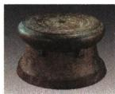

## 讲解

### 是什么

金属材料包括纯金属和合金，常有金属光泽、导电导热、延展等性质，各材料表现不同。

### 怎么来的

性质支持用途：导电传电流、导热传热、延展加工丝箔；机械强度抵抗受力变形，硬度抵抗划伤压入，两个指标不能等同。

### 什么时候能用

多数金属常温固态而汞液态；不能把共性全说成任何金属都相同程度。材料选择兼顾成本、耐蚀、密度；原“铁工具硬”多指钢等实际合金，不说纯铁特别硬。

## 例题

### 藏品金属材料

> 来源ID Q08-01；第八单元金属和金属材料；101-150/full.md 第431–443行。原答案与解析定位：101-150/full.md 第419–421行。

例1（2024 广东中考）广东省博物馆馆藏丰富。下列藏品主要由金属材料制成的是 （）

  
A. 肇庆端砚

  
B.广彩青瓷

  
C.潮州木雕

  
D.云浮铜鼓

**原资料答案与解析：**

例1 解析 A(×) 肇庆端砚是用石材制成的; B(×) 广彩青瓷是用陶瓷烧制而成的; C(×) 潮州木雕是用木头雕制而成的; D(√) 云浮铜鼓是用金属铜制成的。

答案 D

**展开解析（依据原详解补足理由与步骤）：**

选D。A端砚石材、B青瓷陶瓷、C木雕木材，均不是主要金属材料。D铜鼓按题示铜材料，属于金属材料。题问主要材料，不能因非金属制品附带一小件金属装饰就改变主要分类。

### 航天材料与燃料

> 来源ID Q08-02；第八单元金属和金属材料；101-150/full.md 第447–456行。原答案与解析定位：101-150/full.md 第423–427行。

例2 (2024 江苏常州中考)“嫦娥六号”在月球背面顺利着陆(如图)。它表面覆盖了聚酰亚胺—铝箔多层复合材料,推进器用到了液氢和液氧,着陆后用高强度合金铲进行月壤采样。请用下列物质的序号填空。

①铝箔；②液氢；③液氧；④合金

(1)利用物质延展性的是\_\_\_\_。  
(2)利用硬度大的性质的是\_\_\_\_。  
(3)作为推进器燃料的是\_\_\_\_。  
(4)作为推进器助燃剂的是\_\_\_\_。

**原资料答案与解析：**

例2 解析 (1) 利用金属的延展性, 压成薄片, 制得铝箔。(2) 合金的硬度比纯金属的高, 故选④。(3) 氢气具有可燃性, 液氢可作为推进器的燃料, 故选②。(4) 氧气具有助燃性, 液氧可作为推进器的助燃剂, 故选③。

答案 (1)① (2)④ (3)②

(4)③

**展开解析（依据原详解补足理由与步骤）：**

(1)①铝箔由较厚铝压成薄片，依延展性。(2)④合金铲抗划伤与硬度大有关。(3)②液氢作燃料，本身可燃。(4)③液氧供氧助燃，自身不是此处燃料。铝箔的薄与合金铲的硬是不同物理性质，不将“有金属特征”当每材料性质都相同。

### 原金属性质用途表

> 来源ID Q08-22；第八单元金属和金属材料；101-150/full.md 第332–332行。原答案与解析定位：101-150/full.md 第332–332行。

|  | 金属的物理性质 | 金属的用途 |
| --- | --- | --- |
| 内容 | 能导电 | 制电线、电缆 |
| 内容 | 能导热 | 作炊具用于烹饪食物 |
| 内容 | 有延展性 | 拉成丝,制成箔 |
| 内容 | 有一定的机械强度 | 制造车辆、防盗门窗等 |
| 内容 | 具有金属光泽 | 作装饰品 |
| 关系 | 性质 决定 用途 反映 | 性质 决定 用途 反映 |

**原资料答案与解析：**

|  | 金属的物理性质 | 金属的用途 |
| --- | --- | --- |
| 内容 | 能导电 | 制电线、电缆 |
| 内容 | 能导热 | 作炊具用于烹饪食物 |
| 内容 | 有延展性 | 拉成丝,制成箔 |
| 内容 | 有一定的机械强度 | 制造车辆、防盗门窗等 |
| 内容 | 具有金属光泽 | 作装饰品 |
| 关系 | 性质 决定 用途 反映 | 性质 决定 用途 反映 |

**展开解析（依据原详解补足理由与步骤）：**

这是原用途表。电线需要导电性，炊具导热，箔/丝依延展，机械部件需强度，装饰可依光泽。实际材料还考虑密度、耐蚀、成本，导电最好不等于最常用。纯铁较软，原生活铁工具常为钢等铁合金，不把其硬度直接归纯铁。

## 易错

活动性、硬度、产气量、反应速度分别判断。
