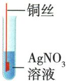

## 讲解

### 是什么

常见顺序K Ca Na Mg Al Zn Fe Sn Pb (H) Cu Hg Ag Pt Au，氢作酸中置氢比较的界线。

### 怎么来的

较前金属在合适溶液反应中更易以离子形式进入溶液；前于H的常见金属可与稀盐酸稀硫酸置氢，前金属可置后金属的可溶盐。

### 什么时候能用

盐须可溶、金属表面可接触、条件合适；K/Ca/Na在水溶液先与水等反应，不能简单套金属盐置换。硝酸和浓硫酸不按稀非氧化性酸置氢模型；实际速率还受浓度温度表面积膜影响。

## 例题

### 过量锌与银镁溶液

> 来源ID Q08-04；第八单元金属和金属材料；101-150/full.md 第692–695行。原答案与解析定位：101-150/full.md 第697–701行。

例2 (2024 河南中考)金属与人类的生活密切相关。回答下列有关金属性质的问题。

(1)铝较为活泼,为什么铝制品却很耐腐蚀?  
(2) 现将过量的锌粉加入到 $AgNO_{3}$ 和 $\mathrm{Mg(NO_{3})_{2}}$ 的混合溶液中, 充分反应后, 过滤。过滤后留在滤纸上的固体是什么? 请写出有关反应的化学方程式。

**原资料答案与解析：**

解析 (1) 铝是比较活泼的金属, 铝制品却耐腐蚀, 是因为铝在空气中能与氧气反应, 其表面生成一层致密的氧化铝薄膜, 防止内部的铝进一步被氧化, 因此铝制品抗腐蚀性强。(2) 金属活动性为镁 > 锌 > 银, 将过量的锌粉加入 $\mathrm{AgNO}_{3}$ 和 $\mathrm{Mg(NO_{3})_{2}}$ 的混合溶液中, 锌和硝酸银反应生成银和硝酸锌, 锌不与硝酸镁反应, 故过滤后留在滤纸上的固体是银和锌。

答案 (1) 铝与氧气反应, 其表面生成致密的氧化铝薄膜。

(2)固体是银和锌。 $\mathrm{Zn}+2\mathrm{AgNO}_{3}=\mathrm{Zn}\left(\mathrm{NO}_{3}\right)_{2}+2\mathrm{Ag}$

**展开解析（依据原详解补足理由与步骤）：**

(1)铝表面致密$Al_{2}O_{3}$膜阻止进一步接触氧，并非铝不活泼。(2)Mg>Zn>Ag，锌能置换银却不能置换镁。$Zn+2AgNO_3=Zn(NO_3)_2+2Ag$。锌过量，银盐全反应后仍余Zn，滤渣Ag、Zn；滤液含$Mg(NO_{3})_{2}$及新生Zn(NO₃)₂，无$AgNO_{3}$。不能把$Mg^{2+}$也误当能被锌还原的金属。

### 锌铜活动性方案

> 来源ID Q08-06；第八单元金属和金属材料；101-150/full.md 第738–743行。原答案与解析定位：101-150/full.md 第745–747行。

例4 (2024 江苏徐州中考) 人类开发利用金属的时间和金属的活动性有关。为探究金属的活动性强弱,用如图装置进行实验。下列说法不正确的是 ( )

A. 实验前需要打磨金属片, 除去表面的氧化膜  
B. 若向甲、乙试管加入稀盐酸, 只有锌片表面能产生气泡  
C. 若向乙试管加入 $ZnSO_{4}$ 溶液, 能得出锌的金属活动性比铜强  
D. 若向甲、乙试管加入 $AgNO_{3}$ 溶液, 能得出三种金属的活动性: Zn > Cu > Ag

**原资料答案与解析：**

解析 A(√)实验前打磨金属片,是为了除去表面的氧化膜,从而防止氧化膜阻碍反应的进行;B(√)由金属活动性:锌>(氢)>铜可知,若向甲、乙试管加入稀盐酸,只有锌片表面能产生气泡;C(√)若向乙试管加入 $ZnSO_{4}$ 溶液,无明显现象,说明铜不与硫酸锌反应,即锌的金属活动性比铜强;D(×)由金属活动性:锌>铜>银可知,若向甲、乙试管加入 $AgNO_{3}$ 溶液,锌和铜都能与硝酸银反应置换出银,能得出金属的活动性:Zn>Ag、Cu>Ag,但无法比较锌和铜的金属活动性。

答案 D

**展开解析（依据原详解补足理由与步骤）：**

选错误D。A打磨去氧化膜保证直接接触，对。BZn在H前、Cu在H后，同稀盐酸仅Zn产氢，对。C乙为Cu，加入$ZnSO_{4}$无反应；在去膜、有可溶盐且接触充分条件支持Zn>Cu，对。D两金属都置换Ag，只能Zn>Ag、Cu>Ag，缺Zn与Cu之间证据，错。并非两个都反应时沉积多的必更活泼，量与浓度等可影响。

### 锂电池铝铜验证

> 来源ID Q08-07；第八单元金属和金属材料；101-150/full.md 第768–782行。原答案与解析定位：101-150/full.md 第784–790行。

例5 (2024 重庆 B 卷中考)锂(Li)离子电池应用广泛,有利于电动汽车的不断发展。

(1) Li\_\_\_\_（填“得到”或“失去”）电子变成 $Li^{+}$ 。

(2)锂离子电池中含有铝箔,通常由铝锭打造而成,说明铝具有良好的\_\_\_\_性。

(3) 锂离子电池中还含有铜箔, 为验证铝和铜的金属活动性顺序, 设计了如下实验:

【方案一】将铝片和铜片相互刻画,金属片上出现划痕者更活泼。

【方案二】将铝丝和铜丝表面打磨后,同时放入 5 mL 相同的稀盐酸中,金属丝表面产生气泡者更活泼。

【方案三】将铝丝和铜丝表面打磨后,同时放入 5 mL 相同的硝酸银溶液中,金属丝表面有银白色物质析出者更活泼。

以上方案中,你认为能达到实验目的的是\_\_\_\_(填方案序号),该方案中发生反应的化学方程式为\_\_\_\_。

**原资料答案与解析：**

解析 (1) 锂原子最外层电子数是 1, 在化学反应中容易失去电子变成带 1 个单位正电荷的锂离子。

(2) 铝箔由铝锭打造而成, 说明铝具有良好的延展性。

(3) 方案一: 将铝片和铜片相互刻画, 出现划痕的金属硬度更小, 不能判断铝和铜的金属活动性强弱, 该方案错误; 方案二: 将铝丝和铜丝表面打磨后, 同时放入 5 mL 相同的稀盐酸中, 铝丝表面产生气泡, 铜丝无现象, 说明铝的金属活动性比氢强, 铜的金属活动性比氢弱, 即 Al > (H) > Cu, 铝和稀盐酸反应生成氯化铝和氢气; 方案三: 将铝丝和铜丝表面打磨后, 同时放入 5 mL 相同的硝酸银溶液中, 铝丝和铜丝表面都有银白色物质析出, 说明铝和铜都比银活泼, 但无法判断铝和铜的金属活动性, 该方案错误。

答案（1）失去 （2）延展 （3）二 $2\mathrm{Al} + 6\mathrm{HCl} = 2\mathrm{AlCl}_3 + 3\mathrm{H}_2\uparrow$

**展开解析（依据原详解补足理由与步骤）：**

(1)失去1电子：Li原子原本电中性，电子少1而质子不变形成Li⁺。(2)延展。(3)只选二。方案一划痕反映硬度，非化学活动性；方案二Al产氢、Cu不产，支持Al>(H)>Cu，式$2Al+6HCl=2AlCl_3+3H_2\uparrow$。方案三两者都置换Ag只说明都在Ag前，不能互相排序。先按判据列可得不等式，再检查目标链是否完整。

### 铝铁银四说法

> 来源ID Q08-09；第八单元金属和金属材料；101-150/full.md 第844–849行。原答案与解析定位：101-150/full.md 第912–914行。

例1 (2024 陕西中考)关于铝、铁、银三种金属,下列有关说法正确的是

A. 三种金属在空气中均易锈蚀  
B.用稀硫酸可以区分三种金属  
C. 用铁、银和硝酸铝溶液可以验证三种金属的活动性顺序  
D.三种金属均是生活中常用导线的制作材料

**原资料答案与解析：**

例1 解析 A(×)铁易锈蚀,铝、银不易锈蚀;C(×)铁、银与硝酸铝溶液都不反应,无法验证铁、银的活动性顺序;D(×)银价格偏高,不用于导线的制作材料。

答案 B

**展开解析（依据原详解补足理由与步骤）：**

选B。A铁易生锈，铝有致密保护膜、银在本题较稳定，不能说均易锈蚀。B同稀硫酸Al产氢溶液无色、Fe产氢浅绿、Ag无反应，可区分。CFe、Ag都不能置换Al，两项无反应无法比较Fe与Ag，错。D题说三种“均是生活常用导线”，铁通常不作相应用途、银成本高非日常普遍选择；不是说银不能导电或不存在银导线。原解析“银不用于导线”过强，按常用限定评价。

### 镍与白铜

> 来源ID Q08-10；第八单元金属和金属材料；101-150/full.md 第851–854行。原答案与解析定位：101-150/full.md 第916–918行。

例2 (2024 山东淄博中考)镍(Ni)是一种用途广泛的金属,可用作其他金属的保护层或用来生产耐腐蚀的合金钢、硬币及耐热元件。回答下列问题:

(1)镍在室温条件下能与稀硫酸反应生成硫酸镍 （$NiSO_4$ ，易溶于水)和氢气,该反应的化学方程式为\_\_\_\_。根据这一反应事实,可以得出镍和铜的金属活动性由强到弱的顺序为\_\_\_\_。  
(2)白铜是一种铜镍合金,属于\_\_\_\_(填“纯净物”或“混合物”),其硬度比纯铜的硬度\_\_\_\_(填“大”或“小”)。

**原资料答案与解析：**

例2 解析 (1)镍能与稀硫酸反应,而铜不与稀硫酸反应,则镍的活动性比铜的活动性强。

答案 (1) $\mathrm{Ni} + \mathrm{H}_{2}\mathrm{SO}_{4} = \mathrm{NiSO}_{4} + \mathrm{H}_{2}\uparrow$ $\mathrm{Ni} > \mathrm{Cu}$ （或镍 $>$ 铜） (2) 混合物 大

**展开解析（依据原详解补足理由与步骤）：**

(1)$Ni+H_2SO_4=NiSO_4+H_2\uparrow$，NiSO₄给Ni+2价，所以一Ni对应一H₂。能从稀酸置氢说明Ni>H，Cu<H，故Ni>Cu。(2)白铜铜镍合金属混合物；按题给常见合金比较，硬度大。合金性质随成分工艺变化，不能将此题大硬度结论当所有合金绝无例外。

### 三金活动性药品选择

> 来源ID Q08-12；第八单元金属和金属材料；101-150/full.md 第870–892行。原答案与解析定位：101-150/full.md 第922–924行。

例4（2024 山东滨州中考）下列各组药品不能验证铁、铜、银三种金属活动性强弱的是 （）

A. ${\mathrm{{CuSO}}}_{4}$ 溶液

Fe Ag

B. ${\mathrm{{FeSO}}}_{4}$ 溶液

稀 $H_{2}SO_{4}$

Cu Ag

C. $AgNO_{3}$ 溶液

稀 $\mathrm{H}_{2} \mathrm{SO}_{4}$

Fe Cu

D. $AgNO_{3}$ 溶液

$\mathrm{FeSO}_{4}$ 溶液

Cu

**原资料答案与解析：**

例4 解析 B(×)Cu、Ag 都不能与 $FeSO_{4}$ 溶液和稀 $H_{2}SO_{4}$ 反应，只能说明 Cu、Ag 的活动性都比 H 弱，但无法比较 Cu 和 Ag 的活动性强弱。

答案 B

**展开解析（依据原详解补足理由与步骤）：**

选不能验证的B。A Fe置Cu、Ag不置Cu，得Fe>Cu>Ag。B Cu、Ag均不与$FeSO_{4}$及稀$H_{2}SO_{4}$反应，只得Fe/H在它们前，Cu与Ag关系缺失。C同稀酸Fe反应而Cu不反应，得Fe>Cu；Cu置Ag得Cu>Ag，链完整。D Cu不置Fe且能置Ag，得Fe>Cu>Ag。验证三种至少要连接两个独立比较关系，不以试剂多就视为充分。

### 铜铁银弱到强排序

> 来源ID Q08-13；第八单元金属和金属材料；101-150/full.md 第894–908行。原答案与解析定位：101-150/full.md 第926–928行。

例5（2024 江苏宿迁中考节选）以下是利用铜、铁等物质进行的实验，请回答下列问题。

(2)如图是比较铜、铁、银三种金属活动性的实验。

①实验 B 中反应的化学方程式是
\_\_\_\_。
\_\_\_\_。

②通过实验 A、B, 得出三种金属的活动性由弱到强的顺序是 \_\_\_\_。

  
A   
B

**原资料答案与解析：**

例5 解析 (2)①实验 B 中铁与硫酸铜反应生成硫酸亚铁和铜。②实验 A 中铜与硝酸银反应,说明铜比银活泼;实验 B 中铁与硫酸铜反应,说明铁比铜活泼,所以三种金属的活动性由弱到强的顺序是银<铜<铁。

答案 (2) ① $\mathrm{Fe} + \mathrm{CuSO}_4 = \mathrm{FeSO}_4+$ Cu ②银<铜<铁

**展开解析（依据原详解补足理由与步骤）：**

实验A铜置银，$Cu+2AgNO_3=Cu(NO_3)_2+2Ag$，得Cu>Ag。B铁置铜，$Fe+CuSO_4=FeSO_4+Cu$，得Fe>Cu。合链Ag<Cu<Fe，题问弱到强不能反写。产铜红色、溶液蓝变浅绿来自$Cu^{2+}$减少和$Fe^{2+}$生成。节选只保留原(2)，不另造(1)。

### 原金属稀酸反应表

> 来源ID Q08-19；第八单元金属和金属材料；101-150/full.md 第491–491行。原答案与解析定位：101-150/full.md 第491–491行。

| 金属 | 现象 | 化学方程式(与稀盐酸或稀硫酸反应)4 |
| --- | --- | --- |
| 镁 | 反应剧烈,有大量气泡生成,溶液仍为无色 | $\text{Mg} + 2\text{HCl} = \text{MgCl}_2 + \text{H}_2 \uparrow$  或  $\text{Mg} + \text{H}_2\text{SO}_4 = \text{MgSO}_4 + \text{H}_2 \uparrow$ |
| 锌 | 反应较剧烈,有较多气泡生成,溶液仍为无色 | $\text{Zn} + 2\text{HCl} = \text{ZnCl}_2 + \text{H}_2 \uparrow$  或  $\text{Zn} + \text{H}_2\text{SO}_4 = \text{ZnSO}_4 + \text{H}_2 \uparrow$ |
| 铁 | 反应较缓慢,有少量气泡生成,溶液由无色逐渐变为浅绿色 | $\text{Fe} + 2\text{HCl} = \text{FeCl}_2 + \text{H}_2 \uparrow$  或  $\text{Fe} + \text{H}_2\text{SO}_4 = \text{FeSO}_4 + \text{H}_2 \uparrow$ |
| 铜 | 无明显现象 | — |

**原资料答案与解析：**

| 金属 | 现象 | 化学方程式(与稀盐酸或稀硫酸反应)4 |
| --- | --- | --- |
| 镁 | 反应剧烈,有大量气泡生成,溶液仍为无色 | $\text{Mg} + 2\text{HCl} = \text{MgCl}_2 + \text{H}_2 \uparrow$  或  $\text{Mg} + \text{H}_2\text{SO}_4 = \text{MgSO}_4 + \text{H}_2 \uparrow$ |
| 锌 | 反应较剧烈,有较多气泡生成,溶液仍为无色 | $\text{Zn} + 2\text{HCl} = \text{ZnCl}_2 + \text{H}_2 \uparrow$  或  $\text{Zn} + \text{H}_2\text{SO}_4 = \text{ZnSO}_4 + \text{H}_2 \uparrow$ |
| 铁 | 反应较缓慢,有少量气泡生成,溶液由无色逐渐变为浅绿色 | $\text{Fe} + 2\text{HCl} = \text{FeCl}_2 + \text{H}_2 \uparrow$  或  $\text{Fe} + \text{H}_2\text{SO}_4 = \text{FeSO}_4 + \text{H}_2 \uparrow$ |
| 铜 | 无明显现象 | — |

**展开解析（依据原详解补足理由与步骤）：**

这是原实验表。Mg、Zn、Fe与同种同浓度稀酸生成氢；常见Fe盐为+2、浅绿，不写成$FeCl_{3}$。Cu与本题非氧化性稀酸不置氢。比较快慢须同温、酸浓度、表面积与去膜状态；活动性序不自动保证任何不同表面样品速率严格同序。

## 易错

活动性、硬度、产气量、反应速度分别判断。
