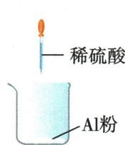
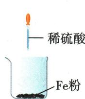
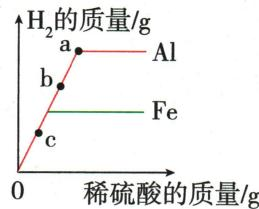

## 讲解

### 是什么

常见氢前金属与稀盐酸或稀硫酸产氢；例如$Fe+2HCl=FeCl_2+H_2\uparrow$，产$Fe^{2+}$盐。

### 怎么来的

金属进入溶液成为正离子，酸中氢形成H₂。Fe在本模型为+2，$FeCl_{2}$/$FeSO_{4}$溶液浅绿；Al+3，每2Al需6$HCl$成3H₂，不能不看价数直接用相同系数。

### 什么时候能用

金属与“酸”并非永远产氢；限定原题稀盐酸稀硫酸，不含氧化性特殊反应。膜、不同用量或酸过量会影响观察；看见气泡也需题设确定气体。

## 例题

### 氢气酸质量曲线双选

> 来源ID Q08-03；第八单元金属和金属材料；101-150/full.md 第634–645行。原答案与解析定位：101-150/full.md 第647–649行。

例1 (双选)(2023 山东潍坊中考)向两个盛有相同质量铝粉和铁粉的烧杯中,分别滴加相同浓度的稀硫酸,产生氢气的质量与加入稀硫酸的质量关系如图所示。下列说法正确的是 ( )

A.a 点时,两个烧杯中的酸都恰好完全反应  
B.b 点时,两个烧杯中产生氢气的质量相同  
C.c 点时,两个烧杯中都有金属剩余  
D. 图中曲线不能反映铁和铝的金属活动性强弱

**原资料答案与解析：**

解析 A(×)a 点时, Al 与稀硫酸恰好完全反应, 盛铁粉的烧杯中的酸有剩余; B(×)b 点时, 两个烧杯中消耗硫酸不相等, 产生氢气的质量不相同; C(√)c 点之后, 两个烧杯都能继续产生氢气, 则 c 点时, 两个烧杯中都有金属剩余; D(√)该曲线是氢气质量—酸的质量曲线, 不是氢气质量—时间的曲线, 故图中曲线不能反映反应的速率, 不能反映铁和铝的金属活动性强弱。

答案 CD

**展开解析（依据原详解补足理由与步骤）：**

选CD。横轴是加入硫酸质量，并非时间。A点a铝达高平台、铁早达低平台，所以铝酸恰耗、铁酸有剩，错。B点b铝仍上升高于铁平台，两氢气量不同，错。C点c在两者仍上升共线段，后续加酸还能产氢，两边均有剩金属，对。D这种斜率表示每单位酸产氢，不能当单位时间速率判活动性，对。等质量金属产氢应比化合价/相对质量，Al为3/27、Fe为2/56；不同价态不能只比相对原子质量。

### 锂电池铝铜验证

> 来源ID Q08-07；第八单元金属和金属材料；101-150/full.md 第768–782行。原答案与解析定位：101-150/full.md 第784–790行。

例5 (2024 重庆 B 卷中考)锂(Li)离子电池应用广泛,有利于电动汽车的不断发展。

(1) Li\_\_\_\_（填“得到”或“失去”）电子变成 $Li^{+}$ 。

(2)锂离子电池中含有铝箔,通常由铝锭打造而成,说明铝具有良好的\_\_\_\_性。

(3) 锂离子电池中还含有铜箔, 为验证铝和铜的金属活动性顺序, 设计了如下实验:

【方案一】将铝片和铜片相互刻画,金属片上出现划痕者更活泼。

【方案二】将铝丝和铜丝表面打磨后,同时放入 5 mL 相同的稀盐酸中,金属丝表面产生气泡者更活泼。

【方案三】将铝丝和铜丝表面打磨后,同时放入 5 mL 相同的硝酸银溶液中,金属丝表面有银白色物质析出者更活泼。

以上方案中,你认为能达到实验目的的是\_\_\_\_(填方案序号),该方案中发生反应的化学方程式为\_\_\_\_。

**原资料答案与解析：**

解析 (1) 锂原子最外层电子数是 1, 在化学反应中容易失去电子变成带 1 个单位正电荷的锂离子。

(2) 铝箔由铝锭打造而成, 说明铝具有良好的延展性。

(3) 方案一: 将铝片和铜片相互刻画, 出现划痕的金属硬度更小, 不能判断铝和铜的金属活动性强弱, 该方案错误; 方案二: 将铝丝和铜丝表面打磨后, 同时放入 5 mL 相同的稀盐酸中, 铝丝表面产生气泡, 铜丝无现象, 说明铝的金属活动性比氢强, 铜的金属活动性比氢弱, 即 Al > (H) > Cu, 铝和稀盐酸反应生成氯化铝和氢气; 方案三: 将铝丝和铜丝表面打磨后, 同时放入 5 mL 相同的硝酸银溶液中, 铝丝和铜丝表面都有银白色物质析出, 说明铝和铜都比银活泼, 但无法判断铝和铜的金属活动性, 该方案错误。

答案（1）失去 （2）延展 （3）二 $2\mathrm{Al} + 6\mathrm{HCl} = 2\mathrm{AlCl}_3 + 3\mathrm{H}_2\uparrow$

**展开解析（依据原详解补足理由与步骤）：**

(1)失去1电子：Li原子原本电中性，电子少1而质子不变形成Li⁺。(2)延展。(3)只选二。方案一划痕反映硬度，非化学活动性；方案二Al产氢、Cu不产，支持Al>(H)>Cu，式$2Al+6HCl=2AlCl_3+3H_2\uparrow$。方案三两者都置换Ag只说明都在Ag前，不能互相排序。先按判据列可得不等式，再检查目标链是否完整。

### 铝铁银四说法

> 来源ID Q08-09；第八单元金属和金属材料；101-150/full.md 第844–849行。原答案与解析定位：101-150/full.md 第912–914行。

例1 (2024 陕西中考)关于铝、铁、银三种金属,下列有关说法正确的是

A. 三种金属在空气中均易锈蚀  
B.用稀硫酸可以区分三种金属  
C. 用铁、银和硝酸铝溶液可以验证三种金属的活动性顺序  
D.三种金属均是生活中常用导线的制作材料

**原资料答案与解析：**

例1 解析 A(×)铁易锈蚀,铝、银不易锈蚀;C(×)铁、银与硝酸铝溶液都不反应,无法验证铁、银的活动性顺序;D(×)银价格偏高,不用于导线的制作材料。

答案 B

**展开解析（依据原详解补足理由与步骤）：**

选B。A铁易生锈，铝有致密保护膜、银在本题较稳定，不能说均易锈蚀。B同稀硫酸Al产氢溶液无色、Fe产氢浅绿、Ag无反应，可区分。CFe、Ag都不能置换Al，两项无反应无法比较Fe与Ag，错。D题说三种“均是生活常用导线”，铁通常不作相应用途、银成本高非日常普遍选择；不是说银不能导电或不存在银导线。原解析“银不用于导线”过强，按常用限定评价。

### 镍与白铜

> 来源ID Q08-10；第八单元金属和金属材料；101-150/full.md 第851–854行。原答案与解析定位：101-150/full.md 第916–918行。

例2 (2024 山东淄博中考)镍(Ni)是一种用途广泛的金属,可用作其他金属的保护层或用来生产耐腐蚀的合金钢、硬币及耐热元件。回答下列问题:

(1)镍在室温条件下能与稀硫酸反应生成硫酸镍 （$NiSO_4$ ，易溶于水)和氢气,该反应的化学方程式为\_\_\_\_。根据这一反应事实,可以得出镍和铜的金属活动性由强到弱的顺序为\_\_\_\_。  
(2)白铜是一种铜镍合金,属于\_\_\_\_(填“纯净物”或“混合物”),其硬度比纯铜的硬度\_\_\_\_(填“大”或“小”)。

**原资料答案与解析：**

例2 解析 (1)镍能与稀硫酸反应,而铜不与稀硫酸反应,则镍的活动性比铜的活动性强。

答案 (1) $\mathrm{Ni} + \mathrm{H}_{2}\mathrm{SO}_{4} = \mathrm{NiSO}_{4} + \mathrm{H}_{2}\uparrow$ $\mathrm{Ni} > \mathrm{Cu}$ （或镍 $>$ 铜） (2) 混合物 大

**展开解析（依据原详解补足理由与步骤）：**

(1)$Ni+H_2SO_4=NiSO_4+H_2\uparrow$，NiSO₄给Ni+2价，所以一Ni对应一H₂。能从稀酸置氢说明Ni>H，Cu<H，故Ni>Cu。(2)白铜铜镍合金属混合物；按题给常见合金比较，硬度大。合金性质随成分工艺变化，不能将此题大硬度结论当所有合金绝无例外。

### 原金属稀酸反应表

> 来源ID Q08-19；第八单元金属和金属材料；101-150/full.md 第491–491行。原答案与解析定位：101-150/full.md 第491–491行。

| 金属 | 现象 | 化学方程式(与稀盐酸或稀硫酸反应)4 |
| --- | --- | --- |
| 镁 | 反应剧烈,有大量气泡生成,溶液仍为无色 | $\text{Mg} + 2\text{HCl} = \text{MgCl}_2 + \text{H}_2 \uparrow$  或  $\text{Mg} + \text{H}_2\text{SO}_4 = \text{MgSO}_4 + \text{H}_2 \uparrow$ |
| 锌 | 反应较剧烈,有较多气泡生成,溶液仍为无色 | $\text{Zn} + 2\text{HCl} = \text{ZnCl}_2 + \text{H}_2 \uparrow$  或  $\text{Zn} + \text{H}_2\text{SO}_4 = \text{ZnSO}_4 + \text{H}_2 \uparrow$ |
| 铁 | 反应较缓慢,有少量气泡生成,溶液由无色逐渐变为浅绿色 | $\text{Fe} + 2\text{HCl} = \text{FeCl}_2 + \text{H}_2 \uparrow$  或  $\text{Fe} + \text{H}_2\text{SO}_4 = \text{FeSO}_4 + \text{H}_2 \uparrow$ |
| 铜 | 无明显现象 | — |

**原资料答案与解析：**

| 金属 | 现象 | 化学方程式(与稀盐酸或稀硫酸反应)4 |
| --- | --- | --- |
| 镁 | 反应剧烈,有大量气泡生成,溶液仍为无色 | $\text{Mg} + 2\text{HCl} = \text{MgCl}_2 + \text{H}_2 \uparrow$  或  $\text{Mg} + \text{H}_2\text{SO}_4 = \text{MgSO}_4 + \text{H}_2 \uparrow$ |
| 锌 | 反应较剧烈,有较多气泡生成,溶液仍为无色 | $\text{Zn} + 2\text{HCl} = \text{ZnCl}_2 + \text{H}_2 \uparrow$  或  $\text{Zn} + \text{H}_2\text{SO}_4 = \text{ZnSO}_4 + \text{H}_2 \uparrow$ |
| 铁 | 反应较缓慢,有少量气泡生成,溶液由无色逐渐变为浅绿色 | $\text{Fe} + 2\text{HCl} = \text{FeCl}_2 + \text{H}_2 \uparrow$  或  $\text{Fe} + \text{H}_2\text{SO}_4 = \text{FeSO}_4 + \text{H}_2 \uparrow$ |
| 铜 | 无明显现象 | — |

**展开解析（依据原详解补足理由与步骤）：**

这是原实验表。Mg、Zn、Fe与同种同浓度稀酸生成氢；常见Fe盐为+2、浅绿，不写成$FeCl_{3}$。Cu与本题非氧化性稀酸不置氢。比较快慢须同温、酸浓度、表面积与去膜状态；活动性序不自动保证任何不同表面样品速率严格同序。

### 磷酸铁锂电池回收

> 来源ID Q11-09；第十一单元化学与社会；151-200/full.md 第735–745行。原答案与解析定位：151-200/full.md 第775–783行。

例3（2024山东东营中考）我国新能源汽车产销量连续八年全球第一，新能源汽车常用磷酸铁锂电池(如图)作为动力。

(1)新能源汽车与传统燃油汽车相比,突出的优点是\_\_\_\_。

(2)磷酸铁锂电池外壳常用的材料大体分为三种:塑料、钢壳和铝壳,其中属于合成材料的是\_\_\_\_,电池工作过程中将化学能转化为\_\_\_\_能。

(3)电极材料磷酸铁锂 $\left(\mathrm{LiFePO}_{4}\right)$ 中,锂、氧两种元素的质量比是\_\_\_\_。

(4)报废的磷酸铁锂电池经过预处理、酸浸、除杂等环节回收得到的物质,可重新作为制作该电池的原料。已知拆解电池所得材料中含铁片、铜箔、铝箔等,采用硫酸“酸浸”的目的是除去铁、铝,反应的化学方程式为\_\_\_\_（任写其中一个）,该反应属于\_\_\_\_（填基本反应类型)反应。

**原资料答案与解析：**

例3 解析（1）与传统燃油汽车相比，新能源汽车可以减少污染物的排放，保护环境。

(2) 塑料属于合成材料, 钢是铁的合金, 钢和铝均属于金属材料; 电池工作过程中将化学能转化为电能。

(3) 磷酸铁锂中锂、氧两种元素的质量比为 $7: (16 \times 4) = 7: 64$ 。

(4)采用硫酸“酸浸”的目的是除去铁、铝,发生的反应为铁和硫酸反应生成硫酸亚铁和氢气、铝和硫酸反应生成硫酸铝和氢气;上述反应均属于置换反应。

答案（1）可以减少污染物的排放，保护环境（合理即可）（2）塑料电（3）7：64（4） $2\mathrm{Al}+3\mathrm{H}_{2}\mathrm{SO}_{4}=\mathrm{Al}_{2}\left(\mathrm{SO}_{4}\right)_{3}+3\mathrm{H}_{2}\uparrow$ （或 $Fe+H_{2}SO_{4}=FeSO_{4}+H_{2}\uparrow$ ）置换

**展开解析（依据原详解补足理由与步骤）：**

(1)与燃油汽车相比，电驱运行减少当地燃烧尾气排放，依发电和制造边界评价全流程。(2)塑料属合成材料，钢合金与铝属金属材料；电池放电化学能转电能，充电反向储能。(3)按式Li₁Fe₁P₁O₄，用Li=7、O=16，质量比$7:(16\times4)=7:64$，不是1:4原子比。(4)稀硫酸与活动性铁铝反应、铜在本模型不置氢，所以除铁铝。可写$Fe+H_2SO_4=FeSO_4+H_2\uparrow$，或$2Al+3H_2SO_4=Al_2(SO_4)_3+3H_2\uparrow$，均单质换单质为置换。酸浸需工业条件，铝表面膜及浓酸不同不套简式自行操作。

## 易错

活动性、硬度、产气量、反应速度分别判断。
