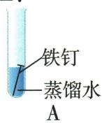
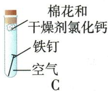

## 讲解

### 是什么

Mg、Al常温可缓慢与氧反应；Al形成致密$Al_{2}O_{3}$保护膜。铁丝在氧气点燃成$Fe_{3}O_{4}$，Cu加热成$CuO$。

### 怎么来的

氧化膜隔开金属与反应环境，铝虽活动性较强却可耐进一步腐蚀；铁锈疏松，不能提供同样长期保护。条件与表面状态决定是否看到迅速现象。

### 什么时候能用

铝耐蚀不代表不活泼或所有酸碱中膜均不被破坏。打磨用于实验接触，不是建议日常把铝制品保护膜磨去。不同气氛、形态的金属燃烧不能套一个产物。

## 例题

### 过量锌与银镁溶液

> 来源ID Q08-04；第八单元金属和金属材料；101-150/full.md 第692–695行。原答案与解析定位：101-150/full.md 第697–701行。

例2 (2024 河南中考)金属与人类的生活密切相关。回答下列有关金属性质的问题。

(1)铝较为活泼,为什么铝制品却很耐腐蚀?  
(2) 现将过量的锌粉加入到 $AgNO_{3}$ 和 $\mathrm{Mg(NO_{3})_{2}}$ 的混合溶液中, 充分反应后, 过滤。过滤后留在滤纸上的固体是什么? 请写出有关反应的化学方程式。

**原资料答案与解析：**

解析 (1) 铝是比较活泼的金属, 铝制品却耐腐蚀, 是因为铝在空气中能与氧气反应, 其表面生成一层致密的氧化铝薄膜, 防止内部的铝进一步被氧化, 因此铝制品抗腐蚀性强。(2) 金属活动性为镁 > 锌 > 银, 将过量的锌粉加入 $\mathrm{AgNO}_{3}$ 和 $\mathrm{Mg(NO_{3})_{2}}$ 的混合溶液中, 锌和硝酸银反应生成银和硝酸锌, 锌不与硝酸镁反应, 故过滤后留在滤纸上的固体是银和锌。

答案 (1) 铝与氧气反应, 其表面生成致密的氧化铝薄膜。

(2)固体是银和锌。 $\mathrm{Zn}+2\mathrm{AgNO}_{3}=\mathrm{Zn}\left(\mathrm{NO}_{3}\right)_{2}+2\mathrm{Ag}$

**展开解析（依据原详解补足理由与步骤）：**

(1)铝表面致密$Al_{2}O_{3}$膜阻止进一步接触氧，并非铝不活泼。(2)Mg>Zn>Ag，锌能置换银却不能置换镁。$Zn+2AgNO_3=Zn(NO_3)_2+2Ag$。锌过量，银盐全反应后仍余Zn，滤渣Ag、Zn；滤液含$Mg(NO_{3})_{2}$及新生Zn(NO₃)₂，无$AgNO_{3}$。不能把$Mg^{2+}$也误当能被锌还原的金属。

### 铝铁银四说法

> 来源ID Q08-09；第八单元金属和金属材料；101-150/full.md 第844–849行。原答案与解析定位：101-150/full.md 第912–914行。

例1 (2024 陕西中考)关于铝、铁、银三种金属,下列有关说法正确的是

A. 三种金属在空气中均易锈蚀  
B.用稀硫酸可以区分三种金属  
C. 用铁、银和硝酸铝溶液可以验证三种金属的活动性顺序  
D.三种金属均是生活中常用导线的制作材料

**原资料答案与解析：**

例1 解析 A(×)铁易锈蚀,铝、银不易锈蚀;C(×)铁、银与硝酸铝溶液都不反应,无法验证铁、银的活动性顺序;D(×)银价格偏高,不用于导线的制作材料。

答案 B

**展开解析（依据原详解补足理由与步骤）：**

选B。A铁易生锈，铝有致密保护膜、银在本题较稳定，不能说均易锈蚀。B同稀硫酸Al产氢溶液无色、Fe产氢浅绿、Ag无反应，可区分。CFe、Ag都不能置换Al，两项无反应无法比较Fe与Ag，错。D题说三种“均是生活常用导线”，铁通常不作相应用途、银成本高非日常普遍选择；不是说银不能导电或不存在银导线。原解析“银不用于导线”过强，按常用限定评价。

### 原金属氧气反应表

> 来源ID Q08-18；第八单元金属和金属材料；101-150/full.md 第476–476行。原答案与解析定位：101-150/full.md 第476–476行。

| 金属 | 反应条件 | 实验现象 | 化学方程式 |
| --- | --- | --- | --- |
| 镁 | 常温 | 打磨过的镁条露置在空气中,表面逐渐变暗 | $2Mg+O_2=2MgO$ |
| 镁 | 加热或点燃 | 点燃后,镁条在空气中剧烈燃烧,发出耀眼的白光,伴随有白烟,放热,生成白色固体 | $2Mg + O_{2} \xlongequal{\text{点燃}} 2MgO$ |
| 铝 | 常温 | 打磨过的铝条露置在空气中,表面逐渐变暗1 | $4Al+3O_2=2Al_2O_3$ |
| 铁 | 加热或点燃 | 点燃后,铁丝在氧气中剧烈燃烧,火星四射,放出大量的热,生成黑色固体(铁丝在空气中不能燃烧) | $3Fe + 2O_{2} \xlongequal{\text{点燃}} Fe_{3}O_{4}$ |
| 铜 | 加热 | 在空气中加热,表面会变黑 | $2Cu + O_{2} \xlongequal{\Delta} 2CuO$ |
| 金 | 高温 | 在空气中加热至高温时不变色 | — |

**原资料答案与解析：**

| 金属 | 反应条件 | 实验现象 | 化学方程式 |
| --- | --- | --- | --- |
| 镁 | 常温 | 打磨过的镁条露置在空气中,表面逐渐变暗 | $2Mg+O_2=2MgO$ |
| 镁 | 加热或点燃 | 点燃后,镁条在空气中剧烈燃烧,发出耀眼的白光,伴随有白烟,放热,生成白色固体 | $2Mg + O_{2} \xlongequal{\text{点燃}} 2MgO$ |
| 铝 | 常温 | 打磨过的铝条露置在空气中,表面逐渐变暗1 | $4Al+3O_2=2Al_2O_3$ |
| 铁 | 加热或点燃 | 点燃后,铁丝在氧气中剧烈燃烧,火星四射,放出大量的热,生成黑色固体(铁丝在空气中不能燃烧) | $3Fe + 2O_{2} \xlongequal{\text{点燃}} Fe_{3}O_{4}$ |
| 铜 | 加热 | 在空气中加热,表面会变黑 | $2Cu + O_{2} \xlongequal{\Delta} 2CuO$ |
| 金 | 高温 | 在空气中加热至高温时不变色 | — |

**展开解析（依据原详解补足理由与步骤）：**

这是原反应表，原PDF实际9页常温Mg、Al均不标加热。氧化膜形成解释常温反应与抗继续腐蚀可同时存在；铁丝在氧气中点燃成$Fe_{3}O_{4}$，铜加热成黑$CuO$；金在本表普通加热条件不反应。不能说所有金属遇空气均剧烈燃烧，也不把铁丝在常温干空气的缓慢反应与潮湿生锈一概说不发生。

### 铁锈条件除锈防锈

> 来源ID Q08-16；第八单元金属和金属材料；101-150/full.md 第1074–1098行。原答案与解析定位：101-150/full.md 第1051–1057行。

例2（2024 湖南中考）铁制品经常有锈蚀现象,于是某兴趣小组围绕“锈”进行一系列研究。

(1)探锈

现有洁净无锈的铁钉、经煮沸迅速冷却的蒸馏水、植物油、棉花和干燥剂氯化钙,还可以选用其他物品。为探究铁制品锈蚀的条件,设计如下实验:

①A 中玻璃仪器的名称是\_\_\_\_。

②一周后,观察 A、B、C 中的铁钉,只有 A 中的铁钉出现了明显锈蚀现象,由此得出铁钉锈蚀需要与\_\_\_\_接触的结论。

(2)除锈

取出生锈的铁钉,将其放置在稀盐酸中,一段时间后发现溶液变黄,铁钉表面有少量气泡产生。产生气泡的原因是\_\_\_\_(用化学方程式表示)。稀盐酸可用于除锈,但铁制品不可长时间浸泡其中。

(3)防锈

防止铁制品锈蚀,可以破坏其锈蚀的条件。常用的防锈方法有\_\_\_\_(写一种即可)。

兴趣小组继续通过文献研究、调研访谈,发现如何防止金属锈蚀已成为科学研究和技术领域中的重要科研课题。

**原资料答案与解析：**

例2 解析 (1) ①A 中玻璃仪器是试管; ②A 中铁钉与氧气和水同时接触, B 中铁钉只与水接触, C 中铁钉只与氧气接触, 只有 A 中的铁钉出现了明显锈蚀现象, 由此得出铁钉锈蚀需要与氧气和水接触的结论。(2) 铁锈的主要成分是氧化铁, 氧化铁和盐酸反应生成氯化铁和水, 溶液变黄; 铁锈反应完全, 铁和盐酸反应生成氯化亚铁和氢气, 产生气泡。(3) 铁与氧气和水同时接触会发生锈蚀, 防止铁制品锈蚀, 可以破坏其锈蚀的条件, 常用的防锈方法有表面刷漆、涂油等。

答案（1）①试管 ②氧气（或空气）和水

(2) $\mathrm{Fe} + 2\mathrm{HCl} = \mathrm{FeCl}_2 + \mathrm{H}_2\uparrow$

(3) 表面刷漆、涂油(或置于干燥、低温、低氧的环境中, 合理即可)

**展开解析（依据原详解补足理由与步骤）：**

(1)①试管。②A有水氧，B煮沸迅速冷却水减溶氧、油层隔空气，C干燥剂除水，两对照分别支持氧和水同时需要。(2)先铁锈按教材$Fe_{2}O_{3}$模型与酸反应，$Fe_2O_3+6HCl=2FeCl_3+3H_2O$，$Fe^{3+}$呈黄色；酸接触铁基体又$Fe+2HCl=FeCl_2+H_2\uparrow$，气泡来自氢，故不要长浸导致基体损失。(3)刷漆、涂油、干燥等破坏水/氧条件。油层不是把原有全部溶氧凭空去掉，必须先用煮沸后冷却水配合。

## 易错

活动性、硬度、产气量、反应速度分别判断。
