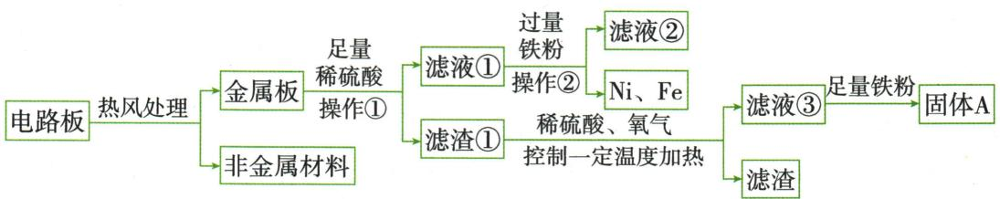
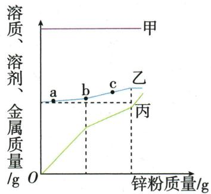
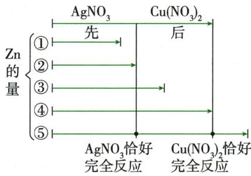
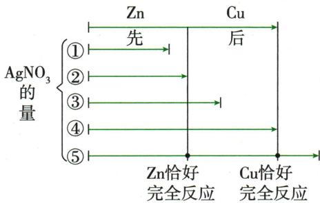

## 讲解

### 判据

题出现混合盐、过量金属、过滤和颜色，按固液分别记账。

### 流程

先排不能反应的旁观物；写可反应及顺序；利用过量、颜色、残渣加酸产气确定进行到哪一步。滤渣列新金属加剩投料，滤液列新盐加未耗原盐及剩酸。信息不足写可能，不虚补恰好条件。

## 例题

### 过量锌与银镁溶液

> 来源ID Q08-04；第八单元金属和金属材料；101-150/full.md 第692–695行。原答案与解析定位：101-150/full.md 第697–701行。

例2 (2024 河南中考)金属与人类的生活密切相关。回答下列有关金属性质的问题。

(1)铝较为活泼,为什么铝制品却很耐腐蚀?  
(2) 现将过量的锌粉加入到 $AgNO_{3}$ 和 $\mathrm{Mg(NO_{3})_{2}}$ 的混合溶液中, 充分反应后, 过滤。过滤后留在滤纸上的固体是什么? 请写出有关反应的化学方程式。

**原资料答案与解析：**

解析 (1) 铝是比较活泼的金属, 铝制品却耐腐蚀, 是因为铝在空气中能与氧气反应, 其表面生成一层致密的氧化铝薄膜, 防止内部的铝进一步被氧化, 因此铝制品抗腐蚀性强。(2) 金属活动性为镁 > 锌 > 银, 将过量的锌粉加入 $\mathrm{AgNO}_{3}$ 和 $\mathrm{Mg(NO_{3})_{2}}$ 的混合溶液中, 锌和硝酸银反应生成银和硝酸锌, 锌不与硝酸镁反应, 故过滤后留在滤纸上的固体是银和锌。

答案 (1) 铝与氧气反应, 其表面生成致密的氧化铝薄膜。

(2)固体是银和锌。 $\mathrm{Zn}+2\mathrm{AgNO}_{3}=\mathrm{Zn}\left(\mathrm{NO}_{3}\right)_{2}+2\mathrm{Ag}$

**展开解析（依据原详解补足理由与步骤）：**

(1)铝表面致密$Al_{2}O_{3}$膜阻止进一步接触氧，并非铝不活泼。(2)Mg>Zn>Ag，锌能置换银却不能置换镁。$Zn+2AgNO_3=Zn(NO_3)_2+2Ag$。锌过量，银盐全反应后仍余Zn，滤渣Ag、Zn；滤液含$Mg(NO_{3})_{2}$及新生Zn(NO₃)₂，无$AgNO_{3}$。不能把$Mg^{2+}$也误当能被锌还原的金属。

### 电路板金属回收流程

> 来源ID Q08-05；第八单元金属和金属材料；101-150/full.md 第703–713行。原答案与解析定位：101-150/full.md 第715–722行。

例3 (2024 山东泰安中考)某种手机电路板中含有 Fe、Cu、Ag、Ni 等金属,如图是某工厂回收部分金属的流程图:

资料信息: $2\mathrm{Cu} + \mathrm{O}_{2} + 2\mathrm{H}_{2}\mathrm{SO}_{4} \xlongequal{\triangle} 2\mathrm{CuSO}_{4} + 2\mathrm{H}_{2}\mathrm{O}$ , 硫酸镍的化学式为 $\mathrm{NiSO}_{4}$ 。

(1)金属中加入足量稀硫酸的目的是\_\_\_\_，操作①的名称是\_\_\_\_。  
(2) 滤液②中所含溶质的化学式为 \_\_\_\_。  
(3)滤渣①中所含金属的化学式为\_\_\_\_。  
(4) 滤液③和铁粉反应的化学方程式为 \_\_\_\_。  
(5) Cu、Ag、Ni 在溶液中的活动性由强到弱依次是 \_\_\_\_。

**原资料答案与解析：**

解析 部分流程图：

(1)金属中加入足量稀硫酸是为了使铁、镍与稀硫酸完全反应或将固体中的铁、镍全部除去,操作①是分离固体、液体的过滤操作;(2)加入足量稀硫酸,铁与稀硫酸反应生成氢气和硫酸亚铁,镍与稀硫酸反应生成氢气和硫酸镍,铜、银与稀硫酸不反应,则充分反应后过滤得到的滤液①中含有硫酸亚铁、硫酸镍,可能含有硫酸,滤渣①中含有铜、银,向滤液①中加入过量铁粉,得到滤液②和铁、镍,说明金属活动性:铁>镍,则滤液②中所含溶质为 $\mathrm{FeSO}_{4}$ ; (3)由上述分析可知,滤渣①中所含金属为Cu、Ag;(4)向滤渣①中加入稀硫酸、氧气,控制一定温度加热,则铜、氧气与稀硫酸在加热条件下反应生成硫酸铜和水,银与稀硫酸不反应,则充分反应后过滤得到的滤液③中含有硫酸铜,滤渣中含有银,向滤液③中加入足量铁粉,铁与硫酸铜反应生成铜和硫酸亚铁,化学方程式为 $\mathrm{Fe}+\mathrm{CuSO}_{4}=\mathrm{FeSO}_{4}+\mathrm{Cu}$ ; (5)由上述分析可知,镍能与硫酸反应生成硫酸镍,说明镍在金属活动性顺序中位于氢之前,则Cu、Ag、Ni在溶液中的活动性由强到弱依次是Ni>Cu>Ag。

答案 (1)使铁、镍与稀硫酸完全反应(或将固体中的铁、镍全部除去) 过滤 (2) $FeSO_{4}$ (3)Cu、Ag
(4) $Fe+CuSO_{4}=FeSO_{4}+Cu$ (5)Ni>Cu>Ag

**展开解析（依据原详解补足理由与步骤）：**

(1)足量稀硫酸让Fe、Ni全部进入溶液，Cu、Ag保留固体；①过滤分固液。(2)滤液①有$FeSO_{4}$、NiSO₄，足量酸可能剩$H_{2}SO_{4}$。过量Fe可消耗酸及置换Ni，所以滤液②仅$FeSO_{4}$，剩Fe和析Ni成固体。(3)初滤渣Cu、Ag。(4)Cu不与稀硫酸单独产氢，但题给$O_{2}$参与且加热的新反应允许Cu成$CuSO_{4}$；后Fe置换$Fe+CuSO_4=FeSO_4+Cu$。足量铁若未说明过量，不必断言固体A一定有剩铁，至少Cu，可能Fe。(5)Ni与稀酸产氢在H前，Cu、Ag在后，又Cu能置换Ag，因此Ni>Cu>Ag。新增反应事实优先采用，不把一般规则盖过题给特殊条件。

### 锌粉加入混合盐质量图

> 来源ID Q08-08；第八单元金属和金属材料；101-150/full.md 第826–836行。原答案与解析定位：101-150/full.md 第838–840行。

例6 (双选)(2023 山东潍坊中考)向盛有一定质量 $MgSO_{4}$ 、 $FeSO_{4}$ 和 $CuSO_{4}$ 混合溶液的烧杯中,加入锌粉至过量使其充分反应(溶液始终未饱和),烧杯中溶质、溶剂和金属的质量随锌粉质量变化情况如图所示。下列说法正确的是()

A.丙代表烧杯中金属质量

B.ab 段发生反应: $\mathrm{{Zn}} + {\mathrm{{CuSO}}}_{4} =  \mathrm{{ZnSO}}{}_{4} + \mathrm{{Cu}}$

C. 溶液质量: a > c

D.c 点溶液一定是无色的

**原资料答案与解析：**

解析 A(√)由金属活动性顺序 Mg>Zn>Fe>Cu 知,向盛有一定质量 $MgSO_{4}$ 、 $FeSO_{4}$ 和 $CuSO_{4}$ 混合溶液的烧杯中加入锌粉,锌不能与硫酸镁反应,锌先与硫酸铜反应生成硫酸锌和铜,反应完全后,锌才能与硫酸亚铁反应生成硫酸锌和铁;反应前,烧杯中没有金属,加入锌粉后,锌依次置换出铜和铁,则丙代表烧杯中金属质量。B(√)由上述分析可知,ab 段发生的反应为锌和硫酸铜的反应。C(×)第一个过程,由 $Zn+CuSO_{4}=ZnSO_{4}+Cu$ 知,每 65 份质量的锌可置换出 64 份质量的铜,根据质量守恒定律可知,溶液的质量会增加;第二个过程,由 $Zn+FeSO_{4}=ZnSO_{4}+Fe$ 知,每 65 份质量的锌可置换出 56 份质量的铁,溶液的质量会增加,故溶液质量:c>a。D(×)c 点硫酸亚铁还没有完全反应,溶液显浅绿色。

答案 AB

**展开解析（依据原详解补足理由与步骤）：**

选AB。甲水平对应未改变的水，丙从0起为金属；乙逐步增加为溶质。Mg>Zn>Fe>Cu，Mg盐不被置换。A丙确为金属，对；B ab先置Cu，$Zn+CuSO_4=ZnSO_4+Cu$，对。C每65份Zn进溶液而64份Cu析出，液增1；后置Fe则65进56出，液增9，故c>a，选项反向错。D图c在置铁尚未完成阶段，仍有$Fe^{2+}$浅绿色，不能说无色。末段过量Zn留固相，金属质量继续增，溶质不再增加。金属质量含析出与剩余两部分。

### 原滤液滤渣分段模型

> 来源ID Q08-20；第八单元金属和金属材料；101-150/full.md 第653–661；663–669行。原答案与解析定位：101-150/full.md 第653–661行；101-150/full.md 第663–669行。

1. 将一种金属单质投入含有多种金属化合物的溶液中或者将一种金属化合物的溶液加入一定量的含多种金属单质的混合物中,较活泼的金属单质优先与金属活动性最弱的金属的化合物反应。

(1)一种金属与多种金属化合物的混合溶液反应,如将锌粉加入一定量的硝酸铜和硝酸银的混合溶液中,先: $\mathrm{Zn}+2\mathrm{AgNO}_{3}=\mathrm{Zn}\left(\mathrm{NO}_{3}\right)_{2}+2\mathrm{Ag}$ ;后: $\mathrm{Zn}+\mathrm{Cu}\left(\mathrm{NO}_{3}\right)_{2}=\mathrm{Zn}\left(\mathrm{NO}_{3}\right)_{2}+\mathrm{Cu}$ 。

具体分析如下:

| 锌粉的量(反应程度) | 滤液中的溶质 | 滤渣 |
| --- | --- | --- |
| 1锌与部分 $AgNO_{3}$ 反应 | $Zn(NO_{3})_{2}$ 、 $Cu(NO_{3})_{2}$ 、 $AgNO_{3}$ | Ag |
| 2锌与 $AgNO_{3}$ 恰好完全反应 | $Zn(NO_{3})_{2}$ 、 $Cu(NO_{3})_{2}$ | Ag |
| 3锌与部分 $Cu(NO_{3})_{2}$ 反应 | $Zn(NO_{3})_{2}$ 、 $Cu(NO_{3})_{2}$ | Ag、Cu |
| 4锌与 $Cu(NO_{3})_{2}$ 恰好完全反应 | $Zn(NO_{3})_{2}$ | Ag、Cu |
| 5锌过量 | $Zn(NO_{3})_{2}$ | Ag、Cu、Zn |

(2)一种金属化合物溶液和金属混合物的反应,如将硝酸银溶液加入一定量锌和铜的混合物中,先: $\mathrm{Zn}+2\mathrm{AgNO}_{3}=\mathrm{Zn}\left(\mathrm{NO}_{3}\right)_{2}+2\mathrm{Ag}$ ;后: $\mathrm{Cu}+2\mathrm{AgNO}_{3}=\mathrm{Cu}\left(\mathrm{NO}_{3}\right)_{2}+2\mathrm{Ag}$ 。

具体分析如下:

| 硝酸银的量(反应程度) | 滤液中的溶质 | 滤渣 |
| --- | --- | --- |
| 1 $AgNO_{3}$ 与部分锌反应 | $Zn(NO_{3})_{2}$ | Ag、Cu、Zn |
| 2 $AgNO_{3}$ 与锌恰好完全反应 | $Zn(NO_{3})_{2}$ | Ag、Cu |
| 3 $AgNO_{3}$ 与部分铜反应 | $Zn(NO_{3})_{2}$ 、 $Cu(NO_{3})_{2}$ | Ag、Cu |
| 4 $AgNO_{3}$ 与铜恰好完全反应 | $Zn(NO_{3})_{2}$ 、 $Cu(NO_{3})_{2}$ | Ag |
| 5 $AgNO_{3}$ 过量 | $Zn(NO_{3})_{2}$ 、 $Cu(NO_{3})_{2}$ 、 $AgNO_{3}$ | Ag |

**原资料答案与解析：**

1. 将一种金属单质投入含有多种金属化合物的溶液中或者将一种金属化合物的溶液加入一定量的含多种金属单质的混合物中,较活泼的金属单质优先与金属活动性最弱的金属的化合物反应。

(1)一种金属与多种金属化合物的混合溶液反应,如将锌粉加入一定量的硝酸铜和硝酸银的混合溶液中,先: $\mathrm{Zn}+2\mathrm{AgNO}_{3}=\mathrm{Zn}\left(\mathrm{NO}_{3}\right)_{2}+2\mathrm{Ag}$ ;后: $\mathrm{Zn}+\mathrm{Cu}\left(\mathrm{NO}_{3}\right)_{2}=\mathrm{Zn}\left(\mathrm{NO}_{3}\right)_{2}+\mathrm{Cu}$ 。

具体分析如下:

| 锌粉的量(反应程度) | 滤液中的溶质 | 滤渣 |
| --- | --- | --- |
| 1锌与部分 $AgNO_{3}$ 反应 | $Zn(NO_{3})_{2}$ 、 $Cu(NO_{3})_{2}$ 、 $AgNO_{3}$ | Ag |
| 2锌与 $AgNO_{3}$ 恰好完全反应 | $Zn(NO_{3})_{2}$ 、 $Cu(NO_{3})_{2}$ | Ag |
| 3锌与部分 $Cu(NO_{3})_{2}$ 反应 | $Zn(NO_{3})_{2}$ 、 $Cu(NO_{3})_{2}$ | Ag、Cu |
| 4锌与 $Cu(NO_{3})_{2}$ 恰好完全反应 | $Zn(NO_{3})_{2}$ | Ag、Cu |
| 5锌过量 | $Zn(NO_{3})_{2}$ | Ag、Cu、Zn |

(2)一种金属化合物溶液和金属混合物的反应,如将硝酸银溶液加入一定量锌和铜的混合物中,先: $\mathrm{Zn}+2\mathrm{AgNO}_{3}=\mathrm{Zn}\left(\mathrm{NO}_{3}\right)_{2}+2\mathrm{Ag}$ ;后: $\mathrm{Cu}+2\mathrm{AgNO}_{3}=\mathrm{Cu}\left(\mathrm{NO}_{3}\right)_{2}+2\mathrm{Ag}$ 。

具体分析如下:

| 硝酸银的量(反应程度) | 滤液中的溶质 | 滤渣 |
| --- | --- | --- |
| 1 $AgNO_{3}$ 与部分锌反应 | $Zn(NO_{3})_{2}$ | Ag、Cu、Zn |
| 2 $AgNO_{3}$ 与锌恰好完全反应 | $Zn(NO_{3})_{2}$ | Ag、Cu |
| 3 $AgNO_{3}$ 与部分铜反应 | $Zn(NO_{3})_{2}$ 、 $Cu(NO_{3})_{2}$ | Ag、Cu |
| 4 $AgNO_{3}$ 与铜恰好完全反应 | $Zn(NO_{3})_{2}$ 、 $Cu(NO_{3})_{2}$ | Ag |
| 5 $AgNO_{3}$ 过量 | $Zn(NO_{3})_{2}$ 、 $Cu(NO_{3})_{2}$ 、 $AgNO_{3}$ | Ag |

**展开解析（依据原详解补足理由与步骤）：**

这是原两组加入量模型。加Zn到银铜盐液，先置Ag后置Cu；每次净消耗Zn生成Zn盐，过量Zn才进滤渣。反过来加银盐到Zn/Cu固体，先消耗Zn后Cu；银盐过量才留$Ag^{+}$。两方向终点组分不同，不能只背“最活泼一定在液里”；原有不反应的盐、过量加入金属也要全列。

## 易错

按表面状态、酸或盐的种类和剩余程度核查。
