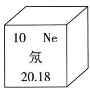
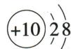
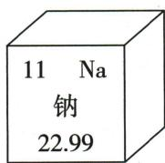

## 讲解

### 判据

元素格与结构图同时出现时，先给每个数据定名。

### 流程

格上序数→质子；中性原子→总电子同数；结构每弧数→该层电子；相对原子质量→无量纲比值。需要画图时先数总电子，再按常见元素范围分层，最后复核和为质子数。

## 例题

### 氖钠结构与相对原子质量

> 来源ID Q03-08；第三单元物质构成的奥秘；1-50/full.md 第2522–2535行。原答案与解析定位：1-50/full.md 第2506–2508行。

例2 (2024 山东济南中考)下图为元素周期表部分内容和两种微观粒子的结构示意图。结合图示信息判断,下列说法中正确的是 ( )

A. 钠原子核内有 11 个质子  
B. 氖的相对原子质量为 $20.18 \mathrm{~g}$   
C. 氖原子与钠原子的电子层数相同  
D. 氖原子与钠原子的化学性质相似

**原资料答案与解析：**

例2 解析 A(√)钠原子核内有11个质子。B(×)氖的相对原子质量为20.18,相对原子质量的单位是“1”不是“g”,通常省略不写。C(×)氖原子有2个电子层,钠原子有3个电子层。D(×)根据原子结构示意图可知,钠原子在化学反应中易失去电子,化学性质活泼;氖原子在化学反应中不易得失电子,化学性质稳定。

答案 A

**展开解析（依据原详解补足理由与步骤）：**

选A。图示Na序数11，中性钠原子有11质子。B氖相对原子质量20.18是比值，不能加g。C氖电子分层2、8，只有两层；钠2、8、1有三层。D氖最外层8较稳定，钠最外层1易失电子，性质不相似。需区分序数、各层电子数、相对质量三类图示数据。

### 锂原子与周期表信息

> 来源ID Q03-14；第三单元物质构成的奥秘；1-50/full.md 第2759–2764行。原答案与解析定位：1-50/full.md 第2727–2729行。

例3（2024 江苏无锡中考）锂电池应用广泛。锂在元素周期表中的信息和锂原子的结构示意图如图所示。下列叙述正确的是（）

A. 锂的原子序数为 3  
B. 锂的相对原子质量为 $6.941 \mathrm{~g}$   
C. 锂原子的核外电子数为 1  
D. 锂原子在化学反应中容易得到电子

原图信息（按1-50.pdf实际第49页转写）：原子序数3，元素符号Li，名称锂，相对原子质量6.941；原子核+3，电子第一层2、第二层1。

**原资料答案与解析：**

例3 解析 A(√) 锂元素的原子序数为 3; B(×) 锂元素的相对原子质量为 6.941, 相对原子质量的单位是“1”不是“g”, 通常省略不写; C(×) D(×) 锂原子的核外电子数为 3, 最外层电子数为 1, 在化学反应中易失去电子达到稳定结构。

答案 A

**展开解析（依据原详解补足理由与步骤）：**

选A。原图信息按PDF实际第49页恢复：序数3、符号Li、名称锂、相对原子质量6.941；结构核+3、第一层2、第二层1。A序数为3，正确。B6.941是相对质量，不是克。C核外总电子2+1=3，1只是最外层电子数。D最外层1，通常易失去而非得到电子。不要从总电子数判断性质，也不要把最外层数当核外总数。

### 周期表补元素与结构

> 来源ID Q03-15；第三单元物质构成的奥秘；1-50/full.md 第2766–2774行。原答案与解析定位：1-50/full.md 第2731–2739行。

例4（原资料所注2024山东济宁中考节选，身份未另核）如图是教材中元素周期表的一部分，①②各表示一种元素。下表按PDF实际第49页完整转写，保留原题旧族标记。

|周期|IA|IIA|IIIA|IVA|VA|VIA|VIIA|0族|
|---|---|---|---|---|---|---|---|---|
|1|H|||||||He|
|2|Li|Be|B|C|N|①|F|Ne|
|3|Na|Mg|Al|②|P|S|Cl|Ar|

请回答：

(1)①所表示元素原子的质子数为\_\_\_\_；  
(2)②表示硅元素,晶体硅广泛应用于芯片、太阳能光伏板的生产中,给人类的生活带来了便利,请画出硅元素的原子结构示意图\_\_\_\_;  
(3)元素 F 和 Cl 化学性质相似,原因是 \_\_\_\_。

**原资料答案与解析：**

例4 解析（1）①为0，质子数为8；

(2) Si 的原子序数为 14, 原子结构示意图为 +14 284;

(3) F、Cl 最外层电子数相等, 化学性质相似。

答案 (1)8 (2) $+14$ 284

(3)原子最外层电子数相等

**展开解析（依据原详解补足理由与步骤）：**

(1)①在第二周期、原表VIA列，为氧元素，质子数8。(2)②为硅，序数14，中性原子电子14个；先排第一层2，再第二层8，剩14−2−8=4排第三层，所以核标+14，三条层线依次标2、8、4。(3)F和Cl原子最外层均7，通常得电子趋势相似，化学性质相似。电子层数分别2和3，不必相同。表中0族与A族为原题旧标记，不可把0族中的氦或氖核电荷写0。

## 易错

分别数总电子、最外层电子和粒子种类；答案需对准题问。
