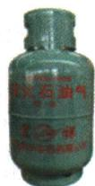

## 错法

看到气体压缩，认为每个分子缩小或分子数量减少；看到气味变淡，认为分子消失。

## 正解

压缩首先改变间隔，扩散使局部浓度下降；在不发生反应和不漏气的限定下，粒子种类及总数保持。范围不相同的局部数与全系统总数要区分。

## 例题

### 液化石油气与气味

> 来源ID Q03-03；第三单元物质构成的奥秘；1-50/full.md 第2228–2234行。原答案与解析定位：1-50/full.md 第2236–2238行。

例3 (2024 河南中考)液化石油气是常用燃料。从分子及其运动的角度解释下列现象。

(1) $25 \mathrm{~m}^{3}$ 石油气加压后可装入容积为 $0.024 \mathrm{~m}^{3}$ 的钢瓶中（如图）。

(2)液化石油气中添加有特殊臭味的乙硫醇,一旦液化石油气泄漏,周围较大范围都能闻到特殊臭味,可及时采取安全措施。

**原资料答案与解析：**

解析（1）石油气体积减小，是因为分子间有间隔，加压后，分子间的间隔变小。（2）闻到特殊臭味，是因为具有臭味的分子在不断运动，向四周扩散，使人们闻到特殊臭味。

答案 (1) 分子间有间隔, 加压使分子间隔变小。 (2) 分子在不断运动, 特殊臭味在空气中扩散。

**展开解析（依据原详解补足理由与步骤）：**

(1)原25 m³气体能装入0.024 m³瓶，说明加压时粒子间隔显著减小；若涉及液化，状态变化进一步缩小间隔。分子自身不被压小，也不是分子数自动减少。(2)添加乙硫醇后，具有臭味的分子不断运动而向周围扩散，所以泄漏可被察觉。两个问句分别对应间隔和运动，不能用“粒子很小”笼统回答。

### 酒精挥发判断

> 来源ID Q03-04；第三单元物质构成的奥秘；1-50/full.md 第2246–2251行。原答案与解析定位：1-50/full.md 第2242–2242行。

例（2024 山东东营中考）小东同学将少量医用酒精涂在手背上，先感到手背凉凉的，后闻到了酒精的气味，一会儿发现酒精不见了，气味也变淡了。下列说法错误的是 （）

A. 手背凉凉的——分子获得能量运动速率加快  
B.闻到了酒精的气味——分子在不断地运动  
C.酒精不见了——分子之间的间隔变大  
D. 气味变淡了——分子的总数减少

**原资料答案与解析：**

例 解析 A(√) 酒精挥发吸热, 分子获得能量, 运动速率加快; B(√) 酒精分子在不断地运动, 向四周扩散, 使人闻到酒精气味; C(√) 酒精不见了, 是因为酒精变成气态, 分子之间的间隔变大; D(×) 气味变淡, 是因为酒精分子不断运动到空气中, 导致浓度降低, 但分子总数不变。答案 D

**展开解析（依据原详解补足理由与步骤）：**

选错误项D。A酒精挥发需要吸热，从手背吸收能量，使人感到凉；原题用“分子获得能量”表示这一过程，不能进一步说手背所有粒子都加速。B酒精分子不断运动并扩散，正确。C从液态成为气态，平均间隔增大，正确。D在忽略化学反应的条件下，酒精分子未被消灭，只是扩散到更大空间，局部浓度降低；若指定一小块空间，其中数目可能减少，但题中“总数”不能按局部数目理解。
