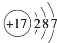
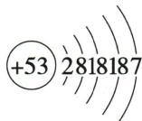

## 错法

看到圆圈+2，就说整个原子带两个正电；把中子计入核电荷。

## 正解

+2只表示两质子形成的核电荷，中性原子另有两电子抵消；中子不带电，只影响质量。应先算总电荷再描述粒子。

## 例题

### 氦三结构图选择

> 来源ID Q03-07；第三单元物质构成的奥秘；1-50/full.md 第2512–2520行。原答案与解析定位：1-50/full.md 第2502–2504行。

例1（2024 四川巴中中考）我国探月工程嫦娥五号返回器曾携带 1731 g 月壤样品返回地球。月壤中含量丰富的氦-3 可作为核聚变燃料, 其原子核是由 2 个质子和 1 个中子构成的, 氦-3 的原子结构示意图为 （）

**原资料答案与解析：**

例1 解析 氦-3 原子的质子数=核外电子数=2。

答案 B

**展开解析（依据原详解补足理由与步骤）：**

选B。题设氦-3原子核有2质子、1中子，所以核电荷写+2；原子中电子数等于质子数，为2，第一层最多容纳2。A写3个电子，且超第一层容量；B核+2、第一层2，正确；C核+3且2、1两层，对应另一元素；D核+3而电子2也不是中性氦原子。中子不带电，不能把中子数加进核电荷。

### 氯与碘原子结构

> 来源ID Q03-05；第三单元物质构成的奥秘；1-50/full.md 第2461–2472行。原答案与解析定位：1-50/full.md 第2474–2476行。

例1 (2024 江苏宿迁中考)氯原子、碘原子结构示意图如图所示。下列说法正确的是 ( )

A. 氯元素和碘元素的化学性质相似   
B.符号“2Cl”可表示2个氯元素  
C. 图中“+”表示两种原子带正电荷  
D.碘原子在化学反应中易失去电子

  
氯原子

  
碘原子

**原资料答案与解析：**

解析 A(√)氯原子和碘原子的最外层电子数相同,故氯元素和碘元素的化学性质相似;B(×)2Cl表示2个氯原子;C(×)原子是不带电的,图中“+”表示两种原子的原子核带正电荷;D(×)碘原子最外层电子数为7,大于4,故碘原子在化学反应中易得到电子。

答案 A

**展开解析（依据原详解补足理由与步骤）：**

选A。图中氯和碘最外层都7个电子，按同族原子趋势化学性质相似。B“2Cl”表示两个氯原子，元素不计个数。C圆圈中的+标核带正电，不是整个原子带正电；中性原子电子负电抵消质子正电。D碘最外层7个，通常易得1个电子趋于稳定结构，不是失去电子。
