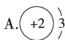
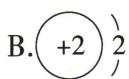
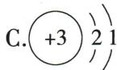
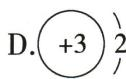
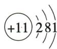

## 讲解

### 是什么

原子含带正电的核及带负电的电子；核中质子带正电、中子不带电，中性原子质子数等于电子数。

### 怎么来的

一质子与一电子各带一个单位相反电荷，数目相等时总电荷抵消，原子不显电性；这不意味着内部没有带电粒子。核电荷只数质子，不能加中子。

### 什么时候能用

多数原子核含中子，但氕即氢-1没有中子。原MD第2263行氘为错识，PDF实际第41页写氕。氦-3的3是质子和中子合计，不是质子数。

## 例题

### 氦三结构图选择

> 来源ID Q03-07；第三单元物质构成的奥秘；1-50/full.md 第2512–2520行。原答案与解析定位：1-50/full.md 第2502–2504行。

例1（2024 四川巴中中考）我国探月工程嫦娥五号返回器曾携带 1731 g 月壤样品返回地球。月壤中含量丰富的氦-3 可作为核聚变燃料, 其原子核是由 2 个质子和 1 个中子构成的, 氦-3 的原子结构示意图为 （）

**原资料答案与解析：**

例1 解析 氦-3 原子的质子数=核外电子数=2。

答案 B

**展开解析（依据原详解补足理由与步骤）：**

选B。题设氦-3原子核有2质子、1中子，所以核电荷写+2；原子中电子数等于质子数，为2，第一层最多容纳2。A写3个电子，且超第一层容量；B核+2、第一层2，正确；C核+3且2、1两层，对应另一元素；D核+3而电子2也不是中性氦原子。中子不带电，不能把中子数加进核电荷。

### 氖钠结构与相对原子质量

> 来源ID Q03-08；第三单元物质构成的奥秘；1-50/full.md 第2522–2535行。原答案与解析定位：1-50/full.md 第2506–2508行。

例2 (2024 山东济南中考)下图为元素周期表部分内容和两种微观粒子的结构示意图。结合图示信息判断,下列说法中正确的是 ( )

A. 钠原子核内有 11 个质子  
B. 氖的相对原子质量为 $20.18 \mathrm{~g}$   
C. 氖原子与钠原子的电子层数相同  
D. 氖原子与钠原子的化学性质相似

**原资料答案与解析：**

例2 解析 A(√)钠原子核内有11个质子。B(×)氖的相对原子质量为20.18,相对原子质量的单位是“1”不是“g”,通常省略不写。C(×)氖原子有2个电子层,钠原子有3个电子层。D(×)根据原子结构示意图可知,钠原子在化学反应中易失去电子,化学性质活泼;氖原子在化学反应中不易得失电子,化学性质稳定。

答案 A

**展开解析（依据原详解补足理由与步骤）：**

选A。图示Na序数11，中性钠原子有11质子。B氖相对原子质量20.18是比值，不能加g。C氖电子分层2、8，只有两层；钠2、8、1有三层。D氖最外层8较稳定，钠最外层1易失电子，性质不相似。需区分序数、各层电子数、相对质量三类图示数据。

## 易错

定义须保留条件，电子、质子和物质种类不能互相代替。
