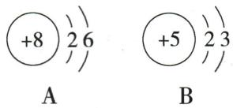
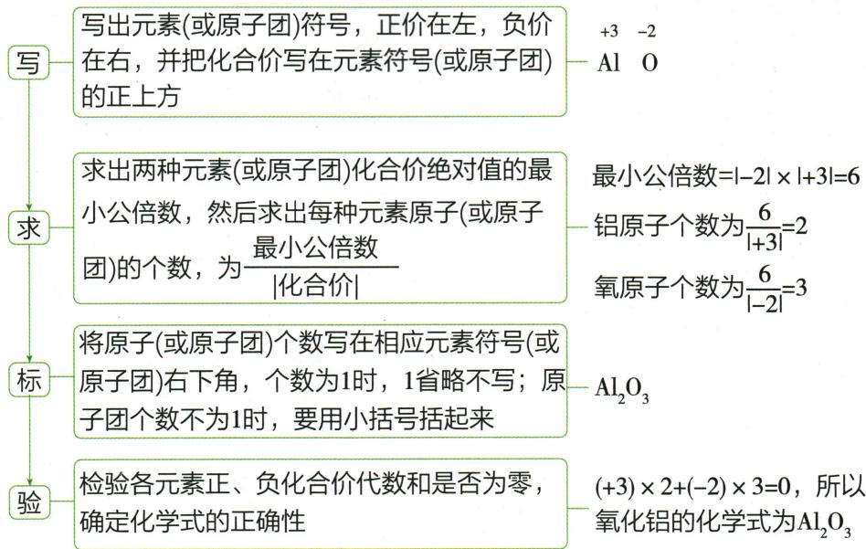
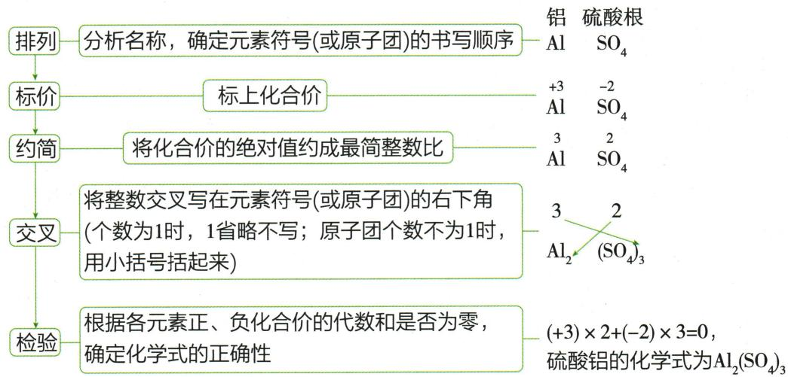

## 讲解

### 判据

知道实际物质身份及组分价数时，寻找总和为零的正整数个数比。

### 流程

取正负价绝对值的最小公倍数L，各粒子数为L除以自身价绝对值；或交叉价数后约成合适整数比。原子团大于1个要括号包整个团。写好再代回检查总和。对已知真实分子必须保留真实分子组成，不机械将所有式约成最简原子比。

## 例题

### 氧硼图推化学式

> 来源ID Q04-11；第四单元自然界的水；51-100/full.md 第659–661行。原答案与解析定位：51-100/full.md 第663–665行。

例4 下图为 A、B 的微粒结构示意图, A 与 B 形成的化合物的化学式为 \_\_\_\_。

**原资料答案与解析：**

解析 A 为氧原子, 在化学反应中易得到 2 个电子, 在化合物中显 -2 价; B 为硼原子, 在化学反应中易失去 3 个电子, 在化合物中显 +3 价; 根据最小公倍数法或交叉法可得化学式为 $\mathrm{B}_{2} \mathrm{O}_{3}$ 。

答案 $\mathrm{B}_{2} \mathrm{O}_{3}$

**展开解析（依据原详解补足理由与步骤）：**

图A核+8、电子2、6，为氧；图B核+5、电子2、3，为硼。按本题化合物中O为−2、B为+3，设B数m、O数n，有$3m-2n=0$，故$3m=2n$，最简$m:n=2:3$，写$B_2O_3$。代回$2\times3+3\times(-2)=0$核验。原解析说硼“易失3电子”是过强模型，硼属非金属，不能当作普遍形成B³⁺的事实；本题式子只需使用给定常见价数。

### 原按化合价书式案例

> 来源ID Q04-19；第四单元自然界的水；51-100/full.md 第619–629行。原答案与解析定位：51-100/full.md 第619–629行。

# 2. 根据某元素的化合价求化学式

根据化合物中各元素正、负化合价的代数和为0,由已知元素的化合价,可以推出实际存在物质的化学式,主要方法有两种。

(1) 最小公倍数法, 步骤如下 (以求氧化铝的化学式为例):

(2)交叉法,步骤如下(以求硫酸铝的化学式为例):

**原资料答案与解析：**

# 2. 根据某元素的化合价求化学式

根据化合物中各元素正、负化合价的代数和为0,由已知元素的化合价,可以推出实际存在物质的化学式,主要方法有两种。

(1) 最小公倍数法, 步骤如下 (以求氧化铝的化学式为例):

(2)交叉法,步骤如下(以求硫酸铝的化学式为例):

**展开解析（依据原详解补足理由与步骤）：**

这是原氧化铝与硫酸铝方法图，不是新题。氧化铝中Al+3、O−2，电荷最小公倍数6；Al个数$6/3=2$、O个数$6/2=3$，得$Al_2O_3$。硫酸铝中Al+3、硫酸根整体−2，取Al2个和硫酸根3个，得$Al_2(SO_4)_3$，括号乘整个团。代回$2\times3+3\times(-2)=0$。交叉法是这个代数和规则的简便写法，写后要约简和核验；过氧化物等真实分子不能不看物质身份就一律约简。

## 易错

原子个数比、质量比、气体体积比各有不同依据；勿混用。
