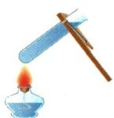
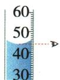
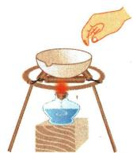

## 错法

以为实验做完就能马上冲洗、拿走，忽略器皿仍热。原安全题B及操作题蒸发皿D分别体现温差与烫伤的错误。

## 正解

先考虑温度与受热状态，热玻璃避免骤冷，热蒸发皿用坩埚钳。透明玻璃不显红色不能证明不热；温度判断依加热情境，不能凭外观。

## 例题

### 灯帽与热玻璃等安全判断

> 来源ID Q01-15；第一单元走进化学世界；1-50/full.md 第1090–1095行。原答案与解析定位：1-50/full.md 第1066–1068行。

例2 (2024 湖南长沙中考)树立安全意识,形成良好习惯。下列做法正确的是 ()

A.用灯帽盖灭酒精灯   
B.加热后的试管立即用冷水冲洗   
C. 在加油站用手机打电话  
D. 携带易燃、易爆品乘坐高铁

**原资料答案与解析：**

例2 解析 B(×)加热后的试管立即用冷水冲洗,会使试管炸裂; C(×)汽油具有可燃性,在加油站打电话,易引发火灾; D(×)禁止携带易燃、易爆品乘坐高铁。

答案 A

**展开解析（依据原详解补足理由与步骤）：**

A灯帽盖灭酒精灯，正确；其作用是阻断火焰处持续得到空气。B热试管立即冷水冲洗会受热不均、产生较大温差而易炸裂，错误。C在加油作业危险区域应遵守禁用手机等现场安全要求，按原题错误；原解析的“易引发火灾”是安全提示，不能单凭汽油可燃推出正常手机每次通话必然引燃。D携带易燃易爆品乘高铁违反本题安全要求，错误。答案A。[应急管理部门所载现场要求](https://www.mem.gov.cn/fw/yjpf/pfrd/202010/t20201021_370700.shtml)记录了具体地方的禁用规定，本文不把该地方通知改写成全部现行法规。

### 闻气味加热读数取蒸发皿四图

> 来源ID Q01-19；第一单元走进化学世界；1-50/full.md 第1138–1150行。原答案与解析定位：1-50/full.md 第1164–1166行。

例6 (2024 四川自贡中考)规范的实验操作是实验成功和安全的重要保证。下列实验操作正确的是 ( )

  
A. 闻气体气味

  
B.加热液体

  
C.读取液体体积

  
D.移走蒸发皿

**原资料答案与解析：**

例6 解析 A(×) 应用手在瓶口轻轻地扇动, 使极少量的气体飘进鼻孔; B(×) 加热试管中的液体时, 液体不超过试管容积的 1/3; D(×) 不能用手直接拿热的蒸发皿, 应用坩埚钳夹取。

答案 C

**展开解析（依据原详解补足理由与步骤）：**

A鼻子直接靠近瓶口，错误；需按教材轻扇少量气体的方法闻，不能直接深吸。B试管中液体超过规定的约三分之一，错误。C原图量筒放平、视线与凹液面最低处齐平，正确。D用手直接取热蒸发皿，错误，应使用坩埚钳。故选C。操作图没有温度数字，依据其“正在加热”的情境判断器皿已热，不能擅自补温度。
